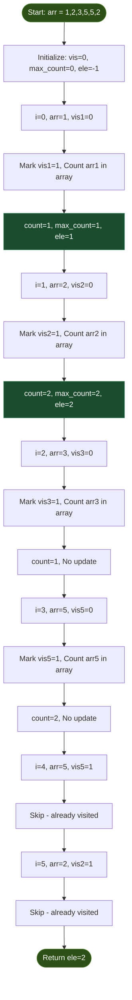
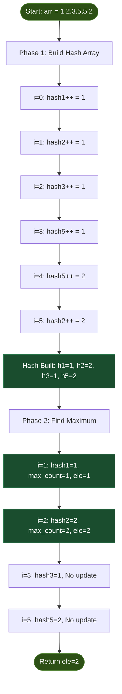
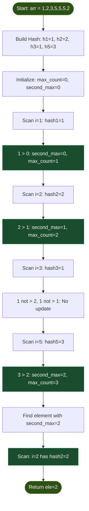
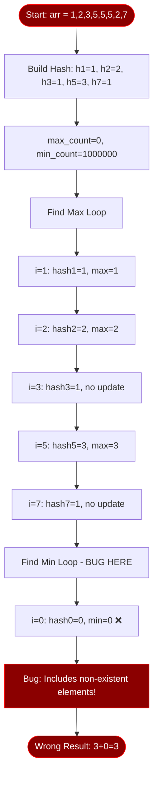
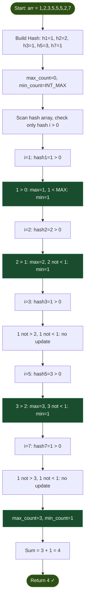

# Hashing - Master Revision Guide

## Table of Contents
1. [Introduction to Hashing](#introduction-to-hashing)
2. [Problem 1: Most Occurring Element (Brute Force)](#problem-1-most-occurring-element-brute-force)
3. [Problem 2: Most Occurring Element (Using Hash)](#problem-2-most-occurring-element-using-hash)
4. [Problem 3: Second Most Occurring Element](#problem-3-second-most-occurring-element)
5. [Problem 4: Sum of Highest and Lowest Frequency](#problem-4-sum-of-highest-and-lowest-frequency)

---

## Introduction to Hashing

### Key Concepts to Remember

**Memory Constraints:**
- Operations per second: ~10^8
- **Outside main()**: `bool hash[10^8]`, `int hash[10^7]`
- **Inside main()**: `bool hash[10^7]`, `int hash[10^6]`

**Character Hashing:**
- For lowercase letters: `hash[26] = {0}`
- Index mapping: `hash[arr[i] - 'a']++` (saves space, 'a' → 0, 'b' → 1, etc.)

**Map vs Unordered Map:**
| Feature | map | unordered_map |
|---------|-----|---------------|
| Time Complexity | O(log n) | O(1) average |
| Order | Sorted | Unsorted |
| Implementation | Red-Black Tree | Hash Table |
| Use Case | When sorting needed | When order doesn't matter |

---

## Problem 1: Most Occurring Element (Brute Force)

### Problem Statement
Find the element that appears most frequently in an array using a brute force approach.

### Intuition & Strategy

**Pattern Recognition:**
This is a **frequency counting problem**. The brute force approach teaches us the naive way before optimization.

**Why This Approach?**
- For each unique element, count its occurrences by scanning the entire array
- Use a visited array to avoid recounting the same element
- Track the maximum count and corresponding element

**Key Insight:**
The visited array prevents redundant counting. Without it, we'd count element '5' multiple times if it appears at different positions.

**When to Use:**
- Small arrays where optimization isn't critical
- Understanding the baseline before learning hashing optimization

### The Code

```cpp
int mocc_brute(int arr[], int n)
{
    int vis[1000000] = {0};  // Visited array to track processed elements
    int max_count = 0;        // Stores the highest frequency found
    int ele = -1;             // Stores the most frequent element
    
    for (int i = 0; i < n; i++)
    {
        int count = 0;
        // Only process if element hasn't been visited
        if (vis[arr[i]] == 0)
        {
            vis[arr[i]] = 1;  // Mark as visited
            
            // Count occurrences of arr[i] in entire array
            for (int j = 0; j < n; j++)
            {
                if (arr[i] == arr[j])
                {
                    count++;
                }
            }
            
            // Update max if current count is higher
            if (count > max_count)
            {
                max_count = count;
                ele = arr[i];
            }
        }
    }
    return ele;
}
```

### Visual Dry Run



### Complexity Analysis

**Time Complexity: O(n²)**
- Outer loop: O(n) - iterates through all elements
- Inner loop: O(n) - counts occurrences for each unique element
- In worst case (all unique elements): n × n = O(n²)

**Space Complexity: O(max_element)**
- Visited array: O(1000000) = O(max possible element value)
- Other variables: O(1)
- Total: O(max_element)

---

## Problem 2: Most Occurring Element (Using Hash)

### Problem Statement
Find the element that appears most frequently in an array using hash table optimization.

### Intuition & Strategy

**Pattern Recognition:**
This is the **optimized frequency counting** using the hashing technique.

**Why This Approach?**
- **Single Pass Counting**: Build frequency map in one pass through array
- **Single Pass Finding**: Find maximum in one pass through hash array
- **Trade Space for Time**: Use extra space (hash array) to eliminate nested loops

**Key Insight:**
Instead of counting each element separately (O(n) per element), we count all elements simultaneously in one pass. The hash array acts as a frequency counter where `hash[element] = frequency`.

**Mental Model:**
Think of the hash array as a scoreboard where each position represents an element, and the value at that position is its score (frequency).

**When to Use:**
- When you need O(n) time complexity
- When element values are within a reasonable range
- Standard approach for frequency problems

### The Code

```cpp
int mocc_hash(int arr[], int n)
{
    int hash[1000000] = {0};  // Frequency array initialized to 0
    
    // Step 1: Build frequency map in single pass
    for (int i = 0; i < n; i++)
    {
        hash[arr[i]]++;  // Increment count for this element
    }
    
    int max_count = 0;   // Track highest frequency
    int ele = -1;        // Track element with highest frequency
    
    // Step 2: Find element with maximum frequency
    for (int i = 0; i < 1000000; i++)
    {
        if (hash[i] > max_count)
        {
            max_count = hash[i];
            ele = i;  // i is the element, hash[i] is its frequency
        }
    }
    
    return ele;
}
```

### Visual Dry Run



### Complexity Analysis

**Time Complexity: O(n + max_element)**
- Building hash: O(n) - single pass through array
- Finding max: O(max_element) - scan hash array
- Total: O(n + max_element)
- **Practical**: Often considered O(n) when max_element is constant

**Space Complexity: O(max_element)**
- Hash array: O(1000000) = O(max possible element value)
- Other variables: O(1)
- Total: O(max_element)

**Comparison with Brute Force:**
- Time improved from O(n²) to O(n)
- Space increased from O(max_element) to O(max_element) (same)
- **Trade-off**: No additional space cost, massive time improvement!

---

## Problem 3: Second Most Occurring Element

### Problem Statement
Find the element that has the second highest frequency in an array.

### Intuition & Strategy

**Pattern Recognition:**
This is a **kth largest frequency** problem (where k=2). It extends the maximum frequency pattern.

**Why This Approach?**
- **Two-pass strategy**: 
  1. Build frequency map
  2. Find first and second maximum frequencies simultaneously
  3. Find element with second max frequency

**Key Insight:**
We need to track TWO values: `max_count` and `second_max_count`. When we find a new maximum, the old maximum becomes the second maximum. This is the classic "tracking top-k" pattern.

**Critical Logic:**
```
if (current > max):
    second_max = max      // Old max becomes second
    max = current         // New max
else if (current > second_max AND current < max):
    second_max = current  // Update second without touching max
```

**Common Mistake to Avoid:**
Don't forget the condition `hash[i] < max_count` in the else-if. Without it, if all elements have the same frequency, second_max would equal max_count.

**When to Use:**
- Finding second/third/kth most frequent elements
- Ranking problems
- Top-k frequency queries

### The Code

```cpp
int smocc_hash(int arr[], int n)
{
    int hash[1000000] = {0};
    
    // Step 1: Build frequency map
    for (int i = 0; i < n; i++)
    {
        hash[arr[i]]++;
    }
    
    int max_count = 0;
    int second_max_count = 0;
    int ele = -1;
    
    // Step 2: Find first and second maximum frequencies
    for (int i = 0; i < 1000000; i++)
    {
        if (hash[i] > max_count)
        {
            // New max found: old max becomes second max
            second_max_count = max_count;
            max_count = hash[i];
        }
        else if (hash[i] > second_max_count && hash[i] < max_count)
        {
            // Found a better second max (but not greater than max)
            second_max_count = hash[i];
        }
    }

    // Step 3: Find the element with second max frequency
    for (int i = 0; i < 1000000; i++)
    {
        if (hash[i] == second_max_count)
        {
            ele = i;
            break;  // Return first element with this frequency
        }
    }
    
    return ele;
}
```

### Visual Dry Run



### Complexity Analysis

**Time Complexity: O(n + 2×max_element) = O(n + max_element)**
- Building hash: O(n)
- Finding max and second_max: O(max_element)
- Finding element with second_max frequency: O(max_element)
- Total: O(n + max_element)

**Space Complexity: O(max_element)**
- Hash array: O(1000000)
- Other variables: O(1)
- Total: O(max_element)

---

## Problem 4: Sum of Highest and Lowest Frequency

### Problem Statement
Find the sum of the highest frequency and the lowest frequency (excluding zero frequencies) in an array.

### Intuition & Strategy

**Pattern Recognition:**
This is a **min-max frequency** problem. We need to find both extremes of the frequency distribution.

**Why This Approach?**
- Build frequency map first
- Find maximum frequency (standard max-finding)
- Find minimum frequency (but only among non-zero frequencies)

**Key Insight:**
The tricky part is finding the minimum. We initialize `min_count` to a large value (1000000) and only update it when we encounter a non-zero frequency. This ensures we don't count elements that don't exist in the array.

**Critical Logic:**
```
Initialize min_count = LARGE_VALUE (not 0!)
For each hash[i]:
    if hash[i] > 0:  // Element exists in array
        min_count = min(min_count, hash[i])
```

**Common Mistake to Avoid:**
Don't initialize `min_count = 0`. If you do, the minimum will always be 0 (for elements not in the array), which is incorrect.

**Alternative Approach:**
You could also check `if (hash[i] > 0 && hash[i] < min_count)` in a single loop, but the current approach is clearer.

**When to Use:**
- Range queries (min-max)
- Statistical analysis of frequencies
- Distribution problems

### The Code

```cpp
int sum_of_highest_and_lowest_frequency(int arr[], int n)
{
    int hash[1000000] = {0};
    
    // Step 1: Build frequency map
    for (int i = 0; i < n; i++)
    {
        hash[arr[i]]++;
    }
    
    int max_count = 0;
    int min_count = 1000000;  // Initialize to large value, not 0!
    
    // Step 2: Find maximum frequency
    for (int i = 0; i < 1000000; i++)
    {
        if (hash[i] > max_count)
        {
            max_count = hash[i];
        }
    }
    
    // Step 3: Find minimum frequency (only non-zero)
    for (int i = 0; i < 1000000; i++)
    {
        if (hash[i] < min_count)
        {
            min_count = hash[i];
        }
    }
    
    return max_count + min_count;
}
```

### Visual Dry Run

**Original Code (with bug):**



### Bug Fix & Corrected Code

**Issue Identified:** The current code has a logical bug. It will set `min_count = 0` because most hash entries are 0 (for elements not in the array).

**Corrected Version:**

```cpp
int sum_of_highest_and_lowest_frequency(int arr[], int n)
{
    int hash[1000000] = {0};
    
    for (int i = 0; i < n; i++)
    {
        hash[arr[i]]++;
    }
    
    int max_count = 0;
    int min_count = INT_MAX;  // Use INT_MAX for clarity
    
    // Find both max and min in single pass, checking only non-zero
    for (int i = 0; i < 1000000; i++)
    {
        if (hash[i] > 0)  // Only consider elements that exist
        {
            if (hash[i] > max_count)
            {
                max_count = hash[i];
            }
            if (hash[i] < min_count)
            {
                min_count = hash[i];
            }
        }
    }
    
    return max_count + min_count;
}
```

### Corrected Visual Dry Run



### Complexity Analysis

**Time Complexity: O(n + max_element)**
- Building hash: O(n)
- Finding max: O(max_element)
- Finding min: O(max_element) (can be combined with max finding)
- Total: O(n + max_element)

**Space Complexity: O(max_element)**
- Hash array: O(1000000)
- Other variables: O(1)
- Total: O(max_element)

**Optimization Note:**
The two separate loops for finding max and min can be combined into one loop for better performance, as shown in the corrected code.

---

## Summary & Key Takeaways

### Pattern Recognition Guide

| Problem Type | Key Indicator | Approach |
|--------------|---------------|----------|
| Frequency Counting | "How many times", "most/least frequent" | Hash array |
| Kth Largest Frequency | "second most", "top k" | Track k maximums |
| Min-Max Frequency | "highest and lowest" | Track both extremes |
| Brute Force Baseline | Learning/comparison | Nested loops with visited array |

### Time Complexity Progression
- Brute Force: O(n²)
- Hash Optimization: O(n)
- **Key Lesson**: Trading O(max_element) space for O(n) time improvement

### Common Pitfalls
1. **Forgetting to check hash[i] > 0** when finding minimum frequency
2. **Initializing min_count to 0** instead of a large value
3. **Not using visited array** in brute force (causes redundant counting)
4. **Forgetting the condition `< max_count`** when finding second maximum

### When to Use Hashing
- ✅ Frequency counting problems
- ✅ Element values within reasonable range (< 10^7)
- ✅ Need O(1) lookup time
- ❌ Element values too large (use map/unordered_map instead)
- ❌ Memory constrained environments

---

**Last Updated:** March 19, 2026  
**Revision Status:** Complete with bug fixes and optimizations
