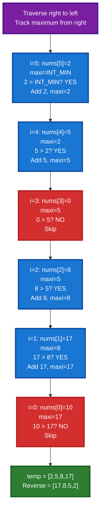

# 📚 Array FAQ (Medium) - Complete Guide

This directory contains three medium-level array problems that test deeper algorithmic thinking and array manipulation skills. Each problem explores both brute force and optimal solutions.

---

## 📋 Table of Contents

1. [Find Leaders in an Array](#1-find-leaders-in-an-array)
2. [Rearrange Array Elements by Sign](#2-rearrange-array-elements-by-sign)
3. [Print Matrix in Spiral Order](#3-print-matrix-in-spiral-order)
4. [Comparison Table](#comparison-table)
5. [Key Takeaways](#key-takeaways)

---

## 1. Find Leaders in an Array

### 📖 Explanation

A leader in an array is an element that is greater than all elements to its right. The rightmost element is always a leader. The problem requires finding all such leader elements and returning them in the order of their appearance.

### 🎯 Approach Comparison

#### **Brute Force Approach** ❌ O(n²)

1. For each element at index `i`
2. Check all elements to its right (index `i+1` to `n-1`)
3. If any element to the right is ≥ current element, it's not a leader
4. Otherwise, add to result

**Complexity**: O(n²) time, O(1) space (excluding output)

#### **Optimal Approach** ⭐ O(n)

1. Start from the **rightmost element** (always a leader)
2. Keep track of maximum element seen so far from right
3. Traverse from right to left:
   - If current element > max seen so far, it's a leader
   - Update max to current element
4. **Reverse the result** (since we traversed right to left)

**Key Insight**: An element is a leader if it's greater than the maximum of all elements to its right!

### 💻 Code Implementation

#### Brute Force

```cpp
class Solution
{
public:
    vector<int> leaders(vector<int> &nums)
    {
        vector<int> ans;

        for (int i = 0; i < nums.size(); i++)
        {
            bool leader = true;

            /* Check whether nums[i] is greater
            than all elements to its right*/
            for (int j = i + 1; j < nums.size(); j++)
            {
                if (nums[j] >= nums[i])
                {
                    /* If any element to the right is greater
                    or equal, nums[i] is not a leader*/
                    leader = false;
                    break;
                }
            }

            // If nums[i] is a leader, add it to the ans vector
            if (leader)
            {
                ans.push_back(nums[i]);
            }
        }

        return ans;
    }
};
```

#### Optimal Solution

```cpp
class Solution
{
public:
    vector<int> leaders(vector<int> &nums)
    {
        vector<int> ans;
        int n = nums.size();
        int maxi = INT_MIN;

        // Traverse from right to left
        for (int i = n - 1; i >= 0; i--)
        {
            if (nums[i] > maxi)
            {
                // to be leader, every element should be greater than its prev maximum.
                ans.push_back(nums[i]);
                maxi = nums[i]; // then if element is greater than prev max, element itself becomes new max
            }
        }

        reverse(ans.begin(), ans.end());

        return ans;
    }
};
```

### 🔍 Complexity Analysis

| Approach | Time  | Space |
| -------- | ----- | ----- |
| Brute    | O(n²) | O(1)  |
| Optimal  | O(n)  | O(1)  |

### 🎨 Dry Run with Visual

**Input**: `nums = [10, 17, 8, 0, 5, 2]`

#### Brute Force Visualization

```mermaid
graph TD
    A["Array: [10,17,8,0,5,2]"] --> B["Check 10: Right elements [17,8,0,5,2]<br/>17 ≥ 10? YES<br/>10 is NOT a leader ❌"]
    B --> C["Check 17: Right elements [8,0,5,2]<br/>All < 17? YES<br/>17 is a leader ✓"]
    C --> D["Check 8: Right elements [0,5,2]<br/>All < 8? NO (5 >= 8 is false)<br/>Wait, 5 < 8? YES<br/>8 is a leader ✓"]
    D --> E["Check 0: Right elements [5,2]<br/>5 ≥ 0? YES<br/>0 is NOT a leader ❌"]
    E --> F["Check 5: Right elements [2]<br/>2 ≥ 5? NO<br/>5 is a leader ✓"]
    F --> G["Check 2: (last element)<br/>2 is a leader ✓"]
    G --> H["Result: [17, 8, 5, 2]"]

    style A fill:#7B1FA2,stroke:#4A148C,stroke-width:3px,color:#fff
    style C fill:#2E7D32,stroke:#1B5E20,stroke-width:3px,color:#fff
    style D fill:#2E7D32,stroke:#1B5E20,stroke-width:3px,color:#fff
    style F fill:#2E7D32,stroke:#1B5E20,stroke-width:3px,color:#fff
    style G fill:#2E7D32,stroke:#1B5E20,stroke-width:3px,color:#fff
    style H fill:#F57C00,stroke:#E65100,stroke-width:3px,color:#fff
```



#### Optimal Approach Visualization



### ✅ Key Points

- ✓ Rightmost element is always a leader
- ✓ Optimal: Single right-to-left pass
- ✓ Track maximum from right to identify leaders
- ✓ O(n) vs O(n²) dramatic improvement
- ✓ Must reverse result (traversed right to left)

---

## 2. Rearrange Array Elements by Sign

### 📖 Explanation

Given an array with equal positive and negative integers, rearrange so that:

1. Every consecutive pair has opposite signs
2. Order of same-sign elements is preserved
3. Array starts with a positive integer

### 🎯 Approach Comparison

#### **Brute Force Approach** - O(n)

1. Separate array into positive and negative vectors
2. Place positives on even indices (0, 2, 4, ...)
3. Place negatives on odd indices (1, 3, 5, ...)

**Complexity**: O(n) time, O(n) space

#### **Optimal Approach** ⭐ - O(n)

1. Create result array of size n
2. Use two pointers: `posIndex = 0`, `negIndex = 1`
3. Single pass:
   - If element ≥ 0: place at `posIndex`, increment by 2
   - If element < 0: place at `negIndex`, increment by 2

**Complexity**: O(n) time, O(n) space (same but cleaner)

### 💻 Code Implementation

#### Brute Force

```cpp
class Solution
{
public:
    vector<int> rearrangeArray(vector<int> &nums)
    {
        int n = nums.size();

        // Define 2 vectors, one for storing positive
        // and the other for negative elements of the array
        vector<int> pos, neg;

        // Segregate the array into positives and negatives
        for (int i = 0; i < n; ++i)
        {
            if (nums[i] > 0)
                pos.push_back(nums[i]);
            else
                neg.push_back(nums[i]);
        }

        // Positives on even indices, negatives on odd
        for (int i = 0; i < n / 2; ++i)
        {
            nums[2 * i] = pos[i];
            nums[2 * i + 1] = neg[i];
        }

        return nums;
    }
};
```

#### Optimal Solution

```cpp
class Solution
{
public:
    vector<int> rearrangeArray(vector<int> &nums)
    {
        int n = nums.size();
        vector<int> ans(n, 0);
        int posIndex = 0;
        int negIndex = 1;

        for (int i = 0; i < n; i++)
        {
            if (nums[i] >= 0)
            {
                ans[posIndex] = nums[i];
                posIndex = posIndex + 2;
            }
            else
            {
                ans[negIndex] = nums[i];
                negIndex = negIndex + 2;
            }
        }

        return ans;
    }
};
```

### 🔍 Complexity Analysis

| Approach | Time | Space |
| -------- | ---- | ----- |
| Brute    | O(n) | O(n)  |
| Optimal  | O(n) | O(n)  |

**Both have same complexity but optimal is more direct**

### 🎨 Dry Run with Visual

**Input**: `nums = [3, 1, -2, -5, 2, -4]`

```mermaid
graph TD
    A["Initialize<br/>ans = [0,0,0,0,0,0]<br/>posIndex=0, negIndex=1"] --> B["i=0: nums[0]=3 ≥ 0<br/>ans[0]=3<br/>posIndex=2<br/>ans=[3,0,0,0,0,0]"]
    B --> C["i=1: nums[1]=1 ≥ 0<br/>ans[2]=1<br/>posIndex=4<br/>ans=[3,0,1,0,0,0]"]
    C --> D["i=2: nums[2]=-2 < 0<br/>ans[1]=-2<br/>negIndex=3<br/>ans=[3,-2,1,0,0,0]"]
    D --> E["i=3: nums[3]=-5 < 0<br/>ans[3]=-5<br/>negIndex=5<br/>ans=[3,-2,1,-5,0,0]"]
    E --> F["i=4: nums[4]=2 ≥ 0<br/>ans[4]=2<br/>posIndex=6<br/>ans=[3,-2,1,-5,2,0]"]
    F --> G["i=5: nums[5]=-4 < 0<br/>ans[5]=-4<br/>negIndex=7<br/>ans=[3,-2,1,-5,2,-4]"]
    G --> H["Result<br/>[3,-2,1,-5,2,-4]"]

    style A fill:#7B1FA2,stroke:#4A148C,stroke-width:3px,color:#fff
    style B fill:#1976D2,stroke:#0D47A1,stroke-width:3px,color:#fff
    style C fill:#1976D2,stroke:#0D47A1,stroke-width:3px,color:#fff
    style D fill:#E91E63,stroke:#C2185B,stroke-width:3px,color:#fff
    style E fill:#E91E63,stroke:#C2185B,stroke-width:3px,color:#fff
    style F fill:#1976D2,stroke:#0D47A1,stroke-width:3px,color:#fff
    style G fill:#E91E63,stroke:#C2185B,stroke-width:3px,color:#fff
    style H fill:#2E7D32,stroke:#1B5E20,stroke-width:3px,color:#fff
```



### 📊 Two-Pointer Index Management

```mermaid
sequenceDiagram
    participant Arr as Input Array
    participant Ans as Result Array
    participant Pos as posIndex
    participant Neg as negIndex

    Note over Arr,Neg: [3,1,-2,-5,2,-4]

    Arr->>Ans: 3 is positive
    Pos->>Ans: Place at index 0
    Pos->>Pos: 0 + 2 = 2

    Arr->>Ans: 1 is positive
    Pos->>Ans: Place at index 2
    Pos->>Pos: 2 + 2 = 4

    Arr->>Ans: -2 is negative
    Neg->>Ans: Place at index 1
    Neg->>Neg: 1 + 2 = 3

    Arr->>Ans: -5 is negative
    Neg->>Ans: Place at index 3
    Neg->>Neg: 3 + 2 = 5

    Arr->>Ans: 2 is positive
    Pos->>Ans: Place at index 4
    Pos->>Pos: 4 + 2 = 6

    Arr->>Ans: -4 is negative
    Neg->>Ans: Place at index 5
    Neg->>Neg: 5 + 2 = 7

    Note over Ans: [3,-2,1,-5,2,-4] ✓
```



### ✅ Key Points

- ✓ Single pass solution
- ✓ Preserves order of same-sign elements
- ✓ Two separate index pointers for positions
- ✓ Increment by 2 to alternate signs
- ✓ Can start with positive (even indices)

---

## 3. Print Matrix in Spiral Order

### 📖 Explanation

Given an M×N matrix, traverse and print elements in clockwise spiral order: right → down → left → up, spiraling inward layer by layer.

### 🎯 Approach

1. Use four boundaries: `top`, `bottom`, `left`, `right`
2. Traverse four sides in order:
   - **Top row** (left to right)
   - **Right column** (top to bottom)
   - **Bottom row** (right to left)
   - **Left column** (bottom to top)
3. After each side, adjust the corresponding boundary
4. Check boundaries before each side to avoid duplicates

### 💻 Code Implementation

```cpp
class Solution
{
public:
    vector<int> spiralOrder(vector<vector<int>> &matrix)
    {
        int n = matrix.size();
        int m = matrix[0].size();
        int top = 0;
        int bottom = n - 1;
        int left = 0;
        int right = m - 1;
        vector<int> ans;

        while (left <= right && top <= bottom)
        {
            // Traverse top row (left to right)
            for (int i = left; i <= right; i++)
            {
                ans.push_back(matrix[top][i]);
            }
            top++;

            // Traverse right column (top to bottom)
            for (int i = top; i <= bottom; i++)
            {
                ans.push_back(matrix[i][right]);
            }
            right--;

            // Traverse bottom row (right to left) - check boundary
            if (top > bottom)
                break;
            for (int i = right; i >= left; i--)
            {
                ans.push_back(matrix[bottom][i]);
            }
            bottom--;

            // Traverse left column (bottom to top) - check boundary
            if (left > right)
                break;
            for (int i = bottom; i >= top; i--)
            {
                ans.push_back(matrix[i][left]);
            }
            left++;
        }

        return ans;
    }
};
```

### 🔍 Complexity Analysis

| Complexity | Value   |
| ---------- | ------- |
| Time       | O(m\*n) |
| Space      | O(1)    |

- **Time O(m\*n)**: Visit each element exactly once
- **Space O(1)**: Only boundaries and output

### 🎨 Dry Run with Visual

**Input**: `matrix = [[1,2,3], [4,5,6], [7,8,9]]`

```mermaid
graph TD
    A["Matrix 3x3:<br/>1 2 3<br/>4 5 6<br/>7 8 9<br/><br/>top=0, bottom=2<br/>left=0, right=2"] --> B["Step 1: Traverse TOP row<br/>i=0→2: 1, 2, 3<br/>top++ = 1<br/>Path: →→→"]
    B --> C["Step 2: Traverse RIGHT column<br/>i=1→2: 6, 9<br/>right-- = 1<br/>Path: ↓↓"]
    C --> D["Step 3: Traverse BOTTOM row<br/>Check: top=1, bottom=2 (1≤2? YES)<br/>i=1→0: 8, 7<br/>bottom-- = 1<br/>Path: ←←"]
    D --> E["Step 4: Traverse LEFT column<br/>Check: left=0, right=1 (0≤1? YES)<br/>i=1→1: 4<br/>left++ = 1<br/>Path: ↑"]
    E --> F["Check loop condition<br/>left=1, right=1 (1≤1? YES)<br/>top=1, bottom=1 (1≤1? YES)<br/>Continue..."]
    F --> G["Step 5: Traverse TOP row<br/>i=1→1: 5<br/>top++ = 2<br/>Path: →"]
    G --> H["Check loop condition<br/>left=1, right=1 (YES)<br/>top=2, bottom=1 (2≤1? NO)<br/>Exit loop"]
    H --> I["Result: [1,2,3,6,9,8,7,4,5]"]

    style A fill:#7B1FA2,stroke:#4A148C,stroke-width:3px,color:#fff
    style B fill:#1976D2,stroke:#0D47A1,stroke-width:3px,color:#fff
    style C fill:#1976D2,stroke:#0D47A1,stroke-width:3px,color:#fff
    style D fill:#F57C00,stroke:#E65100,stroke-width:3px,color:#fff
    style E fill:#E91E63,stroke:#C2185B,stroke-width:3px,color:#fff
    style F fill:#1976D2,stroke:#0D47A1,stroke-width:3px,color:#fff
    style G fill:#F57C00,stroke:#E65100,stroke-width:3px,color:#fff
    style H fill:#D32F2F,stroke:#B71C1C,stroke-width:3px,color:#fff
    style I fill:#2E7D32,stroke:#1B5E20,stroke-width:3px,color:#fff
```



### 📊 Spiral Visualization

```mermaid
graph TD
    A["Matrix:<br/>1 2 3<br/>4 5 6<br/>7 8 9"] --> B["Phase 1: Top Row<br/>→ 1,2,3"]
    B --> C["Phase 2: Right Col<br/>↓ 6,9"]
    C --> D["Phase 3: Bottom Row<br/>← 8,7"]
    D --> E["Phase 4: Left Col<br/>↑ 4"]
    E --> F["Phase 5: Top Row<br/>→ 5"]
    F --> G["Result<br/>1,2,3,6,9,8,7,4,5"]

    style A fill:#7B1FA2,stroke:#4A148C,stroke-width:3px,color:#fff
    style B fill:#1976D2,stroke:#0D47A1,stroke-width:3px,color:#fff
    style C fill:#1976D2,stroke:#0D47A1,stroke-width:3px,color:#fff
    style D fill:#F57C00,stroke:#E65100,stroke-width:3px,color:#fff
    style E fill:#E91E63,stroke:#C2185B,stroke-width:3px,color:#fff
    style F fill:#1976D2,stroke:#0D47A1,stroke-width:3px,color:#fff
    style G fill:#2E7D32,stroke:#1B5E20,stroke-width:3px,color:#fff
```



### ✅ Key Points

- ✓ Four-boundary approach (top, bottom, left, right)
- ✓ Adjust boundaries after each side
- ✓ Check boundaries before bottom and left traversals
- ✓ Prevents processing already-visited elements
- ✓ Works for any M×N matrix

---

## Comparison Table

| Problem               | Approach      | Brute Time | Optimal Time | Space | Difficulty |
| --------------------- | ------------- | ---------- | ------------ | ----- | ---------- |
| **Leaders**           | Right to Left | O(n²)      | O(n)         | O(1)  | Medium     |
| **Rearrange by Sign** | Two Pointers  | O(n)       | O(n)         | O(n)  | Medium     |
| **Spiral Matrix**     | Four Boundary | O(m\*n)    | O(m\*n)      | O(1)  | Medium     |

---

## Key Takeaways

### 🎯 Problem 1: Find Leaders

- **Key Insight**: Track maximum from right to identify leaders
- **Optimization**: O(n²) → O(n) by reversing traversal direction
- **Application**: First element after sorting descending is always a leader

### 🎯 Problem 2: Rearrange by Sign

- **Key Insight**: Use two separate index pointers for positions
- **Optimization**: Single pass instead of separate segregation
- **Application**: Two-pointer technique on single array

### 🎯 Problem 3: Spiral Matrix

- **Key Insight**: Maintain four boundaries for layer-by-layer traversal
- **Challenge**: Handle boundary conditions for different matrix sizes
- **Application**: 2D array traversal patterns

---

## 🎓 Key Techniques Mastered

1. **Reverse Traversal Optimization** - Traverse from right/end to find optimal solutions
2. **Multi-Pointer Management** - Multiple indices for different purposes
3. **Boundary Management** - Track and adjust boundaries for 2D traversals
4. **Layer-by-Layer Processing** - Spiral and similar patterns

---

## 🔗 Related Advanced Topics

- **2D Matrix Traversals**: Zigzag, diagonal, rotations
- **Graph Traversal**: DFS/BFS similar to spiral pattern
- **Stack-based Solutions**: Alternative to boundary management
- **Dynamic Programming**: Building solutions from edges inward

---

## 💡 Common Interview Questions

1. What if we need to spiral traverse right-to-left (counter-clockwise)?
2. Can we spiral traverse a non-rectangular matrix?
3. Find all leaders in O(n log n) with additional constraints?
4. Rearrange with more than 2 types of elements?

---

**Happy Coding! 🚀**

_Last Updated: October 10, 2025_
