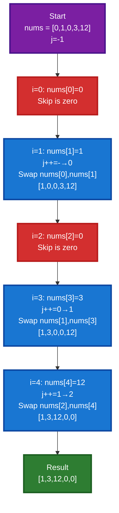
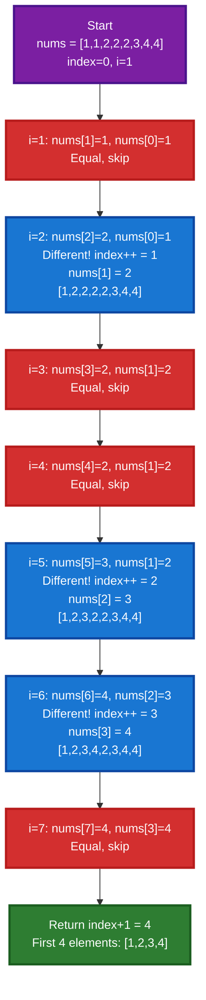
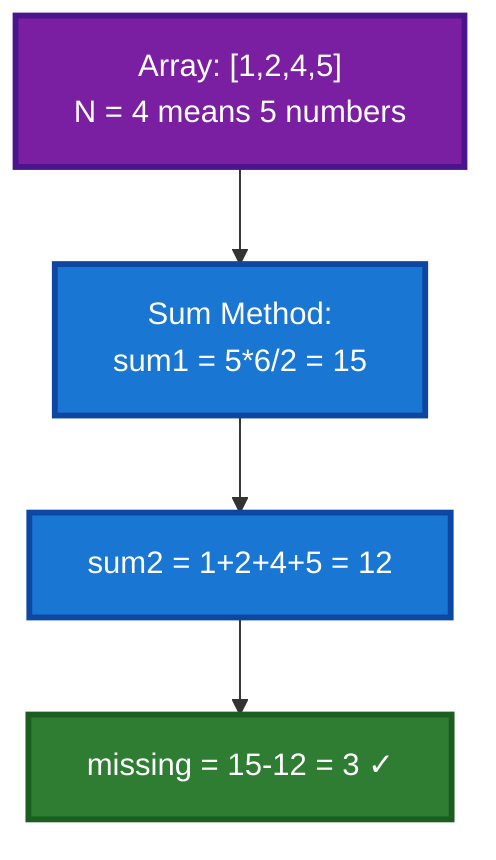
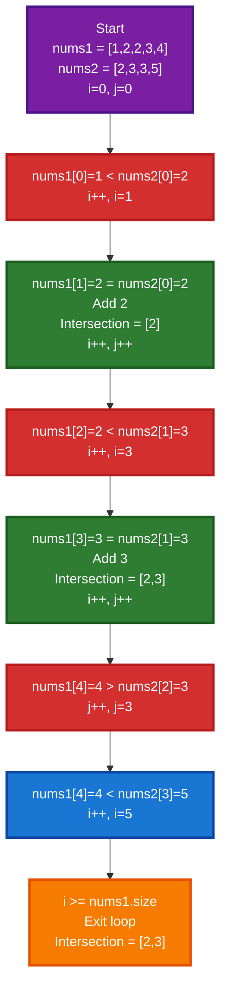

# 📚 Array Logic Building - Complete Guide

This directory contains intermediate-level array problems focusing on logic building, two-pointer techniques, and array manipulation. Each problem explores both brute force and optimal solutions.

---

## 📋 Table of Contents

1. [Move Zeroes to End](#1-move-zeroes-to-end)
2. [Remove Duplicates from Sorted Array](#2-remove-duplicates-from-sorted-array)
3. [Find Missing Number](#3-find-missing-number)
4. [Union of Two Sorted Arrays](#4-union-of-two-sorted-arrays)
5. [Intersection of Two Sorted Arrays](#5-intersection-of-two-sorted-arrays)
6. [Comparison Table](#comparison-table)
7. [Key Techniques](#key-techniques)

---

## 1. Move Zeroes to End

### 📖 Explanation

This problem requires moving all zero elements to the end of the array while maintaining the relative order of non-zero elements. The algorithm uses the two-pointer technique to efficiently swap elements.

### 🎯 Approach

1. Initialize `j = -1` (pointer for first zero position)
2. Traverse array with pointer `i`
3. Whenever we find a non-zero element:
   - Pre-increment `j` and swap `nums[j]` with `nums[i]`
4. All zeros automatically move to the end

**Key Insight**: We only swap when we find non-zero elements, effectively moving zeroes to the end.

### 💻 Code Implementation

```cpp
// move zeroes to end of array
class Solution
{
public:
    void moveZeroes(vector<int> &nums)
    {
        int n = nums.size();
        int j = -1;
        for (int i = 0; i < n; i++)
        {
            if (nums[i] != 0)
            {
                swap(nums[++j], nums[i]);
            }
        }
    }
};
```

### 🔍 Complexity Analysis

| Complexity Type | Value |
| --------------- | ----- |
| Time            | O(n)  |
| Space           | O(1)  |

- **Time O(n)**: Single pass through array
- **Space O(1)**: In-place swapping, no extra space

### 🎨 Dry Run with Visual

**Input**: `nums = [0, 1, 0, 3, 12]`



### ✅ Key Points

- ✓ In-place solution
- ✓ Maintains relative order of non-zero elements
- ✓ Single pass O(n) algorithm
- ✓ Two-pointer technique
- ✓ Minimal swaps only for non-zero elements

---

## 2. Remove Duplicates from Sorted Array

### 📖 Explanation

Remove all duplicate elements from a sorted array such that each unique element appears only once. Returns the count of unique elements.

### 🎯 Approach Comparison

#### **Brute Force Approach**

1. Insert all elements into a `set` automatically sorted and unique
2. Get the size of set count of unique elements
3. Copy unique elements back to array
4. Return count

**Complexity**: O(n log n + n) time, O(n) space

#### **Optimal Approach** ⭐

1. Use two pointers: `index` at 0, `i` starting from 1
2. When `nums[i] != nums[index]`:
   - Increment `index`
   - Copy `nums[i]` to `nums[index]`
3. Return `index + 1` count of unique elements

**Complexity**: O(n) time, O(1) space

### 💻 Code Implementation

#### Brute Force

```cpp
// time complexity o(nlogn+n), space complexity o(n)
class Solution
{
public:
    int removeDuplicates(vector<int> &nums)
    {
        set<int> s;
        for (int val : nums)
        {
            s.insert(val);
        }
        int k = s.size();
        int j = 0;
        for (int val : s)
        {
            nums[j++] = val;
        }
        return k;
    }
};
```

#### Optimal Solution

```cpp
// time complexity o(n), space complexity o(1)
class Solution
{
public:
    int removeDuplicates(vector<int> &nums)
    {
        int n = nums.size();
        int index = 0;
        for (int i = 1; i < n; i++)
        {
            if (nums[i] != nums[index])
            {
                nums[++index] = nums[i];
            }
        }
        return index + 1;
    }
};
```

### 🔍 Complexity Analysis

| Approach | Time Complexity | Space Complexity |
| -------- | --------------- | ---------------- |
| Brute    | O(n log n + n)  | O(n)             |
| Optimal  | O(n)            | O(1)             |

### 🎨 Dry Run with Visual

**Input**: `nums = [1, 1, 2, 2, 2, 3, 4, 4]`



### ✅ Key Points

- ✓ Optimal solution is in-place
- ✓ Linear time complexity O(n)
- ✓ Two-pointer technique
- ✓ No extra space required
- ✓ Works for sorted arrays only

---

## 3. Find Missing Number

### 📖 Explanation

Given an array containing n distinct numbers from 1 to n+1, find the missing number. Two approaches with different mathematical properties.

### 🎯 Approach Comparison

#### **Optimal-1: Sum Method**

1. Calculate sum of first N natural numbers: `sum = N*(N+1)/2`
2. Calculate sum of array elements
3. Missing number = `sum - array_sum`

**Pros**: Simple and intuitive  
**Cons**: Can overflow for very large arrays

#### **Optimal-2: XOR Method** ⭐ **Most Elegant**

1. Calculate XOR of all numbers from 1 to N: `xor1`
2. Calculate XOR of all array elements: `xor2`
3. Missing number = `xor1 ^ xor2`

**Pros**: No overflow issues, elegant bit manipulation  
**Cons**: Less intuitive

### 💻 Code Implementation

#### Sum Method

```cpp
class Solution
{
public:
    int missingNumber(vector<int> &nums)
    {
        int N = nums.size();
        int sum1 = (N * (N + 1)) / 2;
        int sum2 = 0;
        for (int num : nums)
        {
            sum2 += num;
        }
        int missingNum = sum1 - sum2;
        return missingNum;
    }
};
```

#### XOR Method

```cpp
class Solution
{
public:
    int missingNumber(vector<int> &nums)
    {
        int xor1 = 0, xor2 = 0;
        for (int i = 0; i < nums.size(); i++)
        {
            xor1 = xor1 ^ (i + 1);
            xor2 = xor2 ^ nums[i];
        }
        return (xor1 ^ xor2);
    }
};
```

### 🔍 Complexity Analysis

| Method | Time | Space |
| ------ | ---- | ----- |
| Sum    | O(n) | O(1)  |
| XOR    | O(n) | O(1)  |

Both are equally optimal!

### 🎨 Dry Run with Visual

**Input**: `nums = [1, 2, 4, 5]` Missing: 3



### ✅ Key Points

- ✓ Both solutions O(n) time, O(1) space
- ✓ Sum method: intuitive but can overflow
- ✓ XOR method: elegant, no overflow
- ✓ Single pass solutions
- ✓ XOR is preferred for competitive programming

---

## 4. Union of Two Sorted Arrays

### 📖 Explanation

Find the union of two sorted arrays all unique elements from both arrays in sorted order.

### 🎯 Approach Comparison

#### **Brute Force: Using Set**

1. Insert all elements from both arrays into a set
2. Convert set back to vector
3. Return result

**Complexity**: O(m log m + n log n) time, O(m+n) space

#### **Optimal: Two Pointers** ⭐

1. Use two pointers `i` and `j` for both arrays
2. Compare elements and add smaller one
3. Handle remaining elements from either array
4. Skip duplicates by checking last added element

**Complexity**: O(m+n) time, O(1) space excluding output

### 💻 Code Implementation

#### Optimal Solution

```cpp
class Solution
{
public:
    vector<int> unionArray(vector<int> &nums1, vector<int> &nums2)
    {
        int n1 = nums1.size();
        int n2 = nums2.size();
        vector<int> uni;
        int i = 0, j = 0;
        while (i < n1 && j < n2)
        {
            if (nums1[i] < nums2[j])
            {
                if (uni.size() == 0 || uni.back() != nums1[i])
                {
                    uni.push_back(nums1[i]);
                }
                i++;
            }
            else
            {
                if (uni.size() == 0 || uni.back() != nums2[j])
                {
                    uni.push_back(nums2[j]);
                }
                j++;
            }
        }
        while (i < n1)
        {
            if (uni.size() == 0 || uni.back() != nums1[i])
            {
                uni.push_back(nums1[i]);
            }
            i++;
        }
        while (j < n2)
        {
            if (uni.size() == 0 || uni.back() != nums2[j])
            {
                uni.push_back(nums2[j]);
            }
            j++;
        }
        return uni;
    }
};
```

### 🔍 Complexity Analysis

| Approach | Time                 | Space  |
| -------- | -------------------- | ------ |
| Brute    | O(m log m + n log n) | O(m+n) |
| Optimal  | O(m+n)               | O(1)   |

### ✅ Key Points

- ✓ Two-pointer technique on sorted arrays
- ✓ Optimal solution O(m+n) time
- ✓ Handles duplicates efficiently
- ✓ No extra space for main processing
- ✓ Single pass through both arrays

---

## 5. Intersection of Two Sorted Arrays

### 📖 Explanation

Find the intersection of two sorted arrays common elements present in both arrays.

### 🎯 Approach Comparison

#### **Brute Force: Nested Loop with Visited Array**

1. For each element in nums1
2. Search for it in nums2
3. Mark visited elements to avoid duplicates
4. Break early if nums2[j] > nums1[i]

**Complexity**: O(m\*n) worst case, O(m+n) with early break

#### **Optimal: Two Pointers** ⭐

1. Initialize two pointers for both sorted arrays
2. Compare elements:
   - If nums1[i] < nums2[j]: increment i
   - If nums1[i] > nums2[j]: increment j
   - If equal: add to result and increment both
3. Single pass through both arrays

**Complexity**: O(m+n) time, O(1) space

### 💻 Code Implementation

#### Optimal Solution

```cpp
class Solution
{
public:
    vector<int> intersectionArray(vector<int> &nums1, vector<int> &nums2)
    {
        int n = nums1.size();
        int m = nums2.size();
        int i = 0;
        int j = 0;
        vector<int> inter;
        while (i < n && j < m)
        {
            if (nums1[i] < nums2[j])
            {
                i++;
            }
            else if (nums2[j] < nums1[i])
            {
                j++;
            }
            else
            {
                inter.push_back(nums1[i]);
                i++;
                j++;
            }
        }
        return inter;
    }
};
```

### 🔍 Complexity Analysis

| Approach | Time    | Space |
| -------- | ------- | ----- |
| Brute    | O(m\*n) | O(m)  |
| Optimal  | O(m+n)  | O(1)  |

### 🎨 Dry Run with Visual

**Input**: `nums1 = [1, 2, 2, 3, 4]`, `nums2 = [2, 3, 3, 5]`



### ✅ Key Points

- ✓ Two-pointer technique on sorted arrays
- ✓ Optimal O(m+n) solution
- ✓ Automatically handles duplicates only adds common elements
- ✓ Single pass through both arrays
- ✓ No extra space needed

---

## Comparison Table

| Problem               | Technique    | Time Best  | Time Optimal | Space | Difficulty |
| --------------------- | ------------ | ---------- | ------------ | ----- | ---------- |
| **Move Zeroes**       | Two Pointers | O(n)       | O(n)         | O(1)  | Easy       |
| **Remove Duplicates** | Two Pointers | O(n log n) | O(n)         | O(1)  | Easy       |
| **Missing Number**    | Math/XOR     | O(n²)      | O(n)         | O(1)  | Easy       |
| **Union of Arrays**   | Merge/Set    | O(n log n) | O(m+n)       | O(1)  | Medium     |
| **Intersection**      | Two Pointers | O(m\*n)    | O(m+n)       | O(1)  | Medium     |

---

## Key Techniques

### 🎯 Two-Pointer Technique

**Pattern:**

```
Initialize two pointers
While pointers within bounds:
    Compare elements
    Move pointer based on logic
    Process results
```

### 🎯 Set Operations

- Union: All unique elements from both
- Intersection: Common elements only

---

**Happy Coding! 🚀**

_Last Updated: October 10, 2025_
