```mermaid
flowchart TD
    subgraph Input["📊 Input"]
        M["matrix = [[1,4,9], [2,5,6], [3,7,8]]<br/>n=3, m=3, total=9 elements<br/>req = 9/2 = 4 (need 4 elements smaller)"]
    end
    
    subgraph Init["🔧 Find Range"]
        I["low = min(1,2,3) = 1<br/>high = max(9,6,8) = 9"]
    end
    
    subgraph Iter1["Iteration 1: mid = 5"]
        I1_CNT["Count elements ≤ 5:<br/>Row [1,4,9]: 2 (1,4)<br/>Row [2,5,6]: 2 (2,5)<br/>Row [3,7,8]: 1 (3)<br/>Total = 5"]
        I1_CMP["5 > 4 (req)<br/>high = 5 - 1 = 4"]
        I1_CNT --> I1_CMP
    end
    
    subgraph Iter2["Iteration 2: mid = 2"]
        I2_CNT["Count elements ≤ 2:<br/>Row [1,4,9]: 1 (1)<br/>Row [2,5,6]: 1 (2)<br/>Row [3,7,8]: 0<br/>Total = 2"]
        I2_CMP["2 ≤ 4 (req)<br/>low = 2 + 1 = 3"]
        I2_CNT --> I2_CMP
    end
    
    subgraph Iter3["Iteration 3: mid = 3"]
        I3_CNT["Count elements ≤ 3:<br/>Row [1,4,9]: 1 (1)<br/>Row [2,5,6]: 1 (2)<br/>Row [3,7,8]: 1 (3)<br/>Total = 3"]
        I3_CMP["3 ≤ 4 (req)<br/>low = 3 + 1 = 4"]
        I3_CNT --> I3_CMP
    end
    
    subgraph Iter4["Iteration 4: mid = 4"]
        I4_CNT["Count elements ≤ 4:<br/>Row [1,4,9]: 2 (1,4)<br/>Row [2,5,6]: 1 (2)<br/>Row [3,7,8]: 1 (3)<br/>Total = 4"]
        I4_CMP["4 ≤ 4 (req)<br/>low = 4 + 1 = 5"]
        I4_CNT --> I4_CMP
    end
    
    subgraph Iter5["Iteration 5: low=5, high=4"]
        I5_CHK["low > high<br/>Loop terminates"]
    end
    
    subgraph Result["✅ Return low = 5"]
        RES["Median = 5"]
    end
    
    M --> Init --> Iter1 --> Iter2 --> Iter3 --> Iter4 --> Iter5 --> Result
    
    style Input fill:#1e3a5f,stroke:#60a5fa,color:#fff
    style Init fill:#1e3a5f,stroke:#60a5fa,color:#fff
    style Iter1 fill:#713f12,stroke:#facc15,color:#fff
    style Iter2 fill:#713f12,stroke:#facc15,color:#fff
    style Iter3 fill:#713f12,stroke:#facc15,color:#fff
    style Iter4 fill:#713f12,stroke:#facc15,color:#fff
    style Iter5 fill:#713f12,stroke:#facc15,color:#fff
    style Result fill:#14532d,stroke:#4ade80,color:#fff
```

# 🔍 2D Array Binary Search - Master Revision Guide

> **A comprehensive study guide covering Binary Search techniques applied to 2D arrays/matrices.**

---

## 📑 Table of Contents

1. [Row with Maximum 1's](#1-row-with-maximum-1s)
2. [Search in a 2D Matrix](#2-search-in-a-2d-matrix)
3. [Search in 2D Matrix II](#3-search-in-2d-matrix-ii)
4. [Find Peak Element II](#4-find-peak-element-ii)
5. [Matrix Median](#5-matrix-median)

---

## 1. Row with Maximum 1's

### 📋 Problem Statement

Given a **non-empty grid** `mat` consisting of only **0s and 1s**, where all the rows are sorted in **ascending order**, find the index of the row with the **maximum number of ones**.

- If two rows have the same number of ones, return the one with the **smaller index**.
- If no 1 exists in the matrix, return `-1`.

**Example:**
```
Input:  mat = [[1, 1, 1], [0, 0, 1], [0, 0, 0]]
Output: 0
Explanation: Row 0 has 3 ones, Row 1 has 1 one, Row 2 has 0 ones.
```

---

### 💡 Intuition & Strategy

#### Pattern Recognition:
The key insight is that **rows are sorted in ascending order**, meaning all 0s come before all 1s in each row. This sorted property screams **Binary Search!**

#### Why Binary Search?
- **Brute Force Trap**: Counting 1s in each row takes O(m) per row → O(n × m) total.
- **Binary Search Optimization**: Instead of counting, we find the **first occurrence of 1** using `lower_bound`. The count of 1s = `m - index_of_first_1`.

#### The Mental Model:
```
Row: [0, 0, 0, 1, 1, 1, 1]
      ↑       ↑
    0s zone  1s zone
              └── Find this index using lower_bound
              
Count of 1s = Total columns - Index of first 1 = 7 - 3 = 4
```

#### Why Lower Bound?
Lower bound finds the **first position where element ≥ target**. Since we're looking for the first 1, `lower_bound(1)` gives exactly what we need!

---

### 📝 The Code

#### Approach 1: Linear Search (Brute Force)
```cpp
class Solution {
public:
    int rowWithMax1s(vector<vector<int>>& mat) {
        int n = mat.size();
        int m = mat[0].size();
        
        int cnt_max = 0;   // Track maximum 1s count found so far
        int index = -1;    // Store row index with max 1s (-1 if none)
        
        // Iterate through each row
        for (int i = 0; i < n; i++) {
            int cnt_ones = 0;
            
            // Count 1s in current row (O(m) per row)
            for (int j = 0; j < m; j++) {
                cnt_ones += mat[i][j];  // 1s add to count, 0s don't
            }
            
            // Update only if current row has MORE 1s (handles tie by smaller index)
            if (cnt_ones > cnt_max) {
                cnt_max = cnt_ones;
                index = i;
            }
        }
        return index;
    }
};
```

#### Approach 2: Binary Search (Optimal)
```cpp
class Solution {
private:
    // Binary search to find first occurrence of 1 (lower bound)
    int lowerBound(vector<int> arr, int n, int x) {
        int low = 0, high = n - 1;
        int ans = n;  // Default: no 1 found, so first 1 is "after" array
        
        while (low <= high) {
            int mid = (low + high) / 2;
            
            // If arr[mid] >= x, this could be our answer
            if (arr[mid] >= x) {
                ans = mid;         // Store potential answer
                high = mid - 1;    // Search left for earlier 1
            } else {
                low = mid + 1;     // Search right
            }
        }
        return ans;
    }

public:
    int rowWithMax1s(vector<vector<int>>& mat) {
        int n = mat.size();
        int m = mat[0].size();
        
        int cnt_max = 0;
        int index = -1;
        
        for (int i = 0; i < n; i++) {
            // Count = m - (index of first 1)
            int cnt_ones = m - lowerBound(mat[i], m, 1);
            
            if (cnt_ones > cnt_max) {
                cnt_max = cnt_ones;
                index = i;
            }
        }
        return index;
    }
};
```

---

### 🎯 Visual Dry Run


---

### ⏱️ Complexity Analysis

| Approach | Time Complexity | Space Complexity |
|----------|----------------|------------------|
| Brute Force | **O(n × m)** | **O(1)** |
| Binary Search | **O(n × log m)** | **O(1)** |

**Derivation:**
- **Brute Force**: For each of `n` rows, we scan all `m` columns → O(n × m)
- **Binary Search**: For each of `n` rows, we perform binary search on `m` elements → O(n × log m)
- **Space**: Both use only constant extra variables

---

## 2. Search in a 2D Matrix

### 📋 Problem Statement

Given a **2D matrix** `mat` where:
- Elements of each row are sorted in **non-decreasing order**
- The **first element of a row is greater than the last element of the previous row**

Find if a given `target` exists in the matrix.

**Example:**
```
Input:  mat = [[1,2,3,4], [5,6,7,8], [9,10,11,12]], target = 8
Output: True
Explanation: 8 exists at position (1, 3)
```

---

### 💡 Intuition & Strategy

#### Pattern Recognition:
The matrix is **globally sorted** when read row by row! This is essentially a **sorted 1D array wrapped in 2D form**.

```
Matrix:         Flattened View:
[1, 2, 3, 4]    [1, 2, 3, 4, 5, 6, 7, 8, 9, 10, 11, 12]
[5, 6, 7, 8]     ← Sorted 1D array!
[9,10,11,12]
```

#### Two Approaches:

**Approach 1: Row Identification + Binary Search**
- First, identify which row the target could be in (check if `mat[i][0] <= target <= mat[i][m-1]`)
- Then perform binary search within that row

**Approach 2: Virtual Flattening (Optimal)**
- Treat the 2D matrix as a 1D array of size `n × m`
- Apply standard binary search
- Convert 1D index to 2D using: `row = mid / m`, `col = mid % m`

#### The Key Formula:
```
1D index → 2D coordinates:
row = index / num_columns = mid / m
col = index % num_columns = mid % m

Example: 1D index 7 in 3×4 matrix
row = 7 / 4 = 1
col = 7 % 4 = 3
Position: mat[1][3] = 8 ✓
```

---

### 📝 The Code

#### Approach 1: Row-wise Binary Search
```cpp
class Solution {
private:
    // Standard binary search within a row
    bool binarySearch(vector<int>& mat, int target) {
        int n = mat.size();
        int low = 0, high = n - 1;
        
        while (low <= high) {
            int mid = (low + high) / 2;
            
            if (mat[mid] == target) return true;
            else if (target > mat[mid]) low = mid + 1;
            else high = mid - 1;
        }
        return false;
    }

public:
    bool searchMatrix(vector<vector<int>>& mat, int target) {
        int n = mat.size();
        int m = mat[0].size();
        
        for (int i = 0; i < n; i++) {
            // Check if target can exist in this row
            // Row range: [mat[i][0], mat[i][m-1]]
            if (mat[i][0] <= target && target <= mat[i][m - 1]) {
                return binarySearch(mat[i], target);
            }
        }
        return false;
    }
};
```

#### Approach 2: Virtual 1D Binary Search (Optimal)
```cpp
class Solution {
public:
    bool searchMatrix(vector<vector<int>>& mat, int target) {
        int n = mat.size();
        int m = mat[0].size();
        
        // Treat as 1D array: indices from 0 to n*m-1
        int low = 0;
        int high = n * m - 1;
        
        while (low <= high) {
            int mid = low + (high - low) / 2;  // Avoid overflow
            
            // Convert 1D index to 2D coordinates
            int row = mid / m;  // Integer division gives row
            int col = mid % m;  // Remainder gives column
            
            if (mat[row][col] == target) return true;
            else if (mat[row][col] < target) low = mid + 1;
            else high = mid - 1;
        }
        return false;
    }
};
```

---

### 🎯 Visual Dry Run


---

### ⏱️ Complexity Analysis

| Approach | Time Complexity | Space Complexity |
|----------|----------------|------------------|
| Row-wise BS | **O(n + log m)** | **O(1)** |
| Virtual 1D BS | **O(log(n × m))** | **O(1)** |

**Derivation:**
- **Row-wise**: O(n) to find the row + O(log m) for binary search
- **Virtual 1D**: Binary search on `n × m` elements = O(log(n × m)) = O(log n + log m)
- **Space**: Only constant variables used

---

## 3. Search in 2D Matrix II

### 📋 Problem Statement

Given a **2D matrix** where:
- Each row is sorted in ascending order **left to right**
- Each column is sorted in ascending order **top to bottom**

Find if a `target` exists in the matrix.

**Example:**
```
Input:  matrix = [[1,4,7,11,15],
                  [2,5,8,12,19],
                  [3,6,9,16,22],
                  [10,13,14,17,24],
                  [18,21,23,26,30]], target = 5
Output: True
```

---

### 💡 Intuition & Strategy

#### Why is this Different from Problem 2?
In this matrix, rows adjacent to each other **don't maintain global sorted order**. For example, row 0's last element (15) > row 1's first element (2). So we can't treat it as a flattened sorted array!

#### The Staircase Approach:
**Start from a corner where you can make a decisive elimination!**

Consider the **top-right corner** `(0, n-1)`:
- Everything **left** is smaller
- Everything **below** is larger

```
Matrix View from top-right (starting at 15):
       ← smaller
    [1, 4, 7,11,→15←]
    [2, 5, 8,12, 19]   
    [3, 6, 9,16, 22]  ↓ larger
    ...
```

**Decision Logic:**
- If `current == target`: Found! ✓
- If `current > target`: Move **left** (eliminate current column)
- If `current < target`: Move **down** (eliminate current row)

#### Why This Works?
Each step eliminates either a **full row** or a **full column**, giving us O(m + n) worst case!

#### Alternative: Bottom-Left Corner
Start at `(m-1, 0)`:
- Everything **right** is larger  
- Everything **above** is smaller

---

### 📝 The Code

```cpp
class Solution {
public:
    bool searchMatrix(vector<vector<int>>& matrix, int target) {
        int m = matrix.size();       // Number of rows
        int n = matrix[0].size();    // Number of columns
        
        // Start from top-right corner
        int row = 0;
        int col = n - 1;
        
        // Traverse until we go out of bounds
        while (row < m && col >= 0) {
            if (matrix[row][col] == target) {
                return true;  // Found!
            }
            else if (matrix[row][col] < target) {
                row++;  // Current element too small, move down
            }
            else {
                col--;  // Current element too large, move left
            }
        }
        return false;  // Target not found
    }
};
```

---

### 🎯 Visual Dry Run


#### Visual Path on Matrix:
```
[1,  4,  7, 11, (15)]  ← Start here
     ↓
[2, (5), 8, 12, 19]    ← Found at (1,1)
[3,  6,  9, 16, 22]
[10,13, 14, 17, 24]
[18,21, 23, 26, 30]

Path: 15 → 11 → 7 → 4 → 5 ✓
```

---

### ⏱️ Complexity Analysis

| Approach | Time Complexity | Space Complexity |
|----------|----------------|------------------|
| Binary Search per row | **O(m × log n)** | **O(1)** |
| Staircase (Optimal) | **O(m + n)** | **O(1)** |

**Derivation:**
- **Staircase**: At worst, we traverse `m` rows down + `n` columns left = O(m + n)
- **Space**: Only constant variables (row, col)

---

## 4. Find Peak Element II

### 📋 Problem Statement

Given a **0-indexed n × m matrix** where **no two adjacent cells are equal**, find any **peak element** `mat[i][j]` and return `[i, j]`.

A **peak element** is strictly greater than all its adjacent neighbors (left, right, top, bottom).

**Assumption**: The entire matrix is surrounded by an outer perimeter with value `-1`.

**Example:**
```
Input:  mat = [[10,20,15], [21,30,14], [7,16,32]]
Output: [1,1] (30 is a peak) or [2,2] (32 is also a peak)
```

---

### 💡 Intuition & Strategy

#### Pattern Recognition:
This is an extension of **1D Peak Element** problem! In 1D, we used binary search by comparing mid with neighbors and moving towards the "promising" side.

#### The Key Insight:
**Binary search on columns, not on individual elements!**

1. Pick the **middle column**
2. Find the **maximum element** in that column (guaranteed to be greater than its top/bottom neighbors in that column)
3. Compare this max with its **left and right neighbors**:
   - If it's greater than both → **Peak found!**
   - If left neighbor is greater → Peak exists on **left half** (move high = mid - 1)
   - If right neighbor is greater → Peak exists on **right half** (move low = mid + 1)

#### Why Does This Work?
- By picking the column maximum, we ensure the element is already a "local peak" vertically
- We only need to validate horizontally
- Moving towards the larger neighbor guarantees we'll find a peak (greedy works here!)

#### Visual Intuition:
```
Column 1 (mid):     [20, 30, 16]
                         ↑ max = 30 at row 1

Check horizontal:
Left:  mat[1][0] = 21
Right: mat[1][2] = 14

30 > 21 and 30 > 14 → Peak found at (1, 1)!
```

---

### 📝 The Code

```cpp
class Solution {
public:
    // Find the row index of maximum element in a given column
    int maxElement(vector<vector<int>>& arr, int col) {
        int n = arr.size();
        int max_val = INT_MIN;
        int index = -1;
        
        for (int i = 0; i < n; i++) {
            if (arr[i][col] > max_val) {
                max_val = arr[i][col];
                index = i;
            }
        }
        return index;  // Row index of max in column
    }
    
    vector<int> findPeakGrid(vector<vector<int>>& arr) {
        int n = arr.size();
        int m = arr[0].size();
        
        int low = 0;
        int high = m - 1;  // Binary search on columns
        
        while (low <= high) {
            int mid = (low + high) / 2;
            
            // Find the row with max element in column mid
            int row = maxElement(arr, mid);
            
            // Get left and right neighbors (handle boundaries with INT_MIN)
            int left = mid - 1 >= 0 ? arr[row][mid - 1] : INT_MIN;
            int right = mid + 1 < m ? arr[row][mid + 1] : INT_MIN;
            
            // Check if current element is a peak
            if (arr[row][mid] > left && arr[row][mid] > right) {
                return {row, mid};  // Peak found!
            }
            else if (left > arr[row][mid]) {
                high = mid - 1;  // Move to left half
            }
            else {
                low = mid + 1;   // Move to right half
            }
        }
        
        return {-1, -1};  // Should never reach here for valid input
    }
};
```

---

### 🎯 Visual Dry Run


#### Matrix Visualization:
```
        col0  col1  col2
       ┌─────┬─────┬─────┐
row0   │ 10  │  20 │ 15  │
       ├─────┼─────┼─────┤
row1   │ 21  │【30】│ 14  │  ← Peak: 30 > all neighbors
       ├─────┼─────┼─────┤
row2   │  7  │  16 │ 32  │     (32 is also a valid peak)
       └─────┴─────┴─────┘
```

---

### ⏱️ Complexity Analysis

| Approach | Time Complexity | Space Complexity |
|----------|----------------|------------------|
| Brute Force | **O(n × m)** | **O(1)** |
| Binary Search | **O(n × log m)** | **O(1)** |

**Derivation:**
- **Binary Search**: O(log m) iterations, each finds max in column O(n)
- Total: O(n × log m)
- **Space**: Only constant extra variables

---

## 5. Matrix Median

### 📋 Problem Statement

Given a **row-wise sorted 2D matrix** with an **odd number of elements**, find the **median** of the matrix.

**Example:**
```
Input:  matrix = [[1,4,9], [2,5,6], [3,7,8]]
Output: 5
Explanation: Sorted array = [1,2,3,4,5,6,7,8,9], Median = 5
```

---

### 💡 Intuition & Strategy

#### Brute Force Thinking:
Flatten the matrix, sort it, return the middle element. Simple but O(n×m×log(n×m)).

#### The Binary Search Insight:
**We don't need to know all elements, just need to find the element at position (n×m)/2!**

#### Key Observation:
For an element to be the median:
- There should be exactly `(n×m)/2` elements **smaller or equal** to it in the sorted order

#### The Algorithm:
1. **Search Space**: Values between `min(matrix)` and `max(matrix)`
2. For a guess `mid`, count how many elements are ≤ mid
3. If count ≤ required → median is larger, move right
4. If count > required → median is this or smaller, move left

#### Why Binary Search on Values?
- Traditional binary search on indices won't work (matrix isn't globally sorted)
- But the **answer must be one of the matrix values**
- Binary search on the **value range** to find the boundary

#### The Count Function:
For each row, use binary search (`upper_bound`) to count elements ≤ x.

```
For value x:
Row [1, 4, 9]: upper_bound(x) gives count of elements ≤ x
If x = 5: upper_bound returns index 2 (elements: 1, 4)
```

---

### 📝 The Code

#### Brute Force Approach
```cpp
class Solution {
public:
    int findMedian(vector<vector<int>>& matrix) {
        // Step 1: Flatten the matrix
        vector<int> flattened;
        for (auto& row : matrix) {
            for (int val : row) {
                flattened.push_back(val);
            }
        }
        
        // Step 2: Sort the flattened array
        sort(flattened.begin(), flattened.end());
        
        // Step 3: Return middle element
        int n = flattened.size();
        return flattened[n / 2];
    }
};
```

#### Optimal Approach (Binary Search on Answer)
```cpp
class Solution {
private:
    // Binary search to find upper bound (count of elements <= x)
    int upperBound(vector<int>& arr, int x, int m) {
        int low = 0, high = m - 1;
        int ans = m;  // Default: all elements <= x
        
        while (low <= high) {
            int mid = (low + high) / 2;
            
            if (arr[mid] > x) {
                ans = mid;      // First element > x
                high = mid - 1;
            } else {
                low = mid + 1;
            }
        }
        return ans;  // Count of elements <= x
    }
    
    // Count total elements <= x in entire matrix
    int countSmallEqual(vector<vector<int>>& matrix, int n, int m, int x) {
        int cnt = 0;
        for (int i = 0; i < n; i++) {
            cnt += upperBound(matrix[i], x, m);
        }
        return cnt;
    }

public:
    int findMedian(vector<vector<int>>& matrix) {
        int n = matrix.size();
        int m = matrix[0].size();
        
        // Find min and max values in matrix
        int low = INT_MAX, high = INT_MIN;
        for (int i = 0; i < n; i++) {
            low = min(low, matrix[i][0]);      // Min is first element of some row
            high = max(high, matrix[i][m-1]);  // Max is last element of some row
        }
        
        // Required position for median (0-indexed: n*m/2)
        int req = (n * m) / 2;
        
        // Binary search on answer value
        while (low <= high) {
            int mid = low + (high - low) / 2;
            
            // Count elements <= mid
            int smallEqual = countSmallEqual(matrix, n, m, mid);
            
            if (smallEqual <= req) {
                low = mid + 1;   // Need more elements, search right
            } else {
                high = mid - 1;  // Too many elements, search left
            }
        }
        
        return low;  // low is the median
    }
};
```

---

### 🎯 Visual Dry Run



---

### ⏱️ Complexity Analysis

| Approach | Time Complexity | Space Complexity |
|----------|----------------|------------------|
| Brute Force | **O(n×m×log(n×m))** | **O(n×m)** |
| Binary Search | **O(n × log m × log(max-min))** | **O(1)** |

**Derivation:**
- **Brute Force**: Flatten O(n×m) + Sort O(n×m×log(n×m))
- **Optimal**: 
  - Binary search on value range: O(log(max-min))
  - For each value, count in n rows: O(n × log m)
  - Total: O(n × log m × log(max-min))
- **Space**: Brute force needs array; Optimal uses only constants

---

## 🧠 Key Takeaways

### Pattern Summary Table

| Problem | Key Pattern | Core Technique |
|---------|-------------|----------------|
| Row with Max 1s | Sorted rows | Lower bound to count 1s |
| Search in 2D Matrix I | Globally sorted | Virtual 1D binary search |
| Search in 2D Matrix II | Row & Col sorted | Staircase traversal |
| Peak Element II | Elimination | Binary search on columns |
| Matrix Median | Value range | Binary search on answer |

### When to Use What:


---

> 📅 **Last Updated**: January 2026  
> 📚 **Source**: [2d-arr.cpp](./2d-arr.cpp)  
> 🎯 **Topic**: Binary Search on 2D Arrays

---

*Happy Coding! 🚀*
