# 📚 Recursion Implementation Problems - Master Revision Guide

A comprehensive revision guide for recursion-based implementation problems, covering **Pow(x, n)**, **Generate Parentheses**, and **Power Set**.

---

## Table of Contents

1. [Pow(x, n) - Exponentiation](#1-powx-n---exponentiation)
   - [Problem Statement](#problem-statement)
   - [Brute Force Approach](#brute-force-approach)
   - [Optimized Approach (Binary Exponentiation)](#optimized-approach-binary-exponentiation)
2. [Generate Parentheses](#2-generate-parentheses)
3. [Power Set (Subsets)](#3-power-set-subsets)

---

## 1. Pow(x, n) - Exponentiation

### Problem Statement

Implement a function to calculate `x` raised to the power `n` (i.e., `x^n`).

**Constraints:**
- `n` can be negative, zero, or positive
- Handle edge cases like `n = INT_MIN` (integer overflow when negating)

**Examples:**
| Input | Output |
|-------|--------|
| x = 2.0, n = 10 | 1024.0 |
| x = 2.1, n = 3 | 9.261 |
| x = 2.0, n = -2 | 0.25 |

---

### Brute Force Approach

#### Intuition & Strategy

> **Core Idea:** Multiply `x` by itself `n` times iteratively.

**Pattern Recognition:**
- **Observation 1:** `x^n = x × x × x × ... (n times)`
- **Observation 2:** For negative `n`, we compute `(1/x)^|n|` instead
- **Edge Case:** When `n = INT_MIN`, converting to positive causes overflow. Solution: Use `long long`

**Why this approach?**
This is the most straightforward interpretation of exponentiation. We simply simulate the mathematical definition by repeated multiplication.

**Key Insight for Negative Exponents:**
```
x^(-n) = 1 / x^n = (1/x)^n
```
So we transform the problem: invert the base and make exponent positive.

#### The Code

```cpp
class Solution {
public:
    double myPow(double x, int n) {
        // Base case: any number to the power of 0 is 1
        // Also x=1.0 always gives 1 regardless of power
        if (n == 0 || x == 1.0)
            return 1;

        // CRITICAL: Use long long to prevent overflow when n = INT_MIN
        // Because -INT_MIN exceeds INT_MAX
        long long temp = n;

        // Handle negative exponents: x^(-n) = (1/x)^n
        if (n < 0) {
            x = 1 / x;              // Invert the base
            temp = -1 * 1LL * n;    // Make exponent positive (safely)
        }

        double ans = 1;

        // Simple loop: multiply x, temp times
        for (long long i = 0; i < temp; i++) {
            ans *= x;
        }
        return ans;
    }
};
```

#### Visual Dry Run

**Example:** `x = 2.0, n = 3`

```mermaid
flowchart TD
    subgraph Input["📥 Input"]
        A["x = 2.0, n = 3"]
    end
    
    subgraph Init["🔧 Initialization"]
        B["temp = 3 (positive, no change)"]
        C["ans = 1"]
    end
    
    subgraph Loop["🔄 Iteration Loop"]
        D["i=0: ans = 1 × 2.0 = 2.0"]
        E["i=1: ans = 2.0 × 2.0 = 4.0"]
        F["i=2: ans = 4.0 × 2.0 = 8.0"]
    end
    
    subgraph Output["📤 Output"]
        G["Return ans = 8.0 ✅"]
    end
    
    A --> B --> C --> D --> E --> F --> G
    
    style Input fill:#1a1a2e,stroke:#e94560,color:#fff
    style Init fill:#16213e,stroke:#0f3460,color:#fff
    style Loop fill:#0f3460,stroke:#e94560,color:#fff
    style Output fill:#1a1a2e,stroke:#00d9ff,color:#fff
```



#### Complexity Analysis

| Metric | Value | Explanation |
|--------|-------|-------------|
| **Time Complexity** | O(n) | We iterate `n` times, each iteration does O(1) work |
| **Space Complexity** | O(1) | Only using a few variables, no extra data structures |

---

### Optimized Approach (Binary Exponentiation)

#### Intuition & Strategy

> **Core Idea:** Use the mathematical property that allows us to halve the problem size at each step.

**The Key Mathematical Insight:**
```
x^n = (x^2)^(n/2)     when n is EVEN
x^n = x × x^(n-1)     when n is ODD
```

**Pattern Recognition - Why This Works:**
1. **Even Power:** `2^10 = 4^5` → We squared the base and halved the exponent
2. **Odd Power:** `4^5 = 4 × 4^4` → Extract one `x`, now exponent is even

**Visualization of the Reduction:**
```
2^10 → (4)^5 → 4 × (4)^4 → 4 × (16)^2 → 4 × (256)^1 → 4 × 256 × (256)^0
     ↓             ↓              ↓              ↓
   halve        extract x       halve         base case
```

**Why This is Optimal:**
- Brute force: O(n) multiplications
- Binary exponentiation: O(log n) multiplications
- For `n = 1,000,000`: 1M operations → ~20 operations!

**Memory Trick 🧠:**
> *"Even? Square and halve. Odd? Take one out."*

#### The Code

```cpp
class Solution {
public:
    double myPow(double x, int n) {
        long long N = n;  // Promote to 64-bit to handle INT_MIN safely

        // Base case: anything^0 = 1
        if (N == 0)
            return 1.0;

        // Handle negative exponent: x^(-N) = (1/x)^N
        if (N < 0) {
            x = 1.0 / x;   // Invert base
            N = -N;        // Make exponent positive (safe in 64-bit)
        }

        // Base case: anything^1 = itself
        if (N == 1)
            return x;

        // CORE LOGIC: Binary Exponentiation
        if (N % 2 == 0) {
            // EVEN: x^N = (x*x)^(N/2)
            // Square the base, halve the exponent
            return myPow(x * x, (int)(N / 2));
        } else {
            // ODD: x^N = x * x^(N-1)
            // Extract one x, reduce exponent by 1 (now even)
            return x * myPow(x, (int)(N - 1));
        }
    }
};
```

#### Visual Dry Run

**Example:** `x = 2.0, n = 10`

```mermaid
flowchart TD
    subgraph Call1["📞 Call 1: myPow(2.0, 10)"]
        A1["N=10 is EVEN"]
        A2["Return myPow(2×2, 10/2)"]
        A3["= myPow(4.0, 5)"]
    end
    
    subgraph Call2["📞 Call 2: myPow(4.0, 5)"]
        B1["N=5 is ODD"]
        B2["Return 4.0 × myPow(4.0, 4)"]
    end
    
    subgraph Call3["📞 Call 3: myPow(4.0, 4)"]
        C1["N=4 is EVEN"]
        C2["Return myPow(4×4, 4/2)"]
        C3["= myPow(16.0, 2)"]
    end
    
    subgraph Call4["📞 Call 4: myPow(16.0, 2)"]
        D1["N=2 is EVEN"]
        D2["Return myPow(16×16, 2/2)"]
        D3["= myPow(256.0, 1)"]
    end
    
    subgraph Call5["📞 Call 5: myPow(256.0, 1)"]
        E1["N=1: BASE CASE"]
        E2["Return 256.0"]
    end
    
    subgraph Unwind["🔙 Unwinding"]
        F1["Call 4 returns: 256.0"]
        F2["Call 3 returns: 256.0"]
        F3["Call 2 returns: 4.0 × 256.0 = 1024.0"]
        F4["Call 1 returns: 1024.0 ✅"]
    end
    
    A1 --> A2 --> A3 --> B1
    B1 --> B2 --> C1
    C1 --> C2 --> C3 --> D1
    D1 --> D2 --> D3 --> E1
    E1 --> E2 --> F1 --> F2 --> F3 --> F4
    
    style Call1 fill:#1a1a2e,stroke:#e94560,color:#fff
    style Call2 fill:#16213e,stroke:#0f3460,color:#fff
    style Call3 fill:#0f3460,stroke:#e94560,color:#fff
    style Call4 fill:#16213e,stroke:#0f3460,color:#fff
    style Call5 fill:#1a1a2e,stroke:#00d9ff,color:#fff
    style Unwind fill:#0d7377,stroke:#14ffec,color:#fff
```



#### Complexity Analysis

| Metric | Value | Explanation |
|--------|-------|-------------|
| **Time Complexity** | O(log n) | Each recursive call halves `n` (or reduces by 1 then halves) |
| **Space Complexity** | O(log n) | Recursion stack depth is proportional to log n |

---

## 2. Generate Parentheses

### Problem Statement

Given an integer `n`, generate all possible combinations of **well-formed parentheses** of length `2 × n`.

**Well-formed means:**
- Every `(` has a matching `)`
- Closing `)` never appears before its matching `(`

**Examples:**

| n | Output |
|---|--------|
| 2 | `["(())", "()()"]` |
| 3 | `["((()))", "(()())", "(())()", "()(())", "()()()"]` |

---

### Intuition & Strategy

> **Core Idea:** Build the string character by character using recursion, making valid choices at each step.

**Pattern Recognition - The Two Rules:**

1. **Rule 1:** We can add `(` if we haven't used all `n` opening brackets
   - Condition: `open < n`

2. **Rule 2:** We can add `)` only if there's an unmatched `(` 
   - Condition: `close < open`

**Why These Rules Guarantee Valid Parentheses:**
- Rule 1 ensures we don't exceed the allowed count of `(`
- Rule 2 ensures every `)` has a matching `(` before it

**Visual Decision Tree for n=2:**
```
                    ""
                    |
                   "("
                 /     \
              "(("      "()"
               |          |
             "(()"      "()("
               |          |
            "(())"      "()()"
```

**The Decision at Each Step:**
```
┌─────────────────────────────────────────────────┐
│ At current position, ask:                       │
│                                                 │
│ 1. Can I add '(' ? → YES if open < n            │
│ 2. Can I add ')' ? → YES if close < open        │
│                                                 │
│ Base case: When open + close = 2n, we're done   │
└─────────────────────────────────────────────────┘
```

**Memory Trick 🧠:**
> *"Open freely (until n), close only if something is open."*

---

### The Code

```cpp
class Solution {
    // Recursive helper function
    // open: count of '(' used so far
    // close: count of ')' used so far  
    // list: stores all valid combinations
    // s: current string being built
    // n: target number of pairs
    void para(int open, int close, vector<string> &list, string s, int n) {
        // BASE CASE: String is complete when length = 2*n
        // and we have equal open and close (balanced)
        if ((open + close == 2 * n) && (open == close)) {
            list.push_back(s);  // Found a valid combination!
            return;
        }

        // CHOICE 1: Add '(' if we haven't used all n
        if (open <= n) {
            para(open + 1, close, list, s + '(', n);
        }

        // CHOICE 2: Add ')' only if there's an unmatched '('
        // This ensures we never have more ')' than '(' at any point
        if (close < open) {
            para(open, close + 1, list, s + ')', n);
        }
    }

public:
    vector<string> generateParenthesis(int n) {
        vector<string> list;   // Result container
        string s = "";         // Start with empty string
        para(0, 0, list, s, n);
        return list;
    }
};
```

---

### Visual Dry Run

**Example:** `n = 2`

```mermaid
flowchart TD
    subgraph Legend["🎨 Legend"]
        direction LR
        L1["🟢 Add '('"]
        L2["🔵 Add ')'"]
        L3["✅ Valid Result"]
    end

    Start["para(0,0,'')"] --> A["para(1,0,'(')"]
    
    A --> B["para(2,0,'((')"]
    A --> C["para(1,1,'()')"]
    
    B --> D["para(2,1,'(()')"]
    D --> E["para(2,2,'(())') ✅"]
    
    C --> F["para(2,1,'()(')"]
    F --> G["para(2,2,'()()') ✅"]
    
    subgraph Results["📋 Final Results"]
        R1["'(())'"]
        R2["'()()'"]
    end
    
    E --> R1
    G --> R2
    
    style Start fill:#1a1a2e,stroke:#e94560,color:#fff
    style A fill:#0f3460,stroke:#00ff88,color:#fff
    style B fill:#0f3460,stroke:#00ff88,color:#fff
    style C fill:#16213e,stroke:#00d9ff,color:#fff
    style D fill:#16213e,stroke:#00d9ff,color:#fff
    style E fill:#0d7377,stroke:#14ffec,color:#fff
    style F fill:#0f3460,stroke:#00ff88,color:#fff
    style G fill:#0d7377,stroke:#14ffec,color:#fff
    style Results fill:#1a1a2e,stroke:#e94560,color:#fff
    style Legend fill:#2d2d2d,stroke:#888,color:#fff
```



**State Tracking Table:**

| Call | open | close | Current String | Action |
|------|------|-------|----------------|--------|
| 1 | 0 | 0 | `""` | Add `(` |
| 2 | 1 | 0 | `"("` | Add `(` or `)` |
| 3 | 2 | 0 | `"(("` | Can only add `)` |
| 4 | 2 | 1 | `"(()"` | Add `)` |
| 5 | 2 | 2 | `"(())"` | ✅ Complete! |
| 6 | 1 | 1 | `"()"` | Add `(` |
| 7 | 2 | 1 | `"()("` | Add `)` |
| 8 | 2 | 2 | `"()()"` | ✅ Complete! |

---

### Complexity Analysis

| Metric | Value | Explanation |
|--------|-------|-------------|
| **Time Complexity** | O(4^n / √n) | This is the n-th Catalan number. Each valid sequence takes O(n) to construct. |
| **Space Complexity** | O(n) | Recursion depth is 2n, and current string `s` has max length 2n |

> **Note:** The exact count of valid parentheses combinations for `n` pairs is the **Catalan number** `C_n = (2n)! / ((n+1)! × n!)`

---

## 3. Power Set (Subsets)

### Problem Statement

Given an array of **unique** integers `nums`, return all possible subsets (the power set).

**Note:**
- The solution must NOT contain duplicate subsets
- The empty set `[]` is always included

**Examples:**

| Input | Output |
|-------|--------|
| `[1, 2, 3]` | `[[], [1], [2], [1,2], [3], [1,3], [2,3], [1,2,3]]` |
| `[1, 2]` | `[[], [1], [2], [1,2]]` |

---

### Intuition & Strategy

> **Core Idea:** For each element, we have exactly TWO choices - either include it in the current subset or exclude it.

**Pattern Recognition - The Binary Choice:**

For an array of `n` elements, each subset corresponds to a **binary decision** for each element:
```
Element:    [1]    [2]    [3]
Decision:   0/1    0/1    0/1    →  2^3 = 8 subsets
```

**The Recursive Structure:**

```
At index i, ask: "Should nums[i] be in this subset?"
    │
    ├── NO (exclude) → Recurse to index i+1
    │
    └── YES (include) → Add nums[i], recurse to i+1, then BACKTRACK
```

**Backtracking Explained:**

Backtracking is the key technique here. After exploring with an element included, we **remove it** to explore the path where it's excluded.

```
Include nums[i] in arr
    ↓
Explore all subsets with nums[i]
    ↓
Remove nums[i] from arr  ← BACKTRACK
    ↓
Explore all subsets without nums[i]
```

**Why Backtracking Works:**
- We're building subsets in a shared `arr` vector
- After exploring one branch, we must undo our choice to explore another
- This avoids creating new arrays at each step (memory efficient)

**Memory Trick 🧠:**
> *"For each element: Skip it OR Take it and backtrack."*

---

### The Code

```cpp
class Solution {
private:
    void func(int ind, int n, vector<int> &nums, vector<int> &arr, vector<vector<int>> &ans) {
        // BASE CASE: We've made decisions for all elements
        if (ind == n) {
            ans.push_back(arr);  // Current subset is complete
            return;
        }

        // CHOICE 1: EXCLUDE current element
        // Simply move to next index without adding anything
        func(ind + 1, n, nums, arr, ans);

        // CHOICE 2: INCLUDE current element
        arr.push_back(nums[ind]);        // Add element to current subset
        func(ind + 1, n, nums, arr, ans); // Explore with this element
        arr.pop_back();                   // BACKTRACK: Remove element
        
        // After backtracking, we've explored both branches from this point
    }

public:
    vector<vector<int>> powerSet(vector<int> &nums) {
        vector<vector<int>> ans;  // Stores all subsets
        vector<int> arr;          // Current subset being built
        
        func(0, nums.size(), nums, arr, ans);
        
        return ans;
    }
};
```

---

### Visual Dry Run

**Example:** `nums = [1, 2]`

```mermaid
flowchart TD
    subgraph Legend["🎨 Legend"]
        direction LR
        L1["⬜ Exclude"]
        L2["🟩 Include"]
        L3["🔙 Backtrack"]
    end

    Start["func(0, [], ans)"] 
    
    Start -->|"⬜ Exclude 1"| A["func(1, [], ans)"]
    Start -->|"🟩 Include 1"| B["func(1, [1], ans)"]
    
    A -->|"⬜ Exclude 2"| C["func(2, [], ans)<br/>✅ Add []"]
    A -->|"🟩 Include 2"| D["func(2, [2], ans)<br/>✅ Add [2]"]
    
    B -->|"⬜ Exclude 2"| E["func(2, [1], ans)<br/>✅ Add [1]"]
    B -->|"🟩 Include 2"| F["func(2, [1,2], ans)<br/>✅ Add [1,2]"]
    
    D -->|"🔙"| D2["pop_back() → []"]
    F -->|"🔙"| F2["pop_back() → [1]"]
    B -->|"🔙"| B2["pop_back() → []"]
    
    subgraph Results["📋 Final Answer"]
        R["[], [2], [1], [1,2]"]
    end
    
    C & D & E & F --> Results
    
    style Start fill:#1a1a2e,stroke:#e94560,color:#fff
    style A fill:#16213e,stroke:#888,color:#fff
    style B fill:#0f3460,stroke:#00ff88,color:#fff
    style C fill:#0d7377,stroke:#14ffec,color:#fff
    style D fill:#0d7377,stroke:#14ffec,color:#fff
    style E fill:#0d7377,stroke:#14ffec,color:#fff
    style F fill:#0d7377,stroke:#14ffec,color:#fff
    style Results fill:#1a1a2e,stroke:#e94560,color:#fff
    style Legend fill:#2d2d2d,stroke:#888,color:#fff
```



**Detailed Recursion Trace:**


**Step-by-Step Execution Table:**

| Step | ind | arr (before) | Action | arr (after) | Saved? |
|------|-----|--------------|--------|-------------|--------|
| 1 | 0 | `[]` | Exclude 1, recurse | `[]` | No |
| 2 | 1 | `[]` | Exclude 2, recurse | `[]` | No |
| 3 | 2 | `[]` | Base case reached | `[]` | ✅ `[]` |
| 4 | 1 | `[]` | Include 2, recurse | `[2]` | No |
| 5 | 2 | `[2]` | Base case reached | `[2]` | ✅ `[2]` |
| 6 | 1 | `[2]` | Backtrack | `[]` | No |
| 7 | 0 | `[]` | Include 1, recurse | `[1]` | No |
| 8 | 1 | `[1]` | Exclude 2, recurse | `[1]` | No |
| 9 | 2 | `[1]` | Base case reached | `[1]` | ✅ `[1]` |
| 10 | 1 | `[1]` | Include 2, recurse | `[1,2]` | No |
| 11 | 2 | `[1,2]` | Base case reached | `[1,2]` | ✅ `[1,2]` |
| 12 | 1 | `[1,2]` | Backtrack | `[1]` | No |
| 13 | 0 | `[1]` | Backtrack | `[]` | No |

---

### Complexity Analysis

| Metric | Value | Explanation |
|--------|-------|-------------|
| **Time Complexity** | O(n × 2^n) | There are 2^n subsets, and each takes O(n) time to copy into answer |
| **Space Complexity** | O(n) | Recursion depth is n, and `arr` has max size n (excluding output storage) |

**Why 2^n subsets?**
- For each of `n` elements, we have 2 choices (include/exclude)
- Total combinations = 2 × 2 × 2 × ... (n times) = 2^n

---

## 🎯 Quick Revision Cheat Sheet

| Problem | Pattern | Key Insight | Time |
|---------|---------|-------------|------|
| **Pow(x,n)** | Binary Exponentiation | Even→square & halve; Odd→extract one | O(log n) |
| **Parentheses** | Constrained Recursion | Add `(` freely, `)` only if open exists | O(4^n/√n) |
| **Power Set** | Include/Exclude + Backtrack | Binary choice at each element | O(n × 2^n) |

---

## 🧠 Key Takeaways

1. **Binary Exponentiation** reduces O(n) to O(log n) by halving the problem
2. **Well-formed parentheses** require tracking open/close counts
3. **Power Set** uses the include/exclude pattern with backtracking
4. **Backtracking** = try a choice → explore → undo the choice
5. Always handle **edge cases** (negative numbers, overflow, empty inputs)

---

*Generated as a revision guide for recursion implementation problems.*
