# 📚 Subsequence Pattern Problems - Master Revision Guide

A comprehensive revision guide for **subsequence-based recursion problems**, covering existence check and counting variants.

---

## Table of Contents

1. [Check if Subsequence with Sum K Exists](#1-check-if-subsequence-with-sum-k-exists)
2. [Count All Subsequences with Sum K](#2-count-all-subsequences-with-sum-k)
3. [Pattern Summary & Comparison](#3-pattern-summary--comparison)

---

## 1. Check if Subsequence with Sum K Exists

### Problem Statement

Given an array `nums` and an integer `k`, return `true` if there exists **any subsequence** such that the sum of all elements equals `k`, else return `false`.

**Examples:**

| Input                           | Output | Explanation                                |
| ------------------------------- | ------ | ------------------------------------------ |
| `nums = [1, 2, 3, 4, 5], k = 8` | `Yes`  | `[1,2,5]`, `[1,3,4]`, `[3,5]` all sum to 8 |
| `nums = [4, 3, 9, 2], k = 10`   | `No`   | No subsequence sums to 10                  |

---

### Intuition & Strategy

> **Core Idea:** At each element, we have exactly TWO choices - include it in our sum or exclude it. We explore ALL possibilities using recursion.

**Pattern Recognition - The Include/Exclude Framework:**

This is the **classic subsequence pattern** that appears in many recursion problems:

```
For each element at index i:
├── INCLUDE it → Subtract from remaining sum, move to i+1
└── EXCLUDE it → Keep sum unchanged, move to i+1
```

**Key Insight - Tracking the Sum:**

Instead of building the subsequence and summing at the end, we **subtract from target** as we go:

- Start with `sum = k`
- When including `nums[i]`, reduce sum by `nums[i]`
- At the end, if `sum == 0`, we found a valid subsequence!

**Why Subtraction Instead of Addition?**

- Addition: Need to compare `currentSum == k` at each base case
- Subtraction: Simply check if `sum == 0` - cleaner and more intuitive

**Decision Tree Visualization (nums = [1, 2], k = 3):**

```
                    sum=3, ind=0
                   /            \
            Include 1          Exclude 1
           sum=2, ind=1       sum=3, ind=1
           /        \         /        \
      Inc 2      Exc 2    Inc 2      Exc 2
     sum=0✅    sum=2      sum=1      sum=3
```

**Memory Trick 🧠:**

> _"Subtract when you take, check for zero at the gate."_

---

### The Code

```cpp
class Solution {
private:
    // Recursive helper function
    // ind: current index in array
    // sum: remaining target sum to achieve
    // nums: input array
    bool func(int ind, int sum, std::vector<int> &nums) {
        // BASE CASE: All elements processed
        // If sum is exactly 0, we found a valid subsequence!
        if (ind == nums.size()) {
            return sum == 0;
        }

        // CHOICE 1: Include current element (subtract from sum)
        // CHOICE 2: Exclude current element (sum stays same)
        // Use OR (|) because we need ANY one valid path
        return func(ind + 1, sum - nums[ind], nums) | func(ind + 1, sum, nums);
    }

public:
    bool checkSubsequenceSum(std::vector<int> &nums, int target) {
        return func(0, target, nums);  // Start from index 0 with full target
    }
};
```

**Why Use `|` (OR) Instead of `||`?**

- `||` short-circuits: if the first condition is `true`, it won't evaluate the second
- `|` evaluates both branches (though here either works since we return early on `true`)
- For this problem, `||` is actually more efficient!

---

### Visual Dry Run

**Example:** `nums = [1, 2, 5], k = 8`

```mermaid
flowchart TD
    subgraph Legend["🎨 Legend"]
        direction LR
        L1["🟢 Include"]
        L2["⬜ Exclude"]
        L3["✅ Found (sum=0)"]
        L4["❌ Not Found"]
    end

    Start["func(0, 8)"]

    Start -->|"🟢 Include 1"| A["func(1, 7)"]
    Start -->|"⬜ Exclude 1"| B["func(1, 8)"]

    A -->|"🟢 Include 2"| C["func(2, 5)"]
    A -->|"⬜ Exclude 2"| D["func(2, 7)"]

    C -->|"🟢 Include 5"| E["func(3, 0)<br/>✅ sum=0!"]
    C -->|"⬜ Exclude 5"| F["func(3, 5)<br/>❌ sum≠0"]

    E --> Result["Return TRUE"]

    style Start fill:#1a1a2e,stroke:#e94560,color:#fff
    style A fill:#0f3460,stroke:#00ff88,color:#fff
    style C fill:#0f3460,stroke:#00ff88,color:#fff
    style E fill:#0d7377,stroke:#14ffec,color:#fff
    style Result fill:#00d9ff,stroke:#fff,color:#000
    style Legend fill:#2d2d2d,stroke:#888,color:#fff
```



**State Tracking Table:**

| Step | ind | sum | Action    | Result                 |
| ---- | --- | --- | --------- | ---------------------- |
| 1    | 0   | 8   | Include 1 | sum = 7, move to ind=1 |
| 2    | 1   | 7   | Include 2 | sum = 5, move to ind=2 |
| 3    | 2   | 5   | Include 5 | sum = 0, move to ind=3 |
| 4    | 3   | 0   | Base case | **sum == 0 → TRUE ✅** |

---

### Complexity Analysis

| Metric               | Value  | Explanation                                        |
| -------------------- | ------ | -------------------------------------------------- |
| **Time Complexity**  | O(2^n) | Each element has 2 choices, giving 2^n total paths |
| **Space Complexity** | O(n)   | Maximum recursion depth equals array length        |

---

## 2. Count All Subsequences with Sum K

### Problem Statement

Given an array `nums` and an integer `k`, return the **count** of all non-empty subsequences where the sum equals `k`.

**Examples:**

| Input                               | Output | Explanation               |
| ----------------------------------- | ------ | ------------------------- |
| `nums = [4, 9, 2, 5, 1], k = 10`    | `2`    | `[9, 1]`, `[4, 5, 1]`     |
| `nums = [4, 2, 10, 5, 1, 3], k = 5` | `3`    | `[4, 1]`, `[2, 3]`, `[5]` |

---

### Intuition & Strategy

> **Core Idea:** Same include/exclude pattern, but instead of returning boolean, we **count** all valid paths.

**Key Difference from Existence Check:**

| Aspect          | Existence Check | Counting   |
| --------------- | --------------- | ---------- |
| Return type     | `bool`          | `int`      |
| Combine results | OR (`\|`)       | ADD (`+`)  |
| When sum=0      | Return `true`   | Return `1` |
| Invalid path    | Return `false`  | Return `0` |

**Pattern Recognition:**

```
Total count = (count including current element) + (count excluding current element)
```

**Important Base Case Optimization:**

Check `sum == 0` **before** checking `ind == n`:

- Why? If `sum` becomes 0 mid-array, we've found a valid subsequence
- Remaining elements can be ignored for this path

**Early Termination:**

- If `sum < 0`, no valid subsequence possible (assuming positive numbers)
- Return `0` immediately to prune the search

**Memory Trick 🧠:**

> _"Count by adding, not by checking. Each valid path contributes 1."_

---

### The Code

```cpp
class Solution {
private:
    // Helper function to count all valid subsequences
    // ind: current index
    // sum: remaining target to achieve
    // nums: input array
    int func(int ind, int sum, vector<int> &nums) {
        // SUCCESS BASE CASE: Found a valid subsequence!
        // Check this FIRST - if sum is 0, this path counts as 1
        if (sum == 0)
            return 1;

        // FAILURE BASE CASES:
        // - sum < 0: Overshot the target (only for positive nums)
        // - ind == n: Exhausted array without hitting target
        if (sum < 0 || ind == nums.size())
            return 0;

        // COUNT = Include paths + Exclude paths
        // Include: subtract current element from sum
        // Exclude: keep sum as is
        return func(ind + 1, sum - nums[ind], nums) + func(ind + 1, sum, nums);
    }

public:
    int countSubsequenceWithTargetSum(vector<int> &nums, int target) {
        return func(0, target, nums);
    }
};
```

---

### Visual Dry Run

**Example:** `nums = [2, 3], k = 5`

```mermaid
flowchart TD
    subgraph Legend["🎨 Legend"]
        direction LR
        L1["🟩 Include"]
        L2["⬜ Exclude"]
        L3["✅ Count = 1"]
        L4["❌ Count = 0"]
    end

    Start["func(0, 5)<br/>sum=5"]

    Start -->|"🟩 Include 2"| A["func(1, 3)<br/>sum=3"]
    Start -->|"⬜ Exclude 2"| B["func(1, 5)<br/>sum=5"]

    A -->|"🟩 Include 3"| C["func(2, 0)<br/>sum=0 ✅<br/>return 1"]
    A -->|"⬜ Exclude 3"| D["func(2, 3)<br/>ind=n, sum≠0<br/>return 0"]

    B -->|"🟩 Include 3"| E["func(2, 2)<br/>ind=n, sum≠0<br/>return 0"]
    B -->|"⬜ Exclude 3"| F["func(2, 5)<br/>ind=n, sum≠0<br/>return 0"]

    C --> G["1"]
    D --> H["0"]
    E --> I["0"]
    F --> J["0"]

    A --> K["1 + 0 = 1"]
    B --> L["0 + 0 = 0"]

    Start --> M["Total: 1 + 0 = 1"]

    style Start fill:#1a1a2e,stroke:#e94560,color:#fff
    style A fill:#0f3460,stroke:#00ff88,color:#fff
    style B fill:#16213e,stroke:#888,color:#fff
    style C fill:#0d7377,stroke:#14ffec,color:#fff
    style D fill:#4a1a1a,stroke:#ff4444,color:#fff
    style E fill:#4a1a1a,stroke:#ff4444,color:#fff
    style F fill:#4a1a1a,stroke:#ff4444,color:#fff
    style M fill:#00d9ff,stroke:#fff,color:#000
    style Legend fill:#2d2d2d,stroke:#888,color:#fff
```



**Complete Recursion Tree:**

```mermaid
stateDiagram-v2
    direction TB

    state "func(0, 5)" as S0
    state "func(1, 3) [inc 2]" as S1A
    state "func(1, 5) [exc 2]" as S1B
    state "func(2, 0) → 1 ✅" as S2A
    state "func(2, 3) → 0" as S2B
    state "func(2, 2) → 0" as S2C
    state "func(2, 5) → 0" as S2D

    S0 --> S1A: include 2
    S0 --> S1B: exclude 2

    S1A --> S2A: include 3
    S1A --> S2B: exclude 3

    S1B --> S2C: include 3
    S1B --> S2D: exclude 3

    note right of S2A: sum=0, found [2,3]!
```



---

### Complexity Analysis

| Metric               | Value  | Explanation                                             |
| -------------------- | ------ | ------------------------------------------------------- |
| **Time Complexity**  | O(2^n) | Every element has 2 choices, exploring all combinations |
| **Space Complexity** | O(n)   | Maximum recursion stack depth                           |

---

## 3. Pattern Summary & Comparison

### The Universal Subsequence Template

Both problems follow the **include/exclude pattern**:

```cpp
function solve(ind, state) {
    // Base case(s)
    if (termination_condition) {
        return base_value;
    }

    // Include current element
    include = solve(ind + 1, updated_state);

    // Exclude current element
    exclude = solve(ind + 1, state);

    // Combine results based on problem type
    return combine(include, exclude);
}
```

### Quick Comparison Table

| Aspect             | Existence Check                   | Count All                    |
| ------------------ | --------------------------------- | ---------------------------- |
| **Goal**           | Find if ANY subsequence exists    | Count ALL valid subsequences |
| **Return**         | `bool`                            | `int`                        |
| **Combine**        | `OR (\|)`                         | `ADD (+)`                    |
| **Base (success)** | `return true`                     | `return 1`                   |
| **Base (failure)** | `return false`                    | `return 0`                   |
| **Early exit**     | Can short-circuit on first `true` | Must explore all paths       |

### 🧠 Key Takeaways

1. **Subsequence = Binary Choice**: Each element is either IN or OUT
2. **Track State**: Use `sum` parameter to track remaining target
3. **Subtraction Trick**: Subtract when including, check `== 0` at base
4. **Existence vs Count**: Change the way you combine results (`OR` vs `+`)
5. **Pruning**: Return early if `sum < 0` (for positive arrays)

### When to Use This Pattern

- ✅ Subset Sum problems
- ✅ Partition Equal Subset Sum
- ✅ Target Sum with +/- operators
- ✅ Combination Sum (with modifications)
- ✅ Any "choose/don't choose" problems

---

_Generated as a revision guide for subsequence pattern recursion problems._
