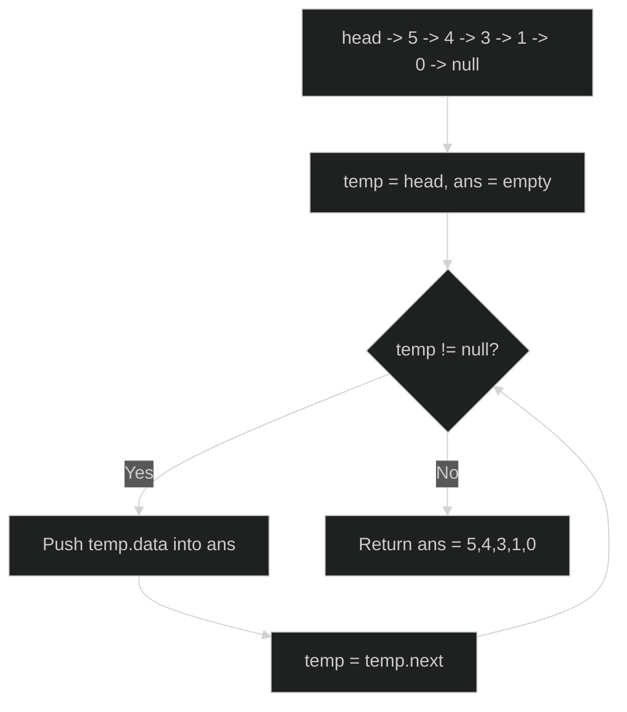
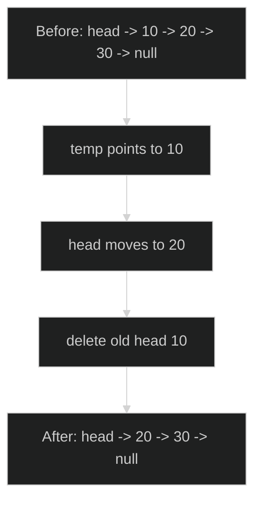
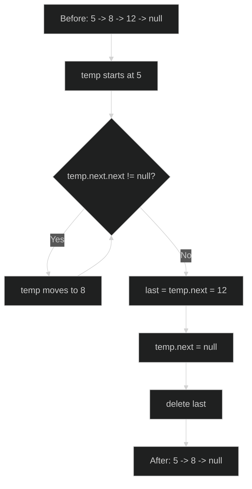
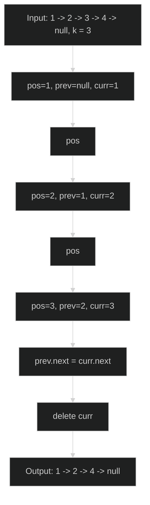
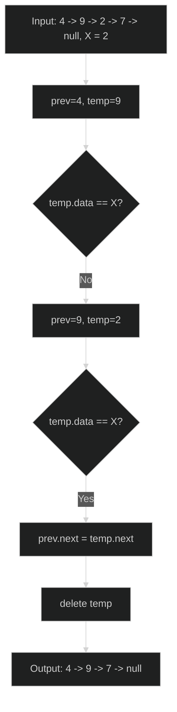
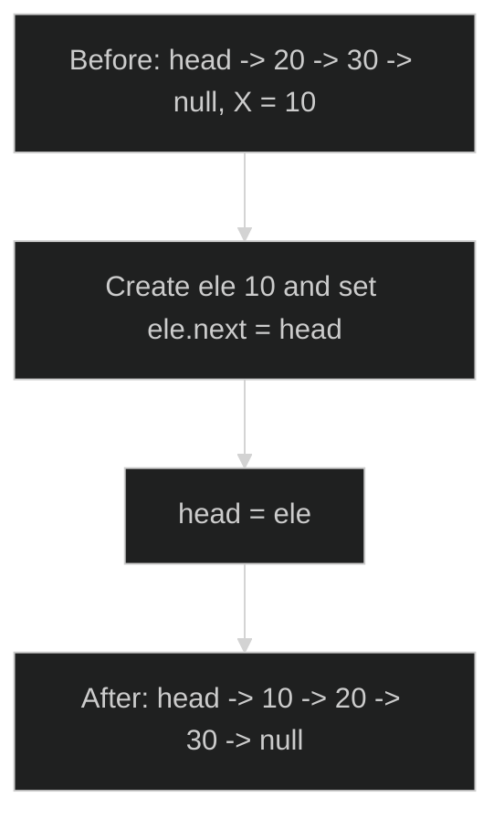
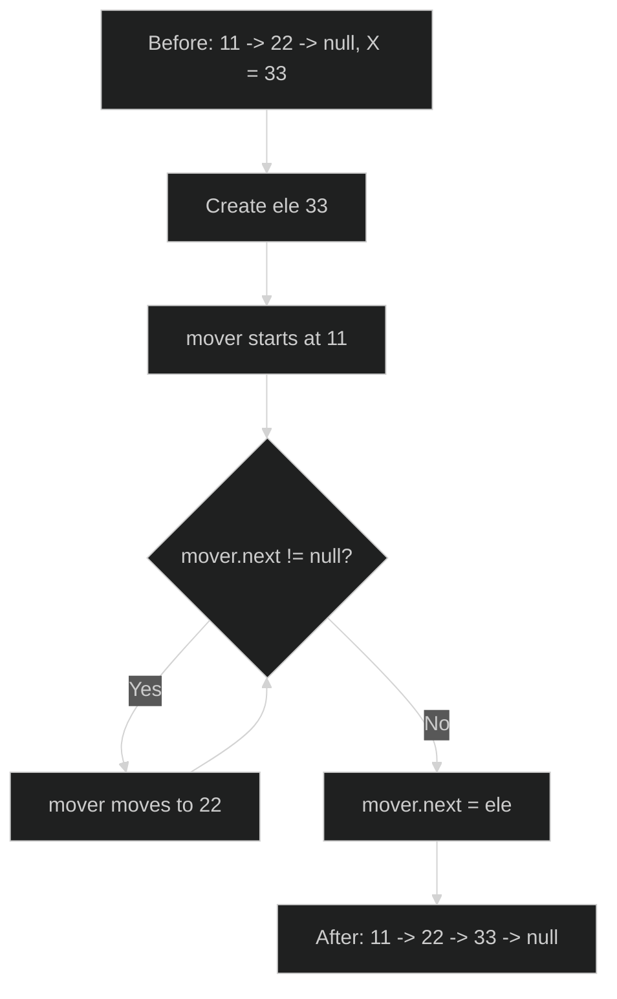
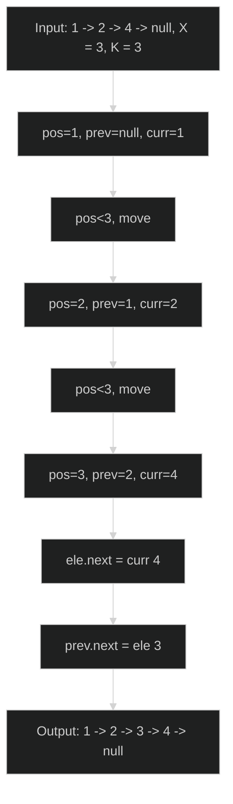
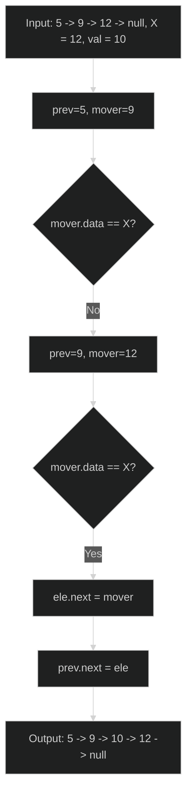

# Linked List Fundamentals - Master Revision Guide

This guide covers every problem implemented in `01-funda-ques.cpp` and is designed for quick-but-deep revision before interviews/tests.

---

## Problem 1: Traversal of Linked List

### 1. Problem Title & Statement
Given the head of a singly linked list, traverse the list from head to tail and return all node values in the same order as an array/vector.

### 2. Intuition & Strategy
Pattern to recognize: **"read every node exactly once"**.

Whenever we need to collect all values from a linked list, the most natural strategy is a single pointer walk:
- Start from `head`.
- At each node, store `data`.
- Move to `next`.
- Stop at `nullptr`.

Why this approach:
- Linked list has no random access, so sequential traversal is mandatory.
- Any approach other than linear scan cannot see all elements.
- This pattern becomes a base template for almost every linked-list problem.

Memory trick for revision: **"temp walks, ans records."**

### 3. The Code
```cpp
class Solution {
public:
    vector<int> LLTraversal(ListNode *head) {
        ListNode *temp = head;   // walker pointer
        vector<int> ans;         // stores traversal order

        while (temp != nullptr) {
            ans.push_back(temp->data); // record current node value
            temp = temp->next;         // move ahead
        }
        return ans;
    }
};
```

### 4. Visual Dry Run


### 5. Complexity Analysis
- **Time Complexity (TC): `O(n)`**  
  We visit each of the `n` nodes exactly once, and each visit does `O(1)` work.
- **Space Complexity (SC): `O(n)` auxiliary**  
  Output vector stores all `n` values. (Pointer variables are `O(1)`.)

---

## Problem 2: Deletion of Head Node

### 1. Problem Title & Statement
Delete the first node (head) of a singly linked list and return the updated head.

### 2. Intuition & Strategy
Pattern to recognize: **"special case at the boundary (head)"**.

Head deletion is the easiest delete because no previous node needs rewiring:
- Store current head in a temporary pointer.
- Shift `head` to `head->next`.
- Delete old node.

Why this approach:
- Safe memory release in C++.
- Constant-time update.

Memory trick: **"save old head -> move head -> free old head."**

### 3. The Code
```cpp
class Solution {
public:
    ListNode* deleteHead(ListNode *&head) {
        if (head == nullptr) return head; // empty list case

        ListNode *temp = head;  // old head
        head = head->next;      // shift head forward
        delete temp;            // free removed node
        return head;
    }
};
```

### 4. Visual Dry Run


### 5. Complexity Analysis
- **Time Complexity (TC): `O(1)`**  
  Only constant pointer updates/deletion.
- **Space Complexity (SC): `O(1)`**  
  Only one temporary pointer used.

---

## Problem 3: Deletion of Tail Node

### 1. Problem Title & Statement
Delete the last node (tail) of a singly linked list and return the updated head.

### 2. Intuition & Strategy
Pattern to recognize: **"need previous of target node"**.

In singly linked list, to delete tail we must reach the **second-last** node because only then we can set its `next = nullptr`.

Steps:
- Handle empty list.
- Handle single-node list (after deletion, list becomes empty).
- Walk until `temp->next->next == nullptr`.
- Delete `temp->next` (old tail), and cut link.

Why this approach:
- Without backward links, second-last traversal is the only direct method.
- Keeps operation in one pass.

Memory trick: **"for tail delete, stand at second-last."**

### 3. The Code
```cpp
class Solution {
public:
    ListNode* deleteTail(ListNode *&head) {
        if (head == nullptr) return head; // empty

        if (head->next == nullptr) {      // single node
            delete head;
            head = nullptr;
            return head;
        }

        ListNode *temp = head;
        while (temp->next->next != nullptr) {
            temp = temp->next;            // move to second-last
        }

        ListNode *last = temp->next;      // actual tail
        temp->next = nullptr;             // detach tail
        delete last;                      // free memory
        return head;
    }
};
```

### 4. Visual Dry Run


### 5. Complexity Analysis
- **Time Complexity (TC): `O(n)`**  
  In worst case we traverse almost all nodes to reach second-last.
- **Space Complexity (SC): `O(1)`**  
  No extra data structure, only pointers.

---

## Problem 4: Deletion of K-th Node

### 1. Problem Title & Statement
Delete the node at position `k` (1-based index) in a singly linked list and return updated head.

### 2. Intuition & Strategy
Pattern to recognize: **"position-based delete = reach node and its previous."**

Core idea:
- If `k == 1`, this reduces to head deletion.
- Otherwise move `k-1` steps while tracking:
  - `curr` = candidate node to delete
  - `prev` = node before `curr`
- Rewire `prev->next = curr->next`, then delete `curr`.

Why this approach:
- For deletion, previous link must be updated.
- One pass is enough.

Memory trick: **"delete at k means park `prev` at k-1 and `curr` at k."**

### 3. The Code
```cpp
class Solution {
public:
    ListNode* deleteKthNode(ListNode *&head, int k) {
        if (head == nullptr || k <= 0) return head;

        if (k == 1) {
            ListNode *temp = head;
            head = head->next;
            delete temp;
            return head;
        }

        ListNode *prev = nullptr;
        ListNode *curr = head;
        int pos = 1;

        while (curr != nullptr && pos < k) {
            prev = curr;
            curr = curr->next;
            pos++;
        }

        if (curr == nullptr) return head; // k > length, no deletion

        prev->next = curr->next;          // bypass kth node
        delete curr;                      // free memory
        return head;
    }
};
```

### 4. Visual Dry Run


### 5. Complexity Analysis
- **Time Complexity (TC): `O(n)`**  
  At most one full pass to find position `k`.
- **Space Complexity (SC): `O(1)`**  
  Constant extra pointers/counters.

---

## Problem 5: Deletion of Node Having Value X

### 1. Problem Title & Statement
Delete the first node whose value equals `X` in a singly linked list and return updated head.

### 2. Intuition & Strategy
Pattern to recognize: **"value-based search + delete when matched."**

Approach:
- If list empty, return.
- If head contains `X`, delete head directly.
- Otherwise traverse with two pointers:
  - `prev` (previous node)
  - `temp` (current node)
- On match: rewire `prev->next`, delete matched node, stop.

Why this approach:
- Linked list delete needs previous pointer.
- One linear scan handles both search and deletion.

Memory trick: **"search with `temp`, keep `prev` ready for splice."**

### 3. The Code
```cpp
class Solution {
public:
    ListNode* deleteNodeWithValueX(ListNode *&head, int X) {
        if (head == nullptr) return head; // empty list

        if (head->data == X) {            // delete head case
            ListNode *temp = head;
            head = head->next;
            delete temp;
            return head;
        }

        ListNode *prev = head;
        ListNode *temp = head->next;

        while (temp != nullptr) {
            if (temp->data == X) {
                prev->next = temp->next;  // unlink matched node
                delete temp;              // free memory
                break;                    // delete first occurrence only
            }
            prev = temp;
            temp = temp->next;
        }
        return head;
    }
};
```

### 4. Visual Dry Run


### 5. Complexity Analysis
- **Time Complexity (TC): `O(n)`**  
  In worst case value is at end or absent, so we scan all nodes.
- **Space Complexity (SC): `O(1)`**  
  Only pointer variables used.

---

## Problem 6: Insertion at Beginning (Head Insertion)

### 1. Problem Title & Statement
Insert a new node with value `X` at the start of the singly linked list and return updated head.

### 2. Intuition & Strategy
Pattern to recognize: **"insertion at boundary with direct head update."**

Steps:
- Create new node with value `X`.
- Make its `next` point to current head.
- Set `head` to this new node.

Why this approach:
- Constant-time insertion.
- No traversal required.

Memory trick: **"new node points to old head, then becomes head."**

### 3. The Code
```cpp
class Solution {
public:
    ListNode* insertAtHead(ListNode *&head, int X) {
        ListNode *ele = new ListNode(X, head); // new node before current head
        head = ele;                            // update head
        return head;
    }
};
```

### 4. Visual Dry Run


### 5. Complexity Analysis
- **Time Complexity (TC): `O(1)`**  
  Constant pointer operations.
- **Space Complexity (SC): `O(1)` auxiliary**  
  One new node is part of required output list growth.

---

## Problem 7: Insertion at End (Tail Insertion)

### 1. Problem Title & Statement
Insert a new node with value `X` at the end of a singly linked list and return updated head.

### 2. Intuition & Strategy
Pattern to recognize: **"append operation in singly LL requires reaching last node."**

Steps:
- Create new node `ele`.
- If list is empty, new node itself is head.
- Else traverse to last node (`mover->next == nullptr`).
- Link last node to `ele`.

Why this approach:
- Without tail pointer, traversal is necessary.
- Correctly handles both empty and non-empty lists.

Memory trick: **"for append: if empty -> head; else walk to tail."**

### 3. The Code
```cpp
class Solution {
public:
    ListNode* insertAtTail(ListNode *&head, int X) {
        ListNode *ele = new ListNode(X);

        if (head == nullptr) { // empty list
            head = ele;
            return head;
        }

        ListNode *mover = head;
        while (mover->next != nullptr) {
            mover = mover->next; // reach current tail
        }
        mover->next = ele;       // append new node
        return head;
    }
};
```

### 4. Visual Dry Run


### 5. Complexity Analysis
- **Time Complexity (TC): `O(n)`**  
  Need to traverse up to the last node.
- **Space Complexity (SC): `O(1)` auxiliary**  
  Only one traversal pointer besides new node.

---

## Problem 8: Insertion at K-th Position

### 1. Problem Title & Statement
Insert a new node with value `X` at position `K` (1-based) in singly linked list and return updated head.

### 2. Intuition & Strategy
Pattern to recognize: **"position-based insertion = insert between (K-1) and K."**

Core idea:
- If `K <= 1`, this is head insertion.
- Otherwise move until node at `(K-1)` using `prev`, keep `curr` as K-th node.
- Insert by:
  - `newNode->next = curr`
  - `prev->next = newNode`

Why this approach:
- Linked list insertion at a position is pure pointer rewiring.
- Single traversal is enough.

Memory trick: **"break at K-gap, stitch new node in between."**

### 3. The Code
```cpp
class Solution {
public:
    ListNode* insertAtKthPosition(ListNode *&head, int X, int K) {
        ListNode *ele = new ListNode(X);

        if (K <= 1 || head == nullptr) { // head insertion or empty list
            ele->next = head;
            head = ele;
            return head;
        }

        ListNode *prev = nullptr;
        ListNode *curr = head;
        int pos = 1;

        while (curr != nullptr && pos < K) {
            prev = curr;
            curr = curr->next;
            pos++;
        }

        // insert between prev and curr (curr may be nullptr => tail insertion)
        ele->next = curr;
        prev->next = ele;
        return head;
    }
};
```

### 4. Visual Dry Run


### 5. Complexity Analysis
- **Time Complexity (TC): `O(n)`**  
  In worst case insert at end after traversing full list.
- **Space Complexity (SC): `O(1)` auxiliary**  
  Constant helper pointers.

---

## Problem 9: Insertion Before Value X

### 1. Problem Title & Statement
Insert a node with value `val` before the first node whose value is `X` in a singly linked list and return updated head.

### 2. Intuition & Strategy
Pattern to recognize: **"value search + insertion before match."**

To insert before a node, we need its previous node:
- If head itself has value `X`, this is head insertion.
- Else walk with `prev` and `mover`.
- On `mover->data == X`, insert new node between `prev` and `mover`.

Why this approach:
- Singly linked list does not allow backward move, so previous pointer must be maintained during traversal.
- Efficient single pass.

Memory trick: **"find X with mover, keep prev to place new node before it."**

### 3. The Code
```cpp
class Solution {
public:
    ListNode* insertBeforeX(ListNode *&head, int X, int val) {
        ListNode *ele = new ListNode(val);

        if (head == nullptr) {
            delete ele;          // no X exists in empty list
            return head;
        }

        if (head->data == X) {   // insert before current head
            ele->next = head;
            head = ele;
            return head;
        }

        ListNode *prev = head;
        ListNode *mover = head->next;

        while (mover != nullptr) {
            if (mover->data == X) {
                ele->next = mover;
                prev->next = ele; // inserted before X
                return head;
            }
            prev = mover;
            mover = mover->next;
        }

        // X not found, do not insert
        delete ele;
        return head;
    }
};
```

### 4. Visual Dry Run


### 5. Complexity Analysis
- **Time Complexity (TC): `O(n)`**  
  In worst case X is near end or absent, so one full scan.
- **Space Complexity (SC): `O(1)` auxiliary**  
  Only constant pointer helpers used.

---

## Quick Pattern Recap (Last-Minute Revision)

- **Traversal:** single pointer linear scan.
- **Delete:** always think "do I need previous node?"
- **Insert:** always think "where should new node point first?"
- **Head operations:** usually `O(1)` (direct pointer update).
- **Tail/position/value search operations:** usually `O(n)` due to traversal.

