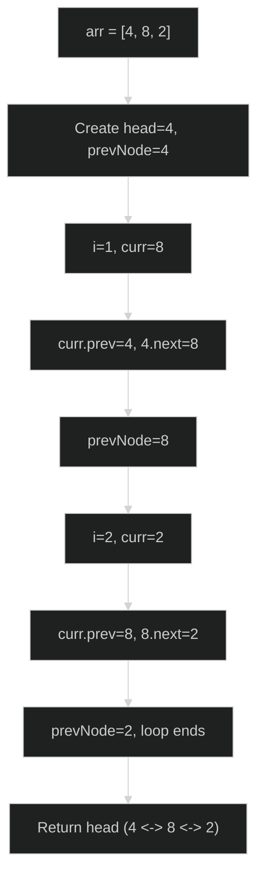
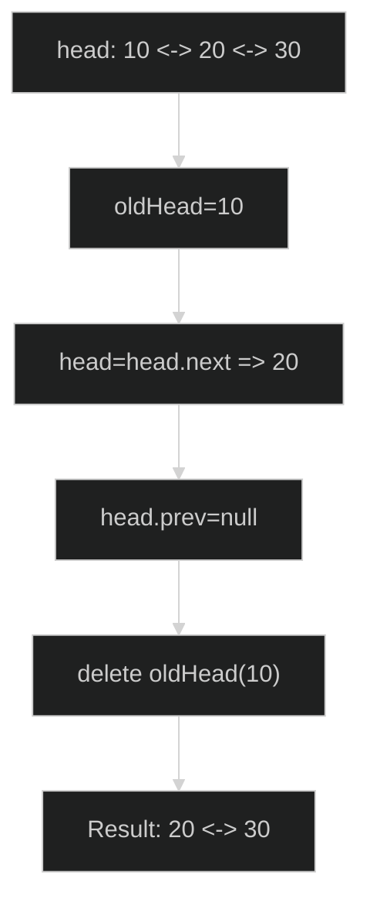
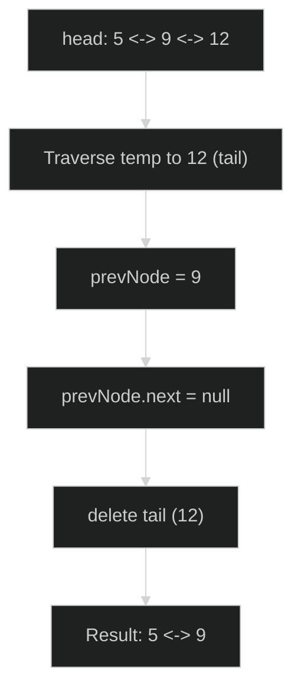
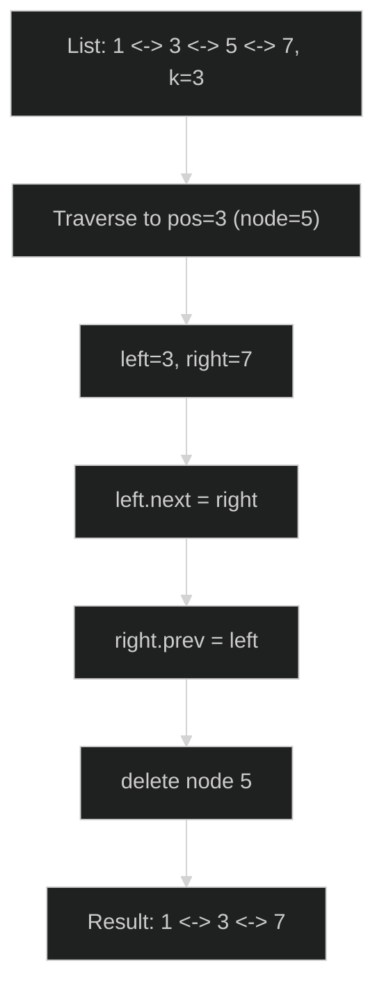
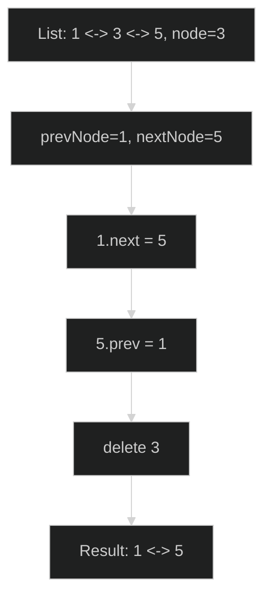
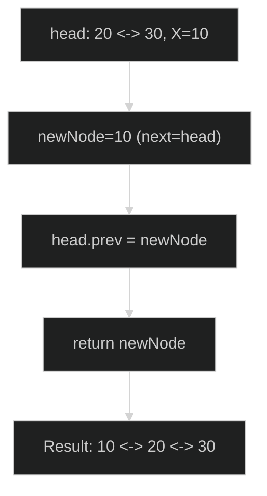
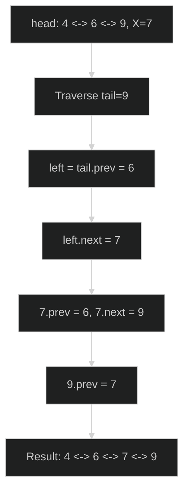
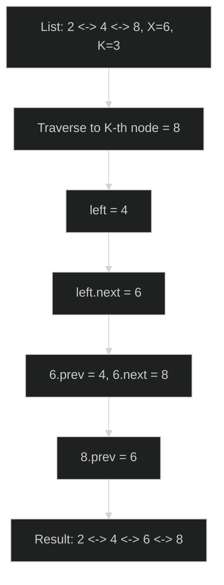
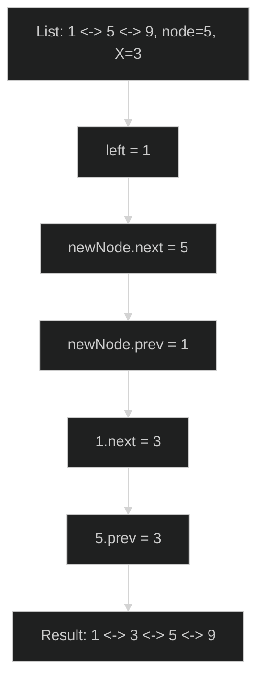

# Doubly Linked List - Master Revision Guide

This guide covers every problem implemented in `funda.cpp` and is written for quick + deep revision.

Assumed node structure:

```cpp
struct ListNode {
    int val;
    ListNode* prev;
    ListNode* next;

    ListNode(int x) : val(x), prev(nullptr), next(nullptr) {}
    ListNode(int x, ListNode* p, ListNode* n) : val(x), prev(p), next(n) {}
};
```

---

## Problem 1: Convert Array to Doubly Linked List

### 1. Problem Title & Statement
Given an integer array, create a doubly linked list containing the same elements in the same order, and return the head pointer.

### 2. Intuition & Strategy
Pattern recognition: whenever we convert a linear container (array) to linked nodes, we process left to right and keep a pointer to the **last created node**.

Why this approach:
- We need both directions in DLL, so each new node should connect with the previous node using:
  - `prevNode->next = curr`
  - `curr->prev = prevNode`
- A single traversal is enough because each array element becomes exactly one node.

Memory trick:
- Think of `prev` as a "tail builder pointer" that always marks the current end of the created DLL.

### 3. The Code
```cpp
class Solution {
public:
    ListNode* arrayToDoublyLinkedList(vector<int>& arr) {
        if (arr.empty()) return nullptr; // empty array => empty list

        ListNode* head = new ListNode(arr[0]); // first node is head
        ListNode* prevNode = head;             // tail builder pointer

        for (int i = 1; i < (int)arr.size(); i++) {
            ListNode* curr = new ListNode(arr[i]);

            curr->prev = prevNode;  // backward link
            prevNode->next = curr;  // forward link

            prevNode = curr;        // move tail pointer
        }
        return head;
    }
};
```

### 4. Visual Dry Run


### 5. Complexity Analysis
- **Time Complexity (TC): `O(n)`**
  - We iterate once through `n` array elements.
- **Space Complexity (SC): `O(1)` auxiliary**
  - Only a few pointers are used additionally.
  - (Nodes themselves are output space, not auxiliary space.)

---

## Problem 2: Delete Head of Doubly Linked List

### 1. Problem Title & Statement
Delete the first node (head) of a doubly linked list and return the updated head.

### 2. Intuition & Strategy
Pattern recognition: deleting a node in DLL means reconnecting neighbors around it.

For head deletion:
- Old head has no left neighbor.
- New head will be `head->next`.
- New head's `prev` must become `nullptr`.

Why this approach:
- Constant-time pointer updates, no traversal needed.
- Handles list integrity in both directions.

### 3. The Code
```cpp
class Solution {
public:
    ListNode* deleteHead(ListNode*& head) {
        if (head == nullptr) return nullptr;      // empty list
        if (head->next == nullptr) {              // single node
            delete head;
            head = nullptr;
            return nullptr;
        }

        ListNode* oldHead = head;
        head = head->next;         // move head right
        head->prev = nullptr;      // new head has no previous
        delete oldHead;            // free old head

        return head;
    }
};
```

### 4. Visual Dry Run


### 5. Complexity Analysis
- **Time Complexity (TC): `O(1)`**
  - Only fixed pointer changes.
- **Space Complexity (SC): `O(1)` auxiliary**
  - No extra data structure.

---

## Problem 3: Delete Tail of Doubly Linked List

### 1. Problem Title & Statement
Delete the last node (tail) from a doubly linked list and return the head.

### 2. Intuition & Strategy
Pattern recognition: to delete tail in a non-circular DLL, we first locate the last node by traversal.

Steps:
- Walk until `temp->next == nullptr` (tail).
- Let `prevNode = temp->prev`.
- Set `prevNode->next = nullptr`.
- Delete tail node.

Why this approach:
- We cannot directly access tail unless it's stored externally.
- DLL lets us backtrack from tail to previous in `O(1)` once reached.

### 3. The Code
```cpp
class Solution {
public:
    ListNode* deleteTail(ListNode*& head) {
        if (head == nullptr) return nullptr;      // empty
        if (head->next == nullptr) {              // single node
            delete head;
            head = nullptr;
            return nullptr;
        }

        ListNode* temp = head;
        while (temp->next != nullptr) {           // reach tail
            temp = temp->next;
        }

        ListNode* prevNode = temp->prev;          // node before tail
        prevNode->next = nullptr;                 // new tail termination
        delete temp;                              // free old tail

        return head;
    }
};
```

### 4. Visual Dry Run


### 5. Complexity Analysis
- **Time Complexity (TC): `O(n)`**
  - Tail search may scan all nodes.
- **Space Complexity (SC): `O(1)` auxiliary**
  - Only pointer variables used.

---

## Problem 4: Delete K-th Node of Doubly Linked List

### 1. Problem Title & Statement
Given a doubly linked list head and integer `k` (1-indexed), delete the `k`-th node if it exists, then return the updated head.

### 2. Intuition & Strategy
Pattern recognition: deletion at position `k` in linked list is a **position-navigation + local relinking** problem.

Core logic:
- Handle `k == 1` separately (head deletion).
- Traverse to the `k`-th node safely.
- Reconnect:
  - `node->prev->next = node->next`
  - if `node->next` exists, `node->next->prev = node->prev`
- Delete node.

Why this approach:
- DLL gives both neighbors directly once target node is found.
- Safe boundary checks avoid null dereference when `k` is invalid.

### 3. The Code
```cpp
class Solution {
public:
    ListNode* deleteKthElement(ListNode*& head, int k) {
        if (head == nullptr || k <= 0) return head; // invalid base case

        if (k == 1) {                                // delete head
            ListNode* oldHead = head;
            head = head->next;
            if (head) head->prev = nullptr;
            delete oldHead;
            return head;
        }

        ListNode* curr = head;
        int pos = 1;
        while (curr != nullptr && pos < k) {         // move to k-th node
            curr = curr->next;
            pos++;
        }
        if (curr == nullptr) return head;            // k > length

        ListNode* left = curr->prev;
        ListNode* right = curr->next;

        left->next = right;                          // bypass k-th
        if (right) right->prev = left;               // fix backward link

        delete curr;
        return head;
    }
};
```

### 4. Visual Dry Run


### 5. Complexity Analysis
- **Time Complexity (TC): `O(k)` worst-case `O(n)`**
  - We traverse until position `k` (or end).
- **Space Complexity (SC): `O(1)` auxiliary**
  - Constant extra pointers.

---

## Problem 5: Remove a Given Node in Doubly Linked List (No Head Given)

### 1. Problem Title & Statement
Given direct reference to a node in a doubly linked list (guaranteed not to be head), delete that node while maintaining list integrity.

### 2. Intuition & Strategy
Pattern recognition: this is pure **local deletion**. Since node address is already known, no traversal is required.

Pointer surgery:
- `prevNode = node->prev`
- `nextNode = node->next`
- `prevNode->next = nextNode`
- If `nextNode` exists, `nextNode->prev = prevNode`

Why this approach:
- DLL stores both neighbors, so deletion is `O(1)`.
- Works for middle node and tail node.

### 3. The Code
```cpp
class Solution {
public:
    void deleteGivenNode(ListNode* node) {
        if (node == nullptr) return;

        ListNode* prevNode = node->prev;      // guaranteed non-null by problem
        ListNode* nextNode = node->next;      // can be null (if node is tail)

        prevNode->next = nextNode;            // detach from left side
        if (nextNode) nextNode->prev = prevNode; // detach from right side

        delete node;
    }
};
```

### 4. Visual Dry Run


### 5. Complexity Analysis
- **Time Complexity (TC): `O(1)`**
  - Direct neighbor updates only.
- **Space Complexity (SC): `O(1)` auxiliary**
  - Constant pointers.

---

## Problem 6: Insert Before Head of Doubly Linked List

### 1. Problem Title & Statement
Insert a new node with value `X` before current head and return the new head.

### 2. Intuition & Strategy
Pattern recognition: insertion at front in DLL is a mirror of head deletion.

Steps:
- Create `newNode` whose `next` points to old head.
- If old head exists, set old head's `prev = newNode`.
- Return `newNode` as head.

Why this approach:
- Front insert should not traverse.
- All updates are local and constant time.

### 3. The Code
```cpp
class Solution {
public:
    ListNode* insertBeforeHead(ListNode* head, int X) {
        ListNode* newNode = new ListNode(X, nullptr, head);

        if (head != nullptr) {
            head->prev = newNode;  // old head points back to new head
        }

        return newNode;            // always new head
    }
};
```

### 4. Visual Dry Run


### 5. Complexity Analysis
- **Time Complexity (TC): `O(1)`**
  - No traversal.
- **Space Complexity (SC): `O(1)` auxiliary**
  - Constant extra pointer usage.

---

## Problem 7: Insert Before Tail of Doubly Linked List

### 1. Problem Title & Statement
Insert a new node with value `X` immediately before the tail node, and return the (possibly updated) head.

### 2. Intuition & Strategy
Pattern recognition: this is position-based insertion where position is "tail-1".  
Without direct tail pointer, first reach tail by traversal.

Cases:
- Empty list: new node becomes head.
- One node list: inserting before tail means inserting before head, so new node becomes new head.
- General case: splice between `tail->prev` and `tail`.

Why this approach:
- Separate edge cases keep pointer operations safe.
- General insertion uses standard DLL four-link adjustment.

### 3. The Code
```cpp
class Solution {
public:
    ListNode* insertBeforeTail(ListNode* head, int X) {
        ListNode* newNode = new ListNode(X);
        if (head == nullptr) return newNode;     // empty list

        ListNode* tail = head;
        while (tail->next != nullptr) {          // reach actual tail
            tail = tail->next;
        }

        if (tail->prev == nullptr) {             // single-node list
            newNode->next = head;
            head->prev = newNode;
            return newNode;
        }

        ListNode* left = tail->prev;
        left->next = newNode;                    // left -> new
        newNode->prev = left;                    // new <- left
        newNode->next = tail;                    // new -> tail
        tail->prev = newNode;                    // tail <- new

        return head;
    }
};
```

### 4. Visual Dry Run


### 5. Complexity Analysis
- **Time Complexity (TC): `O(n)`**
  - Need traversal to reach tail.
- **Space Complexity (SC): `O(1)` auxiliary**
  - Only pointers and one created node.

---

## Problem 8: Insert Before K-th Position in Doubly Linked List

### 1. Problem Title & Statement
Given `head`, value `X`, and position `K` (1-indexed), insert a new node with value `X` before the `K`-th node. Return updated head.

### 2. Intuition & Strategy
Pattern recognition: insertion before position `K` is identical to:
- if `K == 1`: front insertion,
- else: navigate to `K`-th node and splice new node between `K-1` and `K`.

Why this approach:
- Simple decomposition into one special case + one general splice case.
- DLL provides both neighboring pointers once target position is reached.

Important defensive check:
- If `K` is out of range (`K > length+1` in strict settings), keep list unchanged.

### 3. The Code
```cpp
class Solution {
public:
    ListNode* insertBeforeKthPosition(ListNode* head, int X, int K) {
        if (K <= 0) return head;                 // invalid position

        ListNode* newNode = new ListNode(X);

        if (K == 1) {                            // insert before current head
            newNode->next = head;
            if (head) head->prev = newNode;
            return newNode;
        }

        ListNode* curr = head;
        int pos = 1;
        while (curr != nullptr && pos < K) {     // move to K-th node
            curr = curr->next;
            pos++;
        }

        if (curr == nullptr) {                   // K out of range
            delete newNode;
            return head;
        }

        ListNode* left = curr->prev;
        left->next = newNode;                    // left -> new
        newNode->prev = left;                    // new <- left
        newNode->next = curr;                    // new -> curr
        curr->prev = newNode;                    // curr <- new

        return head;
    }
};
```

### 4. Visual Dry Run


### 5. Complexity Analysis
- **Time Complexity (TC): `O(k)` worst-case `O(n)`**
  - Traverse up to `K`-th node.
- **Space Complexity (SC): `O(1)` auxiliary**
  - Constant pointers and one new node.

---

## Problem 9: Insert Before Given Node in Doubly Linked List

### 1. Problem Title & Statement
Given a direct reference to a node in DLL and value `X`, insert a new node immediately before that node.

### 2. Intuition & Strategy
Pattern recognition: this is local insertion around a known node, similar to "insert in middle" without traversal.

Steps:
- `newNode->next = node`
- `newNode->prev = node->prev`
- If left neighbor exists: `left->next = newNode`
- `node->prev = newNode`

Why this approach:
- With direct node pointer, insertion is pure local pointer patching in `O(1)`.
- Works for middle node; if used for head, caller must update head separately.

### 3. The Code
```cpp
class Solution {
public:
    void insertBeforeGivenNode(ListNode* node, int X) {
        if (node == nullptr) return;

        ListNode* newNode = new ListNode(X);
        ListNode* left = node->prev;

        newNode->next = node;        // new -> node
        newNode->prev = left;        // new <- left

        if (left) left->next = newNode; // left -> new (if exists)
        node->prev = newNode;           // node <- new
    }
};
```

### 4. Visual Dry Run


### 5. Complexity Analysis
- **Time Complexity (TC): `O(1)`**
  - No traversal, fixed pointer rewiring.
- **Space Complexity (SC): `O(1)` auxiliary**
  - Constant extra pointer variables.

---

## High-Retention Revision Cues (30-second recall)

- **Delete in DLL**: reconnect neighbors, then free target node.
- **Insert in DLL**: connect four arrows in order: `left->new`, `new->left`, `new->right`, `right->new`.
- **With head access**: edge cases (`empty`, `single`, `k==1`) first.
- **With node-only access**: operations are usually `O(1)` local rewiring.
- **Safety rule**: always guard null pointers before dereferencing.
