```mermaid
flowchart TD
    style C1 fill:#1a1a2e,stroke:#e94560,color:#eee
    style C2 fill:#1a1a2e,stroke:#e94560,color:#eee
    style C3 fill:#1a1a2e,stroke:#e94560,color:#eee
    style R3 fill:#0f3460,stroke:#e94560,color:#eee
    style R2 fill:#0f3460,stroke:#e94560,color:#eee
    style R1 fill:#0f3460,stroke:#e94560,color:#eee
    style FIN fill:#0f3460,stroke:#53ff45,color:#53ff45

    C1["📞 Call reverseList(1)
    head = 1
    Recurse on head→next (2)"]

    C2["📞 Call reverseList(2)
    head = 2
    Recurse on head→next (3)"]

    C3["📞 Call reverseList(3)
    head = 3, head→next = NULL
    BASE CASE → return 3
    newHead = 3"]

    R3["⬅️ Back in reverseList(2)
    newHead = 3
    head→next→next = head → 3→next = 2
    head→next = NULL → 2→next = NULL
    Chain: 3 → 2 → NULL
    Return newHead = 3"]

    R2["⬅️ Back in reverseList(1)
    newHead = 3
    head→next→next = head → 2→next = 1
    head→next = NULL → 1→next = NULL
    Chain: 3 → 2 → 1 → NULL
    Return newHead = 3"]

    R1["Return to caller with newHead = 3"]

    FIN["✅ Result: 3 → 2 → 1"]

    C1 --> C2 --> C3 --> R3 --> R2 --> R1 --> FIN
```

# 🔗 Linked List — Logic Building: Master Revision Guide

> **Source:** `01-ques.cpp`
> A comprehensive revision guide covering 5 classic linked list problems with intuition, code, dry runs, and complexity analysis.

---

## 📑 Table of Contents

| #   | Problem                                                                 | Approaches                               |
| --- | ----------------------------------------------------------------------- | ---------------------------------------- |
| 1   | [Add Two Numbers](#1-add-two-numbers-represented-by-linked-list)        | Iterative with Carry                     |
| 2   | [Segregate Odd & Even Nodes](#2-segregate-odd-and-even-nodes)           | Brute Force · Optimal (Pointer Rewiring) |
| 3   | [Sort Linked List of 0s, 1s, 2s](#3-sort-a-linked-list-of-0s-1s-and-2s) | Counting · Three-Dummy-Lists             |
| 4   | [Delete Nth Node from End](#4-delete-nth-node-from-end-of-linked-list)  | Two-Pass · One-Pass (Fast/Slow)          |
| 5   | [Reverse a Linked List](#5-reverse-a-linked-list)                       | Iterative (3 Pointers) · Recursive       |

---

## 1. Add Two Numbers Represented by Linked List

### 📋 Problem Statement

Given two **non-empty** linked lists `l1` and `l2`, each representing a non-negative integer with digits stored in **reverse order** (least significant digit first), return a new linked list representing their **sum** (also in reverse order).

**Example:**

```
l1 = [5, 4]  →  represents 45
l2 = [4]     →  represents  4
Output: [9, 4]  →  represents 49
```

### 💡 Intuition & Strategy

**Why reverse order is a gift:** When you add numbers by hand, you start from the rightmost digit (units place). Since the linked lists are already reversed, the **head** of each list is the units-place digit — we can iterate left-to-right and add naturally.

**The Pattern — Simulate Grade-School Addition:**

1. Walk both lists simultaneously.
2. At each step: `sum = digit_from_l1 + digit_from_l2 + carry`.
3. The new digit is `sum % 10`, the new carry is `sum / 10`.
4. If one list is shorter, treat missing digits as `0`.
5. After both lists are exhausted, if `carry > 0`, append one more node.

**Why a dummy node?** We don't know the head of the result list upfront. A dummy node acts as a sentinel — we build the list after it, then return `dummy.next`. This eliminates special-case logic for the first node.

**Key Insight:** The loop condition `while (l1 || l2 || carry)` elegantly handles three situations: (a) l1 still has digits, (b) l2 still has digits, (c) there's a leftover carry (e.g., `999 + 1 = 1000`).

### 🧑‍💻 The Code

```cpp
class Solution {
public:
    ListNode *addTwoNumbers(ListNode *l1, ListNode *l2) {
        ListNode dummy(0);            // Sentinel node — avoids special case for head
        ListNode *tail = &dummy;      // Pointer to build the result list
        int carry = 0;

        // Continue while any list has nodes OR there's a carry to process
        while (l1 || l2 || carry) {
            int x = l1 ? l1->data : 0;  // If l1 exists, take digit; else 0
            int y = l2 ? l2->data : 0;  // If l2 exists, take digit; else 0

            int sum = x + y + carry;     // Total sum at this position
            carry = sum / 10;            // Carry for next position (0 or 1)
            int digit = sum % 10;        // Current digit to store

            tail->next = new ListNode(digit);  // Create new node with the digit
            tail = tail->next;                 // Advance tail pointer

            if (l1) l1 = l1->next;  // Advance l1 if nodes remain
            if (l2) l2 = l2->next;  // Advance l2 if nodes remain
        }

        return dummy.next;  // Skip the sentinel, return actual head
    }
};
```

### 🔍 Visual Dry Run

**Input:** `l1 = [5, 4]`, `l2 = [4]`

```mermaid
flowchart TD
    style S0 fill:#1a1a2e,stroke:#e94560,color:#eee
    style S1 fill:#1a1a2e,stroke:#e94560,color:#eee
    style S2 fill:#1a1a2e,stroke:#e94560,color:#eee
    style R fill:#0f3460,stroke:#e94560,color:#53ff45

    S0["🟢 Step 1
    l1→5, l2→4
    sum = 5+4+0 = 9
    digit = 9 % 10 = 9
    carry = 9 / 10 = 0
    Result: dummy → [9]"]

    S1["🟢 Step 2
    l1→4, l2→NULL
    sum = 4+0+0 = 4
    digit = 4 % 10 = 4
    carry = 4 / 10 = 0
    Result: dummy → [9] → [4]"]

    S2["🟢 Step 3
    l1→NULL, l2→NULL, carry=0
    Loop ends (all conditions false)"]

    R["✅ Return dummy.next → [9, 4]
    Represents 49 ✓"]

    S0 --> S1 --> S2 --> R
```



### 📊 Complexity Analysis

|           | Value          | Explanation                                                         |
| --------- | -------------- | ------------------------------------------------------------------- |
| **Time**  | `O(max(m, n))` | We traverse both lists once; `m`, `n` = lengths of `l1`, `l2`       |
| **Space** | `O(max(m, n))` | The result list has at most `max(m, n) + 1` nodes (extra for carry) |

---

## 2. Segregate Odd and Even Nodes

### 📋 Problem Statement

Given a singly linked list, group all **odd-indexed** nodes together followed by all **even-indexed** nodes. Node indexing is **1-based** (node 1 is odd, node 2 is even, etc.).

**Example:**

```
Input:  1 → 2 → 3 → 4 → 5
Output: 1 → 3 → 5 → 2 → 4
        ↑ odd nodes ↑  ↑evens↑
```

### 💡 Intuition & Strategy

#### Brute Force — Extract & Overwrite

**Idea:** Collect values in the correct order, then write them back.

1. Traverse odd positions (1st, 3rd, 5th …) → push values into a vector.
2. Traverse even positions (2nd, 4th, 6th …) → push values into the same vector.
3. Walk the list again and overwrite node values from the vector.

**Why it works but isn't ideal:** It preserves order but uses `O(n)` extra space for the vector, and it modifies node _values_ rather than rewiring _pointers_ — which breaks the contract if nodes carry extra payload.

#### Optimal — Pointer Rewiring (In-Place)

**The "Aha!" moment:** Instead of moving data, just **re-link the pointers**.

1. Maintain two sub-chains: one for odd-indexed nodes, one for even-indexed nodes.
2. Use `oddTemp` (starts at node 1) and `evenTemp` (starts at node 2).
3. Save the `evenHead` — we'll attach it at the end of the odd chain.
4. In each iteration, skip one node for each chain:
   - `oddTemp.next = oddTemp.next.next` (skip over the even node)
   - `evenTemp.next = evenTemp.next.next` (skip over the next odd node)
   - Advance both pointers.
5. When done, connect: `oddTemp.next = evenHead`.

**Why check `evenTemp && evenTemp->next`?** This covers both even-length and odd-length lists. If the list has odd length, `evenTemp` becomes `NULL` first. If even, `evenTemp->next` becomes `NULL`.

### 🧑‍💻 The Code

#### Brute Force

```cpp
class Solution {
public:
    ListNode *oddEvenList(ListNode *&head) {
        ListNode *temp = head;
        if (!head || !head->next) return head;

        vector<int> list;

        // Pass 1: Collect odd-positioned values (1st, 3rd, 5th ...)
        while (temp) {
            list.push_back(temp->data);
            if (temp->next)
                temp = temp->next->next;  // Jump by 2 to stay on odd positions
            else
                break;
        }

        // Pass 2: Collect even-positioned values (2nd, 4th, 6th ...)
        temp = head->next;  // Start from 2nd node
        while (temp) {
            list.push_back(temp->data);
            if (temp->next)
                temp = temp->next->next;  // Jump by 2 to stay on even positions
            else
                break;
        }

        // Pass 3: Overwrite original list with new ordering
        temp = head;
        for (int j = 0; j < list.size(); j++) {
            temp->data = list[j];
            temp = temp->next;
        }
        return head;
    }
};
```

#### Optimal

```cpp
class Solution {
public:
    ListNode *oddEvenList(ListNode *&head) {
        if (!head || !head->next) return head;

        ListNode *oddTemp = head;          // Points to current odd node
        ListNode *evenTemp = head->next;   // Points to current even node
        ListNode *evenHead = evenTemp;     // Save head of even chain for later

        // Rewire: skip pairs to separate odd and even chains
        while (evenTemp && evenTemp->next) {
            oddTemp->next = oddTemp->next->next;   // Odd skips over even
            evenTemp->next = evenTemp->next->next;  // Even skips over odd
            oddTemp = oddTemp->next;                // Advance odd pointer
            evenTemp = evenTemp->next;              // Advance even pointer
        }

        oddTemp->next = evenHead;  // Attach even chain after odd chain
        return head;
    }
};
```

### 🔍 Visual Dry Run (Optimal)

**Input:** `1 → 2 → 3 → 4 → 5`

```mermaid
flowchart TD
    style INIT fill:#1a1a2e,stroke:#e94560,color:#eee
    style I1 fill:#1a1a2e,stroke:#e94560,color:#eee
    style I2 fill:#1a1a2e,stroke:#e94560,color:#eee
    style LINK fill:#0f3460,stroke:#e94560,color:#eee
    style RES fill:#0f3460,stroke:#53ff45,color:#53ff45

    INIT["🟢 Init
    oddTemp → 1
    evenTemp → 2
    evenHead → 2"]

    I1["🟢 Iteration 1
    evenTemp=2, evenTemp→next=3 ✓
    oddTemp→next = 3 (skip 2)
    evenTemp→next = 4 (skip 3)
    oddTemp → 3
    evenTemp → 4
    Odd chain:  1 → 3
    Even chain: 2 → 4"]

    I2["🟢 Iteration 2
    evenTemp=4, evenTemp→next=5 ✓
    oddTemp→next = 5 (skip 4)
    evenTemp→next = NULL (skip 5)
    oddTemp → 5
    evenTemp → NULL
    Odd chain:  1 → 3 → 5
    Even chain: 2 → 4"]

    LINK["🔗 Connect chains
    oddTemp(5)→next = evenHead(2)"]

    RES["✅ Result: 1 → 3 → 5 → 2 → 4"]

    INIT --> I1 --> I2 --> LINK --> RES
```



### 📊 Complexity Analysis

| Approach        | Time                         | Space                                |
| --------------- | ---------------------------- | ------------------------------------ |
| **Brute Force** | `O(n)` — three linear passes | `O(n)` — vector stores all values    |
| **Optimal**     | `O(n)` — single pass         | `O(1)` — only pointer variables used |

---

## 3. Sort a Linked List of 0s, 1s, and 2s

### 📋 Problem Statement

Given a linked list where every node's value is `0`, `1`, or `2`, sort the list so all `0`s come first, then all `1`s, then all `2`s.

**Example:**

```
Input:  1 → 0 → 2 → 1 → 0 → 2
Output: 0 → 0 → 1 → 1 → 2 → 2
```

### 💡 Intuition & Strategy

#### Brute Force — Count & Overwrite (Dutch National Flag on Values)

**Pattern Recognition:** Since there are only **3 distinct values**, we don't need a full sorting algorithm. Just count how many of each value exists, then overwrite.

1. **First pass:** Count occurrences of `0`, `1`, and `2`.
2. **Second pass:** Overwrite node values — first `c0` zeros, then `c1` ones, then `c2` twos.

**Why it works:** Counting sort! With a fixed, tiny range `{0, 1, 2}`, it's simpler than comparison-based sorting.

**Limitation:** Modifies node data, doesn't rearrange nodes themselves.

#### Optimal — Three Dummy Lists (Node Rearrangement)

**The Trick:** Create **three separate sub-lists** (one for each value) and then stitch them together.

1. Create 3 dummy heads: `zeroHead`, `oneHead`, `twoHead`.
2. Traverse the original list. Append each node to the appropriate sub-list based on its value.
3. Connect the three sub-lists: `zero's tail → one's head → two's head`.
4. Handle edge case: if the `1`-list is empty, connect `zero's tail` directly to `two's head`.
5. Set `two's tail → NULL` to terminate the final list.

**Why this is better:** Nodes are physically moved, not just value-overwritten. This is important when nodes carry metadata beyond just the `data` field.

### 🧑‍💻 The Code

#### Brute Force

```cpp
class Solution {
public:
    ListNode *sortList(ListNode *head) {
        int c0 = 0, c1 = 0, c2 = 0;  // Counters for each value
        ListNode *temp = head;

        // Pass 1: Count occurrences of 0, 1, 2
        while (temp != NULL) {
            if (temp->data == 0)      c0++;
            else if (temp->data == 1) c1++;
            else if (temp->data == 2) c2++;
            temp = temp->next;
        }

        // Pass 2: Overwrite values in sorted order
        temp = head;
        while (temp != NULL) {
            if (c0 > 0)       { temp->data = 0; c0--; }
            else if (c1 > 0)  { temp->data = 1; c1--; }
            else if (c2 > 0)  { temp->data = 2; c2--; }
            temp = temp->next;
        }

        return head;
    }
};
```

#### Optimal

```cpp
class Solution {
public:
    ListNode *sortList(ListNode *&head) {
        if (!head || !head->next) return head;

        // Dummy heads for three sub-lists
        ListNode *zeroHead = new ListNode(-1);
        ListNode *zero = zeroHead;
        ListNode *oneHead = new ListNode(-1);
        ListNode *one = oneHead;
        ListNode *twoHead = new ListNode(-1);
        ListNode *two = twoHead;
        ListNode *temp = head;

        // Distribute nodes into three sub-lists
        while (temp) {
            if (temp->data == 0) {
                zero->next = temp;     // Append to 0-list
                zero = zero->next;
            } else if (temp->data == 1) {
                one->next = temp;      // Append to 1-list
                one = one->next;
            } else {
                two->next = temp;      // Append to 2-list
                two = two->next;
            }
            temp = temp->next;
        }

        // Stitch the three lists: 0s → 1s → 2s
        if (oneHead->next)
            zero->next = oneHead->next;   // 0-tail → 1-head
        else
            zero->next = twoHead->next;   // No 1s? 0-tail → 2-head

        one->next = twoHead->next;        // 1-tail → 2-head
        two->next = nullptr;              // Terminate the list
        head = zeroHead->next;            // New head is start of 0-list

        // Clean up dummy nodes
        delete zeroHead;
        delete oneHead;
        delete twoHead;

        return head;
    }
};
```

### 🔍 Visual Dry Run (Optimal)

**Input:** `1 → 0 → 2 → 1 → 0`

```mermaid
flowchart TD
    style S1 fill:#1a1a2e,stroke:#e94560,color:#eee
    style S2 fill:#1a1a2e,stroke:#e94560,color:#eee
    style S3 fill:#1a1a2e,stroke:#e94560,color:#eee
    style S4 fill:#1a1a2e,stroke:#e94560,color:#eee
    style S5 fill:#1a1a2e,stroke:#e94560,color:#eee
    style STITCH fill:#0f3460,stroke:#e94560,color:#eee
    style RES fill:#0f3460,stroke:#53ff45,color:#53ff45

    S1["🟢 Node 1 → val=1
    Append to ONE-list
    0-list: empty
    1-list: 1
    2-list: empty"]

    S2["🟢 Node 2 → val=0
    Append to ZERO-list
    0-list: 0
    1-list: 1
    2-list: empty"]

    S3["🟢 Node 3 → val=2
    Append to TWO-list
    0-list: 0
    1-list: 1
    2-list: 2"]

    S4["🟢 Node 4 → val=1
    Append to ONE-list
    0-list: 0
    1-list: 1 → 1
    2-list: 2"]

    S5["🟢 Node 5 → val=0
    Append to ZERO-list
    0-list: 0 → 0
    1-list: 1 → 1
    2-list: 2"]

    STITCH["🔗 Stitch sub-lists
    zero tail(0) → oneHead(1)
    one tail(1) → twoHead(2)
    two tail(2) → NULL"]

    RES["✅ Result: 0 → 0 → 1 → 1 → 2"]

    S1 --> S2 --> S3 --> S4 --> S5 --> STITCH --> RES
```



### 📊 Complexity Analysis

| Approach        | Time                                           | Space                                       |
| --------------- | ---------------------------------------------- | ------------------------------------------- |
| **Brute Force** | `O(n)` — two passes (count + overwrite)        | `O(1)` — only 3 counters                    |
| **Optimal**     | `O(n)` — single traversal + constant stitching | `O(1)` — only 6 pointers (3 dummy + 3 tail) |

> **Note:** Brute force has better space in code but modifies data. Optimal preserves node identity.

---

## 4. Delete Nth Node from End of Linked List

### 📋 Problem Statement

Given a linked list and an integer `n`, remove the **nth node from the end** of the list and return the head.

**Example:**

```
Input:  1 → 2 → 3 → 4 → 5, n = 2
Output: 1 → 2 → 3 → 5
(Node with value 4, which is 2nd from end, is removed)
```

### 💡 Intuition & Strategy

#### Brute Force — Two-Pass

**Direct Thinking:** "Nth from end" = `(length - n)th from start`.

1. **Pass 1:** Count total nodes → `cnt`.
2. **Edge case:** If `n == cnt`, we're deleting the head → return `head->next`.
3. **Pass 2:** Traverse to position `(cnt - n - 1)` — the node **just before** the target. Rewire its `next` pointer to skip the target.

**Mental model:** Convert the "from-end" problem into a "from-start" problem.

#### Optimal — One-Pass (Fast & Slow Pointers)

**The Elegant Trick:** Use two pointers with a **gap of n** between them.

1. Move `fast` pointer **n** steps ahead.
2. **Edge case:** If `fast == NULL` after n steps, the node to delete is the head itself.
3. Now move both `fast` and `slow` **one step at a time** until `fast` reaches the last node.
4. At this point, `slow` is exactly **one node before** the target. Delete `slow->next`.

**Why does this work?**

- `fast` is `n` nodes ahead of `slow`.
- When `fast` is at the last node, `slow` is at position `(length - n - 1)` from the start.
- That means `slow->next` is the node that's `n` positions from the end. ✓

**Memory tip:** Think of it as two runners on a track. Runner A starts `n` steps early. When Runner A reaches the finish line, Runner B is exactly `n` steps behind it.

### 🧑‍💻 The Code

#### Brute Force

```cpp
class Solution {
public:
    ListNode *removeNthFromEnd(ListNode *head, int n) {
        if (head == NULL) return NULL;

        int cnt = 0;
        ListNode *temp = head;

        // Pass 1: Count total nodes
        while (temp != NULL) {
            cnt++;
            temp = temp->next;
        }

        // Edge case: deleting the head node
        if (cnt == n) {
            ListNode *newhead = head->next;
            delete(head);
            return newhead;
        }

        // Pass 2: Navigate to the node BEFORE the target
        int res = cnt - n;       // Position of target (1-indexed)
        temp = head;
        while (temp != NULL) {
            res--;
            if (res == 0) break;  // temp is now just before the target
            temp = temp->next;
        }

        // Delete the target node
        ListNode *delNode = temp->next;
        temp->next = temp->next->next;   // Bypass the target
        delete(delNode);                 // Free memory
        return head;
    }
};
```

#### Optimal (Fast & Slow Pointers)

```cpp
class Solution {
public:
    ListNode *removeNthFromEnd(ListNode *head, int n) {
        ListNode *fastp = head;
        ListNode *slowp = head;

        // Step 1: Move fast pointer n steps ahead
        for (int i = 0; i < n; i++) {
            fastp = fastp->next;
        }

        // Edge case: if fast is NULL, delete the head
        if (fastp == NULL) {
            return head->next;
        }

        // Step 2: Move both until fast reaches the last node
        while (fastp->next) {
            fastp = fastp->next;
            slowp = slowp->next;
        }

        // Step 3: slow is now just before the target node
        ListNode *delNode = slowp->next;
        slowp->next = slowp->next->next;  // Bypass
        delete delNode;                    // Free memory
        return head;
    }
};
```

### 🔍 Visual Dry Run (Optimal)

**Input:** `1 → 2 → 3 → 4 → 5`, `n = 2`

```mermaid
flowchart TD
    style INIT fill:#1a1a2e,stroke:#e94560,color:#eee
    style MOVE fill:#1a1a2e,stroke:#e94560,color:#eee
    style W1 fill:#1a1a2e,stroke:#e94560,color:#eee
    style W2 fill:#1a1a2e,stroke:#e94560,color:#eee
    style W3 fill:#1a1a2e,stroke:#e94560,color:#eee
    style DEL fill:#0f3460,stroke:#e94560,color:#eee
    style RES fill:#0f3460,stroke:#53ff45,color:#53ff45

    INIT["🟢 Init
    fast → 1, slow → 1
    n = 2"]

    MOVE["🟢 Move fast n=2 steps
    i=0: fast → 2
    i=1: fast → 3
    fast is NOT NULL → continue"]

    W1["🟢 While fast→next exists
    fast → 4, slow → 2"]

    W2["🟢 Continue
    fast → 5, slow → 3"]

    W3["🛑 fast→next = NULL → stop
    fast at 5 (last node)
    slow at 3 (one before target)"]

    DEL["🗑️ Delete slow→next (node 4)
    slow(3)→next = 5"]

    RES["✅ Result: 1 → 2 → 3 → 5"]

    INIT --> MOVE --> W1 --> W2 --> W3 --> DEL --> RES
```



### 📊 Complexity Analysis

| Approach        | Time                                         | Space                                  |
| --------------- | -------------------------------------------- | -------------------------------------- |
| **Brute Force** | `O(n)` — two full passes (`n` = list length) | `O(1)` — only counter and temp pointer |
| **Optimal**     | `O(n)` — single pass                         | `O(1)` — two pointers only             |

> **Key difference:** Optimal does it in **one pass** vs. two, which matters for streaming/online scenarios.

---

## 5. Reverse a Linked List

### 📋 Problem Statement

Given the head of a singly linked list, reverse the list and return the new head.

**Example:**

```
Input:  1 → 2 → 3 → 4 → 5
Output: 5 → 4 → 3 → 2 → 1
```

### 💡 Intuition & Strategy

#### Iterative — Three Pointers (`prev`, `current`, `next`)

**Core Idea:** At each node, flip the `next` pointer to point backward instead of forward.

**The Three-Pointer Dance:**

- `prev` = the node that `current` should now point to (starts as `NULL`).
- `current` = the node we're processing right now.
- `nextEl` = saved reference to the next node (so we don't lose the chain).

**Each step:**

1. Save `current->next` (into `nextEl`) before we break the forward link.
2. Reverse the link: `current->next = prev`.
3. Shift everything forward: `prev = current`, `current = nextEl`.
4. When `current` becomes `NULL`, `prev` is the new head.

**Memory tip:** Imagine a chain of people holding hands in a line. You go person by person, making each person face the opposite direction. You need to remember who was next before you turn them around.

#### Recursive — Trust the Recursion

**The Beautiful Recursive Logic:**

1. **Base case:** If the list is empty or has one node, return it (it's already reversed).
2. **Recursive step:** Reverse everything from `head->next` onward. The result is `newHead`.
3. **Fix the link:** The original `head->next` is now the **last node** of the reversed sub-list. Make it point back to `head`: `head->next->next = head`.
4. **Cut old link:** Set `head->next = NULL` (head is now the last node).
5. Return `newHead` (which propagates up through all recursive calls).

**Why `head->next->next = head`?**

```
Before: head → A (A is the tail of reversed sub-list)
After:  head ← A (A now points back to head)
```

`head->next` gives us `A`. Then `A->next = head` is the same as `head->next->next = head`.

### 🧑‍💻 The Code

#### Iterative

```cpp
class Solution {
public:
    ListNode *reverseList(ListNode *head) {
        if (!head || !head->next) return head;

        ListNode *nextEl = head->next;   // Save reference to next node
        ListNode *current = head;        // Node we're currently reversing
        ListNode *prev = nullptr;        // Will become the new head

        while (current) {
            current->next = prev;      // Flip the pointer backward
            prev = current;            // Move prev forward
            current = nextEl;          // Move current forward
            if (nextEl)
                nextEl = nextEl->next; // Move next forward (if exists)
            else
                break;                 // We've processed the last node
        }

        head = prev;    // prev is now pointing to the last node = new head
        return head;
    }
};
```

#### Recursive

```cpp
class Solution {
public:
    ListNode *reverseList(ListNode *head) {
        // Base case: empty list or single node
        if (!head || !head->next) return head;

        // Recurse: reverse the rest of the list
        ListNode *newHead = reverseList(head->next);

        // head->next is the tail of the reversed sub-list
        // Make it point back to us
        head->next->next = head;

        // We are the new tail, so cut our forward link
        head->next = nullptr;

        // newHead is the head of the fully reversed list
        return newHead;
    }
};
```

### 🔍 Visual Dry Run (Iterative)

**Input:** `1 → 2 → 3`



```mermaid
flowchart TD
    style INIT fill:#1a1a2e,stroke:#e94560,color:#eee
    style S1 fill:#1a1a2e,stroke:#e94560,color:#eee
    style S2 fill:#1a1a2e,stroke:#e94560,color:#eee
    style S3 fill:#1a1a2e,stroke:#e94560,color:#eee
    style RES fill:#0f3460,stroke:#53ff45,color:#53ff45

    INIT["🟢 Init
    prev = NULL
    current = 1
    nextEl = 2
    Chain: 1 → 2 → 3"]

    S1["🟢 Iteration 1
    current(1)→next = prev(NULL)
    prev = 1,  current = 2,  nextEl = 3
    Chain state: NULL ← 1   2 → 3"]

    S2["🟢 Iteration 2
    current(2)→next = prev(1)
    prev = 2,  current = 3,  nextEl = NULL
    Chain state: NULL ← 1 ← 2   3"]

    S3["🟢 Iteration 3
    current(3)→next = prev(2)
    prev = 3,  current = NULL
    nextEl = NULL → break
    Chain state: NULL ← 1 ← 2 ← 3"]

    RES["✅ head = prev = 3
    Result: 3 → 2 → 1"]

    INIT --> S1 --> S2 --> S3 --> RES
```

### 🔍 Visual Dry Run (Recursive)

**Input:** `1 → 2 → 3`



### 📊 Complexity Analysis

| Approach      | Time                                  | Space                                             |
| ------------- | ------------------------------------- | ------------------------------------------------- |
| **Iterative** | `O(n)` — single pass through the list | `O(1)` — only 3 pointer variables                 |
| **Recursive** | `O(n)` — one call per node            | `O(n)` — recursion stack depth equals list length |

> **Trade-off:** Iterative is better for space; recursive is more elegant and easier to reason about for short lists.

---

## 🏁 Quick Revision Cheat Sheet

| Problem              | Key Pattern                        | Optimal TC    | Optimal SC      |
| -------------------- | ---------------------------------- | ------------- | --------------- |
| Add Two Numbers      | Simulate addition with carry       | `O(max(m,n))` | `O(max(m,n))`   |
| Odd-Even Segregation | Two-pointer chain separation       | `O(n)`        | `O(1)`          |
| Sort 0s, 1s, 2s      | Three dummy lists + stitch         | `O(n)`        | `O(1)`          |
| Delete Nth from End  | Fast-slow pointer with gap `n`     | `O(n)`        | `O(1)`          |
| Reverse Linked List  | Three-pointer reversal / Recursion | `O(n)`        | `O(1)` / `O(n)` |

---

_Generated as a revision guide for Linked List Logic Building problems._
