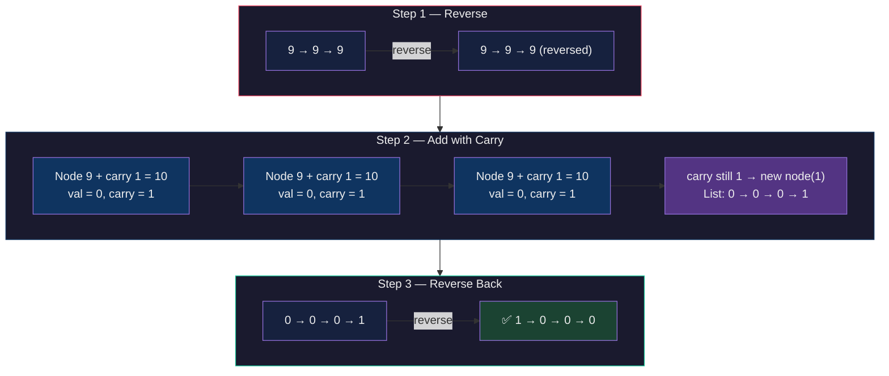
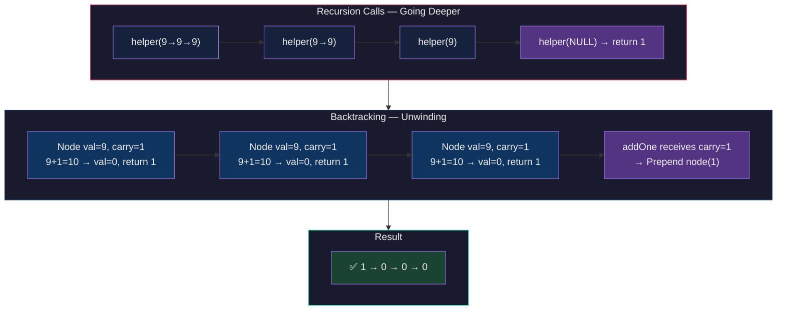
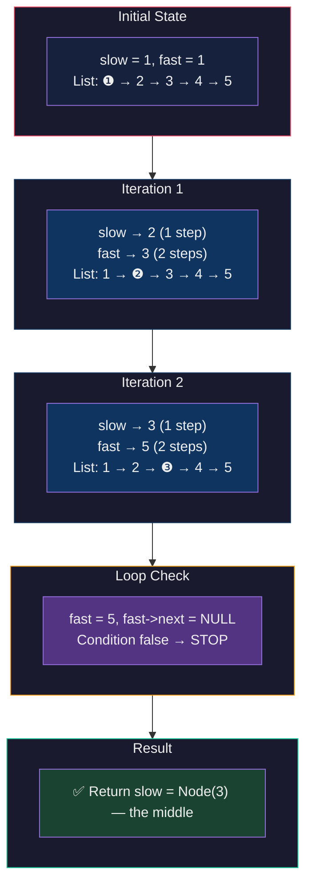
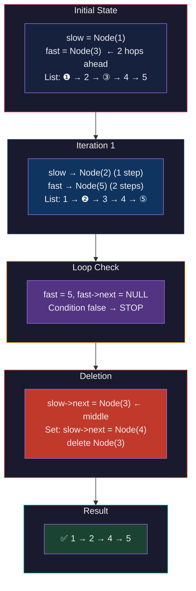
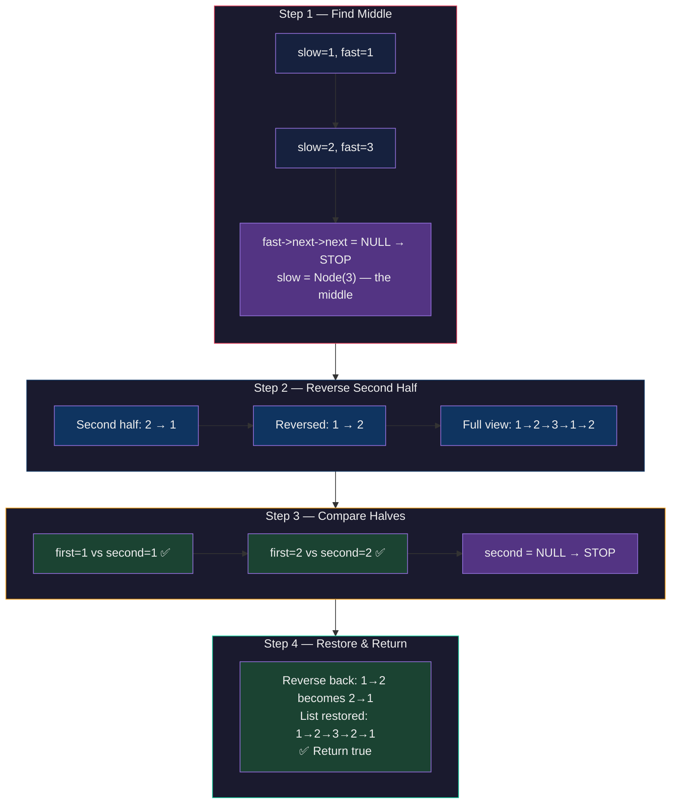

# 🔗 Linked List — Medium FAQs (Part 1) — Master Revision Guide

> **Source:** `faq1.cpp`
> Covers 4 classic linked list problems with brute-force **and** optimal solutions.

---

## Table of Contents

| #   | Problem                                                                                    | Brute TC | Optimal TC |
| --- | ------------------------------------------------------------------------------------------ | -------- | ---------- |
| 1   | [Add One to a Number Represented by LL](#1-add-one-to-a-number-represented-by-linked-list) | O(n)     | O(n)       |
| 2   | [Find Middle of Linked List](#2-find-middle-of-linked-list)                                | O(n)     | O(n/2)     |
| 3   | [Delete the Middle Node](#3-delete-the-middle-node-in-linked-list)                         | O(n)     | O(n/2)     |
| 4   | [Check if LL is Palindrome](#4-check-if-linked-list-is-palindrome)                         | O(2n)    | O(n)       |

---

## 1. Add One to a Number Represented by Linked List

### 📝 Problem Statement

Given a linked list where each node contains a single digit (0-9), the entire list represents a non-negative number (head is the most significant digit). **Add 1** to this number and return the updated linked list.

**Example:**

```
Input:  1 → 9 → 9
Output: 2 → 0 → 0   (199 + 1 = 200)
```

---

### 💡 Intuition & Strategy

#### Why is this tricky?

Addition happens from the **least significant digit** (right/tail), but a singly linked list can only be traversed from the **most significant digit** (left/head). We need a way to process nodes in **reverse order**.

#### Approach A — Iterative (Reverse → Add → Reverse)

**Pattern recognised:** If we can't go right-to-left, make the list go right-to-left!

1. **Reverse** the linked list → now the head is the least-significant digit.
2. Walk through the reversed list, adding `carry = 1` to the first node.
3. Propagate the carry: `sum = node.val + carry`, `node.val = sum % 10`, `carry = sum / 10`.
4. If a carry remains after the last node, append a **new node** with that carry.
5. **Reverse** back to restore original order.

> **Why this works:** Reversing gives us right-to-left access. It's simple and iterative — easy to implement under pressure.

#### Approach B — Recursive (Backtracking)

**Pattern recognised:** Recursion naturally reaches the **tail first** during back-tracking (unwinding the call stack), giving us right-to-left processing _without_ reversing.

1. Recurse until `head == NULL` → return carry `1` (base case: we're adding 1).
2. On the way **back** (unwinding), each node receives the carry from the node to its right.
3. If `node.val + carry ≥ 10` → set `node.val = 0`, return carry `1`.
4. Else → `node.val += carry`, return `0` (carry absorbed, done).
5. If the final return to `addOne()` still has carry `1` → prepend a new head node `1`.

> **Why this is optimal:** Single pass (O(n)) with no list reversal. Recursion stack replaces explicit reversal.

---

### 💻 Code

#### Approach A — Iterative (Reverse – Add – Reverse)

```cpp
class Solution {
public:
  // Standard iterative reversal
  ListNode *reverseList(ListNode *head) {
    ListNode *prev = NULL, *current = head, *next = NULL;
    while (current != NULL) {
      next = current->next;       // save next
      current->next = prev;       // flip the arrow
      prev = current;             // advance prev
      current = next;             // advance current
    }
    return prev;                  // new head
  }

  ListNode *addOne(ListNode *head) {
    head = reverseList(head);     // Step 1: reverse

    ListNode *current = head;
    int carry = 1;                // we are adding ONE

    while (current != NULL) {
      int sum = current->val + carry;
      carry = sum / 10;           // propagate carry
      current->val = sum % 10;    // keep remainder

      if (carry == 0) break;      // no more carry — done early

      // If last node still has carry → create new node
      if (current->next == NULL && carry != 0) {
        current->next = new ListNode(carry);
        break;
      }
      current = current->next;
    }

    head = reverseList(head);     // Step 3: reverse back
    return head;
  }
};
```

#### Approach B — Recursive (Backtracking)

```cpp
class Solution {
private:
  // Recurse to tail, carry comes back during unwinding
  int helper(ListNode *head) {
    if (!head) return 1;          // base: add 1 at the end

    int carry = helper(head->next);  // go deeper first

    if ((head->val + carry) >= 10) {
      head->val = 0;             // 10 → keep 0
      return 1;                  // pass carry upward
    } else {
      head->val += carry;        // absorb carry here
      return 0;                  // no more carry
    }
  }

public:
  ListNode *addOne(ListNode *head) {
    int carry = helper(head);
    if (carry == 1) {
      // Carry survived to the front → prepend new node
      ListNode *el = new ListNode(carry, head);
      head = el;
    }
    return head;
  }
};
```

---

### 🔍 Visual Dry Run

**Input:** `9 → 9 → 9` (i.e., 999 + 1 = 1000)

#### Approach A — Iterative



#### Approach B — Recursive



---

### 📊 Complexity Analysis

| Approach          | Time Complexity                                                           | Space Complexity                            |
| ----------------- | ------------------------------------------------------------------------- | ------------------------------------------- |
| **A — Iterative** | **O(3n) ≈ O(n)** — two reversals (O(n) each) + one traversal for addition | **O(1)** — in-place, only pointer variables |
| **B — Recursive** | **O(n)** — single recursive pass through all n nodes                      | **O(n)** — recursion call stack depth = n   |

---

---

## 2. Find Middle of Linked List

### 📝 Problem Statement

Given a singly linked list, return the **middle node**. If the list has an even number of nodes, return the **second middle** node.

**Example:**

```
Input:  1 → 2 → 3 → 4 → 5        →  Middle = 3
Input:  1 → 2 → 3 → 4 → 5 → 6    →  Middle = 4 (2nd middle)
```

---

### 💡 Intuition & Strategy

#### Approach A — Brute Force (Two-Pass)

**Idea:** If you don't know how long something is, measure it first, then go to the halfway point.

1. **Pass 1:** Count total nodes `n`.
2. Compute middle index: `midPosition = n/2 + 1` (1-indexed).
3. **Pass 2:** Traverse to `midPosition`.

> Simple and foolproof. Disadvantage: needs **two full passes**.

#### Approach B — Tortoise & Hare (One-Pass) ⭐

**Pattern recognised — The "speed ratio" trick:**
If one pointer moves at **1x speed** (slow) and another at **2x speed** (fast), when the fast pointer reaches the end, the slow pointer is exactly at the **middle**.

**Why?** `distance_slow = distance_fast / 2`. When `distance_fast = n`, `distance_slow = n/2`. Done!

- `slow` moves 1 step per iteration.
- `fast` moves 2 steps per iteration.
- Loop condition: `fast != NULL && fast->next != NULL`
  - This handles both odd (fast lands on last node) and even (fast goes past) lengths.

> **Memory trick:** Think of two runners on a track — one runs twice as fast. When the fast runner finishes, the slow runner is at the halfway mark.

---

### 💻 Code

#### Approach A — Brute Force (Two-Pass)

```cpp
class Solution {
public:
  ListNode *middleOfLinkedList(ListNode *head) {
    ListNode *temp = head;
    int count = 0;

    // Pass 1: count all nodes
    while (temp != NULL) {
      count += 1;
      temp = temp->next;
    }

    int midPosition = (count) / 2 + 1; // 1-indexed middle

    ListNode *middleNode = head;
    // Pass 2: walk to the middle
    for (int i = 1; i < midPosition; i++) {
      middleNode = middleNode->next;
    }

    return middleNode;
  }
};
```

#### Approach B — Tortoise & Hare (Optimal)

```cpp
class Solution {
public:
  ListNode *middleOfLinkedList(ListNode *head) {
    ListNode *fastp = head;   // hare — 2x speed
    ListNode *slowp = head;   // tortoise — 1x speed

    while (fastp && fastp->next) {
      slowp = slowp->next;          // 1 step
      fastp = fastp->next->next;    // 2 steps
    }

    return slowp;  // slow is exactly at the middle
  }
};
```

---

### 🔍 Visual Dry Run

**Input:** `1 → 2 → 3 → 4 → 5`

#### Approach B — Tortoise & Hare



---

### 📊 Complexity Analysis

| Approach                | Time Complexity                                     | Space Complexity |
| ----------------------- | --------------------------------------------------- | ---------------- |
| **A — Brute Force**     | **O(n + n/2) ≈ O(n)** — full count + half traversal | **O(1)**         |
| **B — Tortoise & Hare** | **O(n/2)** — fast pointer covers n, slow covers n/2 | **O(1)**         |

> Both are technically O(n), but Optimal does it in a **single pass** with roughly half the pointer movements.

---

---

## 3. Delete the Middle Node in Linked List

### 📝 Problem Statement

Given a singly linked list, **delete the middle node** and return the head. For even-length lists, delete the **second middle** (same convention as "find middle").

**Example:**

```
Input:  1 → 2 → 3 → 4 → 5        →  Output: 1 → 2 → 4 → 5
Input:  1 → 2 → 3 → 4             →  Output: 1 → 2 → 4
```

---

### 💡 Intuition & Strategy

#### Approach A — Brute Force (Two-Pass)

Exactly like finding the middle, but with a deletion step:

1. **Pass 1:** Count nodes → `n`.
2. Compute middle index: `n / 2` (0-indexed).
3. **Pass 2:** Traverse to the node **just before** the middle (`i < middleIndex`), then skip (delete) the middle node.
4. **Edge case:** If list is empty or has 1 node → return `nullptr`.

#### Approach B — Tortoise & Hare (One-Pass) ⭐

**Key insight:** To _delete_ a node, we need a pointer to the node **before** it. So we need `slow` to stop **one step before** the middle.

**Trick:** Start `fast` two hops ahead: `fast = head->next->next`.

This offset ensures that when fast reaches the end, slow is one node **before** the middle:

- `slow` starts at `head` (position 0).
- `fast` starts at `head->next->next` (position 2).
- Each iteration: slow +1, fast +2.
- When fast can't move further → `slow->next` is the middle node.

Then simply: `slow->next = slow->next->next` (skip the middle).

> **Memory trick:** Same tortoise-hare, but give the hare a **2-node head start** so the tortoise stops one position early.

---

### 💻 Code

#### Approach A — Brute Force (Two-Pass)

```cpp
class Solution {
public:
  ListNode *deleteMiddle(ListNode *head) {
    // Edge case: empty or single node
    if (head == nullptr || head->next == nullptr) {
      delete head;
      return nullptr;
    }

    ListNode *temp = head;
    int n = 0;

    // Pass 1: count nodes
    while (temp != nullptr) {
      n++;
      temp = temp->next;
    }

    int middleIndex = n / 2;   // 0-indexed middle
    temp = head;

    // Pass 2: go to node BEFORE the middle
    for (int i = 1; i < middleIndex; i++) {
      temp = temp->next;
    }

    // Delete the middle node
    if (temp->next != nullptr) {
      ListNode *middle = temp->next;
      temp->next = temp->next->next;  // bypass
      delete middle;                  // free memory
    }

    return head;
  }
};
```

#### Approach B — Tortoise & Hare (Optimal)

```cpp
class Solution {
public:
  ListNode *deleteMiddle(ListNode *head) {
    if (!head || !head->next) return nullptr;

    ListNode *slowp = head;
    ListNode *fastp = head->next->next; // 🔑 2-node head start

    while (fastp && fastp->next) {
      slowp = slowp->next;             // 1 step
      fastp = fastp->next->next;        // 2 steps
    }

    // slowp is now ONE BEFORE the middle
    ListNode *temp = slowp->next;       // middle node
    slowp->next = temp->next;           // bypass it
    delete temp;                        // free memory

    return head;
  }
};
```

---

### 🔍 Visual Dry Run

**Input:** `1 → 2 → 3 → 4 → 5` — delete node `3`

#### Approach B — Tortoise & Hare



---

### 📊 Complexity Analysis

| Approach                | Time Complexity                                | Space Complexity |
| ----------------------- | ---------------------------------------------- | ---------------- |
| **A — Brute Force**     | **O(n + n/2) ≈ O(n)** — count + walk to middle | **O(1)**         |
| **B — Tortoise & Hare** | **O(n/2)** — single pass, slow covers half     | **O(1)**         |

---

---

## 4. Check if Linked List is Palindrome

### 📝 Problem Statement

Given a singly linked list, determine if its values form a **palindrome** (reads the same forward and backward).

**Example:**

```
Input:  1 → 2 → 3 → 2 → 1  →  true  ✅
Input:  1 → 2 → 3 → 4       →  false ❌
```

---

### 💡 Intuition & Strategy

#### Approach A — Stack-Based Brute Force

**Pattern recognised:** A stack reverses insertion order. If we push all values, then pop them while re-traversing, we're comparing the list against its own reverse.

1. **Pass 1:** Push every node's value onto a stack → stack top = last element.
2. **Pass 2:** Traverse again from head. At each node, compare `node.val` with `stack.top()`.
   - If mismatch → **not a palindrome**.
   - If all match → **palindrome** ✅.

> **Why it works:** The stack gives us the list in reverse. Comparing forward-traversal with stack-pop is like comparing the string with its reverse.

#### Approach B — Reverse Second Half (Optimal) ⭐

**Key insight:** Instead of using O(n) extra space, we can achieve the same comparison **in-place** by reversing only the second half:

1. **Find the middle** using Tortoise & Hare (slow stops at mid for odd, before mid for even).
2. **Reverse the second half** of the list (from `slow->next` onward).
3. **Compare** first half (starting from head) with reversed second half — node by node.
4. **Restore** the list by reversing the second half back (good practice to not corrupt input).
5. Return the result.

> **Why this is the best approach:**
>
> - O(1) space (only pointer manipulations).
> - Uses two patterns you already know: _find middle_ + _reverse list_.
> - The restoration step is optional but shows discipline.

**Important detail for the loop condition in step 1:**
The while condition is `fast->next != NULL && fast->next->next != NULL` (note: checking `fast->next`, not `fast`). This makes `slow` stop at the node **whose next node is the start of the second half**.

---

### 💻 Code

#### Approach A — Stack-Based

```cpp
class Solution {
public:
  bool isPalindrome(ListNode *head) {
    stack<int> st;
    ListNode *temp = head;

    // Pass 1: push all values onto stack
    while (temp != NULL) {
      st.push(temp->val);
      temp = temp->next;
    }

    // Pass 2: compare from head against reversed order
    temp = head;
    while (temp != NULL) {
      if (temp->val != st.top()) {
        return false;   // mismatch → not palindrome
      }
      st.pop();
      temp = temp->next;
    }

    return true;  // all matched ✅
  }
};
```

#### Approach B — Reverse Second Half (Optimal)

```cpp
class Solution {
private:
  // Recursive reversal (returns new head)
  ListNode *reverseLinkedList(ListNode *head) {
    if (!head || !head->next) return head;

    ListNode *newHead = reverseLinkedList(head->next);
    ListNode *frontNode = head->next;
    frontNode->next = head;      // flip the arrow
    head->next = nullptr;        // old head becomes tail
    return newHead;
  }

public:
  bool isPalindrome(ListNode *head) {
    if (head == NULL || head->next == NULL) return true;

    // Step 1: Find middle (slow ends at mid)
    ListNode *slow = head, *fast = head;
    while (fast->next != NULL && fast->next->next != NULL) {
      slow = slow->next;
      fast = fast->next->next;
    }

    // Step 2: Reverse second half
    ListNode *newHead = reverseLinkedList(slow->next);

    // Step 3: Compare both halves
    ListNode *first = head;
    ListNode *second = newHead;

    while (second != NULL) {
      if (first->val != second->val) {
        reverseLinkedList(newHead);  // restore before returning
        return false;
      }
      first = first->next;
      second = second->next;
    }

    // Step 4: Restore the list
    reverseLinkedList(newHead);

    return true;  // palindrome ✅
  }
};
```

---

### 🔍 Visual Dry Run

**Input:** `1 → 2 → 3 → 2 → 1`

#### Approach B — Reverse Second Half



---

### 📊 Complexity Analysis

| Approach             | Time Complexity                                                        | Space Complexity                                                                                            |
| -------------------- | ---------------------------------------------------------------------- | ----------------------------------------------------------------------------------------------------------- |
| **A — Stack**        | **O(2n) ≈ O(n)** — one pass to push, one to compare                    | **O(n)** — stack stores all n values                                                                        |
| **B — Reverse Half** | **O(n/2 + n/2 + n/2) ≈ O(n)** — find mid + reverse half + compare half | **O(1)** — in-place pointer manipulation (iterative reverse uses O(1); recursive reverse uses O(n/2) stack) |

> **Note:** The code uses _recursive_ reversal which adds O(n/2) stack space. For true O(1) space, replace with iterative reversal.

---

---

## 🧠 Quick Revision Cheat Sheet

| Pattern                         | When to Use                           | Key Idea                                    |
| ------------------------------- | ------------------------------------- | ------------------------------------------- |
| **Reverse → Process → Reverse** | Need right-to-left access iteratively | Temporarily flip the list                   |
| **Recursion + Backtracking**    | Need right-to-left access elegantly   | Call stack gives you reverse order for free |
| **Tortoise & Hare**             | Find middle / detect cycle            | 2x speed difference → half the distance     |
| **Hare with head start**        | Need node _before_ middle             | Start fast 2 positions ahead                |
| **Stack for reversal**          | Compare list vs its reverse           | Stack = natural LIFO reverser               |
| **Reverse second half**         | Palindrome check in O(1) space        | Combine find-middle + reverse               |
