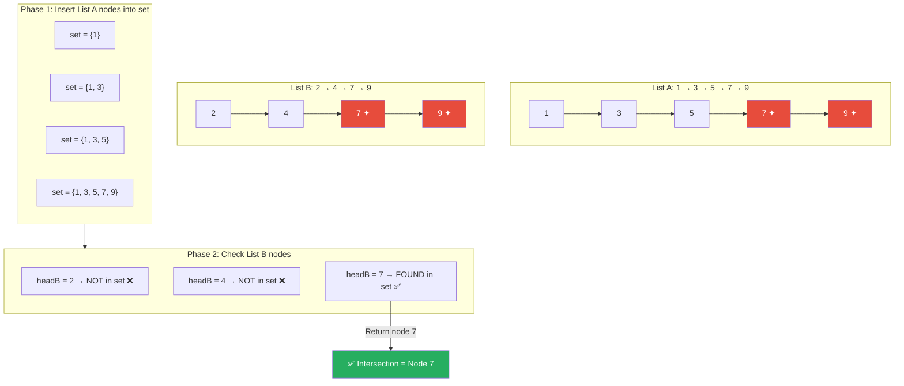
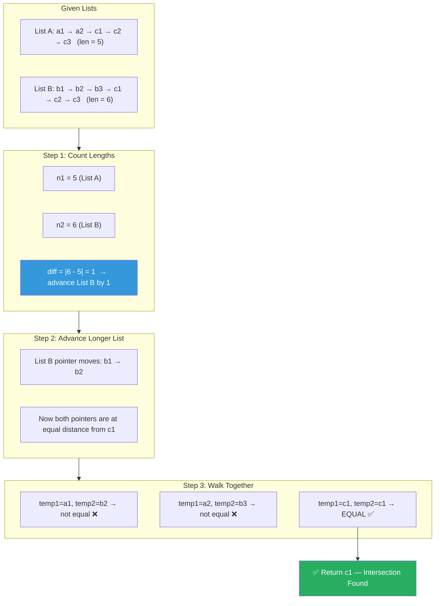
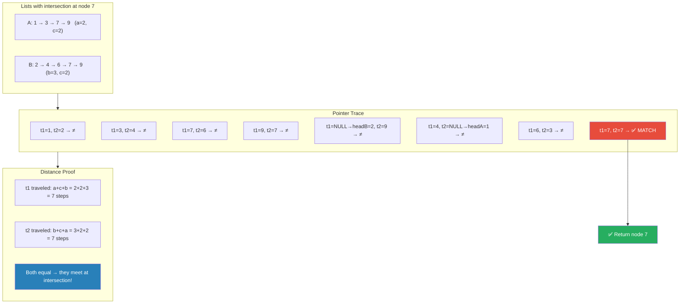
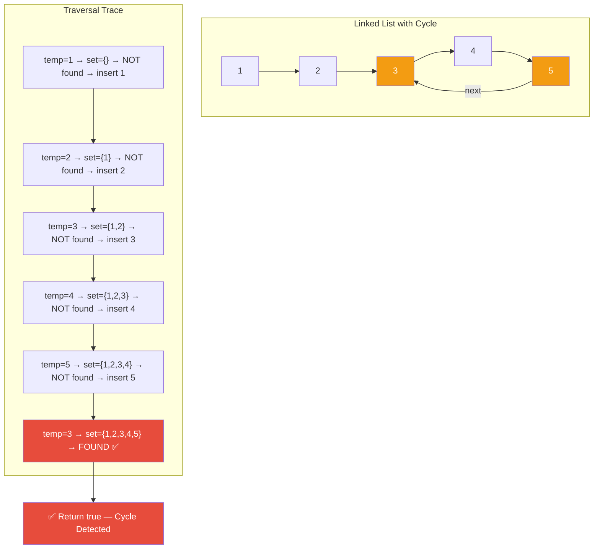
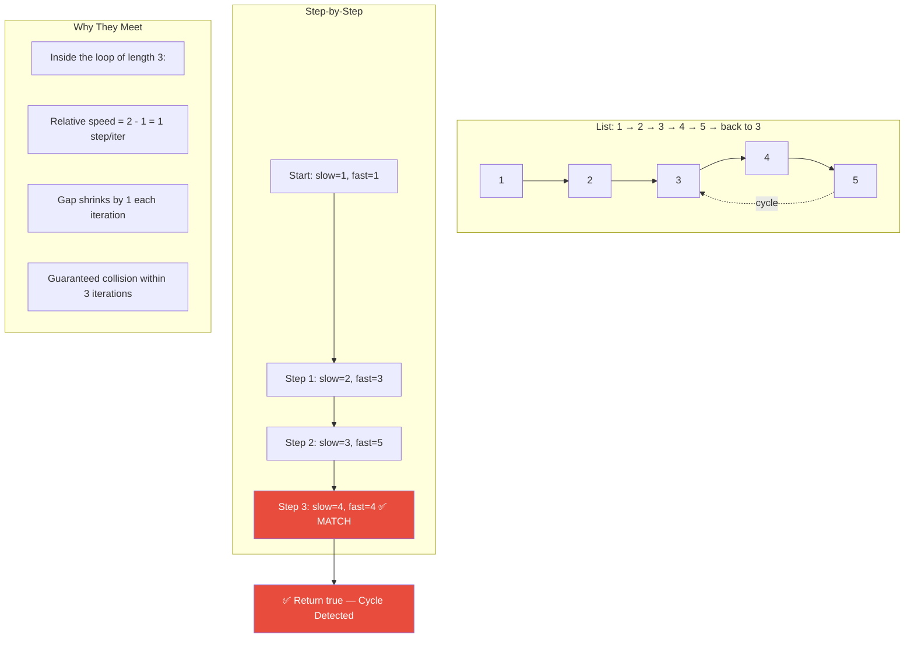
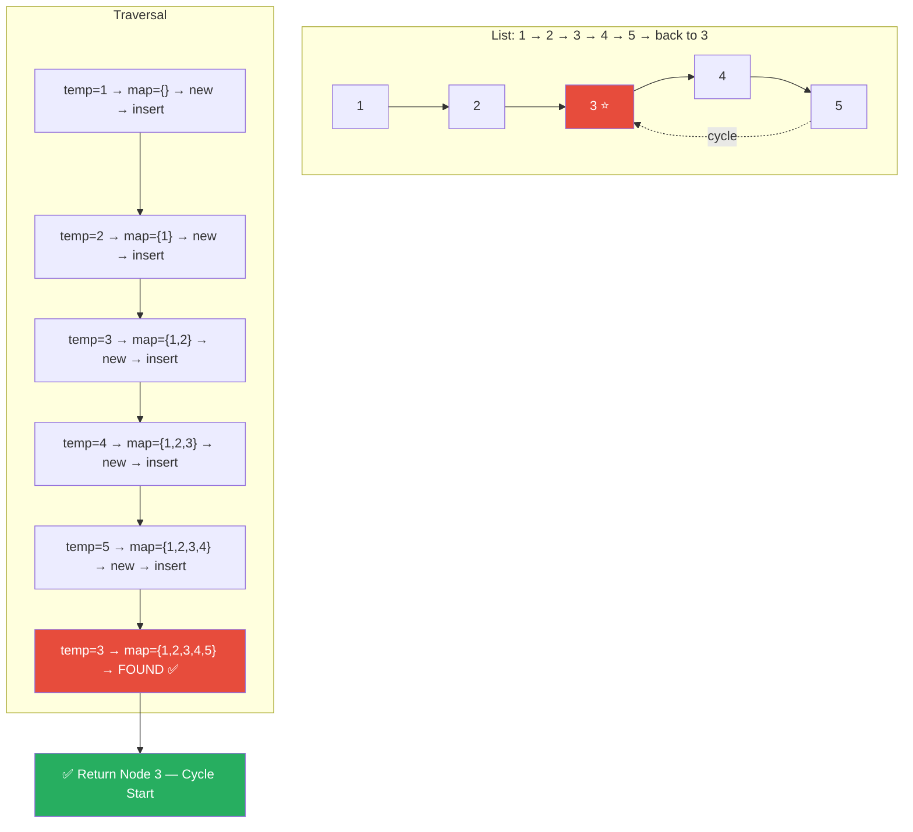
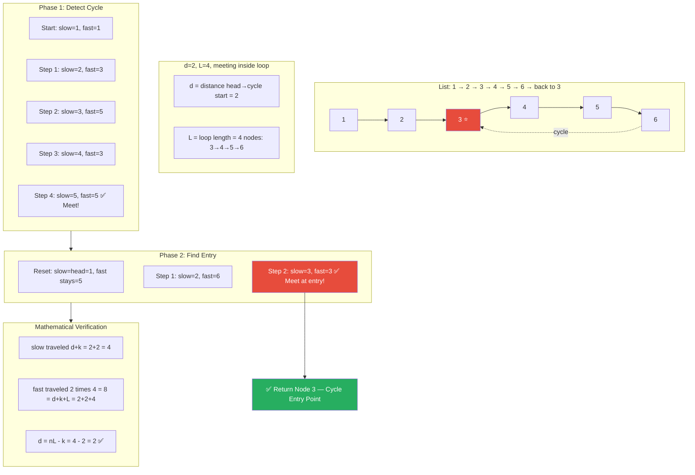
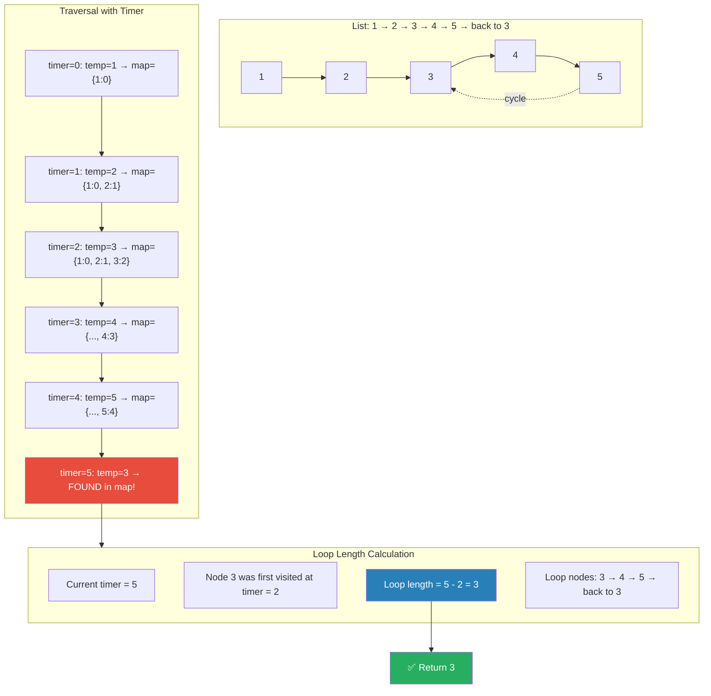
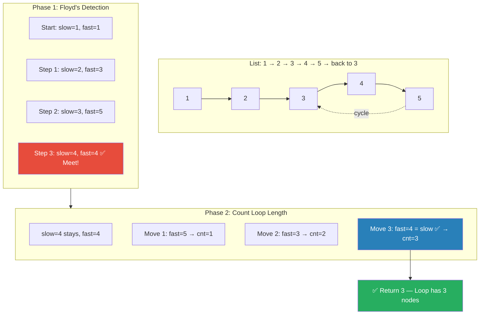

# 🔗 Linked List — FAQs Medium (Part 2): Master Revision Guide

> **Source File:** `faq2.cpp`
> Covers four classic linked list problems with multiple approaches each.

---

## 📑 Table of Contents

| #   | Problem                                                                                                         | Approaches               |
| --- | --------------------------------------------------------------------------------------------------------------- | ------------------------ |
| 1   | [Find the Intersection Point of Y-shaped Linked Lists](#1-find-the-intersection-point-of-y-shaped-linked-lists) | Brute · Better · Optimal |
| 2   | [Detect a Loop in a Linked List](#2-detect-a-loop-in-a-linked-list)                                             | Brute · Optimal          |
| 3   | [Find the Starting Point of a Loop](#3-find-the-starting-point-of-a-loop-in-a-linked-list)                      | Brute · Optimal          |
| 4   | [Length of Loop in a Linked List](#4-length-of-loop-in-a-linked-list)                                           | Brute · Optimal          |

---

## 1. Find the Intersection Point of Y-shaped Linked Lists

### 📝 Problem Statement

Given the heads of two singly linked lists `headA` and `headB`, find the **node** at which the two lists intersect. If they do **not** intersect, return `NULL`.

**Key constraints:**

- The linked lists contain no cycles.
- The original structure of the lists must be preserved after the function returns.

**Visual intuition of a Y-shape:**

```
List A:  a1 → a2 ↘
                   c1 → c2 → c3
List B:  b1 → b2 → b3 ↗
```

Both lists share the tail starting from node `c1`.

---

### Approach 1 — Brute Force (Hashing)

#### 💡 Intuition & Strategy

> **Pattern:** "Have I seen this before?" — classic **hash set membership check**.

The simplest observation: if two lists merge, then at some point a node from list B must be the **exact same object** (same memory address) as a node we already saw in list A.

**Why this works:**

1. Store every node (pointer) from list A into a `HashSet`.
2. Walk through list B — the **first** node that already exists in the set is the intersection point.
3. If we exhaust list B without a hit → no intersection.

**Why we compare pointers, not values:** Two different nodes can hold the same value but be at different memory addresses. Intersection means the **same node object** is shared.

#### 💻 Code

```cpp
class Solution {
public:
  ListNode *getIntersectionNode(ListNode *headA, ListNode *headB) {
    // Set to store node addresses from list A
    unordered_set<ListNode *> nodes_set;

    // Phase 1: Record every node of list A
    while (headA != NULL) {
      nodes_set.insert(headA);   // store the pointer (address)
      headA = headA->next;
    }

    // Phase 2: Walk list B — first match is the intersection
    while (headB != NULL) {
      if (nodes_set.find(headB) != nodes_set.end()) {
        return headB;            // found intersection node
      }
      headB = headB->next;
    }

    return NULL; // no intersection
  }
};
```

#### 🔍 Visual Dry Run



#### 📊 Complexity

|           | Value      | Explanation                                                                                   |
| --------- | ---------- | --------------------------------------------------------------------------------------------- |
| **Time**  | `O(m + n)` | One full traversal of list A (m nodes) + traversal of list B until match (n nodes worst case) |
| **Space** | `O(m)`     | Hash set stores all m nodes of list A                                                         |

---

### Approach 2 — Better (Length Difference)

#### 💡 Intuition & Strategy

> **Pattern:** "Align the starting lines" — **equalize lengths** before comparing.

The core insight: if two lists merge, the tail portions from the intersection point onward are **identical**. The only reason the pointers don't meet at the same time is because one list has **extra leading nodes**.

**Step-by-step logic:**

1. **Count** the lengths of both lists: `n1` and `n2`.
2. **Calculate the difference** `d = |n1 - n2|`.
3. **Advance** the pointer of the longer list by `d` steps — now both pointers are **equidistant** from the intersection point.
4. **Walk both pointers simultaneously** — the first node where they meet is the intersection.

**Why this is better than brute force:** It avoids using a hash set entirely, reducing space to O(1).

#### 💻 Code

```cpp
class Solution {
public:
  ListNode *getIntersectionNode(ListNode *headA, ListNode *headB) {
    ListNode *temp1 = headA;
    ListNode *temp2 = headB;
    int n1 = 0, n2 = 0;

    // Count length of list A
    while (temp1 != NULL) {
      n1++;
      temp1 = temp1->next;
    }

    // Count length of list B
    while (temp2 != NULL) {
      n2++;
      temp2 = temp2->next;
    }

    // The longer list's pointer needs to be advanced first
    if (n1 < n2)
      return collisionPoint(headA, headB, n2 - n1);

    return collisionPoint(headB, headA, n1 - n2);
  }

private:
  ListNode *collisionPoint(ListNode *smallerListHead, ListNode *longerListHead,
                           int len) {
    ListNode *temp1 = smallerListHead;
    ListNode *temp2 = longerListHead;

    // Advance the longer list pointer by 'len' steps
    for (int i = 0; i < len; i++)
      temp2 = temp2->next;

    // Now walk both pointers together until they meet
    while (temp1 != temp2) {
      temp1 = temp1->next;
      temp2 = temp2->next;
    }

    return temp1; // intersection node (or NULL if no intersection)
  }
};
```

#### 🔍 Visual Dry Run



#### 📊 Complexity

|           | Value      | Explanation                                                 |
| --------- | ---------- | ----------------------------------------------------------- |
| **Time**  | `O(m + n)` | Two passes to count lengths + one pass to find intersection |
| **Space** | `O(1)`     | Only a few pointer variables                                |

---

### Approach 3 — Optimal (Two-Pointer Swap)

#### 💡 Intuition & Strategy

> **Pattern:** "If you can't align them, make them walk each other's path" — **virtual concatenation**.

This is one of the most elegant algorithms in linked list problems. Here's the deep insight:

Imagine two pointers, `t1` starting at head A and `t2` starting at head B. They walk at the same speed. When one reaches the end of its list, **it jumps to the head of the other list**.

**Why does this guarantee they meet at the intersection?**

Let:

- `a` = number of nodes unique to list A (before intersection)
- `b` = number of nodes unique to list B (before intersection)
- `c` = number of common nodes (from intersection onward)

| Pointer | Path traversed before meeting                                 |
| ------- | ------------------------------------------------------------- |
| `t1`    | `a + c + b` = total steps to reach intersection from B's head |
| `t2`    | `b + c + a` = total steps to reach intersection from A's head |

Since `a + c + b == b + c + a`, **both pointers travel the exact same distance** before meeting at the intersection node!

If there's **no intersection**, both pointers will reach `NULL` at the same time after traversing `a + b + 2c` steps, and the function returns `NULL`.

**Why this is optimal:** Single pass (effectively), no extra space, no need to count lengths separately.

#### 💻 Code

```cpp
class Solution {
public:
  ListNode *getIntersectionNode(ListNode *headA, ListNode *headB) {
    if (!headA || !headB)
      return NULL;            // edge case: empty list

    ListNode *t1 = headA;
    ListNode *t2 = headB;

    while (t1 != t2) {
      t1 = t1->next;
      t2 = t2->next;

      // If they meet at NULL (no intersection) or at a node
      if (t1 == t2)
        return t1;

      // When t1 reaches end of A, redirect to head of B
      if (t1 == nullptr)
        t1 = headB;

      // When t2 reaches end of B, redirect to head of A
      if (t2 == nullptr)
        t2 = headA;
    }
    return t1; // both started at the same node (edge case)
  }
};
```

#### 🔍 Visual Dry Run



#### 📊 Complexity

|           | Value      | Explanation                                  |
| --------- | ---------- | -------------------------------------------- |
| **Time**  | `O(m + n)` | Each pointer traverses at most `m + n` nodes |
| **Space** | `O(1)`     | Only two pointers                            |

---

## 2. Detect a Loop in a Linked List

### 📝 Problem Statement

Given the `head` of a linked list, determine if the linked list **contains a cycle** (loop). Return `true` if there is a cycle, `false` otherwise.

A cycle exists if some node's `next` pointer points back to a **previously visited node**, causing infinite traversal.

```
1 → 2 → 3 → 4 → 5
        ↑         ↓
        └─────────┘   ← cycle!
```

---

### Approach 1 — Brute Force (Hashing)

#### 💡 Intuition & Strategy

> **Pattern:** "Have I visited this node before?" — **visited set tracking**.

The idea is straightforward:

1. Maintain a `HashSet` of all nodes you've visited.
2. For each node, check: "Is this node already in the set?"
   - **Yes** → you've revisited a node → **cycle exists**.
   - **No** → mark it as visited and move on.
3. If you reach `NULL`, the list terminates → **no cycle**.

**Why store pointers, not values:** Multiple nodes can have the same value. A cycle is about **revisiting the same node object**, not the same value.

#### 💻 Code

```cpp
class Solution {
public:
  bool hasCycle(ListNode *head) {
    ListNode *temp = head;

    // Set to track visited node addresses
    std::unordered_set<ListNode *> nodeSet;

    while (temp != nullptr) {
      // If this node was already visited → loop found
      if (nodeSet.find(temp) != nodeSet.end()) {
        return true;
      }
      // Mark current node as visited
      nodeSet.insert(temp);

      // Move forward
      temp = temp->next;
    }

    // Reached end of list → no loop
    return false;
  }
};
```

#### 🔍 Visual Dry Run



#### 📊 Complexity

|           | Value  | Explanation                                     |
| --------- | ------ | ----------------------------------------------- |
| **Time**  | `O(n)` | Each node visited at most once before detection |
| **Space** | `O(n)` | Hash set stores up to n node pointers           |

---

### Approach 2 — Optimal (Floyd's Tortoise & Hare)

#### 💡 Intuition & Strategy

> **Pattern:** "Two runners on a circular track" — **Floyd's Cycle Detection Algorithm**.

This is one of the most famous algorithms in computer science. The idea is based on a simple physical analogy:

**Imagine two runners on a track:**

- **Slow (Tortoise):** moves **1 step** at a time.
- **Fast (Hare):** moves **2 steps** at a time.

**If the track is straight (no loop):** The fast runner reaches the end and stops. We conclude there's no cycle.

**If the track has a loop:** The fast runner, moving faster, will eventually **lap** the slow runner — they'll be at the **same node** at the same time. This guarantees detection.

**Why must they meet?**
Once both are inside the loop, the relative speed between fast and slow is 1 step per iteration. So the gap between them decreases by 1 each step. They **must** collide within one full loop traversal.

**Why check `fast != nullptr && fast->next != nullptr`?**
The fast pointer moves 2 steps. We must ensure both `fast` and `fast->next` exist to avoid null pointer dereference.

#### 💻 Code

```cpp
class Solution {
public:
  bool hasCycle(ListNode *head) {
    // Both start at head
    ListNode *slow = head;
    ListNode *fast = head;

    // Fast moves 2x speed; check fast and fast->next aren't null
    while (fast != nullptr && fast->next != nullptr) {
      slow = slow->next;           // tortoise: 1 step
      fast = fast->next->next;     // hare: 2 steps

      // If they meet → cycle exists
      if (slow == fast) {
        return true;
      }
    }

    // Fast reached the end → no cycle
    return false;
  }
};
```

#### 🔍 Visual Dry Run



#### 📊 Complexity

|           | Value  | Explanation                                                                        |
| --------- | ------ | ---------------------------------------------------------------------------------- |
| **Time**  | `O(n)` | Slow pointer traverses at most n nodes; fast pointer covers at most 2n nodes total |
| **Space** | `O(1)` | Only two pointers — no extra data structures                                       |

---

## 3. Find the Starting Point of a Loop in a Linked List

### 📝 Problem Statement

Given the `head` of a linked list that **may contain a cycle**, return the **node** where the cycle begins. If there is no cycle, return `NULL`.

This is a harder extension of the "detect cycle" problem — not only do we need to know **if** a cycle exists, but also **where** it starts.

```
1 → 2 → 3 → 4 → 5
        ↑         ↓
        └─────────┘

Starting point = Node 3
```

---

### Approach 1 — Brute Force (Hashing)

#### 💡 Intuition & Strategy

> **Pattern:** "First repeated visit" — the **first node you see twice** is the cycle start.

This is a direct adaptation of the cycle detection hash approach:

1. Traverse the list, recording each node in a `HashMap`.
2. The **first node** that the map says we've already visited = **start of the cycle**.
3. If we hit `NULL`, there's no cycle → return `NULL`.

**Why this correctly finds the START:**
The list is linear until it enters the cycle. The entry point of the cycle is the first node that gets revisited — every node before it was visited exactly once.

#### 💻 Code

```cpp
class Solution {
public:
  ListNode *findStartingPoint(ListNode *head) {
    ListNode *temp = head;

    // Map to record visited nodes
    std::unordered_map<ListNode *, int> mp;

    while (temp != nullptr) {
      // First repeated node = start of cycle
      if (mp.count(temp) != 0) {
        return temp;
      }
      // Mark as visited
      mp[temp] = 1;
      temp = temp->next;
    }

    // No cycle
    return nullptr;
  }
};
```

#### 🔍 Visual Dry Run



#### 📊 Complexity

|           | Value  | Explanation                                                       |
| --------- | ------ | ----------------------------------------------------------------- |
| **Time**  | `O(n)` | Each node visited at most once before the start is re-encountered |
| **Space** | `O(n)` | HashMap stores up to n nodes                                      |

---

### Approach 2 — Optimal (Floyd's Algorithm — Phase 2)

#### 💡 Intuition & Strategy

> **Pattern:** "Slow & Fast meet → reset slow to head → walk both at same speed" — **Floyd's extended algorithm**.

This builds on Floyd's Tortoise & Hare. After detecting the cycle, there's a beautiful mathematical property to find the **entry point**.

**The two phases:**

**Phase 1 — Detect the cycle** (same as before):

- Slow moves 1 step, fast moves 2 steps.
- They meet somewhere **inside** the loop.

**Phase 2 — Find the entry point:**

- Reset `slow` to `head`.
- Now move **both** `slow` and `fast` **one step at a time**.
- The node where they meet again is the **starting point** of the cycle.

**Why does Phase 2 work? (Mathematical Proof):**

Let:

- `d` = distance from head to cycle start
- `k` = distance from cycle start to the meeting point (inside the loop)
- `L` = total length of the cycle

When slow and fast meet:

- Slow has traveled: `d + k` steps
- Fast has traveled: `d + k + nL` steps (n full loops extra)
- Since fast moves 2x: `2(d + k) = d + k + nL`
- Simplifying: `d + k = nL` → **`d = nL - k`**

This means: the distance from **head to cycle start** (`d`) equals the distance from the **meeting point to cycle start** going forward through the loop (`nL - k`).

So if we reset one pointer to head and walk both at speed 1, they meet at the cycle start!

#### 💻 Code

```cpp
class Solution {
public:
  ListNode *findStartingPoint(ListNode *head) {
    ListNode *slow = head;
    ListNode *fast = head;

    // Phase 1: Detect the cycle
    while (fast != NULL && fast->next != NULL) {
      slow = slow->next;           // 1 step
      fast = fast->next->next;     // 2 steps

      if (slow == fast) {
        // Cycle detected! Now find the entry point.

        // Phase 2: Reset slow to head
        slow = head;

        // Walk both at same speed
        while (slow != fast) {
          slow = slow->next;       // 1 step
          fast = fast->next;       // 1 step (not 2!)
        }

        // Meeting point = cycle start
        return slow;
      }
    }

    return NULL; // no cycle
  }
};
```

#### 🔍 Visual Dry Run



#### 📊 Complexity

|           | Value  | Explanation                                                          |
| --------- | ------ | -------------------------------------------------------------------- |
| **Time**  | `O(n)` | Phase 1 takes O(n) for detection, Phase 2 takes O(n) for entry point |
| **Space** | `O(1)` | Only two pointers used throughout                                    |

---

## 4. Length of Loop in a Linked List

### 📝 Problem Statement

Given the `head` of a linked list, find the **length of the loop** if a cycle exists. If there is no cycle, return `0`.

The length of the loop = the number of **distinct nodes** that form the cycle.

```
1 → 2 → 3 → 4 → 5
        ↑         ↓
        └─────────┘

Loop: 3 → 4 → 5 → 3   →   Length = 3
```

---

### Approach 1 — Brute Force (Hashing with Timer)

#### 💡 Intuition & Strategy

> **Pattern:** "When did I first visit this node?" — use a **timestamp** to compute loop length.

This clever approach assigns a **timer value** (visit order) to each node:

1. Traverse the list, recording `node → timestamp` in a HashMap.
2. When you revisit a node, the **loop length** = `current_timer - stored_timer`.

**Why this works:**

- The timer increments by 1 for each node visited.
- If node X was first visited at timer `t1` and revisited at timer `t2`, then exactly `t2 - t1` steps were taken to traverse the entire loop and return to X.
- That difference = number of nodes in the loop.

#### 💻 Code

```cpp
class Solution {
public:
  int findLengthOfLoop(ListNode *head) {
    // Map: node pointer → timer value when first visited
    unordered_map<ListNode *, int> visitedNodes;

    ListNode *temp = head;
    int timer = 0;

    while (temp != NULL) {
      // If we've seen this node before → loop found
      if (visitedNodes.find(temp) != visitedNodes.end()) {
        // Length = current time - time when first visited
        int loopLength = timer - visitedNodes[temp];
        return loopLength;
      }

      // Record this node with its visit time
      visitedNodes[temp] = timer;

      temp = temp->next;
      timer++;
    }

    // No loop found
    return 0;
  }
};
```

#### 🔍 Visual Dry Run



#### 📊 Complexity

|           | Value  | Explanation                                                            |
| --------- | ------ | ---------------------------------------------------------------------- |
| **Time**  | `O(n)` | Each node visited at most once before the loop start is re-encountered |
| **Space** | `O(n)` | HashMap stores up to n node-timestamp pairs                            |

---

### Approach 2 — Optimal (Floyd's + Loop Counting)

#### 💡 Intuition & Strategy

> **Pattern:** "Detect, then count" — use **Floyd's to find meeting point**, then **count the loop**.

This is a two-phase approach:

**Phase 1 — Detect the cycle using Floyd's algorithm:**

- Slow moves 1 step, fast moves 2 steps.
- When they meet, a cycle is confirmed.

**Phase 2 — Count the loop length:**

- After `slow == fast` inside the loop, keep one pointer (`slow`) stationary.
- Move the other pointer (`fast`) forward **one step at a time**, counting each step.
- When `fast` returns to `slow`, the count = loop length.

**Why this works:**
Once we know both pointers are inside the loop and at the same position, moving one pointer around the loop and counting until it returns to the starting position gives us exactly the number of nodes in the cycle.

#### 💻 Code

```cpp
class Solution {
public:
  // Helper: count nodes in the loop starting from meeting point
  int findLength(ListNode *slow, ListNode *fast) {
    int cnt = 1;              // start count at 1 (we'll move fast once first)
    fast = fast->next;        // move fast one step ahead

    // Traverse until fast comes back to slow
    while (slow != fast) {
      cnt++;
      fast = fast->next;
    }

    return cnt; // total nodes in the loop
  }

  int findLengthOfLoop(ListNode *head) {
    ListNode *slow = head;
    ListNode *fast = head;

    // Phase 1: Detect cycle using Floyd's algorithm
    while (fast != nullptr && fast->next != nullptr) {
      slow = slow->next;           // 1 step
      fast = fast->next->next;     // 2 steps

      if (slow == fast) {
        // Cycle detected! Count its length
        return findLength(slow, fast);
      }
    }

    // No loop
    return 0;
  }
};
```

#### 🔍 Visual Dry Run



#### 📊 Complexity

|           | Value  | Explanation                                                    |
| --------- | ------ | -------------------------------------------------------------- |
| **Time**  | `O(n)` | Floyd's detection: O(n) + Loop counting: O(loop length) ≤ O(n) |
| **Space** | `O(1)` | Only two pointers + one counter variable                       |

---

## 📋 Quick Revision Summary

| Problem                | Brute Force                                  | Optimal                                         | Key Insight                                                         |
| ---------------------- | -------------------------------------------- | ----------------------------------------------- | ------------------------------------------------------------------- |
| **Intersection Point** | HashSet — O(m+n) time, O(m) space            | Two-pointer swap — O(m+n) time, O(1) space      | Both pointers travel `a+b+c` steps via virtual concatenation        |
| **Detect Loop**        | HashSet — O(n) time, O(n) space              | Floyd's Tortoise & Hare — O(n) time, O(1) space | Fast laps slow inside loop; relative speed = 1 guarantees collision |
| **Loop Start Point**   | HashMap first-repeat — O(n) time, O(n) space | Floyd's Phase 2 — O(n) time, O(1) space         | `d = nL - k` means head→start = meetpoint→start                     |
| **Loop Length**        | HashMap + timer — O(n) time, O(n) space      | Floyd's + count — O(n) time, O(1) space         | After meeting, count one full traversal of the loop                 |

> **Common Theme:** All brute force solutions use **hashing** for O(n) space. All optimal solutions use **Floyd's Tortoise & Hare** for O(1) space. Master Floyd's algorithm — it's the backbone of all cycle-related linked list problems!
