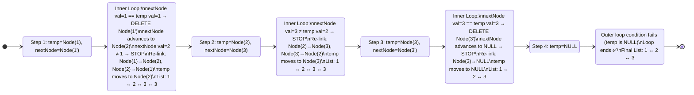

# 🔗 Doubly Linked List — FAQs (Master Revision Guide)

> A comprehensive revision guide for classic Doubly Linked List problems, covering intuition, code, visual dry runs, and complexity analysis.

---

## Table of Contents

| #   | Problem                                                                             | Difficulty  |
| --- | ----------------------------------------------------------------------------------- | ----------- |
| 1   | [Delete All Occurrences of a Key in DLL](#1-delete-all-occurrences-of-a-key-in-dll) | Medium      |
| 2   | [Remove Duplicates from Sorted DLL](#2-remove-duplicates-from-sorted-dll)           | Easy–Medium |

---

## 1. Delete All Occurrences of a Key in DLL

### 📝 Problem Statement

Given the head of a **doubly linked list** and an integer `target`, delete **every node** whose value equals `target` and return the (possibly new) head of the list.

**Example:**

```
Input:  1 <-> 2 <-> 3 <-> 2 <-> 4,  target = 2
Output: 1 <-> 3 <-> 4
```

---

### 💡 Intuition & Strategy

**Core Insight — Single-Pass Linear Scan with In-Place Re-linking**

The beauty of a doubly linked list is that every node already knows its predecessor (`prev`) and successor (`next`). This means we can **delete any node in O(1)** once we find it, without needing a separate "previous" pointer like we would in a singly linked list.

**How to think about this problem:**

1. **Walk through the list linearly** using a pointer `temp`.
2. At each node, check: _does `temp->val == target`?_
   - **No →** Just move `temp` to the next node. Nothing to do.
   - **Yes →** This node must be removed. Here's the key re-linking logic:
     - **Grab neighbors:** `prevNode = temp->prev`, `nextNode = temp->next`.
     - **Bypass the current node:**
       - If `prevNode` exists → `prevNode->next = nextNode` (skip over `temp`).
       - If `nextNode` exists → `nextNode->prev = prevNode` (skip over `temp`).
     - **Handle head deletion:** If `temp == head`, the head shifts to `head->next`.
     - **Free memory** with `delete temp`.
     - **Advance:** Set `temp = nextNode` (not `temp->next` — `temp` is already deleted!).

**Why this approach wins:**

| Approach                             | TC       | SC       | Why not?      |
| ------------------------------------ | -------- | -------- | ------------- |
| Copy non-target nodes to new list    | O(n)     | O(n)     | Wastes memory |
| **Single-pass in-place deletion** ✅ | **O(n)** | **O(1)** | Optimal!      |

**Pattern to remember:** _"In a DLL, to delete a node, stitch its neighbors together and handle the head edge case."_

---

### 💻 The Code

```cpp
// Delete all occurrences of a key in DLL
class Solution {
public:
    ListNode *deleteAllOccurrences(ListNode *head, int target) {
        ListNode *temp = head;         // Traversal pointer
        ListNode *prevNode;
        ListNode *nextNode;

        while (temp) {
            if (temp->val == target) {
                // EDGE CASE: if target node is the head, shift head forward
                if (temp == head) {
                    head = head->next;
                }

                // Grab neighbors before deleting
                prevNode = temp->prev;
                nextNode = temp->next;

                // Re-link previous node (if it exists) to skip over temp
                if (prevNode) {
                    prevNode->next = nextNode;
                }
                // Re-link next node (if it exists) to skip over temp
                if (nextNode) {
                    nextNode->prev = prevNode;
                }

                delete temp;           // Free the deleted node
                temp = nextNode;       // Move to next (NOT temp->next, temp is freed!)
            }
            else {
                temp = temp->next;     // No match — simply advance
            }
        }
        return head;
    }
};
```

---

### 🔍 Visual Dry Run

**Input:** `1 <-> 2 <-> 3 <-> 2 <-> 4`, `target = 2`

```mermaid
stateDiagram-v2
    direction LR

    state "Step 1: temp → Node(1)" as S1
    state "val=1 ≠ 2\nAction: Move temp forward\nList: 1 ↔ 2 ↔ 3 ↔ 2 ↔ 4" as S1_detail

    state "Step 2: temp → Node(2)" as S2
    state "val=2 == target ✓\nprev=Node(1), next=Node(3)\nRe-link: 1→3, 3→1\nDelete Node(2), temp=Node(3)\nList: 1 ↔ 3 ↔ 2 ↔ 4" as S2_detail

    state "Step 3: temp → Node(3)" as S3
    state "val=3 ≠ 2\nAction: Move temp forward\nList: 1 ↔ 3 ↔ 2 ↔ 4" as S3_detail

    state "Step 4: temp → Node(2)" as S4
    state "val=2 == target ✓\nprev=Node(3), next=Node(4)\nRe-link: 3→4, 4→3\nDelete Node(2), temp=Node(4)\nList: 1 ↔ 3 ↔ 4" as S4_detail

    state "Step 5: temp → Node(4)" as S5
    state "val=4 ≠ 2\nAction: Move temp forward\nList: 1 ↔ 3 ↔ 4" as S5_detail

    state "Step 6: temp = NULL" as S6
    state "Loop ends ✅\nFinal List: 1 ↔ 3 ↔ 4" as S6_detail

    [*] --> S1
    S1 --> S1_detail
    S1_detail --> S2
    S2 --> S2_detail
    S2_detail --> S3
    S3 --> S3_detail
    S3_detail --> S4
    S4 --> S4_detail
    S4_detail --> S5
    S5 --> S5_detail
    S5_detail --> S6
    S6 --> S6_detail
    S6_detail --> [*]
```



---

### 📊 Complexity Analysis

| Metric    | Value    | Explanation                                                                                             |
| --------- | -------- | ------------------------------------------------------------------------------------------------------- |
| **Time**  | **O(n)** | We visit each of the `n` nodes exactly once. Each deletion is O(1) due to DLL pointers.                 |
| **Space** | **O(1)** | Only a constant number of pointers (`temp`, `prevNode`, `nextNode`) are used. No extra data structures. |

---

---

## 2. Remove Duplicates from Sorted DLL

### 📝 Problem Statement

Given the head of a **sorted doubly linked list**, remove all **duplicate** nodes such that each value appears **only once**. Return the head of the modified list.

**Example:**

```
Input:  1 <-> 1 <-> 2 <-> 3 <-> 3
Output: 1 <-> 2 <-> 3
```

---

### 💡 Intuition & Strategy

**Core Insight — Exploit the Sorted Order: Duplicates Are Always Adjacent**

Because the list is **sorted**, all duplicate values are guaranteed to be **consecutive**. This is the critical observation. We don't need hash sets or extra storage — we just need to compare each node with the nodes immediately following it.

**How to think about this problem step-by-step:**

1. **Anchor at each unique node** using pointer `temp`.
2. **Scan forward** from `temp->next` using `nextNode`:
   - While `nextNode` exists AND `nextNode->val == temp->val`, it's a duplicate:
     - Save `nextNode` into a temporary pointer `el`.
     - Advance `nextNode` to `nextNode->next`.
     - `delete el` (free the duplicate).
   - This inner loop consumes all consecutive duplicates of `temp->val`.
3. **Re-link:** After all duplicates are removed:
   - `temp->next = nextNode` (point to the first non-duplicate successor).
   - If `nextNode` exists → `nextNode->prev = temp` (back-link).
4. **Advance** `temp = temp->next` (which is now `nextNode`, the next unique value).

**Why this works perfectly:**

- The **outer loop** picks each unique value as an anchor.
- The **inner loop** gobbles up all duplicates of that value.
- After the inner loop, `nextNode` points to either the **next distinct value** or `NULL`.
- Re-linking stitches the unique nodes together cleanly.

**Pattern to remember:** _"Sorted list + duplicates = compare with neighbors. Anchor on unique, sweep duplicates forward, re-link."_

**Why not use a hash set?**

| Approach                                   | TC       | SC       | Why not?                       |
| ------------------------------------------ | -------- | -------- | ------------------------------ |
| Hash set to track seen values              | O(n)     | O(n)     | Unnecessary extra space        |
| **Two-pointer sweep (sorted property)** ✅ | **O(n)** | **O(1)** | Optimal! Exploits sorted order |

---

### 💻 The Code

```cpp
// Remove duplicates from sorted DLL
class Solution {
public:
    ListNode *removeDuplicates(ListNode *head) {
        ListNode *temp = head;         // Anchor pointer for each unique value
        ListNode *nextNode;

        while (temp && temp->next) {   // Need at least 2 nodes to compare
            nextNode = temp->next;

            // Inner loop: consume all consecutive duplicates of temp->val
            while (nextNode && nextNode->val == temp->val) {
                ListNode *el = nextNode;       // Save reference to delete
                nextNode = nextNode->next;     // Advance before deleting
                delete el;                     // Free the duplicate node
            }

            // Re-link: temp now points to the next unique node (or NULL)
            temp->next = nextNode;
            if (nextNode) {
                nextNode->prev = temp;         // Maintain backward link
            }

            temp = temp->next;                 // Move anchor to next unique value
        }
        return head;
    }
};
```

---

### 🔍 Visual Dry Run

**Input:** `1 <-> 1 <-> 2 <-> 3 <-> 3`



---

### 📊 Complexity Analysis

| Metric    | Value    | Explanation                                                                                                                          |
| --------- | -------- | ------------------------------------------------------------------------------------------------------------------------------------ |
| **Time**  | **O(n)** | Each node is visited at most twice — once by `temp` (as anchor) and once by `nextNode` (as duplicate scanner). Total work is linear. |
| **Space** | **O(1)** | Only a constant number of pointers (`temp`, `nextNode`, `el`) are used. No extra data structures.                                    |

---

---

## 🧠 Quick Revision Cheat Sheet

| Problem                    | Key Idea                                                      | Pattern                                 | TC   | SC   |
| -------------------------- | ------------------------------------------------------------- | --------------------------------------- | ---- | ---- |
| Delete All Occurrences     | DLL gives O(1) delete — stitch `prev` and `next`, handle head | _Scan → Match → Re-link → Advance_      | O(n) | O(1) |
| Remove Duplicates (Sorted) | Sorted ⟹ duplicates are adjacent — anchor + forward sweep     | _Anchor unique → Sweep dupes → Re-link_ | O(n) | O(1) |

> **Golden Rule for DLL Deletion:** Always grab `prev` and `next` _before_ deleting. Always check for `NULL` before accessing `->prev` or `->next`. Always update `head` if the head itself is deleted.
