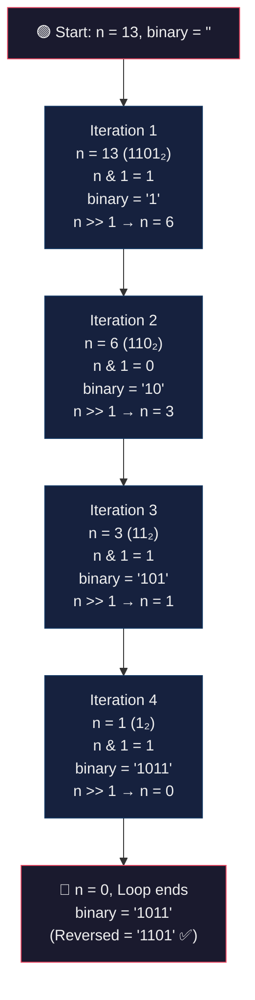
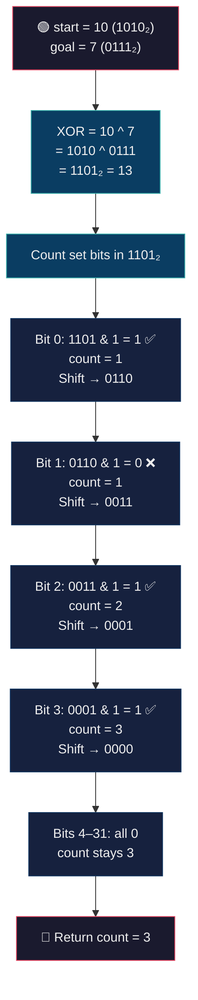
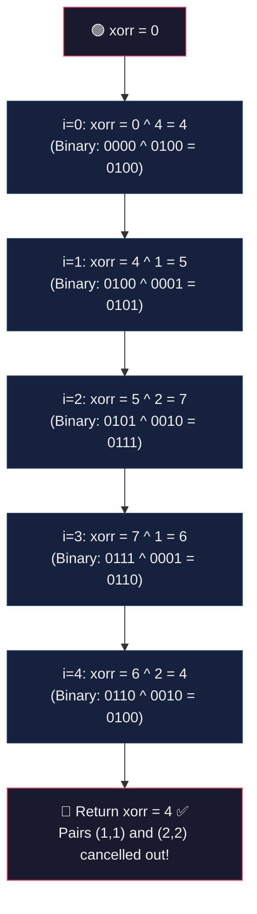
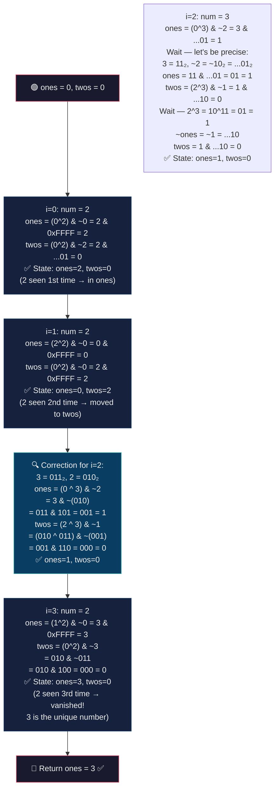
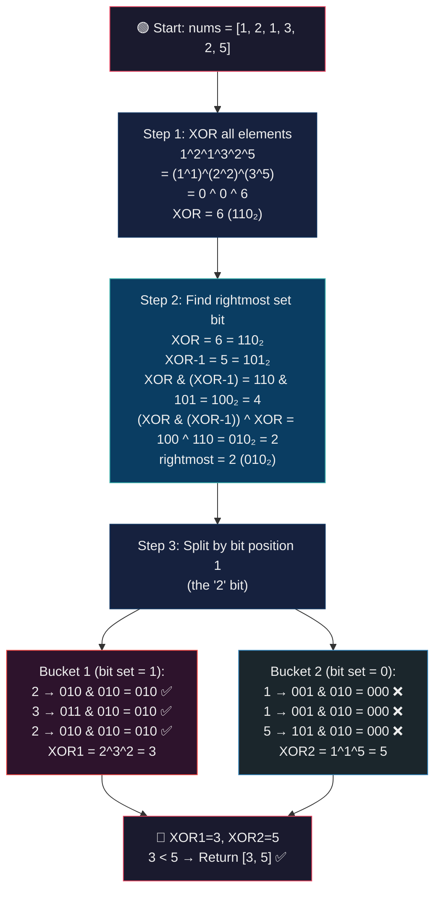

# 🔧 Bit Manipulation – Problems Master Revision Guide

> **Source:** `problems1.cpp`
> Covers: Binary Conversion, Minimum Bit Flips, Single Number I / II / III

---

## 📑 Table of Contents

| # | Problem | Core Technique |
|---|---------|---------------|
| 1 | [Decimal to Binary Conversion](#1-decimal-to-binary-conversion) | Right shift + AND |
| 2 | [Minimum Bit Flips to Convert Number](#2-minimum-bit-flips-to-convert-number) | XOR + Count set bits |
| 3 | [Single Number – I](#3-single-number--i) | XOR all elements |
| 4 | [Single Number – II](#4-single-number--ii) | Ones / Twos buckets |
| 5 | [Single Number – III](#5-single-number--iii) | XOR + Rightmost set bit split |

---

## 1. Decimal to Binary Conversion

### Problem Statement

Given a positive integer `n`, convert it to its binary representation (as a string).

**Example:** `n = 13` → Binary = `1101`

---

### Intuition & Strategy

**Key Insight:** The last bit of any integer tells you whether it's odd or even.

1. `n & 1` extracts the **least significant bit** (LSB) — it gives `1` if odd, `0` if even.
2. `n >> 1` right-shifts the number by 1, effectively **dividing by 2** and discarding the LSB.
3. We repeat this until `n` becomes `0`.

**Why this works:** Binary representation *is* the sequence of remainders when you divide by 2 repeatedly. `n & 1` *is* `n % 2`, and `n >> 1` *is* `n / 2`. We build the string by prepending/appending bits.

> ⚠️ **Note:** The code as written builds the binary string in **reverse** order (LSB first). To get the correct representation, you'd reverse the string. This is a common interview follow-up.

**Pattern to remember:** Extracting bits one by one → `& 1` then `>> 1` in a loop.

---

### The Code

```cpp
#include <iostream>
using namespace std;

int main()
{
    int n = 1084739;
    string binary = "";

    while (n > 0)
    {
        // Extract the last bit (0 or 1) and append to string
        binary = binary + (to_string(n & 1));

        // Right shift: discard the last bit, move to the next
        n = n >> 1;
    }

    // Note: 'binary' is in reverse order (LSB first)
    cout << binary << endl;

    return 0;
}
```

---

### Visual Dry Run

**Input:** `n = 13`



---

### Complexity Analysis

| Metric | Value | Explanation |
|--------|-------|-------------|
| **Time** | **O(log n)** | Each iteration divides `n` by 2. Total iterations = number of bits = `⌊log₂(n)⌋ + 1`. |
| **Space** | **O(log n)** | The binary string stores one character per bit. |

---
---

## 2. Minimum Bit Flips to Convert Number

### Problem Statement

Given two integers `start` and `goal`, return the **minimum number of bit flips** required to convert `start` into `goal`.

**Example:** `start = 10` (1010₂), `goal = 7` (0111₂) → **Output: 3**

---

### Intuition & Strategy

**The Aha Moment:** Where do `start` and `goal` *differ*? Exactly at the positions where their bits are different. And **XOR** is the operation that gives `1` precisely at positions where two bits differ.

**Strategy:**
1. Compute `num = start ^ goal`. Every `1`-bit in `num` marks a position that needs flipping.
2. **Count the number of `1`s** in `num` — that's the answer.

**Why XOR?**
| start bit | goal bit | XOR result | Flip needed? |
|-----------|----------|------------|-------------|
| 0 | 0 | 0 | No |
| 0 | 1 | 1 | Yes |
| 1 | 0 | 1 | Yes |
| 1 | 1 | 0 | No |

XOR literally answers "are these bits different?" for every position simultaneously.

**Counting set bits:** We check each of the 32 bits (for a 32-bit integer) using `num & 1` and then right-shift.

**Pattern to remember:** "Different bits" = XOR → count set bits.

---

### The Code

```cpp
class Solution
{
public:
    int minBitsFlip(int start, int goal)
    {
        // XOR highlights all differing bit positions
        int num = start ^ goal;

        int count = 0;

        // Check each of the 32 bits
        for (int i = 0; i < 32; i++)
        {
            // If current LSB is 1, it's a differing bit
            count += (num & 1);

            // Move to the next bit
            num = num >> 1;
        }
        return count;
    }
};
```

---

### Visual Dry Run

**Input:** `start = 10`, `goal = 7`



---

### Complexity Analysis

| Metric | Value | Explanation |
|--------|-------|-------------|
| **Time** | **O(1)** | Always loops exactly 32 times (constant for 32-bit integers). |
| **Space** | **O(1)** | Only a few integer variables used. |

---
---

## 3. Single Number – I

### Problem Statement

Given an array where **every element appears twice except one**, find the element that appears **only once**.

**Example:** `nums = [4, 1, 2, 1, 2]` → **Output: 4**

---

### Intuition & Strategy

**The Magic of XOR — Three Properties:**

| Property | Expression | Meaning |
|----------|-----------|---------|
| Self-cancel | `a ^ a = 0` | XOR of a number with itself is 0 |
| Identity | `a ^ 0 = a` | XOR with 0 gives the number back |
| Commutative + Associative | `a ^ b ^ a = b` | Order doesn't matter, pairs cancel |

**Strategy:** XOR *all* elements together.

- Every number that appears **twice** will cancel itself out: `a ^ a = 0`.
- The single unique number survives: `0 ^ unique = unique`.

**Why not use a hash map?** You could, but it takes O(n) space. XOR gives O(1) space — this is the optimal solution.

**Pattern to remember:** "Find the lone element among pairs" → XOR everything.

---

### The Code

```cpp
class Solution
{
public:
    int singleNumber(vector<int> &nums)
    {
        int xorr = 0;

        // XOR all elements — pairs cancel, unique survives
        for (int i = 0; i < nums.size(); i++)
        {
            xorr = xorr ^ nums[i];
        }
        return xorr;
    }
};
```

---

### Visual Dry Run

**Input:** `nums = [4, 1, 2, 1, 2]`



---

### Complexity Analysis

| Metric | Value | Explanation |
|--------|-------|-------------|
| **Time** | **O(n)** | Single pass through the array. |
| **Space** | **O(1)** | Only one variable `xorr` used. |

---
---

## 4. Single Number – II

### Problem Statement

Given an array where **every element appears three times except one**, find the element that appears **only once**.

**Example:** `nums = [2, 2, 3, 2]` → **Output: 3**

---

### Intuition & Strategy

**Why XOR alone fails:** XOR cancels pairs (`a ^ a = 0`), but three occurrences give `a ^ a ^ a = a` — the triple *doesn't* cancel! We need a smarter approach.

**The "Ones–Twos" Bucket Method (State Machine):**

Think of tracking how many times each bit has appeared, modulo 3:

| Appearances (mod 3) | `ones` | `twos` | State |
|---------------------|--------|--------|-------|
| 0 times | 0 | 0 | Clean |
| 1 time | 1 | 0 | In ones |
| 2 times | 0 | 1 | In twos |
| 3 times | 0 | 0 | Reset! |

**The two magic lines:**
```
ones = (ones ^ nums[i]) & ~twos;
twos = (twos ^ nums[i]) & ~ones;
```

**Breaking it down step by step:**

1. `ones ^ nums[i]` — tentatively add the number to `ones` (toggle).
2. `& ~twos` — but **remove** it from `ones` if it's already in `twos` (prevents counting twice).
3. `twos ^ nums[i]` — tentatively add the number to `twos`.
4. `& ~ones` — but **remove** it from `twos` if it's already been promoted back to `ones` (on the 3rd occurrence, both `ones` and `twos` go to 0 — the number vanishes!).

**State transitions per number occurrence:**
- **1st time:** Goes into `ones`, not in `twos`. *(ones=1, twos=0)*
- **2nd time:** Leaves `ones`, goes into `twos`. *(ones=0, twos=1)*
- **3rd time:** Leaves `twos` too — completely gone! *(ones=0, twos=0)*

After processing all elements, `ones` holds the number that appeared exactly once.

**Pattern to remember:** "Triplets cancel, find the loner" → Two-bucket state machine (ones, twos) with `& ~other` masking.

---

### The Code

```cpp
class Solution
{
public:
    int singleNumber(vector<int> &nums)
    {
        // Two state-tracking variables
        int ones = 0, twos = 0;

        for (int i = 0; i < nums.size(); i++)
        {
            // Add to ones if NOT already in twos
            ones = (ones ^ nums[i]) & ~twos;

            // Add to twos if NOT already in (updated) ones
            twos = (twos ^ nums[i]) & ~ones;
        }

        // 'ones' contains the single unique number
        return ones;
    }
};
```

---

### Visual Dry Run

**Input:** `nums = [2, 2, 3, 2]`



---

### Complexity Analysis

| Metric | Value | Explanation |
|--------|-------|-------------|
| **Time** | **O(n)** | Single pass through the array. |
| **Space** | **O(1)** | Only two integer variables (`ones`, `twos`). |

---
---

## 5. Single Number – III

### Problem Statement

Given an array where **every element appears twice except two elements**, find the **two elements** that appear only once. Return them in sorted order.

**Example:** `nums = [1, 2, 1, 3, 2, 5]` → **Output: [3, 5]**

---

### Intuition & Strategy

**Challenge:** Simple XOR of everything gives `a ^ b` (where `a`, `b` are the two unique numbers). But we can't separate `a` and `b` from this combined result directly.

**The Breakthrough — Use a Differentiating Bit:**

Since `a ≠ b`, their XOR `a ^ b` has **at least one bit set to 1**. That bit is a position where `a` and `b` *differ*. We use this bit to split the array into two groups:
- **Group 1:** Numbers where that bit is `1` (contains one of the unique numbers).
- **Group 2:** Numbers where that bit is `0` (contains the other unique number).

Every paired number goes into the **same group** (both copies have the same bit), so within each group, pairs cancel and the unique number survives.

**Step-by-step algorithm:**
1. **XOR all elements** → Get `XOR = a ^ b`.
2. **Find the rightmost set bit** of `XOR` using the formula: `rightmost = (XOR & (XOR - 1)) ^ XOR`.
   - `XOR & (XOR - 1)` clears the rightmost set bit.
   - XOR-ing with original `XOR` isolates just that bit.
3. **Partition & XOR:** Split elements into two buckets based on whether `nums[i] & rightmost` is set or not. XOR within each bucket.
4. **Result:** Each bucket's XOR yields one unique number.

**Why the rightmost set bit trick works:**
| Expression | Effect |
|-----------|--------|
| `XOR - 1` | Flips all bits from rightmost set bit to the right |
| `XOR & (XOR - 1)` | Clears the rightmost set bit |
| `(XOR & (XOR-1)) ^ XOR` | Isolates only the rightmost set bit |

**Pattern to remember:** "Two unique among pairs" → XOR all → find a differentiating bit → split into two Single-Number-I problems.

---

### The Code

```cpp
class Solution
{
public:
    vector<int> singleNumber(vector<int> &nums)
    {
        int n = nums.size();

        // Step 1: XOR all elements → a ^ b
        long XOR = 0;
        for (int i = 0; i < n; i++)
        {
            XOR = XOR ^ nums[i];
        }

        // Step 2: Isolate the rightmost set bit
        // This bit is where 'a' and 'b' differ
        int rightmost = (XOR & (XOR - 1)) ^ XOR;

        // Step 3: Split into two buckets and XOR within each
        int XOR1 = 0, XOR2 = 0;
        for (int i = 0; i < n; i++)
        {
            if (nums[i] & rightmost)
            {
                // Bucket 1: bit is set
                XOR1 = XOR1 ^ nums[i];
            }
            else
            {
                // Bucket 2: bit is not set
                XOR2 = XOR2 ^ nums[i];
            }
        }

        // Return in sorted order
        if (XOR1 < XOR2)
            return {XOR1, XOR2};
        return {XOR2, XOR1};
    }
};
```

---

### Visual Dry Run

**Input:** `nums = [1, 2, 1, 3, 2, 5]`



---

### Complexity Analysis

| Metric | Value | Explanation |
|--------|-------|-------------|
| **Time** | **O(n)** | Two linear passes: one to compute XOR, one to partition. |
| **Space** | **O(1)** | Only a fixed number of integer variables. |

---
---

## 🧠 Quick Revision Cheat Sheet

| Problem | Key Technique | One-Line Reminder |
|---------|--------------|-------------------|
| Decimal → Binary | `& 1`, `>> 1` loop | Extract LSB, shift right, repeat |
| Min Bit Flips | `start ^ goal` → count 1s | XOR shows differences, count them |
| Single Number I | XOR all | Pairs cancel, loner survives |
| Single Number II | `ones`/`twos` state machine | Track bit counts mod 3 |
| Single Number III | XOR all → split by rightmost bit → two sub-problems | Reduce to two Single-Number-I problems |

> **Golden Rule of Bit Manipulation:** When the problem says "appears twice/paired" → think **XOR**. When it says "find the different" → think **XOR**. XOR is the Swiss Army knife of bit problems.
