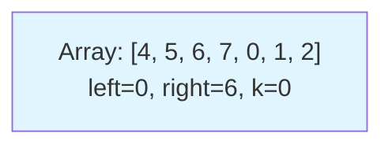
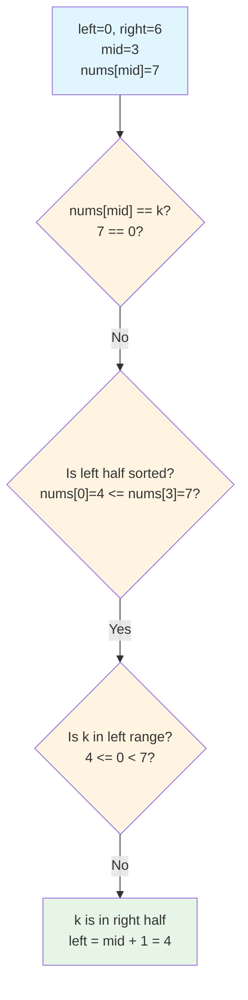
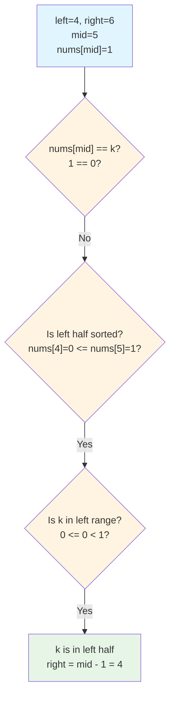

# Search in Rotated Sorted Array - Complete Guide

## 📚 Problem Understanding

### What is a Rotated Sorted Array?

Imagine you have a sorted array like `[0, 1, 2, 4, 5, 6, 7]`. Now, someone picks a random pivot point and rotates the array:

```
Original: [0, 1, 2, 4, 5, 6, 7]
                    ↑ pivot
After rotating at index 3: [4, 5, 6, 7, 0, 1, 2]
```

The array is still "sorted" but in two parts:
- Left part: `[4, 5, 6, 7]` - sorted
- Right part: `[0, 1, 2]` - sorted

### Key Observation 🔑

**At least one half of the array is always sorted!**

When we pick a middle element, either:
- The left half is sorted, OR
- The right half is sorted

This is our key insight for solving the problem efficiently.

---

## 💡 The Approach

### Why Not Linear Search?
We could scan every element (O(n) time), but we can do better!

### Binary Search with a Twist
Since the array has sorted portions, we can use **modified binary search** in O(log n) time.

**Strategy:**
1. Find the middle element
2. Determine which half is sorted
3. Check if target is in the sorted half
4. Narrow down the search space

---

## 💻 Code Implementation

```cpp
class Solution
{
public:
    /**
     * Search for target k in rotated sorted array
     * Time Complexity: O(log n)
     * Space Complexity: O(1)
     */
    int search(vector<int> &nums, int k)
    {
        int left = 0;
        int right = nums.size() - 1;

        while (left <= right)
        {
            int mid = left + (right - left) / 2;

            // Found the target!
            if (nums[mid] == k)
            {
                return mid;
            }

            // Determine which half is sorted
            if (nums[left] <= nums[mid])
            {
                // Left half is sorted
                if (nums[left] <= k && k < nums[mid])
                {
                    // Target is in the sorted left half
                    right = mid - 1;
                }
                else
                {
                    // Target is in the right half
                    left = mid + 1;
                }
            }
            else
            {
                // Right half is sorted
                if (nums[mid] < k && k <= nums[right])
                {
                    // Target is in the sorted right half
                    left = mid + 1;
                }
                else
                {
                    // Target is in the left half
                    right = mid - 1;
                }
            }
        }

        // Target not found
        return -1;
    }
};
```

### Code Breakdown

#### Step 1: Initialize Pointers
```cpp
int left = 0;
int right = nums.size() - 1;
```
We use two pointers to define our search space.

#### Step 2: Binary Search Loop
```cpp
while (left <= right)
{
    int mid = left + (right - left) / 2;
```
- Continue until search space is exhausted
- Calculate middle index safely (avoids integer overflow)

#### Step 3: Check Middle Element
```cpp
if (nums[mid] == k)
{
    return mid;
}
```
If we found the target, return immediately!

#### Step 4: Identify Sorted Half
```cpp
if (nums[left] <= nums[mid])
{
    // Left half is sorted
}
```
**How do we know?** If `nums[left] <= nums[mid]`, then all elements from `left` to `mid` are in ascending order.

#### Step 5: Search Logic
We have four cases:

**Case 1: Left half is sorted AND target is in left range**
```cpp
if (nums[left] <= k && k < nums[mid])
{
    right = mid - 1;  // Search left half
}
```

**Case 2: Left half is sorted BUT target is NOT in left range**
```cpp
else
{
    left = mid + 1;  // Search right half
}
```

**Case 3: Right half is sorted AND target is in right range**
```cpp
if (nums[mid] < k && k <= nums[right])
{
    left = mid + 1;  // Search right half
}
```

**Case 4: Right half is sorted BUT target is NOT in right range**
```cpp
else
{
    right = mid - 1;  // Search left half
}
```

---

## 🎯 Dry Run Example

Let's trace through: `nums = [4, 5, 6, 7, 0, 1, 2]`, `k = 0`

### Initial State



### Iteration 1



**Array visualization:**
```
Index:  0  1  2  3  4  5  6
Array: [4, 5, 6, 7, 0, 1, 2]
        ^        ^           ^
       left     mid        right

Left half [4,5,6,7] is sorted
Target 0 is NOT in range [4,7)
Move to right half
```

### Iteration 2



**Array visualization:**
```
Index:  0  1  2  3  4  5  6
Array: [4, 5, 6, 7, 0, 1, 2]
                    ^  ^  ^
                   left mid right

Left half [0,1] is sorted
Target 0 IS in range [0,1)
Move to left half
```

### Iteration 3

```mermaid
graph TD
    A["left=4, right=4<br/>mid=4<br/>nums[mid]=0"] --> B{"nums[mid] == k?<br/>0 == 0?"}
    B -->|Yes!| C["🎉 Found at index 4!<br/>return 4"]
    
    style A fill:#e1f5ff
    style B fill:#fff4e1
    style C fill:#90ee90
```



**Array visualization:**
```
Index:  0  1  2  3  4  5  6
Array: [4, 5, 6, 7, 0, 1, 2]
                    ^
                left=mid=right

Found target at index 4!
```

### Complete Flow Diagram

```mermaid
graph TD
    Start["Start: [4,5,6,7,0,1,2], k=0"] --> I1["Iteration 1<br/>left=0, right=6, mid=3<br/>nums[3]=7"]
    I1 --> I1Check["Left sorted: [4,5,6,7]<br/>0 not in [4,7)"]
    I1Check --> I2["Iteration 2<br/>left=4, right=6, mid=5<br/>nums[5]=1"]
    I2 --> I2Check["Left sorted: [0,1]<br/>0 in [0,1)"]
    I2Check --> I3["Iteration 3<br/>left=4, right=4, mid=4<br/>nums[4]=0"]
    I3 --> Found["✅ Found at index 4"]
    
    style Start fill:#e1f5ff
    style Found fill:#90ee90
```



---

## 🤔 Think About It

Before moving forward, consider these questions:

1. **What happens if the array is not rotated at all?** (e.g., `[1, 2, 3, 4, 5]`)
   - Does our algorithm still work?

2. **What if the target is the smallest or largest element?**
   - Trace through with `k = 0` or `k = 7` in our example

3. **Why do we use `nums[left] <= nums[mid]` instead of `nums[left] < nums[mid]`?**
   - Hint: Think about arrays with duplicate values or single elements

---

## ⚡ Complexity Analysis

| Metric | Complexity | Explanation |
|--------|-----------|-------------|
| **Time** | O(log n) | Binary search halves the search space each iteration |
| **Space** | O(1) | Only using a few variables (left, right, mid) |

---

## 🎯 Example 2: Target Not Found

Let's trace: `nums = [4, 5, 6, 7, 0, 1, 2]`, `k = 3`

```mermaid
graph TD
    A["Iteration 1: mid=3, nums[3]=7<br/>Left sorted, 3 in [4,7)? No"] --> B["Iteration 2: mid=5, nums[5]=1<br/>Left sorted, 3 in [0,1)? No"]
    B --> C["Iteration 3: mid=4, nums[4]=0<br/>Right sorted, 3 in (0,4]? No"]
    C --> D["Iteration 4: left=5, right=4<br/>left > right"]
    D --> E["❌ Return -1<br/>Target not found"]
    
    style A fill:#e1f5ff
    style B fill:#e1f5ff
    style C fill:#e1f5ff
    style D fill:#ffe1e1
    style E fill:#ff9999
```



---

## 🚀 Key Takeaways

1. **Rotated array has two sorted portions**
2. **At each step, identify which half is sorted**
3. **Use range check to decide which half contains the target**
4. **Efficient O(log n) solution using modified binary search**

---

## 💪 Practice Exercise

Try modifying the algorithm to handle:
- Arrays with duplicate values
- Finding the minimum element in a rotated array
- Counting the number of rotations

Can you solve these variations?
