```mermaid
graph TD
    A["Input: [1, 0, 2, 1, 0]"] --> B["Step 1: Count Elements<br/>cnt0=2, cnt1=2, cnt2=1"]
    B --> C["Step 2: Place 0's<br/>Fill positions 0 to 2<br/>[0, 0, 2, 1, 0]"]
    C --> D["Step 3: Place 1's<br/>Fill positions 2 to 4<br/>[0, 0, 1, 1, 0]"]
    D --> E["Step 4: Place 2's<br/>Fill positions 4 to 5<br/>[0, 0, 1, 1, 2]"]
    E --> F["Output: [0, 0, 1, 1, 2] ✓"]

    style A fill:#7B1FA2,stroke:#4A148C,stroke-width:3px,color:#fff
    style B fill:#1976D2,stroke:#0D47A1,stroke-width:3px,color:#fff
    style C fill:#00796B,stroke:#004D40,stroke-width:3px,color:#fff
    style D fill:#00796B,stroke:#004D40,stroke-width:3px,color:#fff
    style E fill:#00796B,stroke:#004D40,stroke-width:3px,color:#fff
    style F fill:#2E7D32,stroke:#1B5E20,stroke-width:3px,color:#fff
```

```mermaid
graph TD
    A["Input: [1, 0, 2, 1, 0]<br/>low=0, mid=0, high=4"] --> B["mid=0: nums[0]=1<br/>Move mid++<br/>Array: [1, 0, 2, 1, 0]"]
    B --> C["mid=1: nums[1]=0<br/>Swap(0,1), low++, mid++<br/>Array: [0, 1, 2, 1, 0]"]
    C --> D["mid=2: nums[2]=2<br/>Swap(2,4), high--<br/>Array: [0, 1, 0, 1, 2]"]
    D --> E["mid=2: nums[2]=0<br/>Swap(1,2), low++, mid++<br/>Array: [0, 0, 1, 1, 2]"]
    E --> F["mid=3: nums[3]=1<br/>Move mid++<br/>Array: [0, 0, 1, 1, 2]"]
    F --> G["mid=4 > high=3<br/>Loop exits"]
    G --> H["Output: [0, 0, 1, 1, 2] ✓"]

    style A fill:#7B1FA2,stroke:#4A148C,stroke-width:3px,color:#fff
    style B fill:#1976D2,stroke:#0D47A1,stroke-width:3px,color:#fff
    style C fill:#2E7D32,stroke:#1B5E20,stroke-width:3px,color:#fff
    style D fill:#F57C00,stroke:#E65100,stroke-width:3px,color:#fff
    style E fill:#2E7D32,stroke:#1B5E20,stroke-width:3px,color:#fff
    style F fill:#1976D2,stroke:#0D47A1,stroke-width:3px,color:#fff
    style G fill:#D32F2F,stroke:#B71C1C,stroke-width:3px,color:#fff
    style H fill:#2E7D32,stroke:#1B5E20,stroke-width:3px,color:#fff
```

# Array Problems: Questions 11-13

## 📋 Table of Contents

1. [Problem 11: Sort Array of 0's, 1's and 2's](#problem-11-sort-array-of-0s-1s-and-2s)
2. [Problem 12: Kadane's Algorithm (Maximum Subarray Sum)](#problem-12-kadanes-algorithm-maximum-subarray-sum)
3. [Problem 13: Next Permutation](#problem-13-next-permutation)

---

## Problem 11: Sort Array of 0's, 1's and 2's

### Problem Statement

Given an array `nums` consisting of only 0, 1, or 2. Sort the array in non-decreasing order.

**Constraints:**
- The sorting must be done **in-place**, without making a copy of the original array
- Only contains values 0, 1, or 2

**Example:**
```
Input: nums = [1, 0, 2, 1, 0]
Output: [0, 0, 1, 1, 2]

Explanation: The nums array in sorted order has 2 zeroes, 2 ones and 1 two
```

---

### Approach 1: Brute Force (Standard Sort)

#### Explanation

Use the standard sorting function `std::sort` to sort the entire array. This is the simplest approach but not optimal for this specific problem where we know only three distinct values exist.

**Algorithm:**
1. Call `std::sort()` on the entire array
2. Let the sorting algorithm handle the arrangement

#### Code

```cpp
class Solution {
public:
    void sortZeroOneTwo(vector<int> &nums) {
        // Sort the vector using std::sort
        sort(nums.begin(), nums.end());
    }
};
```

#### Complexity Analysis

- **Time Complexity:** O(N log N) - Standard comparison-based sorting algorithm
- **Space Complexity:** O(1) - In-place sorting (excluding internal recursion stack)

#### Dry Run with Visual

**Input:** `nums = [1, 0, 2, 1, 0]`

```
Before sorting: [1, 0, 2, 1, 0]

std::sort applies comparison-based sorting:
- Compares and arranges elements in ascending order

After sorting: [0, 0, 1, 1, 2]
```

**Visual Mermaid Diagram:**


---

### Approach 2: Better (Counting Approach)

#### Explanation

Since we know the array contains only 0, 1, and 2, we can:
1. **Count** the occurrences of each element (0s, 1s, 2s)
2. **Overwrite** the array with the correct number of 0s, then 1s, then 2s

This approach avoids comparison-based sorting and directly reconstructs the sorted array.

**Algorithm:**
1. Traverse the array and count occurrences of 0, 1, and 2
2. Overwrite first `cnt0` positions with 0
3. Overwrite next `cnt1` positions with 1
4. Overwrite remaining `cnt2` positions with 2

#### Code

```cpp
class Solution {
public:
    void sortZeroOneTwo(vector<int> &nums) {
        int cnt0 = 0, cnt1 = 0, cnt2 = 0;

        // Counting the number of 0s, 1s, and 2s in the array
        for (int i = 0; i < nums.size(); i++) {
            if (nums[i] == 0)
                cnt0++;
            else if (nums[i] == 1)
                cnt1++;
            else
                cnt2++;
        }

        // Placing the elements in the original array based on counts
        // Placing 0's
        for (int i = 0; i < cnt0; i++)
            nums[i] = 0;

        // Placing 1's
        for (int i = cnt0; i < cnt0 + cnt1; i++)
            nums[i] = 1;

        // Placing 2's
        for (int i = cnt0 + cnt1; i < nums.size(); i++)
            nums[i] = 2;
    }
};
```

#### Complexity Analysis

- **Time Complexity:** O(N) - One pass to count (O(N)) + Three passes to fill (O(N)) = O(3N) = O(N)
- **Space Complexity:** O(1) - Only three counter variables used, array modified in-place

#### Dry Run with Visual

**Input:** `nums = [1, 0, 2, 1, 0]`

```
Step 1: Count occurrences
Traverse: [1, 0, 2, 1, 0]
- nums[0]=1 → cnt1++
- nums[1]=0 → cnt0++
- nums[2]=2 → cnt2++
- nums[3]=1 → cnt1++
- nums[4]=0 → cnt0++

Result: cnt0 = 2, cnt1 = 2, cnt2 = 1

Step 2: Place 0's
Place cnt0=2 zeros in positions [0, 2):
nums = [0, 0, 2, 1, 0]

Step 3: Place 1's
Place cnt1=2 ones in positions [2, 4):
nums = [0, 0, 1, 1, 0]

Step 4: Place 2's
Place cnt2=1 twos in positions [4, 5):
nums = [0, 0, 1, 1, 2]

Final: [0, 0, 1, 1, 2]
```

**Visual Mermaid Diagram:**



---

### Approach 3: Optimal (Dutch National Flag Algorithm - 3 Pointers)

#### Explanation

This approach uses the **Dutch National Flag** algorithm with three pointers:
- **low:** Boundary for 0s (marks the rightmost 0)
- **mid:** Current element being processed
- **high:** Boundary for 2s (marks the leftmost 2)

**Key Logic:**
1. If `nums[mid] == 0`: Swap with `low`, move both `low` and `mid` forward
2. If `nums[mid] == 1`: Just move `mid` forward (1 is in correct region)
3. If `nums[mid] == 2`: Swap with `high`, move `high` backward (don't move `mid` yet, as swapped element needs checking)

**Why it works:**
- Elements before `low` are guaranteed to be 0
- Elements between `low` and `mid` are guaranteed to be 1
- Elements after `high` are guaranteed to be 2
- When we swap a 2 from the right, we need to check the swapped element

#### Code

```cpp
class Solution {
public:
    void sortZeroOneTwo(vector<int> &nums) {
        int n = nums.size();
        int low = 0;
        int high = n - 1;
        int mid = 0;

        while (mid <= high) {
            if (nums[mid] == 0) {
                // Swap nums[low] and nums[mid], then
                // move both low and mid pointers forward
                swap(nums[low], nums[mid]);
                low++;
                mid++;
            }
            else if (nums[mid] == 1) {
                // Move mid pointer forward
                mid++;
            }
            else {
                // Swap nums[mid] and nums[high],
                // then move high pointer backward
                swap(nums[mid], nums[high]);
                high--;
            }
        }
    }
};
```

#### Complexity Analysis

- **Time Complexity:** O(N) - Single pass through array, each element is visited once
- **Space Complexity:** O(1) - Only three pointer variables, array modified in-place

#### Dry Run with Visual

**Input:** `nums = [1, 0, 2, 1, 0]`

```
Initial state:
Array:  [1, 0, 2, 1, 0]
        low=0, mid=0, high=4

Step 1: mid=0 (nums[0]=1)
- nums[mid]=1 → move mid++
Array:  [1, 0, 2, 1, 0]
        low=0, mid=1, high=4

Step 2: mid=1 (nums[1]=0)
- nums[mid]=0 → swap(low, mid), low++, mid++
- Swap nums[0] and nums[1]
Array:  [0, 1, 2, 1, 0]
        low=1, mid=2, high=4

Step 3: mid=2 (nums[2]=2)
- nums[mid]=2 → swap(mid, high), high--
- Swap nums[2] and nums[4]
Array:  [0, 1, 0, 1, 2]
        low=1, mid=2, high=3
- Note: mid doesn't increment (need to check swapped element)

Step 4: mid=2 (nums[2]=0)
- nums[mid]=0 → swap(low, mid), low++, mid++
- Swap nums[1] and nums[2]
Array:  [0, 0, 1, 1, 2]
        low=2, mid=3, high=3

Step 5: mid=3 (nums[3]=1)
- nums[mid]=1 → move mid++
Array:  [0, 0, 1, 1, 2]
        low=2, mid=4, high=3

Loop exits: mid > high (4 > 3)

Final: [0, 0, 1, 1, 2] ✓
```

**Pointer Movement Visualization:**

```
Start:    [1, 0, 2, 1, 0]
          L  M        H

Step 1:   [1, 0, 2, 1, 0]  (mid=1, move mid)
             L  M     H

Step 2:   [0, 1, 2, 1, 0]  (swap 1 and 0, move low & mid)
             L     M     H

Step 3:   [0, 1, 0, 1, 2]  (swap 2 and 0, move high, not mid)
             L  M     H

Step 4:   [0, 0, 1, 1, 2]  (swap 0 and 1, move low & mid)
                L  M  H

Step 5:   [0, 0, 1, 1, 2]  (1 in correct place, move mid)
                   L  M=H

Done:     [0, 0, 1, 1, 2]
```

**Visual Mermaid Diagram:**



#### Comparison Table

| Approach | Time | Space | Notes |
|----------|------|-------|-------|
| Brute Force | O(N log N) | O(1) | Uses standard sorting |
| Counting | **O(N)** | O(1) | Leverages 3 distinct values |
| Dutch Flag | **O(N)** | O(1) | **Best - Single pass with pointers** |

---

## Problem 12: Kadane's Algorithm (Maximum Subarray Sum)

### Problem Statement

Given an integer array `nums`, find the subarray with the **largest sum** and return the sum of the elements present in that subarray.

**Constraints:**
- A subarray is a contiguous non-empty sequence of elements within an array
- Need to find the maximum sum

**Example:**
```
Input: nums = [2, 3, 5, -2, 7, -4]
Output: 15

Explanation: The subarray from index 0 to index 4 [2, 3, 5, -2, 7] has the largest sum = 15
```

---

### Approach 1: Brute Force (3 Nested Loops)

#### Explanation

Generate all possible subarrays by:
1. **Outer loop (i):** Start index of subarray
2. **Middle loop (j):** End index of subarray
3. **Inner loop (k):** Calculate sum of subarray `[i...j]`

Track the maximum sum found across all subarrays.

**Algorithm:**
1. For each starting position `i`
2. For each ending position `j >= i`
3. Calculate sum of elements from `i` to `j`
4. Update maximum if current sum is larger

#### Code

```cpp
class Solution {
public:
    int maxSubArray(vector<int> &nums) {
        // Initialize maximum sum with the smallest possible integer
        int maxi = INT_MIN;

        // Iterate over each starting index of subarrays
        for (int i = 0; i < nums.size(); i++) {
            // Iterate over each ending index of subarrays starting from i
            for (int j = i; j < nums.size(); j++) {
                // Variable to store the sum of the current subarray
                int sum = 0;

                // Calculate the sum of subarray nums[i...j]
                for (int k = i; k <= j; k++) {
                    sum += nums[k];
                }

                // Update maxi with the maximum of its current
                // value and the sum of the current subarray
                maxi = max(maxi, sum);
            }
        }

        // Return the maximum subarray sum found
        return maxi;
    }
};
```

#### Complexity Analysis

- **Time Complexity:** O(N³) - Three nested loops iterate over all elements
- **Space Complexity:** O(1) - Only variables used, no extra space

#### Dry Run with Visual

**Input:** `nums = [2, 3, 5, -2, 7]`

```
Subarray generation:
i=0: [2]=2, [2,3]=5, [2,3,5]=10, [2,3,5,-2]=8, [2,3,5,-2,7]=15 ← max so far
i=1: [3]=3, [3,5]=8, [3,5,-2]=6, [3,5,-2,7]=13
i=2: [5]=5, [5,-2]=3, [5,-2,7]=10
i=3: [-2]=-2, [-2,7]=5
i=4: [7]=7

Maximum subarray sum found: 15
```

---

### Approach 2: Better (2 Nested Loops)

#### Explanation

Optimize by eliminating the innermost loop:
1. **Outer loop (i):** Start index
2. **Middle loop (j):** End index
3. **Optimization:** Maintain running sum instead of recalculating

For each start position `i`, incrementally add elements to sum as `j` increases.

**Algorithm:**
1. For each starting position `i`
2. Initialize sum to 0
3. For each ending position `j >= i`
   - Add `nums[j]` to running sum
   - Update maximum

#### Code

```cpp
class Solution {
public:
    int maxSubArray(vector<int> &nums) {
        // Initialize maximum sum with the smallest possible integer
        int maxi = INT_MIN;

        // Iterate over each starting index of subarrays
        for (int i = 0; i < nums.size(); i++) {
            // Variable to store the sum of the current subarray
            int sum = 0;

            // Iterate over each ending index of subarrays starting from i
            for (int j = i; j < nums.size(); j++) {
                // Add the current element nums[j] to the sum
                sum += nums[j];

                // Update maxi with the maximum of its current
                // value and the sum of the current subarray
                maxi = max(maxi, sum);
            }
        }

        // Return the maximum subarray sum found
        return maxi;
    }
};
```

#### Complexity Analysis

- **Time Complexity:** O(N²) - Two nested loops
- **Space Complexity:** O(1) - Only variables used

#### Dry Run with Visual

**Input:** `nums = [2, 3, 5, -2, 7]`

```
i=0, sum=0:
  j=0: sum=0+2=2, maxi=2
  j=1: sum=2+3=5, maxi=5
  j=2: sum=5+5=10, maxi=10
  j=3: sum=10+(-2)=8, maxi=10
  j=4: sum=8+7=15, maxi=15 ← Current max

i=1, sum=0:
  j=1: sum=0+3=3, maxi=15
  j=2: sum=3+5=8, maxi=15
  j=3: sum=8+(-2)=6, maxi=15
  j=4: sum=6+7=13, maxi=15

i=2, sum=0:
  j=2: sum=0+5=5, maxi=15
  j=3: sum=5+(-2)=3, maxi=15
  j=4: sum=3+7=10, maxi=15

i=3, sum=0:
  j=3: sum=0+(-2)=-2, maxi=15
  j=4: sum=(-2)+7=5, maxi=15

i=4, sum=0:
  j=4: sum=0+7=7, maxi=15

Result: 15
```

---

### Approach 3: Optimal (Kadane's Algorithm)

#### Explanation

**Kadane's Algorithm** is a dynamic programming approach that tracks:
- **Current sum:** Sum of subarray ending at current position
- **Maximum sum:** Best sum found so far
- **Tracking indices:** Start and end positions of max subarray

**Key Idea:**
- If current sum becomes negative, reset it to 0 (start fresh from next element)
- If current sum exceeds maximum, update maximum
- Track start and end indices of the maximum subarray

**Algorithm:**
1. Initialize `maxi = INT_MIN`, `sum = 0`, tracking variables
2. For each element:
   - Record start index when sum resets
   - Add current element to sum
   - Update maximum if current sum is greater
   - If sum becomes negative, reset to 0

#### Code

```cpp
class Solution {
public:
    int maxSubArray(vector<int> &nums) {
        // Maximum sum
        long long maxi = LLONG_MIN;

        // Current sum of subarray
        long long sum = 0;

        // Starting index of current subarray
        int start = 0;

        // Indices of the maximum sum subarray
        int ansStart = -1, ansEnd = -1;

        // Iterate through the array
        for (int i = 0; i < nums.size(); i++) {
            // Update starting index if sum is reset
            if (sum == 0) {
                start = i;
            }

            // Add current element to the sum
            sum += nums[i];

            // Update maxi and subarray indices if current sum is greater
            if (sum > maxi) {
                maxi = sum;
                ansStart = start;
                ansEnd = i;
            }

            // Reset sum to 0 if it becomes negative
            if (sum < 0) {
                sum = 0;
            }
        }

        // Printing the subarray
        cout << "The subarray is: [";
        for (int i = ansStart; i <= ansEnd; i++) {
            cout << nums[i] << " ";
        }
        cout << "]" << endl;

        // Return the maximum subarray sum found
        return maxi;
    }
};
```

#### Complexity Analysis

- **Time Complexity:** O(N) - Single pass through array
- **Space Complexity:** O(1) - Only tracking variables, no extra space

#### Dry Run with Visual

**Input:** `nums = [2, 3, 5, -2, 7, -4]`

```
Iteration 1: i=0, nums[0]=2
- sum==0 → start=0
- sum = 0+2 = 2
- 2 > INT_MIN → maxi=2, ansStart=0, ansEnd=0
- 2 > 0 → no reset

Iteration 2: i=1, nums[1]=3
- sum != 0 → start unchanged
- sum = 2+3 = 5
- 5 > 2 → maxi=5, ansStart=0, ansEnd=1
- 5 > 0 → no reset

Iteration 3: i=2, nums[2]=5
- sum != 0 → start unchanged
- sum = 5+5 = 10
- 10 > 5 → maxi=10, ansStart=0, ansEnd=2
- 10 > 0 → no reset

Iteration 4: i=3, nums[3]=-2
- sum != 0 → start unchanged
- sum = 10+(-2) = 8
- 8 < 10 → no update
- 8 > 0 → no reset

Iteration 5: i=4, nums[4]=7
- sum != 0 → start unchanged
- sum = 8+7 = 15
- 15 > 10 → maxi=15, ansStart=0, ansEnd=4
- 15 > 0 → no reset

Iteration 6: i=5, nums[5]=-4
- sum != 0 → start unchanged
- sum = 15+(-4) = 11
- 11 < 15 → no update
- 11 > 0 → no reset

Maximum subarray: [2, 3, 5, -2, 7]
Result: 15
```

**Visual Mermaid Diagram:**


#### Comparison Table

| Approach | Time | Space | Notes |
|----------|------|-------|-------|
| Brute Force | O(N³) | O(1) | Recalculates sums |
| Better | O(N²) | O(1) | Cumulative sums |
| Kadane's | **O(N)** | O(1) | **Best - Single pass** |

---

## Problem 13: Next Permutation

### Problem Statement

Given an array of integers, find the **next lexicographically greater permutation** of the array.

**Constraints:**
- If the array is the last permutation (descending order), rearrange to the lowest order
- Must rearrange in-place with only constant extra memory

**Example:**
```
Input: nums = [1, 2, 3]
Output: [1, 3, 2]

Explanation: The next permutation of [1,2,3] is [1,3,2]
```

---

### Approach 1: Brute Force (Generate All Permutations)

#### Explanation

Generate all permutations in lexicographical order:
1. Use backtracking to generate all permutations
2. Sort them in lexicographical order
3. Find the current permutation in the sorted list
4. Return the next permutation (or first if already at last)

**Algorithm:**
1. Generate all N! permutations recursively
2. Sort the permutations lexicographically
3. Find index of current permutation using linear search
4. Return next permutation (or first if at end)

#### Code

```cpp
class Solution {
public:
    void nextPermutation(vector<int> &nums) {
        // Get all the Permutations
        vector<vector<int>> ans = getAllPermutations(nums);

        int index = -1; // Current permutation index

        // Perform a linear search to get the permutation of current permutation
        for (int i = 0; i < ans.size(); i++) {
            if (nums == ans[i]) {
                index = i;
                break;
            }
        }

        // Store the next permutation in-place
        if (index == ans.size() - 1)
            nums = ans[0];
        else
            nums = ans[index + 1];

        return;
    }

private:
    // Function to generate all permutations of the given array in sorted order
    vector<vector<int>> getAllPermutations(vector<int> &nums) {
        vector<vector<int>> ans; // To store the permutation

        // Recursive Helper function call
        helperFunc(0, nums, ans);

        sort(ans.begin(), ans.end()); // Sort the permutations
        return ans;                   // Return the result
    }

    // Helper function to get all the permutations of the given array
    void helperFunc(int ind, vector<int> &nums,
                    vector<vector<int>> &ans) {

        // Base case
        if (ind == nums.size()) {
            // Add the permutation to the answer
            ans.push_back(nums);
            return;
        }

        // Traverse the array
        for (int i = ind; i < nums.size(); i++) {
            swap(nums[ind], nums[i]); // Swap-In

            // Recursively call the helper function
            helperFunc(ind + 1, nums, ans);

            swap(nums[ind], nums[i]); // Swap-Out
        }

        return;
    }
};
```

#### Complexity Analysis

- **Time Complexity:** O(N! × N log(N!)) - Generate N! permutations (O(N! × N)) + Sort (O(N! log(N!)))
- **Space Complexity:** O(N! × N) - Store all N! permutations, each of size N

#### Dry Run with Visual

**Input:** `nums = [1, 2, 3]`

```
Step 1: Generate all permutations using backtracking
Permutations generated:
[1, 2, 3], [1, 3, 2], [2, 1, 3], [2, 3, 1], [3, 1, 2], [3, 2, 1]

Step 2: Sort permutations lexicographically
[1, 2, 3], [1, 3, 2], [2, 1, 3], [2, 3, 1], [3, 1, 2], [3, 2, 1]
(Already sorted)

Step 3: Find current permutation [1, 2, 3]
Index = 0

Step 4: Return next permutation
index + 1 = 1
ans[1] = [1, 3, 2]

Output: [1, 3, 2]
```

---

### Approach 2: Optimal (Three-Step Algorithm)

#### Explanation

The optimal approach works by understanding permutation structure:

**Key Steps:**

1. **Find Pivot:** Scan from right to left, find the first element smaller than its right neighbor
   - This is the position that needs to change
   - If no such element exists, array is in descending order (last permutation)

2. **Find Swap Element:** Scan from right to left, find the first element greater than the pivot
   - This is the smallest element larger than pivot
   - Swap with pivot to get the next larger permutation

3. **Reverse Suffix:** Reverse all elements to the right of pivot
   - This ensures we get the next permutation (smallest arrangement after pivot)

**Algorithm:**
1. Find rightmost index `ind` where `nums[ind] < nums[ind+1]`
2. If `ind == -1`, reverse entire array (last permutation → first permutation)
3. Find rightmost index `j` where `nums[j] > nums[ind]`
4. Swap `nums[ind]` and `nums[j]`
5. Reverse `nums[ind+1...]` to end

#### Code

```cpp
class Solution {
public:
    void nextPermutation(vector<int> &nums) {
        int n = nums.size(); // Size of the given array

        // To store the index of the first smaller element from right
        int ind = -1;

        // Find the first index from the end where nums[i] < nums[i+1]
        for (int i = n - 2; i >= 0; i--) {
            if (nums[i] < nums[i + 1]) {
                ind = i;
                break;
            }
        }

        // If no such index exists, array is in descending order
        // So, reverse it to get the smallest permutation
        if (ind == -1) {
            reverse(nums.begin(), nums.end());
            return;
        }

        // Find the element just greater than nums[ind] from the end
        for (int i = n - 1; i > ind; i--) {
            if (nums[i] > nums[ind]) {
                swap(nums[i], nums[ind]); // Swap with nums[ind]
                break;
            }
        }

        // Reverse the right half to get the next smallest permutation
        reverse(nums.begin() + ind + 1, nums.end());
        return;
    }
};
```

#### Complexity Analysis

- **Time Complexity:** O(N) - Linear scan to find pivot + scan to find swap element + reverse
- **Space Complexity:** O(1) - In-place, only constant extra space

#### Dry Run with Visual

**Input:** `nums = [1, 2, 3]`

```
Step 1: Find pivot (first element smaller than right neighbor from end)
Scan from right to left:
- i=1: nums[1]=2 < nums[2]=3? YES! ind=1, break

Step 2: Array not in descending order (ind != -1), continue

Step 3: Find element just greater than nums[ind] from right
nums[ind] = nums[1] = 2
Scan from right to left starting from i = n-1 = 2:
- i=2: nums[2]=3 > nums[1]=2? YES!
  Swap nums[2] and nums[1]
  Array becomes: [1, 3, 2]
  break

Step 4: Reverse elements after ind
Reverse nums[ind+1...] = nums[2...]
Nothing to reverse (only one element at end)

Result: [1, 3, 2]
```

**Complex Example Walkthrough:**

**Input:** `nums = [2, 3, 1]`

```
Step 1: Find pivot
Scan from i=1 to 0:
- i=1: nums[1]=3 < nums[2]=1? NO
- i=0: nums[0]=2 < nums[1]=3? YES! ind=0

Step 2: Find swap element
nums[ind] = nums[0] = 2
Scan from i=2 to 1:
- i=2: nums[2]=1 > nums[0]=2? NO
- i=1: nums[1]=3 > nums[0]=2? YES!
  Swap nums[1] and nums[0]
  Array becomes: [3, 2, 1]

Step 3: Reverse after ind=0
Reverse nums[1...end] = [2, 1]
Reversed: [1, 2]
Array becomes: [3, 1, 2]

Result: [3, 1, 2]
```

**Last Permutation Example:**

**Input:** `nums = [3, 2, 1]`

```
Step 1: Find pivot
Scan from i=1 to 0:
- i=1: nums[1]=2 < nums[2]=1? NO
- i=0: nums[0]=3 < nums[1]=2? NO
ind = -1 (array is in descending order)

Step 2: Array in descending order
Reverse entire array: [1, 2, 3]

Result: [1, 2, 3]
```

**Visual Mermaid Diagram:**


#### Comparison Table

| Approach | Time | Space | Notes |
|----------|------|-------|-------|
| Brute Force | O(N! × N log(N!)) | O(N! × N) | Generate all permutations |
| Optimal | **O(N)** | O(1) | **Best - Mathematical approach** |

---

## 🔑 Key Insights & Patterns

### Pattern Recognition

1. **Sort 0's, 1's, 2's:**
   - Dutch National Flag: Three pointers for three regions
   - Optimal when limited distinct values
   - Single pass solution

2. **Kadane's Algorithm:**
   - Track running sum
   - Reset when sum becomes negative
   - Single pass for maximum subarray

3. **Next Permutation:**
   - Find pivot from right (first ascending pair)
   - Swap with next greater element
   - Reverse suffix for lexicographically smallest

### General Strategies

| Problem Type | Strategy | Complexity |
|-------------|----------|-----------|
| Sort with k values | Multi-pointer/Counting | O(N) |
| Maximum/Minimum subarray | Kadane's Algorithm | O(N) |
| Permutation operations | Mathematical insight | O(N) |

---

## ⏱️ Complexity Summary

| Problem | Brute Force | Better | Optimal | Space |
|---------|-------------|--------|---------|-------|
| Sort 0,1,2 | O(N log N) | O(N) | **O(N)** | O(1) |
| Max Subarray | O(N³) | O(N²) | **O(N)** | O(1) |
| Next Permutation | O(N! × N log(N!)) | - | **O(N)** | O(1) |

---

## 📝 Practice Tips

1. **Always consider:**
   - Problem constraints (limited values, in-place requirements)
   - Edge cases (empty array, single element, all same)
   - Pattern recognition in problem structure

2. **Common techniques:**
   - Multi-pointer for partitioning
   - Dynamic programming for optimization
   - Mathematical patterns for permutations

3. **Verification:**
   - Test with extreme cases
   - Verify in-place modifications
   - Check boundary conditions

---

## 📚 References & Further Learning

- Dutch National Flag problem: Multi-way partitioning
- Kadane's Algorithm: Maximum subarray problem foundation
- Permutation algorithm: Lexicographical ordering
- In-place operations: Space-efficient solutions

---

**Last Updated:** October 2025
**Total Problems:** 3
**Total Solutions:** 8 (Brute Force, Better/Optimal approaches)
**Visualization:** Comprehensive Mermaid diagrams and dry runs

