```mermaid
flowchart TB
    subgraph Iter1["Iteration 1"]
        A1["Array: 4,5,6,7,0,1,2,3"]
        A2["low=0, mid=3, high=7"]
        A3["arr[0]=4 <= arr[7]=3? NO"]
        A4["arr[0]=4 <= arr[3]=7? YES → Left sorted"]
        A5["min = 4, low = 4"]
    end
    
    subgraph Iter2["Iteration 2"]
        B1["Subarray: 0,1,2,3"]
        B2["low=4, mid=5, high=7"]
        B3["arr[4]=0 <= arr[7]=3? YES → Fully sorted"]
        B4["min = min(4,0) = 0"]
        B5["BREAK"]
    end
    
    Iter1 --> Iter2
    Iter2 --> Result["Answer: 0"]
```

# Binary Search - Logic Building Problems (Part 2)

This document continues the binary search logic-building series, covering advanced problems involving rotated sorted arrays with duplicates, finding minimum/rotation count, and finding a single non-duplicate element. Each problem includes detailed explanations, approach breakdowns, complexity analysis, and visual dry runs.

---

## Table of Contents
1. [Search in Rotated Sorted Array - II (With Duplicates)](#1-search-in-rotated-sorted-array---ii-with-duplicates)
2. [Find Minimum in Rotated Sorted Array](#2-find-minimum-in-rotated-sorted-array)
3. [Find Number of Rotations in Array](#3-find-number-of-rotations-in-array)
4. [Single Element in Sorted Array](#4-single-element-in-sorted-array)

---

## 1. Search in Rotated Sorted Array - II (With Duplicates)

### Problem Statement
Given an integer array `nums`, sorted in ascending order (**may contain duplicate values**) and a target value `k`. The array is rotated at some pivot point unknown to you. Return `True` if `k` is present, otherwise return `False`.

### Examples

| Input Array | Target | Output | Explanation |
|-------------|--------|--------|-------------|
| `[7, 8, 1, 2, 3, 3, 3, 4, 5, 6]` | `3` | `True` | Element 3 is present |
| `[2, 5, 6, 0, 0, 1, 2]` | `0` | `True` | Element 0 is present |
| `[2, 5, 6, 0, 0, 1, 2]` | `3` | `False` | Element 3 not present |

### How is This Different from Part I?


### Key Insight 💡
The main challenge with duplicates is when `nums[low] == nums[mid] == nums[high]`. In this case, we **cannot determine** which half is sorted. The solution is to **shrink the search space** by moving both `low++` and `high--`.

---

### Approach: Binary Search with Edge Case Handling

#### How to Solve - Step by Step Thinking 🧠

1. **Start with the standard rotated array approach**: Check if target equals mid, identify sorted half, search accordingly.

2. **Handle the tricky duplicate case**: When `nums[low] == nums[mid] == nums[high]`:
   - We can't determine which half is sorted
   - **Solution**: Skip the boundary elements by doing `low++` and `high--`
   - Continue to next iteration

3. **For normal cases** (at least one half is identifiable as sorted):
   - If left half is sorted: check if target lies in `[nums[low], nums[mid])`
   - If right half is sorted: check if target lies in `[nums[mid], nums[high]]`

#### Algorithm Flowchart

```mermaid
flowchart TD
    A[Start: low=0, high=n-1] --> B{low <= high?}
    B -->|No| Z[Return false]
    B -->|Yes| C[Calculate mid]
    C --> D{nums[mid] == k?}
    D -->|Yes| Y[Return true]
    D -->|No| E{nums[low] == nums[mid] == nums[high]?}
    E -->|Yes| F["low++, high--"]
    F --> B
    E -->|No| G{nums[low] <= nums[mid]?}
    G -->|Yes - Left Sorted| H{k in range nums[low] to nums[mid]?}
    H -->|Yes| I[high = mid - 1]
    H -->|No| J[low = mid + 1]
    G -->|No - Right Sorted| K{k in range nums[mid] to nums[high]?}
    K -->|Yes| L[low = mid + 1]
    K -->|No| M[high = mid - 1]
    I --> B
    J --> B
    L --> B
    M --> B
```

#### Code
```cpp
class Solution {
public:
    bool searchInARotatedSortedArrayII(vector<int>& nums, int k) {
        int low = 0;
        int high = nums.size() - 1;

        while (low <= high) {
            int mid = low + (high - low) / 2;
            
            // Target found
            if (nums[mid] == k)
                return true;
            
            // CRITICAL: Handle the duplicate edge case
            // When we can't determine which half is sorted
            if (nums[mid] == nums[low] && nums[low] == nums[high]) {
                low++;
                high--;
                continue;  // Skip to next iteration
            }
            
            // Left half is sorted
            if (nums[low] <= nums[mid]) {
                // Check if target is in the sorted left half
                if (nums[low] <= k && k < nums[mid]) {
                    high = mid - 1;  // Search left
                } else {
                    low = mid + 1;   // Search right
                }
            }
            // Right half is sorted
            else {
                // Check if target is in the sorted right half
                if (nums[high] >= k && k >= nums[mid]) {
                    low = mid + 1;   // Search right
                } else {
                    high = mid - 1;  // Search left
                }
            }
        }
        return false;
    }
};
```

#### Complexity Analysis

| Complexity | Average Case | Worst Case | Explanation |
|------------|--------------|------------|-------------|
| **Time** | O(log n) | O(n) | Worst case when all elements are duplicates |
| **Space** | O(1) | O(1) | Only constant extra variables |

> ⚠️ **Why O(n) in worst case?**
> Consider array `[3, 3, 3, 3, 3, 3, 3]` searching for `4`. Each iteration only shrinks the search space by 2 elements (`low++`, `high--`), resulting in approximately n/2 iterations → O(n).

---

### Visual Dry Run

**Example 1: `nums = [7, 8, 1, 2, 3, 3, 3, 4, 5, 6]`, `k = 3`**


**Iteration 1:** `mid = 4`, `nums[4] = 3 == k` ✓ **Found!**

**Answer: True**

---

**Example 2: Duplicate Edge Case - `nums = [3, 1, 2, 3, 3, 3, 3]`, `k = 1`**

```mermaid
flowchart TB
    subgraph Iter1["Iteration 1: Ambiguous Case"]
        A1["Array: 3,1,2,3,3,3,3"]
        A2["low=0, mid=3, high=6"]
        A3["nums[0]=3 == nums[3]=3 == nums[6]=3"]
        A4["→ Shrink: low++, high--"]
    end
    
    subgraph Iter2["Iteration 2: Normal Case"]
        B1["low=1, mid=3, high=5"]
        B2["Left half sorted: 1 <= 3"]
        B3["k=1 in range [1,3)? YES"]
        B4["→ high = mid-1 = 2"]
    end
    
    subgraph Iter3["Iteration 3: Found!"]
        C1["low=1, mid=1, high=2"]
        C2["nums[1] = 1 == k"]
        C3["✓ Return true"]
    end
    
    Iter1 --> Iter2 --> Iter3
```



---

### Memory Aid 🎯

```mermaid
flowchart TD
    A["Rotated Array Search with Duplicates"] --> B["1. Check nums[mid] == target → DONE"]
    B --> C["2. Duplicate Edge Case?"]
    C --> D{"nums[low] == nums[mid] == nums[high]?"}
    D -->|Yes| E["low++, high--, continue"]
    D -->|No| F["3. Normal Case"]
    F --> G["Identify sorted half"]
    G --> H["Check if target in sorted range"]
    H --> I["Eliminate appropriate half"]
```



---

## 2. Find Minimum in Rotated Sorted Array

### Problem Statement
Given an integer array `nums` of size N, sorted in ascending order with **distinct values**, and then rotated an unknown number of times (between 1 and N). Find the **minimum element** in the array.

### Examples

| Input Array | Output | Explanation |
|-------------|--------|-------------|
| `[4, 5, 6, 7, 0, 1, 2, 3]` | `0` | Minimum element is 0 |
| `[3, 4, 5, 1, 2]` | `1` | Minimum element is 1 |
| `[1, 2, 3, 4, 5]` | `1` | Array not rotated, min is first element |

### Key Insight 💡

In a rotated sorted array, the minimum element is the **rotation point** - where the array "breaks" from the sorted order.

```mermaid
flowchart LR
    subgraph Original["Original Sorted Array"]
        O["0,1,2,3,4,5,6,7"]
    end
    
    subgraph Rotated["Rotated Array"]
        R["4,5,6,7,0,1,2,3"]
        M["↑ MIN at index 4"]
    end
    
    Original -->|"Rotate 4 times"| Rotated
```



The minimum element is always in the **unsorted half** of the array!

---

### Approach: Binary Search with Sorted Half Identification

#### How to Solve - Step by Step Thinking 🧠

1. **Observation**: The minimum is at the "break point" of the rotation.

2. **Key Property**: In a rotated sorted array:
   - If the entire search space `[low, high]` is sorted (`nums[low] <= nums[high]`), then `nums[low]` is the minimum in that range.
   - Otherwise, one half is sorted, and the minimum lies in the unsorted half.

3. **Strategy**:
   - Always track the candidate minimum from sorted portions
   - Eliminate the sorted half (after recording its minimum)
   - Search in the unsorted half

#### Algorithm Flowchart


#### Code
```cpp
class Solution {
public:
    int findMin(vector<int>& arr) {
        int low = 0;
        int high = arr.size() - 1;
        int num = INT_MAX;  // Track minimum
        
        while (low <= high) {
            int mid = low + (high - low) / 2;
            
            // Optimization: If search space is already sorted
            // The leftmost element is the minimum
            if (arr[low] <= arr[high]) {
                num = min(num, arr[low]);
                break;  // No need to continue
            }
            
            // Left half is sorted
            if (arr[low] <= arr[mid]) {
                num = min(num, arr[low]);  // Record min from sorted half
                low = mid + 1;             // Search in unsorted half
            }
            // Right half is sorted
            else {
                num = min(num, arr[mid]);  // Record min from sorted half
                high = mid - 1;            // Search in unsorted half
            }
        }
        return num;
    }
};
```

#### Complexity Analysis

| Complexity | Value | Explanation |
|------------|-------|-------------|
| **Time** | O(log n) | Search space halved each iteration |
| **Space** | O(1) | Only constant extra variables |

---

### Visual Dry Run

**Example: `nums = [4, 5, 6, 7, 0, 1, 2, 3]`**



---

### Why This Works - Visual Explanation


The value distribution in rotated array:
- LEFT sorted portion: `[4,5,6,7]` - starts HIGH (after rotation point)
- RIGHT sorted portion: `[0,1,2,3]` - starts LOW (before rotation point)
- **Minimum is always at the START of the right sorted portion!**

---

## 3. Find Number of Rotations in Array

### Problem Statement
Given an integer array `nums` of size n, sorted in ascending order with **distinct values**. The array has been **right rotated** an unknown number of times (between 0 and n-1). Determine the **number of rotations** performed on the array.

### Examples

| Input Array | Output | Explanation |
|-------------|--------|-------------|
| `[4, 5, 6, 7, 0, 1, 2, 3]` | `4` | Original was [0,1,2,3,4,5,6,7], rotated 4 times |
| `[3, 4, 5, 1, 2]` | `3` | Original was [1,2,3,4,5], rotated 3 times |
| `[1, 2, 3, 4, 5]` | `0` | Array not rotated |

### Key Insight 💡

The **index of the minimum element** = Number of rotations!


---

### Approach: Find Index of Minimum Element

#### How to Solve - Step by Step Thinking 🧠

1. **Realize the connection**: Finding rotations = Finding index of minimum.

2. **Use the same approach as Find Minimum**, but track the **index** instead of just the value.

3. **Slight modification**: Instead of storing `min(num, arr[low])`, store the index when we find a smaller element.

#### Code
```cpp
class Solution {
public:
    int findKRotation(vector<int>& nums) {
        int low = 0, high = nums.size() - 1;
        int ans = INT_MAX;  // Track minimum value
        int index = -1;     // Track index of minimum
        
        while (low <= high) {
            int mid = (low + high) / 2;

            // Optimization: Search space is already sorted
            // nums[low] is the minimum in this range
            if (nums[low] <= nums[high]) {
                if (nums[low] < ans) {
                    index = low;
                    ans = nums[low];
                }
                break;
            }
            
            // Left half is sorted
            if (nums[low] <= nums[mid]) {
                if (nums[low] < ans) {
                    index = low;
                    ans = nums[low];
                }
                low = mid + 1;  // Minimum is in right half
            } 
            // Right half is sorted
            else {
                if (nums[mid] < ans) {
                    index = mid;
                    ans = nums[mid];
                }
                high = mid - 1;  // Minimum is in left half
            }
        }
        return index;
    }
};
```

#### Complexity Analysis

| Complexity | Value | Explanation |
|------------|-------|-------------|
| **Time** | O(log n) | Binary search |
| **Space** | O(1) | Only constant extra variables |

---

### Visual Dry Run

**Example: `nums = [4, 5, 6, 7, 0, 1, 2, 3]`**


---

### Connection Between Problems


---

## 4. Single Element in Sorted Array

### Problem Statement
Given an array `nums` sorted in non-decreasing order. Every number in the array except one appears **twice**. Find the **single number** that appears only once.

### Examples

| Input Array | Output | Explanation |
|-------------|--------|-------------|
| `[1, 1, 2, 2, 3, 3, 4, 5, 5, 6, 6]` | `4` | Only 4 appears once |
| `[1, 1, 2, 3, 3, 4, 4, 8, 8]` | `2` | Only 2 appears once |
| `[3, 3, 7, 7, 10, 11, 11]` | `10` | Only 10 appears once |

### Key Insight 💡

In a sorted array where every element appears twice except one:
- **Before the single element**: Pairs start at EVEN indices (0,1), (2,3), (4,5)...
- **After the single element**: Pairs start at ODD indices (odd,even), (odd,even)...


---

### Approach 1: Linear Search (Brute Force)

#### Intuition
Traverse the array in pairs. If the current element doesn't match the next element, it's the single element.

#### Code
```cpp
class Solution {
public:
    int singleNonDuplicate(vector<int>& nums) {
        int n = nums.size();
        int i = 0;

        if (n == 1)
            return nums[0];  // Only one element

        while (i < n - 1) {
            if (nums[i] == nums[i + 1]) {
                i += 2;  // Skip the pair
            } else {
                return nums[i];  // Found single element
            }
        }

        // Single element is at the last index
        return nums[n - 1];
    }
};
```

#### Complexity Analysis

| Complexity | Value | Explanation |
|------------|-------|-------------|
| **Time** | O(n) | May traverse entire array |
| **Space** | O(1) | Constant extra space |

---

### Approach 2: XOR Approach

#### Intuition
XOR has the property: `a ^ a = 0` and `0 ^ a = a`. So XORing all elements cancels out pairs, leaving only the single element.

#### Code
```cpp
class Solution {
public:
    int singleNonDuplicate(vector<int>& nums) {
        int n = nums.size();
        int ans = 0;

        // XOR all elements
        for (int i = 0; i < n; i++) {
            ans = ans ^ nums[i];
        }

        return ans;
    }
};
```

#### How XOR Works

```mermaid
flowchart LR
    A["0 ^ 1 = 1"] --> B["1 ^ 1 = 0"] --> C["0 ^ 2 = 2"] --> D["2 ^ 2 = 0"] --> E["0 ^ 4 = 4"]
    F["Answer: 4 ✓"]
```



#### Complexity Analysis

| Complexity | Value | Explanation |
|------------|-------|-------------|
| **Time** | O(n) | Must visit all elements |
| **Space** | O(1) | Only one variable |

> **Note**: This approach works but doesn't utilize the **sorted** property of the array. We can do better!

---

### Approach 3: Binary Search (Optimal) ⭐

#### How to Solve - Step by Step Thinking 🧠

1. **Observation about pairs and indices**:
   - Before the single element: First of pair is at EVEN index
   - After the single element: First of pair is at ODD index

2. **The pattern**:
   - Before single: `(even, odd)` - first match is at even index
   - After single: `(odd, even)` - first match is at odd index

3. **Strategy**:
   - At any `mid`, check if we're on the LEFT side or RIGHT side of the single element
   - If LEFT side: single element is to the right → `low = mid + 1`
   - If RIGHT side: single element is to the left → `high = mid - 1`

4. **How to identify which side we're on**:
   - If `mid` is EVEN and `nums[mid] == nums[mid+1]` → We're on LEFT side
   - If `mid` is ODD and `nums[mid] == nums[mid-1]` → We're on LEFT side
   - Otherwise → We're on RIGHT side

#### Algorithm Flowchart


#### Code
```cpp
class Solution {
public:
    int singleNonDuplicate(vector<int>& nums) {
        int n = nums.size();

        // Edge cases
        if (n == 1) return nums[0];
        if (nums[0] != nums[1]) return nums[0];
        if (nums[n - 1] != nums[n - 2]) return nums[n - 1];

        // Binary search in range [1, n-2]
        int low = 1, high = n - 2;
        
        while (low <= high) {
            int mid = (low + high) / 2;

            // If nums[mid] is the single element
            if (nums[mid] != nums[mid + 1] && nums[mid] != nums[mid - 1]) {
                return nums[mid];
            }

            // Check if we are on the LEFT side of single element
            // LEFT side: pairs follow (even, odd) pattern
            if ((mid % 2 == 1 && nums[mid] == nums[mid - 1])
                || (mid % 2 == 0 && nums[mid] == nums[mid + 1])) {
                // Single element is on the right
                low = mid + 1;
            }
            // We are on the RIGHT side of single element
            else {
                // Single element is on the left
                high = mid - 1;
            }
        }

        return -1;  // Should never reach here
    }
};
```

#### Complexity Analysis

| Complexity | Value | Explanation |
|------------|-------|-------------|
| **Time** | O(log n) | Binary search |
| **Space** | O(1) | Constant extra space |

---

### Visual Dry Run

**Example: `nums = [1, 1, 2, 2, 3, 3, 4, 5, 5, 6, 6]`**

```mermaid
flowchart TB
    subgraph Setup["Setup"]
        S1["Array: 1,1,2,2,3,3,4,5,5,6,6"]
        S2["Indices: 0,1,2,3,4,5,6,7,8,9,10"]
        S3["Edge checks pass → single is in middle"]
        S4["low=1, high=9"]
    end
    
    subgraph Iter1["Iteration 1"]
        A1["mid=5, nums[5]=3"]
        A2["Not single: 3==nums[4] or 3==nums[6]? YES"]
        A3["mid=5 is ODD, nums[5]==nums[4]? 3==3 YES"]
        A4["→ LEFT side, low = 6"]
    end
    
    subgraph Iter2["Iteration 2"]
        B1["mid=7, nums[7]=5"]
        B2["Not single: 5!=4 but 5==5"]
        B3["mid=7 is ODD, nums[7]==nums[6]? 5==4? NO"]
        B4["→ RIGHT side, high = 6"]
    end
    
    subgraph Iter3["Iteration 3"]
        C1["mid=6, nums[6]=4"]
        C2["4 != nums[5]=3 AND 4 != nums[7]=5"]
        C3["✓ FOUND!"]
    end
    
    Setup --> Iter1 --> Iter2 --> Iter3 --> Result["Answer: 4"]
```



---

### Pattern Summary - When to Use Which Index Check


---

## Comparison of All Approaches for Single Element

| Approach | Time | Space | Uses Sorted Property? |
|----------|------|-------|----------------------|
| Linear Search | O(n) | O(1) | ✓ (partially) |
| XOR | O(n) | O(1) | ✗ |
| Binary Search | O(log n) | O(1) | ✓ (fully) |

---

## Summary - Key Takeaways 🎯

### 1. Search in Rotated Sorted Array - II
- **Challenge**: Duplicates break sorted half identification
- **Solution**: When `nums[low] == nums[mid] == nums[high]`, shrink from both ends
- **Worst case**: O(n) when all elements are same

### 2. Find Minimum in Rotated Sorted Array
- **Key Insight**: Minimum is at the rotation point
- **Strategy**: Always pick minimum from sorted half, search in unsorted half
- **Optimization**: If range is sorted, leftmost is minimum

### 3. Find Number of Rotations
- **Connection**: Rotations count = Index of minimum element
- **Same logic as Find Minimum**, just track index instead of value

### 4. Single Element in Sorted Array
- **Key Insight**: Before single → pairs start at EVEN index; After → pairs start at ODD index
- **Binary Search**: Determine which side of single element we're on using index parity

---

## Quick Revision Patterns 📝

```mermaid
flowchart TB
    subgraph Master["Binary Search in Rotated Arrays - Master Pattern"]
        A["1. Identify which half is SORTED"]
        B["nums[low] <= nums[mid] → LEFT sorted"]
        C["else → RIGHT sorted"]
        A --> B --> C
        
        D["2. Check if target in SORTED half"]
        E["If yes → search sorted half"]
        F["If no → search unsorted half"]
        D --> E --> F
        
        G["3. For DUPLICATES"]
        H["low++, high-- when all three equal"]
        G --> H
    end
```

```mermaid
flowchart LR
    subgraph Quick["Single Element - Quick Pattern"]
        A["Before single:\npairs at EVEN,ODD"]
        B["After single:\npairs at ODD,EVEN"]
        
        C["At mid check:"]
        D["(mid ODD && match left) OR\n(mid EVEN && match right)\n= Before single → go RIGHT"]
        E["Otherwise → go LEFT"]
        
        A --> C
        B --> C
        C --> D
        C --> E
    end
```




