# Binary Search - Logic Building Problems

This document covers essential binary search problems that form the foundation for more advanced binary search applications. Each problem includes multiple approaches, detailed explanations, complexity analysis, and visual dry runs.

---

## Table of Contents
1. [Search Insert Position](#1-search-insert-position)
2. [Floor and Ceil in Sorted Array](#2-floor-and-ceil-in-sorted-array)
3. [First and Last Occurrence of an Element](#3-first-and-last-occurrence-of-an-element)
4. [Search in Rotated Sorted Array - I](#4-search-in-rotated-sorted-array---i)

---

## 1. Search Insert Position

### Problem Statement
Given a sorted array of `nums` consisting of **distinct integers** and a target value, return the index if the target is found. If not, return the index where it would be if it were inserted in order.

### Examples

| Input | Target | Output | Explanation |
|-------|--------|--------|-------------|
| `[1, 3, 5, 6]` | `5` | `2` | Target 5 found at index 2 |
| `[1, 3, 5, 6]` | `2` | `1` | 2 would be inserted at index 1 |
| `[1, 3, 5, 6]` | `7` | `4` | 7 would be inserted at end (index 4) |
| `[1, 3, 5, 6]` | `0` | `0` | 0 would be inserted at beginning |

### Key Insight
This problem is essentially finding the **lower bound** - the smallest index where `nums[i] >= target`.

---

### Approach 1: Linear Search

#### Intuition
Traverse the array from left to right. The first element that is greater than or equal to target is our answer. If no such element exists, the target goes at the end.

#### Code
```cpp
class Solution {
public:
    int searchInsert(vector<int> &nums, int target) {
        int n = nums.size();
        for (int i = 0; i < n; i++) {
            if (nums[i] >= target) {
                return i;
            }
        }
        return n;  // Target is greater than all elements
    }
};
```

#### Complexity Analysis
| Complexity | Value | Explanation |
|------------|-------|-------------|
| **Time** | O(n) | We may traverse the entire array in worst case |
| **Space** | O(1) | No extra space used |

#### Dry Run

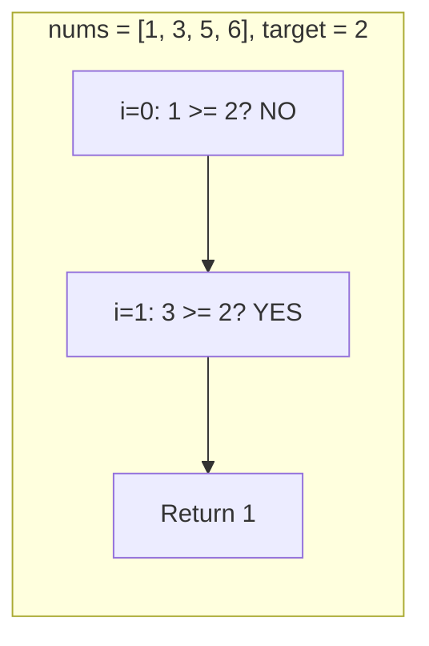

---

### Approach 2: Binary Search (Lower Bound)

#### Intuition
Since the array is sorted, we can use binary search. We're looking for the **lower bound** - the smallest index `i` such that `nums[i] >= target`.

#### Algorithm

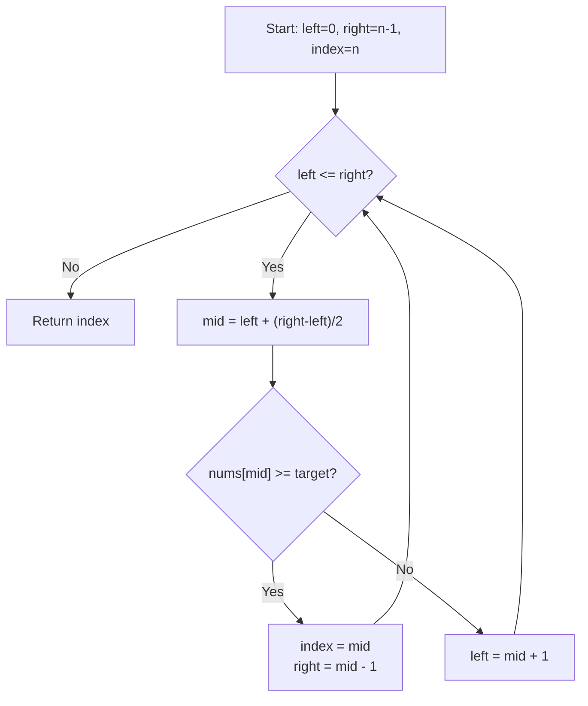

#### Code
```cpp
class Solution {
public:
    int searchInsert(vector<int> &nums, int target) {
        int left = 0;
        int right = nums.size() - 1;
        int index = nums.size();  // Default: insert at end
        
        while (left <= right) {
            int mid = left + (right - left) / 2;
            
            if (nums[mid] >= target) {
                index = mid;      // Potential answer
                right = mid - 1;  // Search for smaller index
            } else {
                left = mid + 1;   // Search right half
            }
        }
        return index;
    }
};
```

#### Complexity Analysis
| Complexity | Value | Explanation |
|------------|-------|-------------|
| **Time** | O(log n) | Search space halved each iteration |
| **Space** | O(1) | Only constant extra variables |

#### Visual Dry Run

**Example: `nums = [1, 3, 5, 6]`, `target = 2`**

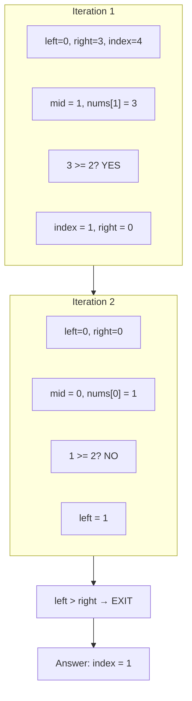

**Example: `nums = [1, 3, 5, 6]`, `target = 7`**

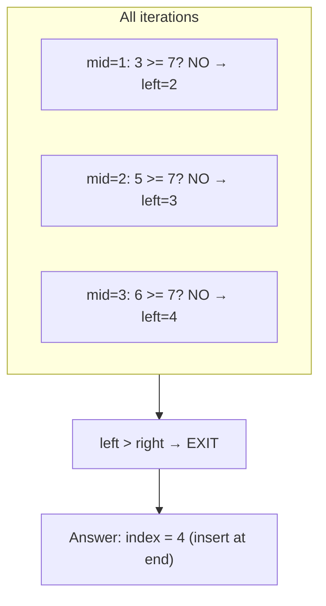

---

## 2. Floor and Ceil in Sorted Array

### Problem Statement
Given a sorted array `nums` and an integer `x`, find the **floor** and **ceil** of `x` in `nums`.
- **Floor**: Largest element in array that is **≤ x**
- **Ceil**: Smallest element in array that is **≥ x**

If no floor or ceil exists, return `-1`.

### Examples

| Input Array | x | Floor | Ceil | Explanation |
|-------------|---|-------|------|-------------|
| `[3, 4, 4, 7, 8, 10]` | `5` | `4` | `7` | 4 ≤ 5 ≤ 7 |
| `[3, 4, 4, 7, 8, 10]` | `8` | `8` | `8` | 8 is present |
| `[3, 4, 4, 7, 8, 10]` | `2` | `-1` | `3` | No element ≤ 2 |
| `[3, 4, 4, 7, 8, 10]` | `11` | `10` | `-1` | No element ≥ 11 |

### Key Insight

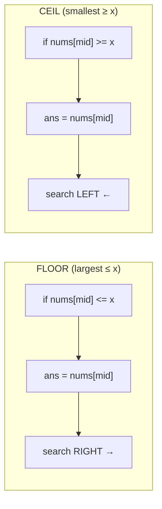

---

### Approach 1: Single Binary Search

#### Intuition
Use a single binary search to find both floor and ceil simultaneously. When we find an exact match, both floor and ceil are the same.

#### Code
```cpp
class Solution {
public:
    pair<int, int> getFloorAndCeil(vector<int> &nums, int x) {
        int left = 0;
        int right = (int)nums.size() - 1;
        int ceilVal = -1;
        int floorVal = -1;

        while (left <= right) {
            int mid = left + (right - left) / 2;

            if (nums[mid] == x) {
                // Exact match: both floor and ceil are x
                return {nums[mid], nums[mid]};
            }

            if (nums[mid] < x) {
                floorVal = nums[mid];  // Potential floor
                left = mid + 1;        // Search right for closer floor
            } else {
                ceilVal = nums[mid];   // Potential ceil
                right = mid - 1;       // Search left for closer ceil
            }
        }

        return {floorVal, ceilVal};
    }
};
```

#### Complexity Analysis
| Complexity | Value | Explanation |
|------------|-------|-------------|
| **Time** | O(log n) | Single binary search |
| **Space** | O(1) | Constant extra space |

#### Visual Dry Run

**Example: `nums = [3, 4, 4, 7, 8, 10]`, `x = 5`**

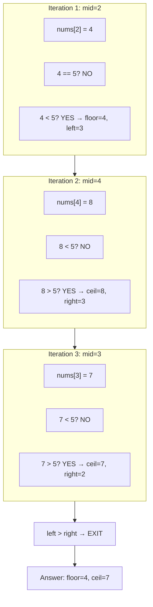

---

### Approach 2: Separate Floor and Ceil Functions

#### Intuition
Use two separate binary search functions - one dedicated to finding floor and another for ceil. This is more modular and easier to understand.

#### Code
```cpp
class Solution {
private:
    // Helper function to find the floor of x
    int findFloor(vector<int> &nums, int n, int x) {
        int low = 0, high = n - 1;
        int ans = -1;

        while (low <= high) {
            int mid = (low + high) / 2;

            // If mid element <= x, it's a potential floor
            // Search right for possibly larger floor
            if (nums[mid] <= x) {
                ans = nums[mid];
                low = mid + 1;
            } else {
                high = mid - 1;
            }
        }
        return ans;
    }

    // Helper function to find the ceil of x
    int findCeil(vector<int> &nums, int n, int x) {
        int low = 0, high = n - 1;
        int ans = -1;

        while (low <= high) {
            int mid = (low + high) / 2;

            // If mid element >= x, it's a potential ceil
            // Search left for possibly smaller ceil
            if (nums[mid] >= x) {
                ans = nums[mid];
                high = mid - 1;
            } else {
                low = mid + 1;
            }
        }
        return ans;
    }

public:
    vector<int> getFloorAndCeil(vector<int> nums, int x) {
        int n = nums.size();
        int floor = findFloor(nums, n, x);
        int ceil = findCeil(nums, n, x);
        return {floor, ceil};
    }
};
```

#### Complexity Analysis
| Complexity | Value | Explanation |
|------------|-------|-------------|
| **Time** | O(log n) + O(log n) = O(log n) | Two binary searches |
| **Space** | O(1) | Constant extra space |

---

## 3. First and Last Occurrence of an Element

### Problem Statement
Given an array of integers `nums` sorted in non-decreasing order, find the **starting** and **ending** position of a given `target` value. If the target is not found, return `[-1, -1]`.

### Examples

| Input Array | Target | Output | Explanation |
|-------------|--------|--------|-------------|
| `[5, 7, 7, 8, 8, 10]` | `8` | `[3, 4]` | 8 appears at indices 3 and 4 |
| `[5, 7, 7, 8, 8, 10]` | `6` | `[-1, -1]` | 6 not present |
| `[1]` | `1` | `[0, 0]` | Single element is both first and last |
| `[]` | `0` | `[-1, -1]` | Empty array |

### Key Insight
- **First occurrence** = Lower bound (first index where `nums[i] == target`)
- **Last occurrence** = Upper bound - 1 (last index where `nums[i] == target`)

---

### Approach 1: Linear Search

#### Code
```cpp
class Solution {
public:
    vector<int> searchRange(vector<int> &nums, int target) {
        int n = nums.size();
        int first = -1;
        int last = -1;

        for (int i = 0; i < n; i++) {
            if (nums[i] == target) {
                if (first == -1) {
                    first = i;  // First occurrence
                }
                last = i;       // Keep updating last
            }
        }
        return {first, last};
    }
};
```

#### Complexity Analysis
| Complexity | Value | Explanation |
|------------|-------|-------------|
| **Time** | O(n) | Traverse entire array |
| **Space** | O(1) | Constant extra space |

---

### Approach 2: Using Lower and Upper Bound

#### Intuition
- **Lower Bound**: Smallest index where `nums[i] >= target`
- **Upper Bound**: Smallest index where `nums[i] > target`
- First occurrence = Lower Bound (if element at that index equals target)
- Last occurrence = Upper Bound - 1

#### Visual: Lower Bound vs Upper Bound

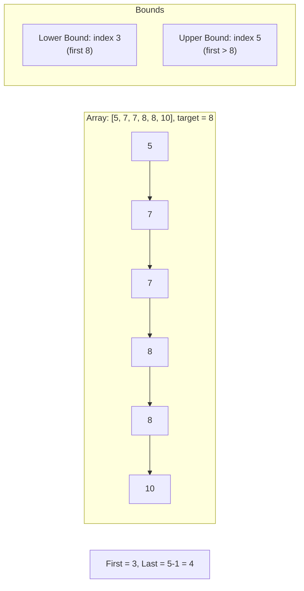

#### Code
```cpp
class Solution {
private:
    // Find smallest index where nums[i] >= target
    int lowerBound(vector<int> &nums, int target) {
        int low = 0, high = nums.size() - 1;
        int ans = nums.size();

        while (low <= high) {
            int mid = (low + high) / 2;

            if (nums[mid] >= target) {
                ans = mid;
                high = mid - 1;  // Search left for smaller index
            } else {
                low = mid + 1;
            }
        }
        return ans;
    }

    // Find smallest index where nums[i] > target
    int upperBound(vector<int> &nums, int target) {
        int low = 0, high = nums.size() - 1;
        int ans = nums.size();

        while (low <= high) {
            int mid = (low + high) / 2;

            if (nums[mid] > target) {
                ans = mid;
                high = mid - 1;  // Search left for smaller index
            } else {
                low = mid + 1;
            }
        }
        return ans;
    }

public:
    vector<int> searchRange(vector<int> &nums, int target) {
        int firstOcc = lowerBound(nums, target);

        // Check if target exists
        if (firstOcc == nums.size() || nums[firstOcc] != target)
            return {-1, -1};

        int lastOcc = upperBound(nums, target) - 1;
        return {firstOcc, lastOcc};
    }
};
```

#### Complexity Analysis
| Complexity | Value | Explanation |
|------------|-------|-------------|
| **Time** | O(log n) | Two binary searches |
| **Space** | O(1) | Constant extra space |

---

### Approach 3: Direct Binary Search

#### Intuition
Instead of using generic lower/upper bound, we can directly find first and last occurrence:
- **First occurrence**: When we find target, save index and search LEFT for earlier occurrence
- **Last occurrence**: When we find target, save index and search RIGHT for later occurrence

#### Algorithm

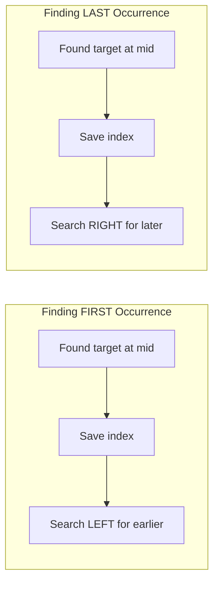

#### Code
```cpp
class Solution {
public:
    int first(vector<int> &nums, int target) {
        int low = 0;
        int high = nums.size() - 1;
        int fo = -1;  // First occurrence
        
        while (low <= high) {
            int mid = low + (high - low) / 2;
            
            if (nums[mid] == target) {
                fo = mid;         // Found one occurrence
                high = mid - 1;   // Search LEFT for earlier occurrence
            } else if (nums[mid] < target) {
                low = mid + 1;
            } else {
                high = mid - 1;
            }
        }
        return fo;
    }
    
    int last(vector<int> &nums, int target) {
        int low = 0;
        int high = nums.size() - 1;
        int lo = -1;  // Last occurrence
        
        while (low <= high) {
            int mid = low + (high - low) / 2;
            
            if (nums[mid] == target) {
                lo = mid;         // Found one occurrence
                low = mid + 1;    // Search RIGHT for later occurrence
            } else if (nums[mid] < target) {
                low = mid + 1;
            } else {
                high = mid - 1;
            }
        }
        return lo;
    }
    
    vector<int> searchRange(vector<int> &nums, int target) {
        int fo = first(nums, target);
        if (fo == -1) {
            return {-1, -1};  // Target not found
        }
        int lo = last(nums, target);
        return {fo, lo};
    }
};
```

#### Complexity Analysis
| Complexity | Value | Explanation |
|------------|-------|-------------|
| **Time** | O(log n) | Two binary searches |
| **Space** | O(1) | Constant extra space |

#### Visual Dry Run

**Example: `nums = [5, 7, 7, 8, 8, 10]`, `target = 8`**

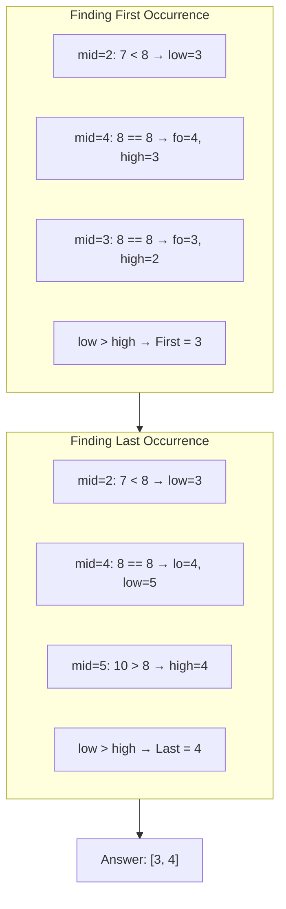

---

## 4. Search in Rotated Sorted Array - I

### Problem Statement
Given an integer array `nums`, sorted in ascending order (with **distinct values**) and a target value `k`. The array is rotated at some pivot point that is unknown. Find the index at which `k` is present. If `k` is not present, return `-1`.

### What is a Rotated Sorted Array?
A rotated sorted array is created by taking a sorted array and rotating it at some pivot.

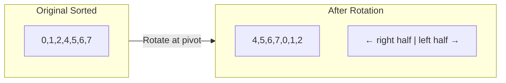

### Examples

| Input Array | Target | Output | Explanation |
|-------------|--------|--------|-------------|
| `[4, 5, 6, 7, 0, 1, 2]` | `0` | `4` | 0 found at index 4 |
| `[4, 5, 6, 7, 0, 1, 2]` | `3` | `-1` | 3 not present |
| `[1]` | `0` | `-1` | Single element, not found |
| `[1]` | `1` | `0` | Single element, found |

### Key Insight
In a rotated sorted array, at least one half (left or right of mid) is **always sorted**. We can identify which half is sorted and decide where to search.

---

### Approach: Binary Search with Sorted Half Identification

#### Algorithm

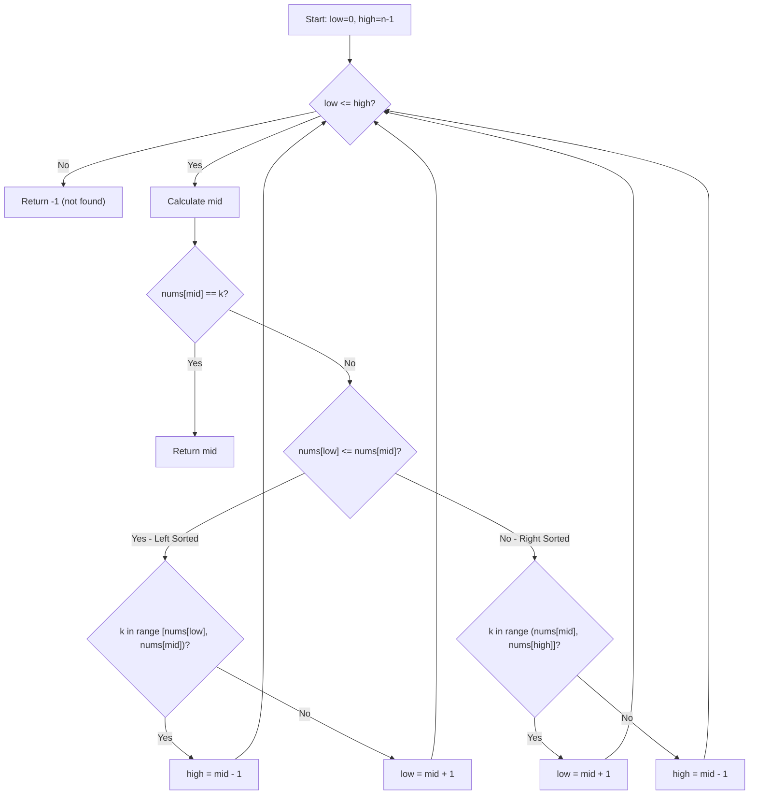

#### Code
```cpp
class Solution {
public:
    int search(vector<int> &nums, int k) {
        int low = 0;
        int high = nums.size() - 1;
        
        while (low <= high) {
            int mid = low + (high - low) / 2;
            
            // Found target
            if (nums[mid] == k)
                return mid;
            
            // Check if LEFT half is sorted
            if (nums[low] <= nums[mid]) {
                // Check if target is in LEFT sorted half
                if (nums[low] <= k && k < nums[mid]) {
                    high = mid - 1;  // Search left
                } else {
                    low = mid + 1;   // Search right
                }
            }
            // RIGHT half is sorted
            else {
                // Check if target is in RIGHT sorted half
                if (k > nums[mid] && k <= nums[high]) {
                    low = mid + 1;   // Search right
                } else {
                    high = mid - 1;  // Search left
                }
            }
        }
        return -1;  // Target not found
    }
};
```

#### Complexity Analysis
| Complexity | Value | Explanation |
|------------|-------|-------------|
| **Time** | O(log n) | Binary search halves search space |
| **Space** | O(1) | Constant extra space |

#### Why Does This Work?

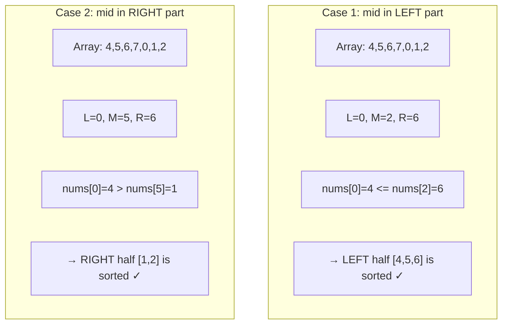

#### Visual Dry Run

**Example: `nums = [4, 5, 6, 7, 0, 1, 2]`, `k = 0`**

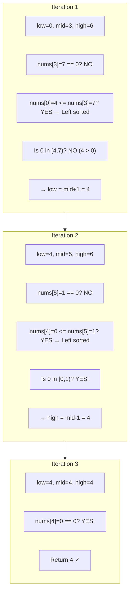

#### Edge Cases

| Case | Array | Target | Explanation |
|------|-------|--------|-------------|
| Not rotated | `[1,2,3,4,5]` | `3` | Works as normal binary search |
| Single element | `[1]` | `1` | Returns 0 |
| Two elements | `[2,1]` | `1` | Correctly identifies sorted half |
| Target at rotation | `[4,5,6,7,0,1,2]` | `7` | Found in left sorted half |

---

## Summary Table

| Problem | Key Technique | Time | Space |
|---------|---------------|------|-------|
| Search Insert Position | Lower Bound | O(log n) | O(1) |
| Floor and Ceil | Dual Binary Search | O(log n) | O(1) |
| First and Last Occurrence | Lower/Upper Bound | O(log n) | O(1) |
| Search in Rotated Array | Sorted Half Identification | O(log n) | O(1) |

---

## Key Takeaways

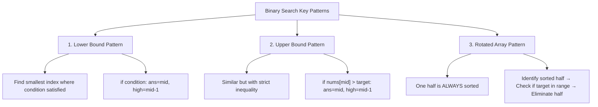

1. **Whenever you see "sorted" and "search"** → Think Binary Search!

2. **Lower Bound Pattern**: Find smallest index where condition is satisfied, keep moving LEFT after finding
   ```cpp
   if (condition) { ans = mid; high = mid - 1; }
   ```

3. **Upper Bound Pattern**: Similar but with strict inequality
   ```cpp
   if (nums[mid] > target) { ans = mid; high = mid - 1; }
   ```

4. **Rotated Array**: One half is ALWAYS sorted - identify and exploit it

5. **Avoid Integer Overflow**: Use `mid = low + (high - low) / 2` instead of `(low + high) / 2`

---

## Practice Problems

- LeetCode 35: Search Insert Position
- LeetCode 34: Find First and Last Position of Element
- LeetCode 33: Search in Rotated Sorted Array
- GFG: Floor and Ceil in Sorted Array
