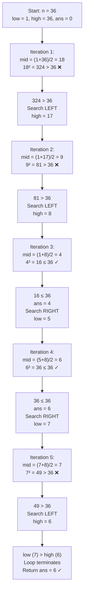
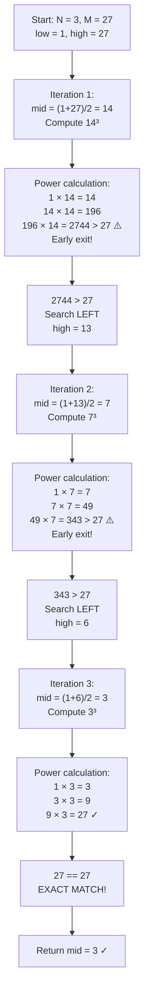
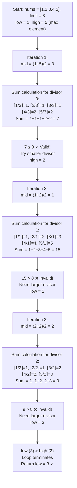

# Binary Search on Answers - Master Revision Guide

> **Core Pattern Recognition**: When the answer lies within a range `[low, high]` and has a **monotonic property** (if `x` works, all values on one side also work, or vice versa), we can apply binary search on the answer space.

---

## Table of Contents
1. [Find Square Root of a Number](#1-find-square-root-of-a-number)
2. [Find Nth Root of a Number](#2-find-nth-root-of-a-number)
3. [Find the Smallest Divisor](#3-find-the-smallest-divisor)

---

## 1. Find Square Root of a Number

### Problem Statement

Given a positive integer `n`, find and return its square root. If `n` is not a perfect square, return the **floor value** of `sqrt(n)`.

**Examples:**
- Input: `n = 36` → Output: `6` (6² = 36)
- Input: `n = 28` → Output: `5` (5² = 25 ≤ 28, but 6² = 36 > 28)

---

### Intuition & Strategy

#### Why Binary Search Works Here?

1. **Answer Space is Bounded**: The answer must lie in `[1, n]`. Actually, it's more tightly bounded by `[1, √n]`, but we can safely search `[1, n]`.

2. **Monotonic Property**: 
   - If `mid² ≤ n`, then `mid` is a **valid candidate** (but there might be a larger valid answer)
   - If `mid² > n`, then `mid` is **too large**, and so is every number greater than `mid`

3. **Pattern Recognition**:
   ```
   For n = 28:
   1² = 1  ≤ 28 ✓ (valid)
   2² = 4  ≤ 28 ✓ (valid)
   3² = 9  ≤ 28 ✓ (valid)
   4² = 16 ≤ 28 ✓ (valid)
   5² = 25 ≤ 28 ✓ (valid) ← Last valid = ANSWER
   6² = 36 > 28 ✗ (invalid)
   7² = 49 > 28 ✗ (invalid)
   ```
   
   Notice: All valid answers are **contiguous on the left**, all invalid on the right. This is the **monotonic boundary** we exploit!

4. **Search Strategy**: Find the **rightmost valid** answer (largest `mid` where `mid² ≤ n`)
   - When valid: Store `ans = mid`, search **right half** (`low = mid + 1`)
   - When invalid: Search **left half** (`high = mid - 1`)

---

### The Code

#### Brute Force - Linear Search
```cpp
class Solution {
public:
    int floorSqrt(int n) {
        int ans = 0;
        
        // Try every number from 1 to n
        for (int i = 1; i <= n; i++) {
            long long val = 1LL * i * i;  // Cast to long long to prevent overflow
            
            if (val <= (long long)n) {
                ans = i;  // Update answer - this could be our floor sqrt
            } else {
                break;    // val exceeded n, no point checking further
            }
        }
        return ans;
    }
};
```

#### Optimal - Binary Search
```cpp
class Solution {
public:
    int floorSqrt(int n) {
        if (n == 0) return 0;  // Edge case
        
        int low = 1, high = n;
        int ans = 0;
        
        while (low <= high) {
            int mid = low + (high - low) / 2;  // Avoid overflow in mid calculation
            long long sq = 1LL * mid * mid;     // Promote to long long before squaring
            
            if (sq <= n) {
                ans = mid;        // mid is valid, store it
                low = mid + 1;    // Search for potentially larger valid answer
            } else {
                high = mid - 1;   // mid is too large, search smaller values
            }
        }
        return ans;
    }
};
```

---

### Visual Dry Run

#### Example: `n = 36`



#### State Tracking Table

| Iteration | low | high | mid | mid² | Condition | Action | ans |
|-----------|-----|------|-----|------|-----------|--------|-----|
| 1 | 1 | 36 | 18 | 324 | 324 > 36 | high = 17 | 0 |
| 2 | 1 | 17 | 9 | 81 | 81 > 36 | high = 8 | 0 |
| 3 | 1 | 8 | 4 | 16 | 16 ≤ 36 | ans=4, low=5 | 4 |
| 4 | 5 | 8 | 6 | 36 | 36 ≤ 36 | ans=6, low=7 | 6 |
| 5 | 7 | 8 | 7 | 49 | 49 > 36 | high = 6 | 6 |
| End | 7 | 6 | - | - | low > high | Return 6 | **6** |

---

### Complexity Analysis

| Approach | Time Complexity | Space Complexity |
|----------|-----------------|------------------|
| Linear Search | O(√n) | O(1) |
| Binary Search | O(log n) | O(1) |

**Time Complexity Derivation (Binary Search):**
- Search space: `[1, n]`
- Each iteration halves the search space
- Number of iterations: `log₂(n)`
- **TC: O(log n)**

**Space Complexity:**
- Only using fixed variables (`low`, `high`, `mid`, `ans`)
- **SC: O(1)**

---

## 2. Find Nth Root of a Number

### Problem Statement

Given two integers `N` and `M`, find the **Nth root of M**. The Nth root of M is a number `X` such that `X^N = M`. If no such integer exists, return `-1`.

**Examples:**
- Input: `N = 3, M = 27` → Output: `3` (3³ = 27)
- Input: `N = 4, M = 69` → Output: `-1` (no integer x where x⁴ = 69)

---

### Intuition & Strategy

#### Key Differences from Square Root Problem:

1. **Exact Match Required**: Unlike floor sqrt, we need **exact** `X^N = M`, otherwise return `-1`

2. **Overflow Danger**: Computing `mid^N` can overflow even for moderate values
   - Example: `mid = 1000, N = 5` → 1000⁵ = 10¹⁵ (exceeds int range!)

3. **Early Termination Trick**: While computing power, if intermediate result exceeds `M`, **stop immediately**
   - This prevents overflow AND saves computation

#### Pattern Recognition:

```
For M = 27, N = 3:
1³ = 1  < 27  → Search right
2³ = 8  < 27  → Search right
3³ = 27 = 27  → FOUND! Return 3
4³ = 64 > 27  → Search left
```

#### Three Possible States During Search:
- `power < M`: Answer is **larger** than mid → `low = mid + 1`
- `power == M`: **Found exact root** → Return mid
- `power > M`: Answer is **smaller** than mid → `high = mid - 1`

---

### The Code

#### Brute Force - Linear Search with Efficient Power
```cpp
class Solution {
private:
    // Exponentiation by squaring - O(log exp) time
    long long Pow(int b, int exp) {
        long long ans = 1;
        long long base = b;
        
        while (exp > 0) {
            if (exp % 2) {           // If exp is odd
                exp--;
                ans = ans * base;    // Multiply once
            } else {                 // If exp is even
                exp /= 2;
                base = base * base;  // Square the base
            }
        }
        return ans;
    }

public:
    int NthRoot(int N, int M) {
        for (int i = 1; i <= M; i++) {
            long long val = Pow(i, N);
            
            if (val == M * 1LL) {
                return i;    // Found exact Nth root
            } else if (val > M * 1LL) {
                break;       // Exceeded M, no point checking further
            }
        }
        return -1;  // No integer Nth root exists
    }
};
```

#### Optimal - Binary Search with Overflow-Safe Power
```cpp
class Solution {
public:
    int NthRoot(int N, int M) {
        int low = 1, high = M, ans = -1;
        
        while (low <= high) {
            int mid = low + (high - low) / 2;
            
            // Calculate mid^N with early termination on overflow
            long long power = 1;
            bool overflow = false;
            for (int i = 0; i < N; i++) {
                power = power * mid;
                if (power > M) {     // Early exit: already exceeded M
                    overflow = true;
                    break;
                }
            }
            
            if (power == M) {
                return mid;          // Exact match found!
            } else if (overflow || power > M) {
                high = mid - 1;      // mid is too large
            } else {
                low = mid + 1;       // mid is too small
            }
        }
        return ans;  // No integer Nth root exists
    }
};
```

---

### Visual Dry Run

#### Example: `N = 3, M = 27` (Finding cube root of 27)



#### State Tracking Table

| Iteration | low | high | mid | Power Calculation | Result | Action |
|-----------|-----|------|-----|-------------------|--------|--------|
| 1 | 1 | 27 | 14 | 14→196→2744 (overflow!) | 2744 > 27 | high = 13 |
| 2 | 1 | 13 | 7 | 7→49→343 (overflow!) | 343 > 27 | high = 6 |
| 3 | 1 | 6 | 3 | 3→9→27 | 27 == 27 | **Return 3** |

---

### Complexity Analysis

| Approach | Time Complexity | Space Complexity |
|----------|-----------------|------------------|
| Linear Search | O(M × log N) | O(1) |
| Binary Search | O(N × log M) | O(1) |

**Time Complexity Derivation (Binary Search):**
- Binary search iterations: `log₂(M)`
- Power calculation per iteration: `O(N)` (with early termination, often less)
- **TC: O(N × log M)**

**Space Complexity:**
- Only using fixed variables
- **SC: O(1)**

**Note**: The early termination in power calculation is crucial—without it, we risk integer overflow for large values.

---

## 3. Find the Smallest Divisor

### Problem Statement

Given an array of integers `nums` and an integer `limit` (threshold), find the **smallest positive integer divisor** such that when all elements are divided by this divisor and **rounded up (ceiling)**, the sum is **less than or equal to** the threshold.

**Examples:**
- Input: `nums = [1, 2, 3, 4, 5], limit = 8`
  - Divisor 1: ⌈1/1⌉ + ⌈2/1⌉ + ⌈3/1⌉ + ⌈4/1⌉ + ⌈5/1⌉ = 15 > 8 ❌
  - Divisor 2: ⌈1/2⌉ + ⌈2/2⌉ + ⌈3/2⌉ + ⌈4/2⌉ + ⌈5/2⌉ = 1+1+2+2+3 = 9 > 8 ❌
  - Divisor 3: ⌈1/3⌉ + ⌈2/3⌉ + ⌈3/3⌉ + ⌈4/3⌉ + ⌈5/3⌉ = 1+1+1+2+2 = 7 ≤ 8 ✓
  - Output: `3`

- Input: `nums = [8, 4, 2, 3], limit = 10`
  - Output: `2` (sum = 4+2+1+2 = 9 ≤ 10)

---

### Intuition & Strategy

#### Key Insights:

1. **Answer Space**: 
   - Minimum divisor = 1 (gives maximum sum = sum of all elements)
   - Maximum divisor = max(nums) (gives minimum sum = n, since each element becomes 1)

2. **Inverse Monotonic Property** (CRUCIAL):
   ```
   LARGER divisor → SMALLER sum
   SMALLER divisor → LARGER sum
   ```
   
   This is the opposite of typical binary search problems!

3. **Pattern Recognition**:
   ```
   For nums = [1, 2, 3, 4, 5], limit = 8:
   
   Divisor 1: sum = 15 > 8 ❌ (too small divisor)
   Divisor 2: sum = 9  > 8 ❌ (too small divisor)
   Divisor 3: sum = 7  ≤ 8 ✓ (valid) ← SMALLEST VALID
   Divisor 4: sum = 6  ≤ 8 ✓ (valid)
   Divisor 5: sum = 5  ≤ 8 ✓ (valid)
   ```
   
   Invalid answers are on the LEFT, valid answers are on the RIGHT.
   We want the **leftmost valid** answer!

4. **Search Strategy**: Find the **leftmost valid** (smallest divisor where sum ≤ limit)
   - When `sum ≤ limit`: Valid! Try to find **smaller** divisor → `high = mid - 1`
   - When `sum > limit`: Invalid! Need **larger** divisor → `low = mid + 1`

#### Edge Case:
- If `n > limit`, it's **impossible** (even with the largest divisor, each element contributes at least 1, so minimum sum = n)

---

### The Code

#### Brute Force - Linear Search
```cpp
class Solution {
public:
    int smallestDivisor(vector<int>& nums, int limit) {
        int n = nums.size();
        
        // Maximum possible divisor is the largest element
        int maxi = *max_element(nums.begin(), nums.end());
        
        // Try each divisor from 1 to max(nums)
        for (int d = 1; d <= maxi; d++) {
            int sum = 0;
            
            // Calculate sum of ceil(nums[i] / d) for all elements
            for (int i = 0; i < n; i++) {
                sum += ceil((double)nums[i] / (double)d);
            }
            
            // First divisor where sum <= limit is our answer
            if (sum <= limit) return d;
        }
        
        return -1;  // Should not reach here for valid input
    }
};
```

#### Optimal - Binary Search
```cpp
class Solution {
private:
    // Helper: Calculate sum of ceil(nums[i] / divisor) for all elements
    int sumByD(vector<int>& nums, int divisor) {
        int sum = 0;
        for (int i = 0; i < nums.size(); i++) {
            sum += ceil((double)nums[i] / (double)divisor);
        }
        return sum;
    }

public:
    int smallestDivisor(vector<int>& nums, int limit) {
        int n = nums.size();
        
        // Edge case: impossible if array size exceeds limit
        if (n > limit) return -1;
        
        // Binary search on divisor range [1, max(nums)]
        int low = 1;
        int high = *max_element(nums.begin(), nums.end());
        
        while (low <= high) {
            int mid = (low + high) / 2;
            
            if (sumByD(nums, mid) <= limit) {
                // Valid! But try to find smaller divisor
                high = mid - 1;
            } else {
                // Invalid! Need larger divisor
                low = mid + 1;
            }
        }
        
        // 'low' points to the smallest valid divisor
        return low;
    }
};
```

---

### Visual Dry Run

#### Example: `nums = [1, 2, 3, 4, 5], limit = 8`



#### State Tracking Table

| Iteration | low | high | mid | Sum Calculation | sum | Condition | Action |
|-----------|-----|------|-----|-----------------|-----|-----------|--------|
| 1 | 1 | 5 | 3 | ⌈1/3⌉+⌈2/3⌉+⌈3/3⌉+⌈4/3⌉+⌈5/3⌉ | 7 | 7 ≤ 8 ✓ | high = 2 |
| 2 | 1 | 2 | 1 | ⌈1/1⌉+⌈2/1⌉+⌈3/1⌉+⌈4/1⌉+⌈5/1⌉ | 15 | 15 > 8 ❌ | low = 2 |
| 3 | 2 | 2 | 2 | ⌈1/2⌉+⌈2/2⌉+⌈3/2⌉+⌈4/2⌉+⌈5/2⌉ | 9 | 9 > 8 ❌ | low = 3 |
| End | 3 | 2 | - | - | - | low > high | **Return 3** |

---

### Complexity Analysis

| Approach | Time Complexity | Space Complexity |
|----------|-----------------|------------------|
| Linear Search | O(max(nums) × n) | O(1) |
| Binary Search | O(n × log(max(nums))) | O(1) |

**Time Complexity Derivation (Binary Search):**
- Search space: `[1, max(nums)]` → `log(max(nums))` iterations
- Each iteration: Calculate sum by iterating all n elements → O(n)
- **TC: O(n × log(max(nums)))**

**Space Complexity:**
- Only using fixed variables
- **SC: O(1)**

---

## Summary: Binary Search on Answers Pattern

| Problem | Answer Range | Monotonic Property | Looking For |
|---------|--------------|-------------------|-------------|
| Square Root | [1, n] | x² ≤ n → valid | Rightmost valid (largest) |
| Nth Root | [1, M] | xⁿ = M → exact match | Exact match |
| Smallest Divisor | [1, max(arr)] | sum ≤ limit → valid | Leftmost valid (smallest) |

### When to Apply This Pattern:

1. **Bounded Answer Space**: Answer lies in a range `[low, high]`
2. **Monotonic Property**: If `x` is valid/invalid, you can infer validity of neighboring values
3. **Optimization Required**: Finding min/max value satisfying some condition

### Template:
```cpp
int binarySearchOnAnswer(/* params */) {
    int low = MIN_POSSIBLE_ANSWER;
    int high = MAX_POSSIBLE_ANSWER;
    int ans = DEFAULT_VALUE;
    
    while (low <= high) {
        int mid = low + (high - low) / 2;
        
        if (isValid(mid)) {
            ans = mid;
            // If finding MAXIMUM valid: low = mid + 1
            // If finding MINIMUM valid: high = mid - 1
        } else {
            // Move to the other half
        }
    }
    return ans;  // or return low/high depending on problem
}
```

