# 📚 Binary Search on Answers - Master Revision Guide

> **Pattern Recognition**: Whenever you find a problem with the pattern:  
> ✅ **Not Possible → Possible** (monotonic behavior)  
> ✅ Find **minimum/maximum** value  
> ✅ Answer lies in a **range**  
> 👉 **Apply Binary Search on Answers!**

---

## 📑 Table of Contents

1. [Problem 1: Koko Eating Bananas](#problem-1-koko-eating-bananas)
   - [Problem Statement](#11-problem-statement)
   - [Intuition & Strategy](#12-intuition--strategy)
   - [The Code](#13-the-code)
   - [Visual Dry Run](#14-visual-dry-run)
   - [Complexity Analysis](#15-complexity-analysis)

2. [Problem 2: Minimum Days to Make M Bouquets](#problem-2-minimum-days-to-make-m-bouquets-rose-garden)
   - [Problem Statement](#21-problem-statement)
   - [Intuition & Strategy](#22-intuition--strategy)
   - [The Code](#23-the-code)
   - [Visual Dry Run](#24-visual-dry-run)
   - [Complexity Analysis](#25-complexity-analysis)

3. [Key Takeaways & Pattern Summary](#key-takeaways--pattern-summary)

---

## Problem 1: Koko Eating Bananas

### 1.1 Problem Statement

**Context**: A monkey (Koko) is given `n` piles of bananas, where the `ith` pile has `nums[i]` bananas. An integer `h` represents the total time in hours to eat all the bananas.

**Rules**:
- Each hour, Koko chooses a **non-empty pile** and eats `k` bananas.
- If a pile has **fewer than `k`** bananas, Koko eats all bananas in that pile and **does not eat more** that hour.

**Goal**: Find the **minimum eating speed `k`** (bananas per hour) to finish all bananas within `h` hours.

**Example**:
```
Input: n = 4, nums = [7, 15, 6, 3], h = 8
Output: 5

Explanation: 
At k=5 bananas/hr:
- Pile 7: ceil(7/5) = 2 hours
- Pile 15: ceil(15/5) = 3 hours
- Pile 6: ceil(6/5) = 2 hours
- Pile 3: ceil(3/5) = 1 hour
Total = 2 + 3 + 2 + 1 = 8 hours ✅
```

---

### 1.2 Intuition & Strategy

#### 🧠 Key Observations

1. **Identify the Answer Space (Range)**:
   - **Minimum possible `k`**: `1` (eat at least 1 banana/hour)
   - **Maximum possible `k`**: `max(nums)` (if you eat at max pile size, you finish any pile in 1 hour)
   - So answer lies in **[1, max(nums)]**

2. **Monotonic Property** (The Magic!):
   - If `k` is **too small** → Takes more hours → NOT POSSIBLE
   - If `k` is **large enough** → Takes fewer hours → POSSIBLE
   - As `k` increases, total hours **decreases monotonically**
   
   ```
   k=1:  Hours = ∞ (many hours) → NOT POSSIBLE
   k=2:  Hours = still high    → NOT POSSIBLE
   ...
   k=5:  Hours = 8             → POSSIBLE ✅ (First valid answer!)
   k=6:  Hours = 7             → POSSIBLE ✅
   k=max: Hours = n            → POSSIBLE ✅
   ```

3. **Why Binary Search Works**:
   - We have a **sorted search space** [1 to max]
   - We have a **monotonic condition**: Once it becomes possible, all larger values are also possible
   - We want the **minimum** `k` → Search for the leftmost "POSSIBLE"

4. **Helper Function Logic**:
   - For a given rate `k`, calculate total hours: `sum of ceil(nums[i] / k)`
   - If `totalHours <= h` → Current rate is sufficient

#### 🎯 Pattern Recognition Checklist
| Check | Status |
|-------|--------|
| Is there a range of possible answers? | ✅ [1, max(nums)] |
| Is there a monotonic condition? | ✅ NOT POSSIBLE → POSSIBLE |
| Are we finding min/max? | ✅ Finding minimum k |
| **Conclusion** | **Binary Search on Answers!** |

---

### 1.3 The Code

#### Approach 1: Linear Search (Brute Force)

```cpp
class Solution {
private:
    // Helper: Find maximum element in the vector
    int findMax(vector<int> &v) {
        int maxi = INT_MIN;
        int n = v.size();
        for (int i = 0; i < n; i++) {
            maxi = max(maxi, v[i]);
        }
        return maxi;
    }

    // Helper: Calculate total hours required at given hourly rate
    // ⚠️ Return type is long long to handle overflow
    long long calculateTotalHours(vector<int> &v, int hourly) {
        long long totalH = 0;
        int n = v.size();
        for (int i = 0; i < n; i++) {
            // ceil(a/b) = (a + b - 1) / b OR use ceil() with double
            totalH += ceil((double)(v[i]) / (double)(hourly));
        }
        return totalH;
    }

public:
    int minimumRateToEatBananas(vector<int> nums, int h) {
        int maxi = findMax(nums);  // Upper bound of search space

        // Linear search from 1 to max
        for (int i = 1; i <= maxi; i++) {
            long long reqTime = calculateTotalHours(nums, i);
            // First valid k found is the minimum (since we start from 1)
            if (reqTime <= (long long)h) {
                return i;
            }
        }
        return maxi;  // Fallback (should not reach here)
    }
};
```

#### Approach 2: Binary Search (Optimal) ⭐

```cpp
class Solution {
private:
    int max_element(vector<int> nums) {
        int maxi = INT_MIN;
        for (int i = 0; i < nums.size(); i++) {
            maxi = max(maxi, nums[i]);
        }
        return maxi;
    }

    // ✅ Return type: long long to prevent overflow
    long long calculateTotalHours(vector<int> nums, int rate) {
        long long totalH = 0;
        for (int i = 0; i < nums.size(); i++) {
            totalH = totalH + ceil((double)nums[i] / (double)rate);
        }
        return totalH;
    }

public:
    int minimumRateToEatBananas(vector<int> nums, int h) {
        int low = 1;                      // Minimum possible rate
        int high = max_element(nums);     // Maximum possible rate
        int ans;
        
        while (low <= high) {
            int mid = low + (high - low) / 2;  // Avoid overflow
            long long total = calculateTotalHours(nums, mid);
            
            if (total <= h) {
                // ✅ POSSIBLE: Can finish in time
                ans = mid;          // Store potential answer
                high = mid - 1;     // Try to find smaller k (minimize)
            } else {
                // ❌ NOT POSSIBLE: Need faster rate
                low = mid + 1;      // Search in right half
            }
        }
        return ans;
    }
};
```

---

### 1.4 Visual Dry Run

**Input**: `nums = [7, 15, 6, 3], h = 8`

```mermaid
flowchart TD
    subgraph INIT["🎬 INITIALIZATION"]
        I1["nums = [7, 15, 6, 3]"]
        I2["h = 8 hours allowed"]
        I3["low = 1, high = 15"]
        I4["Search Space: [1, 2, 3, 4, 5, 6, 7, 8, 9, 10, 11, 12, 13, 14, 15]"]
    end
    
    subgraph ITER1["🔄 ITERATION 1"]
        A1["mid = (1 + 15) / 2 = 8"]
        A2["calculateTotalHours at rate=8:"]
        A3["ceil(7/8) + ceil(15/8) + ceil(6/8) + ceil(3/8)"]
        A4["= 1 + 2 + 1 + 1 = 5 hours"]
        A5["5 ≤ 8? ✅ YES"]
        A6["ans = 8, high = 7"]
        A7["New Search: [1, 2, 3, 4, 5, 6, 7]"]
    end
    
    subgraph ITER2["🔄 ITERATION 2"]
        B1["mid = (1 + 7) / 2 = 4"]
        B2["calculateTotalHours at rate=4:"]
        B3["ceil(7/4) + ceil(15/4) + ceil(6/4) + ceil(3/4)"]
        B4["= 2 + 4 + 2 + 1 = 9 hours"]
        B5["9 ≤ 8? ❌ NO"]
        B6["low = 5"]
        B7["New Search: [5, 6, 7]"]
    end
    
    subgraph ITER3["🔄 ITERATION 3"]
        C1["mid = (5 + 7) / 2 = 6"]
        C2["calculateTotalHours at rate=6:"]
        C3["ceil(7/6) + ceil(15/6) + ceil(6/6) + ceil(3/6)"]
        C4["= 2 + 3 + 1 + 1 = 7 hours"]
        C5["7 ≤ 8? ✅ YES"]
        C6["ans = 6, high = 5"]
        C7["New Search: [5]"]
    end
    
    subgraph ITER4["🔄 ITERATION 4"]
        D1["mid = (5 + 5) / 2 = 5"]
        D2["calculateTotalHours at rate=5:"]
        D3["ceil(7/5) + ceil(15/5) + ceil(6/5) + ceil(3/5)"]
        D4["= 2 + 3 + 2 + 1 = 8 hours"]
        D5["8 ≤ 8? ✅ YES"]
        D6["ans = 5, high = 4"]
        D7["low=5 > high=4 → STOP"]
    end
    
    subgraph RESULT["🎯 RESULT"]
        R1["Return ans = 5"]
        R2["Minimum eating speed = 5 bananas/hour"]
    end
    
    INIT --> ITER1
    ITER1 --> ITER2
    ITER2 --> ITER3
    ITER3 --> ITER4
    ITER4 --> RESULT
    
    style INIT fill:#1a1a2e,stroke:#16213e,color:#eee
    style ITER1 fill:#16213e,stroke:#0f3460,color:#eee
    style ITER2 fill:#0f3460,stroke:#e94560,color:#eee
    style ITER3 fill:#16213e,stroke:#0f3460,color:#eee
    style ITER4 fill:#16213e,stroke:#0f3460,color:#eee
    style RESULT fill:#00b894,stroke:#00cec9,color:#000
```



---

### 1.5 Complexity Analysis

| Approach | Time Complexity | Space Complexity |
|----------|-----------------|------------------|
| **Linear Search** | O(max(nums) × n) | O(1) |
| **Binary Search** | O(n × log(max(nums))) | O(1) |

#### Detailed Derivation:

**Linear Search**:
- Outer loop: `1` to `max(nums)` → O(max(nums))
- Inner loop (calculateTotalHours): O(n)
- **Total**: O(max(nums) × n)

**Binary Search**:
- Binary search iterations: O(log(max(nums)))
- Each iteration calls calculateTotalHours: O(n)
- **Total**: O(n × log(max(nums)))

**Space**: O(1) - Only using constant extra variables

---

## Problem 2: Minimum Days to Make M Bouquets (Rose Garden)

### 2.1 Problem Statement

**Context**: Given `n` roses and an array `nums` where `nums[i]` denotes the day on which the `ith` rose will bloom.

**Rules**:
- Only **adjacent bloomed roses** can be picked to make a bouquet.
- Exactly `k` **adjacent bloomed roses** are required to make **one bouquet**.
- Need to make at least `m` bouquets.

**Goal**: Find the **minimum number of days** required to make at least `m` bouquets. Return `-1` if impossible.

**Example**:
```
Input: n = 8, nums = [7, 7, 7, 7, 13, 11, 12, 7], m = 2, k = 3
Output: 12

Explanation:
On day 12:
- Bloomed roses: [7,7,7,7,_,_,12,7] → indices 0,1,2,3 and 6,7 bloomed
- Wait, let's recalculate: On day 12, roses at positions where nums[i] <= 12 have bloomed
- nums = [7, 7, 7, 7, 13, 11, 12, 7]
- Bloomed: positions 0,1,2,3 (val≤12), pos 5 (11≤12), pos 6 (12≤12), pos 7 (7≤12)
- Adjacent groups: [0,1,2,3] (4 roses) → 1 bouquet (using 3)
                   pos 4 NOT bloomed (13>12) → breaks adjacency
                   [5,6,7] (3 roses) → 1 bouquet
- Total: 2 bouquets ✅
```

---

### 2.2 Intuition & Strategy

#### 🧠 Key Observations

1. **Identify the Answer Space (Range)**:
   - **Minimum possible day**: `min(nums)` (at least need to wait for first flower)
   - **Maximum possible day**: `max(nums)` (by this day, all flowers have bloomed)
   - Answer lies in **[min(nums), max(nums)]**

2. **Impossible Case Check**:
   - Total flowers needed = `m × k`
   - If `m × k > n` → **IMPOSSIBLE** (not enough flowers) → Return `-1`

3. **Monotonic Property**:
   - On **earlier days** → Fewer flowers bloomed → Maybe NOT POSSIBLE to make m bouquets
   - On **later days** → More flowers bloomed → MORE LIKELY to be POSSIBLE
   
   ```
   Day=7:   Some bloomed → Maybe NOT POSSIBLE
   Day=10:  More bloomed → Still checking...
   Day=12:  Enough adjacent bloomed → POSSIBLE ✅ (First valid day!)
   Day=13:  All bloomed → POSSIBLE ✅
   ```

4. **Why Binary Search Works**:
   - **Sorted search space**: [min_day to max_day]
   - **Monotonic condition**: Once possible on day `d`, all days > `d` are also possible
   - We want **minimum day** → Search for leftmost "POSSIBLE"

5. **Helper Function Logic** (`possible()`):
   - Count **adjacent bloomed flowers** on given day
   - When adjacency breaks (flower not bloomed), calculate bouquets from current streak
   - If total bouquets ≥ m → POSSIBLE

#### 🎯 Why Counting Adjacent Matters

```
nums = [7, 7, 7, 7, 13, 11, 12, 7], day = 12, k = 3

Position:  0   1   2   3   4    5   6   7
nums[i]:   7   7   7   7   13  11  12   7
Bloomed?:  ✅  ✅  ✅  ✅  ❌   ✅  ✅  ✅

Adjacent streaks: [0,1,2,3] → 4 flowers → 4/3 = 1 bouquet
                  [5,6,7]   → 3 flowers → 3/3 = 1 bouquet
Total bouquets = 2 ≥ 2 (m) → POSSIBLE ✅
```

---

### 2.3 The Code

#### Approach 1: Linear Search (Brute Force)

```cpp
class Solution {
private:
    // Check if m bouquets of k flowers each can be made on 'day'
    bool possible(vector<int> &nums, int day, int m, int k) {
        int n = nums.size(); 
        int cnt = 0;       // Count of adjacent bloomed flowers
        int noOfB = 0;     // Number of bouquets formed

        for (int i = 0; i < n; i++) {
            if (nums[i] <= day) {
                // Flower has bloomed by this day
                cnt++;
            } else {
                // ❌ Adjacency broken - flower not yet bloomed
                noOfB += (cnt / k);  // Make bouquets from current streak
                cnt = 0;             // Reset streak counter
            }
        }
        // Don't forget remaining streak after loop!
        noOfB += (cnt / k);

        return noOfB >= m;
    }

public:
    int roseGarden(int n, vector<int> nums, int k, int m) {
        // Edge case: Not enough flowers to make required bouquets
        long long val = m * 1ll * k * 1ll;  // Use long long to avoid overflow
        if (val > n) return -1;

        // Find the range [min_day, max_day]
        int mini = INT_MAX, maxi = INT_MIN;
        for (int i = 0; i < n; i++) {
            mini = min(mini, nums[i]);
            maxi = max(maxi, nums[i]);
        }

        // Linear search: Try each day from min to max
        for (int i = mini; i <= maxi; i++) {
            if (possible(nums, i, m, k))
                return i;  // First valid day is minimum
        }
        
        return -1;
    }
};
```

#### Approach 2: Binary Search (Optimal) ⭐

```cpp
class Solution {
private:
    // Check if m bouquets of k flowers each can be made on 'day'
    bool possible(vector<int> &nums, int day, int m, int k) {
        int n = nums.size(); 
        int cnt = 0;       // Count of adjacent bloomed flowers
        int noOfB = 0;     // Number of bouquets formed

        for (int i = 0; i < n; i++) {
            if (nums[i] <= day) {
                cnt++;  // ✅ Flower bloomed - extend streak
            } else {
                // ❌ Adjacency broken
                noOfB += (cnt / k);  // Harvest bouquets from streak
                cnt = 0;             // Reset for next streak
            }
        }
        noOfB += (cnt / k);  // ⚠️ Don't forget last streak!

        return noOfB >= m;
    }

public:
    int roseGarden(int n, vector<int> nums, int k, int m) {
        // Pre-check: Impossible if not enough total flowers
        long long val = m * 1ll * k * 1ll;
        if (val > n) return -1;

        // Determine search range
        int mini = INT_MAX, maxi = INT_MIN;
        for (int i = 0; i < n; i++) {
            mini = min(mini, nums[i]);
            maxi = max(maxi, nums[i]);
        }

        // Binary search on days
        int left = mini, right = maxi, ans = -1;
        
        while (left <= right) {
            int mid = left + (right - left) / 2;
            
            if (possible(nums, mid, m, k)) {
                // ✅ POSSIBLE on this day
                ans = mid;            // Store potential answer
                right = mid - 1;      // Try earlier days (minimize)
            } else {
                // ❌ NOT POSSIBLE - need more days
                left = mid + 1;       // Search later days
            }
        }
        
        return ans;
    }
};
```

---

### 2.4 Visual Dry Run

**Input**: `nums = [7, 7, 7, 7, 13, 11, 12, 7], m = 2, k = 3`

```mermaid
flowchart TD
    subgraph INIT["🎬 INITIALIZATION"]
        I1["nums = [7, 7, 7, 7, 13, 11, 12, 7]"]
        I2["m = 2 bouquets, k = 3 flowers each"]
        I3["Total flowers needed = 2 × 3 = 6"]
        I4["n = 8 ≥ 6 → Possible to proceed ✅"]
        I5["min = 7, max = 13"]
        I6["left = 7, right = 13"]
    end
    
    subgraph ITER1["🔄 ITERATION 1: mid = 10"]
        A1["Check day = 10"]
        A2["Bloomed: nums[i] ≤ 10?"]
        A3["[7✅, 7✅, 7✅, 7✅, 13❌, 11❌, 12❌, 7✅]"]
        A4["Streak [0-3]: 4 flowers → 4/3 = 1 bouquet"]
        A5["Break at index 4, 5, 6"]
        A6["Streak [7]: 1 flower → 1/3 = 0 bouquet"]
        A7["Total bouquets = 1 < 2 ❌"]
        A8["left = 11"]
    end
    
    subgraph ITER2["🔄 ITERATION 2: mid = 12"]
        B1["Check day = 12"]
        B2["Bloomed: nums[i] ≤ 12?"]
        B3["[7✅, 7✅, 7✅, 7✅, 13❌, 11✅, 12✅, 7✅]"]
        B4["Streak [0-3]: 4 flowers → 4/3 = 1 bouquet"]
        B5["Break at index 4"]
        B6["Streak [5-7]: 3 flowers → 3/3 = 1 bouquet"]
        B7["Total bouquets = 2 ≥ 2 ✅"]
        B8["ans = 12, right = 11"]
    end
    
    subgraph ITER3["🔄 ITERATION 3: mid = 11"]
        C1["Check day = 11"]
        C2["Bloomed: nums[i] ≤ 11?"]
        C3["[7✅, 7✅, 7✅, 7✅, 13❌, 11✅, 12❌, 7✅]"]
        C4["Streak [0-3]: 4 flowers → 4/3 = 1 bouquet"]
        C5["Break at index 4"]
        C6["Streak [5]: 1 flower → break at 6"]
        C7["Streak [7]: 1 flower → 0 bouquet"]
        C8["Total bouquets = 1 < 2 ❌"]
        C9["left = 12"]
    end
    
    subgraph TERM["⏹️ TERMINATION"]
        T1["left = 12 > right = 11"]
        T2["Loop ends"]
    end
    
    subgraph RESULT["🎯 RESULT"]
        R1["Return ans = 12"]
        R2["Minimum days = 12"]
    end
    
    INIT --> ITER1
    ITER1 --> ITER2
    ITER2 --> ITER3
    ITER3 --> TERM
    TERM --> RESULT
    
    style INIT fill:#1a1a2e,stroke:#16213e,color:#eee
    style ITER1 fill:#0f3460,stroke:#e94560,color:#eee
    style ITER2 fill:#16213e,stroke:#0f3460,color:#eee
    style ITER3 fill:#0f3460,stroke:#e94560,color:#eee
    style TERM fill:#2d3436,stroke:#636e72,color:#eee
    style RESULT fill:#00b894,stroke:#00cec9,color:#000
```



#### 📊 State Tracking Table

| Iteration | left | right | mid | possible? | ans | Action |
|-----------|------|-------|-----|-----------|-----|--------|
| 1 | 7 | 13 | 10 | ❌ (1 bouquet) | - | left = 11 |
| 2 | 11 | 13 | 12 | ✅ (2 bouquets) | 12 | right = 11 |
| 3 | 11 | 11 | 11 | ❌ (1 bouquet) | 12 | left = 12 |
| End | 12 | 11 | - | - | 12 | left > right, STOP |

---

### 2.5 Complexity Analysis

| Approach | Time Complexity | Space Complexity |
|----------|-----------------|------------------|
| **Linear Search** | O((max-min) × n) | O(1) |
| **Binary Search** | O(n × log(max-min)) | O(1) |

#### Detailed Derivation:

**Linear Search**:
- Find min/max: O(n)
- Outer loop: `min` to `max` → O(max - min)
- Inner check (`possible`): O(n)
- **Total**: O(n) + O((max-min) × n) = **O((max-min) × n)**

**Binary Search**:
- Find min/max: O(n)
- Binary search iterations: O(log(max - min))
- Each iteration calls `possible()`: O(n)
- **Total**: O(n) + O(n × log(max-min)) = **O(n × log(max-min))**

**Space**: O(1) - Only using constant extra variables

---

## Key Takeaways & Pattern Summary

### 🎯 The Universal Pattern for "Binary Search on Answers"

```mermaid
flowchart LR
    subgraph IDENTIFY["1️⃣ IDENTIFY"]
        A1["📏 Define answer range [lo, hi]"]
        A2["🔍 Define feasibility check"]
    end
    
    subgraph CHECK["2️⃣ CHECK MONOTONICITY"]
        B1["Condition changes from"]
        B2["NOT POSSIBLE → POSSIBLE"]
        B3["as answer increases?"]
    end
    
    subgraph SEARCH["3️⃣ BINARY SEARCH"]
        C1["if feasible: store ans, go left"]
        C2["else: go right"]
    end
    
    subgraph RESULT["4️⃣ RETURN"]
        D1["Return stored answer"]
    end
    
    IDENTIFY --> CHECK
    CHECK --> SEARCH
    SEARCH --> RESULT
    
    style IDENTIFY fill:#2d3436,stroke:#00cec9,color:#eee
    style CHECK fill:#2d3436,stroke:#fdcb6e,color:#eee
    style SEARCH fill:#2d3436,stroke:#e17055,color:#eee
    style RESULT fill:#00b894,stroke:#00cec9,color:#000
```



### 📝 Quick Revision Checklist

| Question | Koko Eating Bananas | Rose Garden |
|----------|---------------------|-------------|
| **What is the answer?** | Eating rate `k` | Day number |
| **Answer range?** | [1, max(pile)] | [min(day), max(day)] |
| **Feasibility check?** | total_hours ≤ h | total_bouquets ≥ m |
| **Finding min or max?** | Minimum rate | Minimum day |
| **Edge case?** | Rate can't be 0 | m×k > n → impossible |

### 💡 Memory Hooks

1. **"If linear search works, binary search works faster"** - When checking all values in a range, binary search cuts it to log(range).

2. **"Monotonic = Binary Searchable"** - If the condition flips once and stays, you can binary search.

3. **"The answer IS the search key"** - We're not searching in an array; we're searching in the space of possible answers.

4. **"Store and explore"** - When condition is satisfied: `ans = mid`, then try to find a better answer.

---

*Last updated: December 2024*  
*Happy Coding! 🚀*
