```mermaid
flowchart TD
    subgraph Input["📥 Input Processing"]
        A["nums = [0, 3, 4, 7, 10, 9], k = 4"]
        B["After sorting: [0, 3, 4, 7, 9, 10]"]
    end
    
    subgraph SearchSpace["🔍 Binary Search Space"]
        C["left = 1, right = 10 - 0 = 10"]
        D["Search range: [1, 2, 3, ..., 10]"]
    end
    
    subgraph Iteration1["Iteration 1: mid = 5"]
        E1["mid = (1 + 10) / 2 = 5"]
        E2["Check: Can place 4 cows with dist ≥ 5?"]
        E3["Place at 0 ✓"]
        E4["3: 3-0=3 < 5 ✗"]
        E5["4: 4-0=4 < 5 ✗"]
        E6["7: 7-0=7 ≥ 5 ✓"]
        E7["9: 9-7=2 < 5 ✗"]
        E8["10: 10-7=3 < 5 ✗"]
        E9["Only 2 cows placed ❌"]
        E10["right = 5 - 1 = 4"]
    end
    
    subgraph Iteration2["Iteration 2: mid = 2"]
        F1["mid = (1 + 4) / 2 = 2"]
        F2["Check: Can place 4 cows with dist ≥ 2?"]
        F3["Place at: 0, 3, 7, 9 = 4 cows ✅"]
        F4["left = 2 + 1 = 3"]
    end
    
    subgraph Iteration3["Iteration 3: mid = 3"]
        G1["mid = (3 + 4) / 2 = 3"]
        G2["Check: Can place 4 cows with dist ≥ 3?"]
        G3["0 ✓ → 3 (3-0=3) ✓ → 7 (7-3=4) ✓ → 10 (10-7=3) ✓"]
        G4["4 cows placed ✅"]
        G5["left = 3 + 1 = 4"]
    end
    
    subgraph Iteration4["Iteration 4: mid = 4"]
        H1["mid = (4 + 4) / 2 = 4"]
        H2["Check: Can place 4 cows with dist ≥ 4?"]
        H3["0 ✓ → 4 (4-0=4) ✓ → 9 (9-4=5) ✓"]
        H4["Only 3 cows placed ❌"]
        H5["right = 4 - 1 = 3"]
    end
    
    subgraph Result["✅ Result"]
        I["left=4 > right=3 → Loop ends"]
        J["Return right = 3"]
    end
    
    A --> B --> C --> D --> E1
    E1 --> E2 --> E3 --> E4 --> E5 --> E6 --> E7 --> E8 --> E9 --> E10
    E10 --> F1 --> F2 --> F3 --> F4
    F4 --> G1 --> G2 --> G3 --> G4 --> G5
    G5 --> H1 --> H2 --> H3 --> H4 --> H5
    H5 --> I --> J
    
    style A fill:#2d3748,stroke:#4a5568,color:#e2e8f0
    style J fill:#276749,stroke:#48bb78,color:#f0fff4
    style E9 fill:#c53030,stroke:#fc8181,color:#fff5f5
    style F3 fill:#276749,stroke:#48bb78,color:#f0fff4
    style G4 fill:#276749,stroke:#48bb78,color:#f0fff4
    style H4 fill:#c53030,stroke:#fc8181,color:#fff5f5
```

```mermaid
flowchart TD
    subgraph Input["📥 Input"]
        A["arr = [1, 2, 3, 4, 5, 6, 7, 8, 5, 1]"]
        B["n = 10"]
    end
    
    subgraph EdgeCheck["🔒 Edge Cases"]
        C["arr[0]=1 > arr[1]=2? NO"]
        D["arr[9]=1 > arr[8]=5? NO"]
        E["Search range: low=1, high=8"]
    end
    
    subgraph Iter1["Iteration 1"]
        F1["mid = (1+8)/2 = 4"]
        F2["arr[4]=5, arr[3]=4, arr[5]=6"]
        F3["5 > 4 ✓ AND 5 > 6? ✗"]
        F4["5 < 6 → Ascending slope"]
        F5["Go RIGHT: low = 5"]
    end
    
    subgraph Iter2["Iteration 2"]
        G1["mid = (5+8)/2 = 6"]
        G2["arr[6]=7, arr[5]=6, arr[7]=8"]
        G3["7 > 6 ✓ AND 7 > 8? ✗"]
        G4["7 < 8 → Ascending slope"]
        G5["Go RIGHT: low = 7"]
    end
    
    subgraph Iter3["Iteration 3"]
        H1["mid = (7+8)/2 = 7"]
        H2["arr[7]=8, arr[6]=7, arr[8]=5"]
        H3["8 > 7 ✓ AND 8 > 5 ✓"]
        H4["🎯 PEAK FOUND!"]
    end
    
    subgraph Result["✅ Result"]
        I["Return index 7"]
    end
    
    A --> B --> C --> D --> E
    E --> F1 --> F2 --> F3 --> F4 --> F5
    F5 --> G1 --> G2 --> G3 --> G4 --> G5
    G5 --> H1 --> H2 --> H3 --> H4 --> I
    
    style A fill:#2d3748,stroke:#4a5568,color:#e2e8f0
    style H4 fill:#276749,stroke:#48bb78,color:#f0fff4
    style I fill:#276749,stroke:#48bb78,color:#f0fff4
    style F4 fill:#d69e2e,stroke:#ecc94b,color:#1a202c
    style G4 fill:#d69e2e,stroke:#ecc94b,color:#1a202c
```

```mermaid
flowchart TD
    subgraph Input["📥 Input"]
        A["nums = [12, 34, 67, 90], m = 2"]
        B["low = max(nums) = 90"]
        C["high = sum(nums) = 203"]
    end
    
    subgraph Iter1["Iteration 1: mid = 146"]
        D1["mid = (90 + 203) / 2 = 146"]
        D2["Count students with limit 146:"]
        D3["Student 1: 12+34+67=113 ≤ 146 ✓"]
        D4["Student 1: 113+90=203 > 146 ✗"]
        D5["Student 2: 90 ≤ 146 ✓"]
        D6["Total: 2 students ≤ 2 ✅"]
        D7["ans = 146, high = 145"]
    end
    
    subgraph Iter2["Iteration 2: mid = 117"]
        E1["mid = (90 + 145) / 2 = 117"]
        E2["Count students with limit 117:"]
        E3["S1: 12+34+67=113 ≤ 117 ✓"]
        E4["S1: 113+90=203 > 117 → S2: 90"]
        E5["Total: 2 students ≤ 2 ✅"]
        E6["ans = 117, high = 116"]
    end
    
    subgraph Iter3["Iteration 3: mid = 103"]
        F1["mid = (90 + 116) / 2 = 103"]
        F2["Count students with limit 103:"]
        F3["S1: 12+34=46, 46+67=113 > 103"]
        F4["S2: 67, 67+90=157 > 103"]
        F5["S3: 90"]
        F6["Total: 3 students > 2 ❌"]
        F7["low = 104"]
    end
    
    subgraph Iter4["Iteration 4: mid = 110"]
        G1["mid = (104 + 116) / 2 = 110"]
        G2["S1: 12+34=46+67=113 > 110"]
        G3["S2: 67, 67+90 > 110 → S3: 90"]
        G4["Total: 3 students > 2 ❌"]
        G5["low = 111"]
    end
    
    subgraph Iter5["Iteration 5: mid = 113"]
        H1["mid = (111 + 116) / 2 = 113"]
        H2["S1: 12+34+67=113 ≤ 113 ✓"]
        H3["S1: 113+90 > 113 → S2: 90"]
        H4["Total: 2 students ≤ 2 ✅"]
        H5["ans = 113, high = 112"]
    end
    
    subgraph Iter6["Iteration 6: mid = 111"]
        I1["mid = (111 + 112) / 2 = 111"]
        I2["S1: 12+34=46, 46+67=113 > 111"]
        I3["S2: 67, S3: 90"]
        I4["Total: 3 students > 2 ❌"]
        I5["low = 112"]
    end
    
    subgraph Iter7["Iteration 7: mid = 112"]
        J1["mid = (112 + 112) / 2 = 112"]
        J2["S1: 12+34=46, 46+67=113 > 112"]
        J3["S2: 67, S3: 90 → 3 students ❌"]
        J4["low = 113"]
    end
    
    subgraph Result["✅ Result"]
        K["low=113 > high=112 → Loop ends"]
        L["Return ans = 113"]
    end
    
    A --> B --> C --> D1
    D1 --> D2 --> D3 --> D4 --> D5 --> D6 --> D7
    D7 --> E1 --> E2 --> E3 --> E4 --> E5 --> E6
    E6 --> F1 --> F2 --> F3 --> F4 --> F5 --> F6 --> F7
    F7 --> G1 --> G2 --> G3 --> G4 --> G5
    G5 --> H1 --> H2 --> H3 --> H4 --> H5
    H5 --> I1 --> I2 --> I3 --> I4 --> I5
    I5 --> J1 --> J2 --> J3 --> J4
    J4 --> K --> L
    
    style A fill:#2d3748,stroke:#4a5568,color:#e2e8f0
    style L fill:#276749,stroke:#48bb78,color:#f0fff4
    style D6 fill:#276749,stroke:#48bb78,color:#f0fff4
    style E5 fill:#276749,stroke:#48bb78,color:#f0fff4
    style H4 fill:#276749,stroke:#48bb78,color:#f0fff4
    style F6 fill:#c53030,stroke:#fc8181,color:#fff5f5
    style G4 fill:#c53030,stroke:#fc8181,color:#fff5f5
    style I4 fill:#c53030,stroke:#fc8181,color:#fff5f5
    style J3 fill:#c53030,stroke:#fc8181,color:#fff5f5
```

# Binary Search FAQ - Master Revision Guide

> A comprehensive revision guide for classic binary search problems with intuition, code, visual dry runs, and complexity analysis.

---

## Table of Contents
1. [Aggressive Cows](#1-aggressive-cows)
2. [Find Peak Element](#2-find-peak-element)
3. [Book Allocation Problem](#3-book-allocation-problem)
4. [Median of Two Sorted Arrays](#4-median-of-two-sorted-arrays)

---

## 1. Aggressive Cows

### Problem Statement

Given an array `nums` of size `n` representing positions of stalls, and an integer `k` representing the number of aggressive cows, assign stalls to `k` cows such that the **minimum distance between any two cows is maximized**. Return the maximum possible minimum distance.

**Example:**
```
Input: n = 6, k = 4, nums = [0, 3, 4, 7, 10, 9]
Output: 3
Explanation: Place cows at [0, 3, 7, 10]. Distances: 3, 4, 3. Minimum = 3.
```

---

### Intuition & Strategy

#### Pattern Recognition: "Binary Search on Answer"

**Key Insight:** When asked to **maximize the minimum** or **minimize the maximum**, think **Binary Search on the Answer Space**.

#### Why Binary Search Works Here:

1. **Monotonic Property:** If we can place `k` cows with minimum distance `d`, we can definitely place them with any distance `< d`. If we cannot place with distance `d`, we cannot with any distance `> d`.

2. **Answer Space is Bounded:**
   - **Minimum possible distance:** `1` (cows at adjacent stalls)
   - **Maximum possible distance:** `max(stalls) - min(stalls)` (only 2 cows at extremes)

3. **Feasibility Check:** For a given distance `d`, greedily place cows:
   - Place first cow at first stall
   - For each subsequent stall, place cow only if distance from last placed cow ≥ `d`
   - Count if we can place at least `k` cows

#### Strategy Breakdown:
```
1. Sort stalls (positions must be ordered)
2. Binary search on distance [1, max-min]
3. For each mid-distance, check: canWePlace(mid, k)?
   - YES → Try larger distance (move left pointer right)
   - NO  → Try smaller distance (move right pointer left)
4. Answer = largest feasible distance
```

#### Why Greedy Placement Works:
Placing cows as early as possible (greedily) gives maximum room for remaining cows. If greedy fails, no other arrangement can succeed for that distance.

---

### The Code

#### Approach 1: Linear Search (Brute Force)
```cpp
class Solution {
private:
    // Check if we can place 'cows' cows with at least 'dist' distance apart
    bool canWePlace(vector<int>& nums, int dist, int cows) {
        int n = nums.size();
        int cntCows = 1;           // First cow placed at nums[0]
        int last = nums[0];         // Position of last placed cow

        for (int i = 1; i < n; i++) {
            // If current stall is at least 'dist' away from last cow
            if (nums[i] - last >= dist) {
                cntCows++;          // Place a cow here
                last = nums[i];     // Update last position
            }
            if (cntCows >= cows) return true;  // Early exit: enough cows placed
        }
        return false;
    }

public:
    int aggressiveCows(vector<int>& nums, int k) {
        int n = nums.size();
        sort(nums.begin(), nums.end());  // CRITICAL: Must sort positions

        int limit = nums[n - 1] - nums[0];  // Max possible distance
        
        // Try every distance from 1 to limit
        for (int i = 1; i <= limit; i++) {
            if (canWePlace(nums, i, k) == false) {
                return (i - 1);  // Previous distance was the answer
            }
        }
        return limit;
    }
};
```

#### Approach 2: Binary Search (Optimal)
```cpp
class Solution {
private:
    bool isItPossible(vector<int>& stalls, int dist, int k) {
        int lastCow = stalls[0];    // Place first cow at first stall
        int n = stalls.size();
        k--;                         // One cow already placed

        for (int i = 1; i < n; i++) {
            if ((stalls[i] - lastCow) >= dist) {
                lastCow = stalls[i]; // Place cow at current stall
                k--;                 // One less cow to place
            }
            if (k == 0) return true; // All cows placed successfully
        }
        return false;
    }

public:
    int aggressiveCows(vector<int>& nums, int k) {
        sort(nums.begin(), nums.end());
        int n = nums.size();

        int left = 1;                          // Min possible distance
        int right = nums[n - 1] - nums[0];     // Max possible distance

        while (left <= right) {
            int mid = left + (right - left) / 2;
            
            if (isItPossible(nums, mid, k)) {
                left = mid + 1;   // Try for larger distance
            } else {
                right = mid - 1;  // Reduce distance
            }
        }
        return right;  // Right points to last successful distance
    }
};
```

---

### Visual Dry Run



---

### Complexity Analysis

| Approach | Time Complexity | Space Complexity |
|----------|----------------|------------------|
| Linear Search | O(n log n + (max-min) × n) | O(1) |
| Binary Search | **O(n log n + n log(max-min))** | **O(1)** |

**Time Complexity Derivation (Binary Search):**
- Sorting: `O(n log n)`
- Binary search iterations: `O(log(max-min))`
- Each iteration runs `canWePlace`: `O(n)`
- **Total: O(n log n + n × log(max-min))**

**Space Complexity:** O(1) auxiliary space (sorting is in-place for most implementations)

---

## 2. Find Peak Element

### Problem Statement

Given an array `arr` of integers, find a **peak element** — an element greater than both its neighbors. Return the index of any peak element.

**Boundary Conditions:**
- `arr[-1] = arr[n] = -∞` (elements outside array are considered negative infinity)

**Example:**
```
Input: arr = [1, 2, 3, 4, 5, 6, 7, 8, 5, 1]
Output: 7 (arr[7] = 8 is greater than arr[6] = 7 and arr[8] = 5)
```

---

### Intuition & Strategy

#### Pattern Recognition: "Binary Search with Slope Analysis"

**Key Insight:** A peak always exists! Since boundaries are `-∞`, the array must "rise" from left and "fall" to right at some point.

#### Why Binary Search Works:

1. **Guaranteed Peak Existence:** Due to `-∞` boundaries, at least one peak must exist.

2. **Slope-Based Decision:**
   - If `arr[mid] < arr[mid+1]`: We're on an **ascending slope** → Peak is on the RIGHT
   - If `arr[mid] > arr[mid+1]`: We're on a **descending slope** → Peak is on the LEFT (or mid itself)

3. **Visual Intuition:**
   ```
   Ascending (go right)     Descending (go left or found)
        /                        \
       /                          \
      mid                         mid
   ```

#### Strategy Breakdown:
```
1. Handle edge cases: single element, peak at boundaries
2. Binary search on indices [1, n-2] (avoiding boundaries already checked)
3. At each mid:
   - If arr[mid] > arr[mid-1] AND arr[mid] > arr[mid+1] → FOUND PEAK
   - If arr[mid] < arr[mid+1] → go RIGHT (ascending slope)
   - Else → go LEFT (descending slope)
```

#### Why This Always Finds a Peak:
By always moving towards the "higher" side, we're guaranteed to reach a peak. Think of it like climbing a hill — keep going up until you can't anymore.

---

### The Code

#### Approach 1: Linear Search
```cpp
class Solution {
public:
    int findPeakElement(vector<int>& arr) {
        int n = arr.size();

        for (int i = 0; i < n; i++) {
            // Check boundary conditions using short-circuit evaluation
            // i == 0 means no left neighbor (treat as -∞)
            // i == n-1 means no right neighbor (treat as -∞)
            if ((i == 0 || arr[i - 1] < arr[i]) && 
                (i == n - 1 || arr[i] > arr[i + 1])) {
                return i;  // Found a peak
            }
        }
        return -1;  // Never reached if input is valid
    }
};
```

#### Approach 2: Binary Search (Optimal)
```cpp
class Solution {
public:
    int findPeakElement(vector<int>& arr) {
        int n = arr.size();
        
        // Edge case: single element
        if (n == 1) return 0;
        
        // Check boundaries first (they only need one comparison)
        if (arr[0] > arr[1]) return 0;
        if (arr[n - 1] > arr[n - 2]) return n - 1;
        
        // Binary search in range [1, n-2]
        int low = 1, high = n - 2;
        
        while (low <= high) {
            int mid = low + (high - low) / 2;
            
            // Check if mid is a peak
            if (arr[mid] > arr[mid - 1] && arr[mid] > arr[mid + 1]) {
                return mid;  // Found peak!
            }
            // Ascending slope: peak is on the right
            else if (arr[mid] > arr[mid - 1] && arr[mid] < arr[mid + 1]) {
                low = mid + 1;
            }
            // Descending slope: peak is on the left
            else {
                high = mid - 1;
            }
        }
        return -1;  // Should never reach here
    }
};
```

---

### Visual Dry Run



---

### Complexity Analysis

| Approach | Time Complexity | Space Complexity |
|----------|----------------|------------------|
| Linear Search | O(n) | O(1) |
| Binary Search | **O(log n)** | **O(1)** |

**Time Complexity Derivation (Binary Search):**
- Each iteration eliminates half the search space
- Total iterations: `log₂(n)`
- **Total: O(log n)**

**Space Complexity:** O(1) — only using a few integer variables

---

## 3. Book Allocation Problem

### Problem Statement

Given an array `nums` where `nums[i]` represents pages in the i-th book, and `m` students, allocate books such that:
- Each student gets **at least one** book
- Books allocated are **contiguous**
- **Minimize the maximum pages** assigned to any student

**Example:**
```
Input: nums = [12, 34, 67, 90], m = 2
Output: 113
Explanation: Allocation [12, 34, 67 | 90] gives max = 113. 
             Allocation [12 | 34, 67, 90] gives max = 191. (worse)
```

---

### Intuition & Strategy

#### Pattern Recognition: "Binary Search on Answer - Minimize Maximum"

**Key Insight:** This is the **inverse** of Aggressive Cows. There we maximized minimum; here we **minimize maximum**.

#### Why Binary Search Works:

1. **Monotonic Property:** If we can allocate with max `X` pages per student, we can do so with any limit `> X`. If we can't with `X`, we can't with any limit `< X`.

2. **Answer Space is Bounded:**
   - **Minimum:** `max(nums)` — at least one student gets the largest book
   - **Maximum:** `sum(nums)` — one student gets all books

3. **Feasibility Check:** For a given page limit, greedily assign:
   - Keep adding books to current student until limit exceeded
   - When exceeded, start new student
   - Count students needed

#### Strategy Breakdown:
```
1. Edge case: if m > n, return -1 (impossible)
2. Binary search on pages [max(nums), sum(nums)]
3. For each mid-pages, check: howManyStudents(mid) <= m?
   - YES → Try smaller limit (move high pointer left)
   - NO  → Need larger limit (move low pointer right)
4. Answer = smallest feasible limit
```

#### Greedy Assignment Works Because:
Assigning as many books as possible to each student minimizes the number of students needed for a given limit. This greedy approach gives the minimum student count.

---

### The Code

#### Approach 1: Linear Search
```cpp
class Solution {
private:
    // Count students needed if max pages per student is 'pages'
    int countStudents(vector<int>& nums, int pages) {
        int n = nums.size();
        int students = 1;         // Start with 1 student
        int pagesStudent = 0;     // Pages assigned to current student

        for (int i = 0; i < n; i++) {
            if (pagesStudent + nums[i] <= pages) {
                pagesStudent += nums[i];  // Add to current student
            } else {
                students++;               // Need new student
                pagesStudent = nums[i];   // New student gets this book
            }
        }
        return students;
    }

public:
    int findPages(vector<int>& nums, int m) {
        int n = nums.size();
        if (m > n) return -1;  // More students than books

        int low = *max_element(nums.begin(), nums.end());
        int high = accumulate(nums.begin(), nums.end(), 0);

        // Try every possible page limit
        for (int pages = low; pages <= high; pages++) {
            if (countStudents(nums, pages) <= m) {
                return pages;  // First valid limit is minimum
            }
        }
        return low;
    }
};
```

#### Approach 2: Binary Search (Optimal)
```cpp
class Solution {
private:
    int countStudents(vector<int>& nums, int maxPages) {
        int n = nums.size();
        int numStudents = 1;      // At least 1 student
        int studentPages = 0;     // Current student's pages

        for (int i = 0; i < n; i++) {
            if (studentPages + nums[i] <= maxPages) {
                studentPages += nums[i];
            } else {
                // Current student is full, add new student
                numStudents++;
                studentPages = nums[i];  // New student starts with this book
            }
        }
        return numStudents;
    }

public:
    int findPages(vector<int>& nums, int m) {
        int n = nums.size();
        if (n < m) return -1;  // Impossible case

        int low = *max_element(nums.begin(), nums.end());
        int high = accumulate(nums.begin(), nums.end(), 0);
        int ans = -1;

        while (low <= high) {
            int mid = low + (high - low) / 2;
            
            if (countStudents(nums, mid) <= m) {
                ans = mid;        // Valid answer, try smaller
                high = mid - 1;
            } else {
                low = mid + 1;    // Need more pages per student
            }
        }
        return ans;
    }
};
```

---

### Visual Dry Run



---

### Complexity Analysis

| Approach | Time Complexity | Space Complexity |
|----------|----------------|------------------|
| Linear Search | O((sum - max) × n) | O(1) |
| Binary Search | **O(n × log(sum - max))** | **O(1)** |

**Time Complexity Derivation (Binary Search):**
- Binary search iterations: `O(log(sum - max))`
- Each iteration runs `countStudents`: `O(n)`
- **Total: O(n × log(sum - max))**

**Space Complexity:** O(1) — only constant extra space used

---

## 4. Median of Two Sorted Arrays

### Problem Statement

Given two sorted arrays `nums1` (size `m`) and `nums2` (size `n`), find the **median** of the combined sorted array in **O(log(m+n))** time.

**Example:**
```
Input: nums1 = [1, 3], nums2 = [2]
Output: 2.0
Explanation: Merged = [1, 2, 3], median = 2
```

---

### Intuition & Strategy

#### Pattern Recognition: "Binary Search on Partition"

**Key Insight:** We don't need to merge! We need to find the **correct partition** where left half contains exactly half the elements.

#### Core Concept - Partitioning:

```
arr1: [a1, a2 | a3, a4]     partition at index 2
arr2: [b1 | b2, b3]         partition at index 1

Left half:  [a1, a2, b1]    (3 elements)
Right half: [a3, a4, b2, b3] (4 elements)

For valid partition:
  - max(left half) ≤ min(right half)
  - i.e., a2 ≤ b2 AND b1 ≤ a3
```

#### Why Binary Search Works:

1. **Constraint:** If we pick `mid1` elements from `arr1` for left half, we must pick `left - mid1` from `arr2` where `left = (n1 + n2 + 1) / 2`

2. **Binary Search on Smaller Array:** Search on arr1 (ensure it's smaller) for the partition point.

3. **Validation:**
   - `l1 = arr1[mid1-1]`, `r1 = arr1[mid1]`
   - `l2 = arr2[mid2-1]`, `r2 = arr2[mid2]`
   - Valid if `l1 ≤ r2` AND `l2 ≤ r1`

#### Strategy Breakdown:
```
1. Ensure arr1 is smaller (swap if needed)
2. Binary search on arr1's partition [0, n1]
3. For each mid1, calculate mid2 = left - mid1
4. Check: l1 ≤ r2 AND l2 ≤ r1?
   - YES → Found! Median = appropriate values
   - l1 > r2 → Too many from arr1, go left
   - l2 > r1 → Too few from arr1, go right
```

#### Edge Cases Handling:
- Use `INT_MIN` for left boundary when partition at start
- Use `INT_MAX` for right boundary when partition at end

---

### The Code

#### Approach 1: Brute Force (Merge and Find)
```cpp
class Solution {
public:
    double median(vector<int>& arr1, vector<int>& arr2) {
        int n1 = arr1.size(), n2 = arr2.size();
        vector<int> merged;
        
        // Standard merge of two sorted arrays
        int i = 0, j = 0;
        while (i < n1 && j < n2) {
            if (arr1[i] < arr2[j])
                merged.push_back(arr1[i++]);
            else
                merged.push_back(arr2[j++]);
        }
        while (i < n1) merged.push_back(arr1[i++]);
        while (j < n2) merged.push_back(arr2[j++]);

        // Find median from merged array
        int n = n1 + n2;
        if (n % 2 == 1) {
            return (double)merged[n / 2];
        }
        return (merged[n / 2] + merged[n / 2 - 1]) / 2.0;
    }
};
```

#### Approach 2: Better (Space Optimized)
```cpp
class Solution {
public:
    double median(vector<int>& arr1, vector<int>& arr2) {
        int n1 = arr1.size(), n2 = arr2.size();
        int n = n1 + n2;

        // Indices we need for median
        int ind2 = n / 2;
        int ind1 = ind2 - 1;
        
        int cnt = 0;
        int ind1el = -1, ind2el = -1;

        // Merge but only track needed elements
        int i = 0, j = 0;
        while (i < n1 && j < n2) {
            int val = (arr1[i] < arr2[j]) ? arr1[i++] : arr2[j++];
            if (cnt == ind1) ind1el = val;
            if (cnt == ind2) ind2el = val;
            cnt++;
        }
        
        while (i < n1) {
            if (cnt == ind1) ind1el = arr1[i];
            if (cnt == ind2) ind2el = arr1[i];
            cnt++; i++;
        }
        while (j < n2) {
            if (cnt == ind1) ind1el = arr2[j];
            if (cnt == ind2) ind2el = arr2[j];
            cnt++; j++;
        }

        if (n % 2 == 1) return (double)ind2el;
        return (ind1el + ind2el) / 2.0;
    }
};
```

#### Approach 3: Binary Search (Optimal)
```cpp
class Solution {
public:
    double median(vector<int>& arr1, vector<int>& arr2) {
        int n1 = arr1.size(), n2 = arr2.size();

        // CRITICAL: Binary search on smaller array for efficiency
        if (n1 > n2) return median(arr2, arr1);

        int n = n1 + n2;
        int left = (n1 + n2 + 1) / 2;  // Elements in left half

        int low = 0, high = n1;
        while (low <= high) {
            int mid1 = (low + high) >> 1;       // Partition in arr1
            int mid2 = left - mid1;              // Partition in arr2

            // Handle boundary cases with INT_MIN/MAX
            int l1 = (mid1 > 0) ? arr1[mid1 - 1] : INT_MIN;
            int r1 = (mid1 < n1) ? arr1[mid1] : INT_MAX;
            int l2 = (mid2 > 0) ? arr2[mid2 - 1] : INT_MIN;
            int r2 = (mid2 < n2) ? arr2[mid2] : INT_MAX;

            // Valid partition found
            if (l1 <= r2 && l2 <= r1) {
                if (n % 2 == 1)
                    return max(l1, l2);  // Odd: max of left half
                else
                    return (max(l1, l2) + min(r1, r2)) / 2.0;
            }
            else if (l1 > r2) {
                high = mid1 - 1;  // Move partition left in arr1
            }
            else {
                low = mid1 + 1;   // Move partition right in arr1
            }
        }
        return 0;  // Should never reach
    }
};
```

---

### Visual Dry Run



```mermaid
flowchart TD
    subgraph Input["📥 Input"]
        A["arr1 = [1, 3, 4, 7, 10, 12]"]
        B["arr2 = [2, 3, 6, 15]"]
        C["n1 = 6, n2 = 4, total n = 10"]
        D["left = (10+1)/2 = 5 elements in left half"]
    end
    
    subgraph Setup["🔧 Setup"]
        E["n1 > n2? 6 > 4 = YES"]
        F["Swap: arr1 ↔ arr2"]
        G["Now: arr1=[2,3,6,15], arr2=[1,3,4,7,10,12]"]
        H["n1=4, n2=6, low=0, high=4"]
    end
    
    subgraph Iter1["Iteration 1: mid1 = 2"]
        I1["mid1 = (0+4)/2 = 2"]
        I2["mid2 = 5 - 2 = 3"]
        I3["Partitions:"]
        I4["arr1: [2, 3 | 6, 15]"]
        I5["arr2: [1, 3, 4 | 7, 10, 12]"]
        I6["l1=3, r1=6, l2=4, r2=7"]
        I7["l1≤r2? 3≤7 ✓"]
        I8["l2≤r1? 4≤6 ✓"]
        I9["✅ Valid partition!"]
    end
    
    subgraph Median["📊 Calculate Median"]
        J1["n=10 is EVEN"]
        J2["max(l1,l2) = max(3,4) = 4"]
        J3["min(r1,r2) = min(6,7) = 6"]
        J4["median = (4 + 6) / 2.0 = 5.0"]
    end
    
    subgraph Verify["✔️ Verification"]
        K1["Merged: [1,2,3,3,4,6,7,10,12,15]"]
        K2["Middle elements: 4 and 6"]
        K3["Median = (4+6)/2 = 5.0 ✓"]
    end
    
    A --> B --> C --> D --> E --> F --> G --> H
    H --> I1 --> I2 --> I3 --> I4 --> I5 --> I6
    I6 --> I7 --> I8 --> I9 --> J1 --> J2 --> J3 --> J4
    J4 --> K1 --> K2 --> K3
    
    style A fill:#2d3748,stroke:#4a5568,color:#e2e8f0
    style I9 fill:#276749,stroke:#48bb78,color:#f0fff4
    style J4 fill:#276749,stroke:#48bb78,color:#f0fff4
    style K3 fill:#276749,stroke:#48bb78,color:#f0fff4
```

#### Partition Visualization


---

### Complexity Analysis

| Approach | Time Complexity | Space Complexity |
|----------|----------------|------------------|
| Brute Force | O(m + n) | O(m + n) |
| Better | O(m + n) | O(1) |
| **Binary Search** | **O(log(min(m, n)))** | **O(1)** |

**Time Complexity Derivation (Binary Search):**
- Binary search on smaller array: `O(log(min(m, n)))`
- Each iteration does O(1) work
- **Total: O(log(min(m, n)))**

**Space Complexity:** O(1) — only constant extra variables used

---

## Quick Revision Summary

| Problem | Pattern | Key Insight | Search Space |
|---------|---------|-------------|--------------|
| **Aggressive Cows** | Maximize Minimum | Binary search on distance | [1, max-min] |
| **Peak Element** | Find Any Peak | Slope analysis (ascending/descending) | [0, n-1] |
| **Book Allocation** | Minimize Maximum | Binary search on pages | [max, sum] |
| **Median of Arrays** | Partition | Binary search on partition point | [0, min(n1, n2)] |

### Common Patterns Cheat Sheet

```
MAXIMIZE MINIMUM → Binary search, move LEFT when feasible
MINIMIZE MAXIMUM → Binary search, move RIGHT when feasible
FIND ANY VALID  → Binary search with validity check
```

---

*Generated as a revision guide for Binary Search FAQs*
