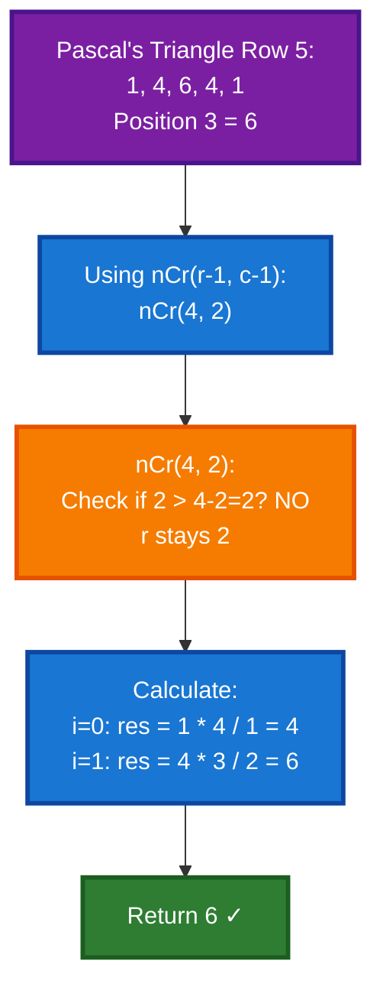
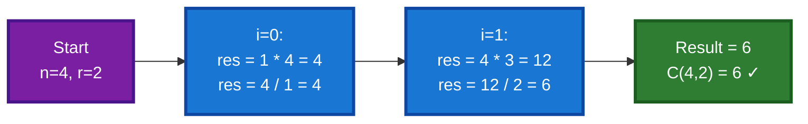
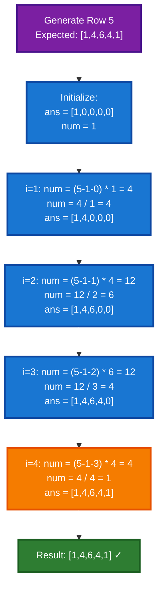
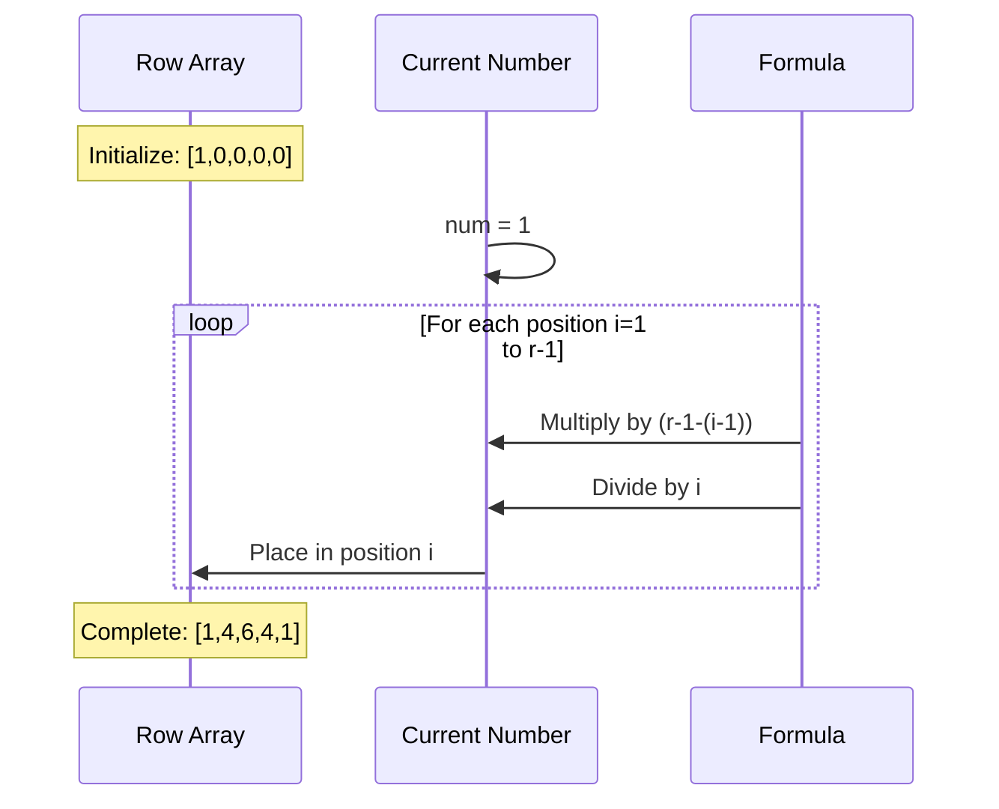
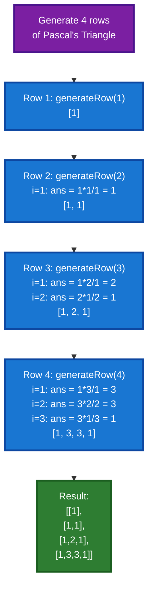
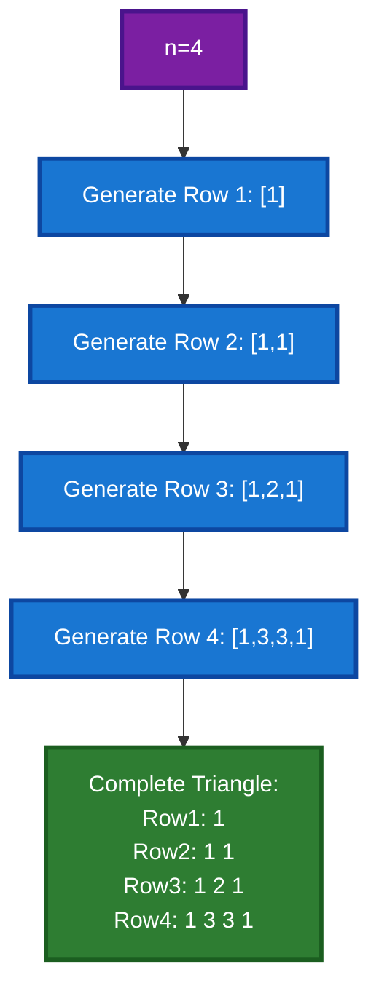

# 📚 Pascal's Triangle - Complete Guide

This file contains three variations of Pascal's Triangle problems, each requiring different approaches to find specific elements or entire rows/triangle.

---

## 📋 Table of Contents

1. [Pascal's Triangle Overview](#pascals-triangle-overview)
2. [Problem 1: Find Single Element](#problem-1-find-single-element)
3. [Problem 2: Generate Single Row](#problem-2-generate-single-row)
4. [Problem 3: Generate Complete Triangle](#problem-3-generate-complete-triangle)
5. [Mathematical Foundation](#mathematical-foundation)
6. [Comparison Table](#comparison-table)

---

## Pascal's Triangle Overview

### 📖 What is Pascal's Triangle?

Pascal's Triangle is a triangular array of numbers where:
- Each row starts and ends with 1
- Each interior element is the sum of the two elements directly above it
- Used in combinatorics, binomial expansions, and probability

### 🎨 Visual Representation

```
Row 1:                    1
Row 2:                  1   1
Row 3:                1   2   1
Row 4:              1   3   3   1
Row 5:            1   4   6   4   1
Row 6:          1   5  10  10   5   1
Row 7:        1   6  15  20  15   6   1
```

### 📊 Mathematical Property

Each element at position (r, c) can be calculated using combinations:
```
Pascal[r][c] = C(r-1, c-1) = (r-1)! / ((c-1)! * (r-c)!)
```

Where C(n, r) is the binomial coefficient "n choose r"

---

## Problem 1: Find Single Element

### 📖 Explanation

Given two integers `r` (row) and `c` (column), find the value at that specific position in Pascal's Triangle (1-indexed).

**Example:**
- Input: r=4, c=2
- Output: 3
- Explanation: Row 4 is [1, 3, 3, 1], so position 2 is 3

### 🎯 Approach

Use the **combinatorics formula**:
- Value at (r, c) = C(r-1, c-1)
- Calculate using efficient nCr function
- No need to build entire triangle

**Key Optimization:**
- Use the property: C(n, r) = C(n, n-r)
- Choose the smaller of r or (n-r) to minimize iterations
- If r > n-r, swap to r = n-r

### 💻 Code Implementation

```cpp
class Solution
{
private:
    int nCr(int n, int r)
    {
        if (r > n - r)
        {
            r = n - r;  // Use symmetry property: C(n,r) = C(n,n-r)
        }
        if (r == 1)
            return n;   // Base case: C(n,1) = n
        
        int res = 1;
        for (int i = 0; i < r; i++)
        {
            res = res * (n - i);
            res = res / (i + 1);
        }
        return res;
    }

public:
    int pascalTriangleI(int r, int c) 
    { 
        return nCr(r - 1, c - 1);  // Convert to 0-indexed
    }
};
```

### 🔍 Complexity Analysis

| Complexity | Value |
| ---------- | ----- |
| Time       | O(c)  |
| Space      | O(1)  |

- **Time O(c)**: nCr iteration depends on column value
- **Space O(1)**: Only constant extra space

### 🎨 Dry Run with Visual

**Input**: r=5, c=3



### 📊 nCr Calculation Example

**Calculate C(4,2):**



### ✅ Key Points
- ✓ Uses combinatorics formula: C(r-1, c-1)
- ✓ Most efficient: O(c) time, O(1) space
- ✓ Doesn't build entire triangle
- ✓ Symmetry optimization: C(n,r) = C(n,n-r)
- ✓ Handles large r and c efficiently

---

## Problem 2: Generate Single Row

### 📖 Explanation

Given an integer `r`, return all values in the rth row of Pascal's Triangle (1-indexed).

**Example:**
- Input: r=4
- Output: [1, 3, 3, 1]
- Explanation: Row 4 contains these 4 elements

### 🎯 Approach

**Iterative Formula Approach:**
1. First element is always 1
2. Use the relationship: `next = current * (r - i) / i`
3. Calculate each element based on the previous one
4. Return the complete row

**Mathematical Basis:**
```
Element[i] = Element[i-1] * (row - (i-1)) / i
           = Element[i-1] * (row - i + 1) / i
```

### 💻 Code Implementation

```cpp
class Solution
{
public:
    vector<int> pascalTriangleII(int r)
    {
        vector<int> ans(r, 0);
        
        int num = 1;
        ans[0] = num;  // First element is always 1
        
        // Generate rest of the row using iterative formula
        for (int i = 1; i < r; i++)
        {
            // Formula: C(r-1, i) = C(r-1, i-1) * (r - i) / i
            num = (r - 1 - (i - 1)) * num;  // Multiply by (r - i)
            num = num / i;                   // Divide by i
            ans[i] = num;
        }
        return ans;
    }
};
```

### 🔍 Complexity Analysis

| Complexity | Value |
| ---------- | ----- |
| Time       | O(r)  |
| Space      | O(r)  |

- **Time O(r)**: Iterate through each position in row
- **Space O(r)**: Output array of size r

### 🎨 Dry Run with Visual

**Input**: r=5



### 📊 Iterative Formula Application



### ✅ Key Points
- ✓ Single pass solution: O(r) time
- ✓ Uses iterative formula for efficiency
- ✓ No recursion or factorial calculations
- ✓ Clean and elegant approach
- ✓ Maintains all elements in one array

---

## Problem 3: Generate Complete Triangle

### 📖 Explanation

Given an integer `n`, return the first n rows of Pascal's Triangle.

**Example:**
- Input: n=4
- Output: [[1], [1,1], [1,2,1], [1,3,3,1]]

### 🎯 Approach

**Iterative Row Generation:**
1. Create output vector of vectors
2. For each row from 1 to n:
   - Use the same iterative formula as Problem 2
   - Generate the complete row
   - Add to output
3. Return all n rows

### 💻 Code Implementation

```cpp
class Solution
{
private:
    vector<int> generateRow(int row)
    {
        int ans = 1;
        vector<int> ansRow;
        ansRow.push_back(ans);  // First element is always 1
        
        // Generate rest of the row using iterative formula
        for (int i = 1; i < row; i++)
        {
            ans = (ans * (row - 1 - (i - 1))) / i;
            ansRow.push_back(ans);
        }
        return ansRow;
    }

public:
    vector<vector<int>> pascalTriangleIII(int n)
    {
        vector<vector<int>> res;
        for (int row = 1; row <= n; row++)
        {
            res.push_back(generateRow(row));
        }
        return res;
    }
};
```

### 🔍 Complexity Analysis

| Complexity | Value |
| ---------- | ----- |
| Time       | O(n²) |
| Space      | O(n²) |

- **Time O(n²)**: Generate n rows, each row i has i elements
  - Total: 1 + 2 + 3 + ... + n = n(n+1)/2 = O(n²)
- **Space O(n²)**: Output stores all elements

### 🎨 Dry Run with Visual

**Input**: n=4



### 📊 Triangle Build-up Visualization



### ✅ Key Points
- ✓ Generates all n rows completely
- ✓ Uses helper function for row generation
- ✓ O(n²) time complexity (optimal for generating all elements)
- ✓ Space complexity O(n²) for output
- ✓ Reusable approach (helper function)

---

## Mathematical Foundation

### 🎯 Binomial Coefficient Formula

The value at position (r, c) in Pascal's Triangle is:

```
Pascal[r][c] = C(r-1, c-1) = (r-1)! / ((c-1)! * (r-c)!)
```

### 📊 Pascal's Triangle Properties

1. **Symmetry**: C(n, r) = C(n, n-r)
   ```
   Row 5: 1, 4, 6, 4, 1
          ↑           ↑
       C(4,0)      C(4,4)
   ```

2. **Sum Property**: Sum of row n = 2^(n-1)
   ```
   Row 4: [1, 3, 3, 1] → Sum = 8 = 2³
   Row 5: [1, 4, 6, 4, 1] → Sum = 16 = 2⁴
   ```

3. **Recurrence Relation**: 
   ```
   C(n, r) = C(n-1, r-1) + C(n-1, r)
   ```

### 🔄 Iterative Formula Derivation

```
C(n, 0) = 1
C(n, 1) = n
C(n, r) = C(n, r-1) * (n - r + 1) / r

Used in efficient row generation!
```

---

## Comparison Table

| Problem          | Input        | Output              | Time    | Space | Key Technique         |
| ---------------- | ------------ | ------------------- | ------- | ----- | --------------------- |
| **I - Element**  | r, c         | Single integer      | O(c)    | O(1)  | Combinatorics (nCr)   |
| **II - Row**     | r            | Vector of integers  | O(r)    | O(r)  | Iterative formula     |
| **III - Triangle** | n          | 2D vector           | O(n²)   | O(n²) | Row generator helper  |

---

## Implementation Comparison

### 📈 Performance Analysis

```
For generating row 100:
- Problem 1: Finding specific element
  Time: O(c) where c ≤ 100 → ~50 operations (avg)
  
- Problem 2: Entire row
  Time: O(100) → 100 operations
  
- Problem 3: All 100 rows
  Time: O(100²) → 5050 operations
```

### 🎯 When to Use Each Approach

1. **Problem I (Single Element)**
   - Need only one specific value
   - r and c are large but you need only one element
   - Most memory-efficient

2. **Problem II (Single Row)**
   - Need all values in one row
   - Balanced time and space usage
   - Clean iterative solution

3. **Problem III (Complete Triangle)**
   - Need entire triangle for computation
   - All values will be used
   - Complete Pascal's Triangle for analysis

---

## ✅ Key Takeaways

1. **Combinatorics Foundation**: Pascal's Triangle is based on binomial coefficients
2. **Formula Optimization**: C(n,r) = C(n,n-r) reduces calculations by half
3. **Iterative Formula**: C(n,r) = C(n,r-1) * (n-r+1)/r enables efficient computation
4. **Complexity Levels**:
   - Single element: O(c) time, O(1) space (best for single value)
   - Single row: O(r) time, O(r) space (efficient row generation)
   - Full triangle: O(n²) time, O(n²) space (complete structure)

5. **Mathematical Properties**:
   - Symmetry: Reduces computations
   - Sum of row n = 2^(n-1)
   - Each element = sum of two above

---

## 🔗 Related Concepts

- **Binomial Expansion**: (a+b)^n coefficients
- **Combinations**: nCr calculations
- **Dynamic Programming**: Alternative approach to generate triangle
- **Recursion**: Recursive implementation using recurrence relation

---

## 💡 Practice Variations

1. Generate triangle using **dynamic programming** (2D array approach)
2. Generate using **recursion** with memoization
3. Find **kth row** efficiently
4. Calculate **sum of specific rows**
5. Find **diagonal sums**
6. Implement **reverse spiral** generation

---

**Happy Coding! 🚀**

_Last Updated: October 10, 2025_
