```mermaid
graph TD
    A["Matrix 3x3:<br/>1 2 3<br/>4 5 6<br/>7 8 9"] --> B["Position Mapping:<br/>(i,j) → (j, n-i-1)"]
    B --> C["(0,0)→1 → (0,2)<br/>(0,1)→2 → (1,2)<br/>(0,2)→3 → (2,2)"]
    C --> D["(1,0)→4 → (0,1)<br/>(1,1)→5 → (1,1)<br/>(1,2)→6 → (2,1)"]
    D --> E["(2,0)→7 → (0,0)<br/>(2,1)→8 → (1,0)<br/>(2,2)→9 → (2,0)"]
    E --> F["Rotated Matrix:<br/>7 4 1<br/>8 5 2<br/>9 6 3 ✓"]
    
    style A fill:#7B1FA2,stroke:#4A148C,stroke-width:3px,color:#fff
    style B fill:#1976D2,stroke:#0D47A1,stroke-width:3px,color:#fff
    style C fill:#1976D2,stroke:#0D47A1,stroke-width:3px,color:#fff
    style D fill:#1976D2,stroke:#0D47A1,stroke-width:3px,color:#fff
    style E fill:#1976D2,stroke:#0D47A1,stroke-width:3px,color:#fff
    style F fill:#2E7D32,stroke:#1B5E20,stroke-width:3px,color:#fff
```

```mermaid
graph TD
    A["Brute Force: 3 Nested Loops<br/>Check all triplets"] --> B["(0,1,2): 2+(-2)+0 = 0 ✓<br/>sorted = [-2,0,2]<br/>Add to set"]
    B --> C["(0,1,3): 2+(-2)+3 = 3 ✗<br/>Skip"]
    C --> D["(1,2,3): (-2)+0+3 = 1 ✗<br/>Skip"]
    D --> E["(2,3,4): 0+3+(-3) = 0 ✓<br/>sorted = [-3,0,3]<br/>Add to set"]
    E --> F["(1,4,5): (-2)+(-3)+5 = 0 ✓<br/>sorted = [-3,-2,5]<br/>Add to set"]
    F --> G["Result Set:<br/>{[-3,-2,5], [-3,0,3], [-2,0,2]}"]
    
    style A fill:#7B1FA2,stroke:#4A148C,stroke-width:3px,color:#fff
    style B fill:#2E7D32,stroke:#1B5E20,stroke-width:3px,color:#fff
    style C fill:#D32F2F,stroke:#B71C1C,stroke-width:3px,color:#fff
    style D fill:#D32F2F,stroke:#B71C1C,stroke-width:3px,color:#fff
    style E fill:#2E7D32,stroke:#1B5E20,stroke-width:3px,color:#fff
    style F fill:#2E7D32,stroke:#1B5E20,stroke-width:3px,color:#fff
    style G fill:#F57C00,stroke:#E65100,stroke-width:3px,color:#fff
```

```mermaid
graph TD
    A["i=0 fixed=2:<br/>Find pairs summing to -2"] --> B["j=1: third = -(2-2) = 0<br/>hashset={}, not found<br/>hashset={-2}"]
    B --> C["j=2: third = -(2+0) = -2<br/>hashset={-2}, FOUND! ✓<br/>triplet: [2,0,-2] sorted [-2,0,2]"]
    C --> D["i=1 fixed=-2:<br/>Find pairs summing to 2"]
    D --> E["j=5: third = -(-2+5) = -3<br/>hashset={0,3,-3}, FOUND! ✓<br/>triplet: [-2,5,-3] sorted [-3,-2,5]"]
    E --> F["i=2 fixed=0:<br/>Find pairs summing to 0"]
    F --> G["j=4: third = -(0-3) = 3<br/>hashset={3}, FOUND! ✓<br/>triplet: [0,-3,3] sorted [-3,0,3]"]
    G --> H["Result: {[-3,-2,5], [-3,0,3], [-2,0,2]}"]
    
    style A fill:#7B1FA2,stroke:#4A148C,stroke-width:3px,color:#fff
    style B fill:#1976D2,stroke:#0D47A1,stroke-width:3px,color:#fff
    style C fill:#2E7D32,stroke:#1B5E20,stroke-width:3px,color:#fff
    style D fill:#1976D2,stroke:#0D47A1,stroke-width:3px,color:#fff
    style E fill:#2E7D32,stroke:#1B5E20,stroke-width:3px,color:#fff
    style F fill:#1976D2,stroke:#0D47A1,stroke-width:3px,color:#fff
    style G fill:#2E7D32,stroke:#1B5E20,stroke-width:3px,color:#fff
    style H fill:#F57C00,stroke:#E65100,stroke-width:3px,color:#fff
```

# Array Problems: Questions 7-10

## 📋 Table of Contents
1. [Problem 7: Rotate Matrix by 90 Degrees](#problem-7-rotate-matrix-by-90-degrees)
2. [Problem 8: Two Sum](#problem-8-two-sum)
3. [Problem 9: Three Sum](#problem-9-three-sum)
4. [Problem 10: Four Sum](#problem-10-four-sum)

---

## Problem 7: Rotate Matrix by 90 Degrees

### Problem Statement
Given an N × N 2D integer matrix, rotate the matrix by 90 degrees **clockwise**.

**Constraints:**
- The rotation must be done **in place** (modify input directly)
- N × N square matrix

**Example:**
```
Input:
1 2 3
4 5 6
7 8 9

Output:
7 4 1
8 5 2
9 6 3
```

---

### Approach 1: Brute Force (Extra Space)

#### Explanation
Create a new matrix to store the rotated values. For every element at position `(i, j)` in the original matrix, place it at position `(j, n - i - 1)` in the rotated matrix.

**Key Formula:** `rotated[j][n - i - 1] = matrix[i][j]`

#### Logic
- Element at row `i`, column `j` in original → Element at row `j`, column `n-1-i` in rotated
- This is because rotating 90° clockwise means:
  - First row becomes last column
  - Second row becomes second-last column
  - And so on...

#### Code
```cpp
class Solution {
public:
    void rotateMatrix(vector<vector<int>> &matrix) {
        int n = matrix.size();
        
        // Step 1: Create new matrix to store rotated values
        vector<vector<int>> rotated(n, vector<int>(n, 0));
        
        // Step 2: Iterate through original matrix
        for (int i = 0; i < n; i++) {
            for (int j = 0; j < n; j++) {
                // Place element at new position
                rotated[j][n - i - 1] = matrix[i][j];
            }
        }
        
        // Step 3: Copy rotated matrix back to original
        for (int i = 0; i < n; i++) {
            for (int j = 0; j < n; j++) {
                matrix[i][j] = rotated[i][j];
            }
        }
    }
};
```

#### Complexity Analysis
- **Time Complexity:** O(N²) - Need to traverse all N² elements
- **Space Complexity:** O(N²) - Extra space for new matrix

#### Dry Run with Visual

**Input Matrix (3×3):**
```
1 2 3
4 5 6
7 8 9
```



---

### Approach 2: Optimal (In-Place - Transpose + Reverse)

#### Explanation
**Key Insight:** Rotate 90° clockwise = Transpose + Reverse Each Row

This two-step process:
1. **Transpose:** Swap `matrix[i][j]` with `matrix[j][i]`
2. **Reverse Each Row:** Reverse elements in each row

#### Why This Works
- **Transpose** flips the matrix along the diagonal
- **Row Reversal** completes the 90° clockwise rotation

**Example:**
```
Original:           After Transpose:    After Row Reverse:
1 2 3               1 4 7               7 4 1
4 5 6      →        2 5 8       →       8 5 2
7 8 9               3 6 9               9 6 3
```

#### Code
```cpp
class Solution {
public:
    void rotateMatrix(vector<vector<int>> &matrix) {
        int n = matrix[0].size();
        
        // Step 1: Transpose the matrix
        for (int i = 0; i < n - 1; i++) {
            for (int j = i + 1; j < n; j++) {
                swap(matrix[i][j], matrix[j][i]);
            }
        }
        
        // Step 2: Reverse each row
        for (int k = 0; k < n; k++) {
            reverse(matrix[k].begin(), matrix[k].end());
        }
    }
};
```

#### Complexity Analysis
- **Time Complexity:** O(N²) - Transpose: O(N²) + Row reversal: O(N²) = O(N²)
- **Space Complexity:** O(1) - Only using `swap` operation, no extra space

#### Dry Run with Visual

**Original Matrix:**
```
1 2 3
4 5 6
7 8 9
```

**Step-by-Step: Transpose + Row Reverse**

```mermaid
graph TD
    A["Original Matrix:<br/>1 2 3<br/>4 5 6<br/>7 8 9"] --> B["Step 1: Transpose<br/>Swap [i][j] ↔ [j][i]"]
    B --> C["After Swap1: swap(2,4)<br/>1 4 3<br/>2 5 6<br/>7 8 9"]
    C --> D["After Swap2: swap(3,7)<br/>1 4 7<br/>2 5 6<br/>3 8 9"]
    D --> E["After Swap3: swap(6,8)<br/>1 4 7<br/>2 5 8<br/>3 6 9"]
    E --> F["Step 2: Reverse Each Row"]
    F --> G["Row 0: [1,4,7] → [7,4,1]<br/>Row 1: [2,5,8] → [8,5,2]<br/>Row 2: [3,6,9] → [9,6,3]"]
    G --> H["Final Rotated Matrix:<br/>7 4 1<br/>8 5 2<br/>9 6 3 ✓"]
    
    style A fill:#7B1FA2,stroke:#4A148C,stroke-width:3px,color:#fff
    style B fill:#1976D2,stroke:#0D47A1,stroke-width:3px,color:#fff
    style C fill:#00796B,stroke:#004D40,stroke-width:3px,color:#fff
    style D fill:#00796B,stroke:#004D40,stroke-width:3px,color:#fff
    style E fill:#00796B,stroke:#004D40,stroke-width:3px,color:#fff
    style F fill:#1976D2,stroke:#0D47A1,stroke-width:3px,color:#fff
    style G fill:#F57C00,stroke:#E65100,stroke-width:3px,color:#fff
    style H fill:#2E7D32,stroke:#1B5E20,stroke-width:3px,color:#fff
```



---

## Problem 8: Two Sum

### Problem Statement
Given an array of integers `nums` and an integer `target`, return the **indices** of the two elements that add up to the target.

**Constraints:**
- Exactly one solution exists
- Same element cannot be used twice
- Return indices in increasing order

**Example:**
```
Input: nums = [1, 6, 2, 10, 3], target = 7
Output: [0, 1]
Explanation: nums[0] + nums[1] = 1 + 6 = 7
```

---

### Approach 1: Brute Force (Nested Loop)

#### Explanation
Check all possible pairs and find the pair whose sum equals the target.

**Algorithm:**
1. Use two nested loops to generate all pairs
2. For each pair, check if sum equals target
3. If found, return their indices immediately

#### Code
```cpp
class Solution {
public:
    vector<int> twoSum(vector<int> &nums, int target) {
        int n = nums.size();
        vector<int> ans;
        
        // Check all possible pairs
        for (int i = 0; i < n; i++) {
            for (int j = i + 1; j < n; j++) {
                // If pair found, return immediately
                if (nums[i] + nums[j] == target) {
                    ans.push_back(i);
                    ans.push_back(j);
                    return ans;
                }
            }
        }
        
        // No pair found
        return {-1, -1};
    }
};
```

#### Complexity Analysis
- **Time Complexity:** O(N²) - Two nested loops checking all pairs
- **Space Complexity:** O(1) - Only using constant extra space (answer vector excluded)

#### Dry Run with Visual

**Input:** `nums = [1, 6, 2, 10, 3]`, `target = 7`


---

### Approach 2: Better (Hash Map)

#### Explanation
Use a hash map to store elements we've seen along with their indices. For each element, check if its complement (`target - current`) exists in the map.

**Key Insight:** Instead of checking all pairs, maintain a map of seen elements. When we see a number, we immediately check if its complement exists.

**Algorithm:**
1. Iterate through the array
2. Calculate `complement = target - current_element`
3. Check if complement exists in map
   - If YES: Return indices of complement and current element
   - If NO: Store current element and its index in map
4. If no pair found, return {-1, -1}

#### Code
```cpp
class Solution {
public:
    vector<int> twoSum(vector<int> &nums, int target) {
        // Map to store (element, index) pairs
        unordered_map<int, int> mpp;
        int n = nums.size();
        
        for (int i = 0; i < n; i++) {
            int num = nums[i];
            int complement = target - num;
            
            // Check if complement exists in map
            if (mpp.find(complement) != mpp.end()) {
                return {mpp[complement], i};
            }
            
            // Store current number and its index
            mpp[num] = i;
        }
        
        // No pair found
        return {-1, -1};
    }
};
```

#### Complexity Analysis
- **Time Complexity:** O(N) - Single pass through array, each hash operation is O(1) on average
- **Space Complexity:** O(N) - Hash map stores up to N elements

#### Dry Run with Visual

**Input:** `nums = [1, 6, 2, 10, 3]`, `target = 7`


---

### Approach 3: Optimal (Two Pointers - When Sorted)

#### Explanation
If the array needs to be sorted (not a constraint here, but shown for completeness), use two-pointer approach:
1. Create pairs of `(element, original_index)`
2. Sort by element value
3. Use two pointers from start and end
4. If sum = target, return original indices
5. If sum < target, move left pointer right (need larger sum)
6. If sum > target, move right pointer left (need smaller sum)

**Why Sorting Helps:** With sorted data, two pointers can efficiently navigate the search space.

#### Code
```cpp
class Solution {
public:
    vector<int> twoSum(vector<int> &nums, int target) {
        int n = nums.size();
        vector<int> ans;
        
        // Create pairs of (value, original_index)
        vector<vector<int>> eleIndex;
        for (int i = 0; i < nums.size(); i++) {
            eleIndex.push_back({nums[i], i});
        }
        
        // Sort by value
        sort(eleIndex.begin(), eleIndex.end(), 
             [](const vector<int> &a, const vector<int> &b) {
                 return a[0] < b[0];
             });
        
        // Two pointers approach
        int left = 0, right = n - 1;
        
        while (left < right) {
            int sum = eleIndex[left][0] + eleIndex[right][0];
            
            if (sum == target) {
                ans.push_back(eleIndex[left][1]);
                ans.push_back(eleIndex[right][1]);
                return ans;
            }
            else if (sum < target) {
                left++;
            }
            else {
                right--;
            }
        }
        
        return {-1, -1};
    }
};
```

#### Complexity Analysis
- **Time Complexity:** O(N log N) - Dominated by sorting
- **Space Complexity:** O(N) - For storing (value, index) pairs

#### Dry Run with Visual

**Input:** `nums = [1, 6, 2, 10, 3]`, `target = 7`


---

#### Comparison Table

| Approach | Time | Space | Notes |
|----------|------|-------|-------|
| Brute Force | O(N²) | O(1) | Simple but slow |
| Hash Map | **O(N)** | O(N) | **Best for this problem** |
| Two Pointers | O(N log N) | O(N) | Good when array is sorted |

---

## Problem 9: Three Sum

### Problem Statement
Given an integer array `nums`, return all **unique triplets** that sum to **zero**.

**Constraints:**
- Return unique triplets only (no duplicates)
- Element indices must be distinct
- Solution set can be in any order
- One element can be part of multiple triplets

**Example:**
```
Input: nums = [2, -2, 0, 3, -3, 5]
Output: [[-3, -2, 5], [-3, 0, 3], [-2, 0, 2]]
```

---

### Approach 1: Brute Force (3 Nested Loops)

#### Explanation
Check all possible triplets using three nested loops. Use a set to handle duplicates automatically.

**Algorithm:**
1. Generate all possible triplets using three nested loops
2. For each triplet, check if sum equals 0
3. If yes, sort and insert into set (set handles duplicates)
4. Convert set to vector and return

#### Code
```cpp
class Solution {
public:
    vector<vector<int>> threeSum(vector<int> &nums) {
        set<vector<int>> tripletSet;
        int n = nums.size();
        
        // Check all possible triplets
        for (int i = 0; i < n - 2; i++) {
            for (int j = i + 1; j < n - 1; j++) {
                for (int k = j + 1; k < n; k++) {
                    if (nums[i] + nums[j] + nums[k] == 0) {
                        // Found a triplet
                        vector<int> temp = {nums[i], nums[j], nums[k]};
                        sort(temp.begin(), temp.end());
                        tripletSet.insert(temp);
                    }
                }
            }
        }
        
        // Convert set to vector
        vector<vector<int>> ans(tripletSet.begin(), tripletSet.end());
        return ans;
    }
};
```

#### Complexity Analysis
- **Time Complexity:** O(N³ log K) - Three nested loops: O(N³), sorting each triplet: O(1) (fixed size), inserting into set: O(log K)
  - Where K is the number of unique triplets (at most O(N³))
  - Overall: **O(N³ log N)**
- **Space Complexity:** O(K) - Set stores unique triplets

#### Dry Run with Visual

**Input:** `nums = [2, -2, 0, 3, -3, 5]`



---

### Approach 2: Better (Outer Loop + Hash Set)

#### Explanation
Optimize by:
1. Using outer loop to fix first element
2. Using hash set for remaining two elements (inner two-pointer logic with set)

**Algorithm:**
1. Iterate through each element as the fixed element
2. For remaining elements, use a hash set approach
3. For each element, check if complement exists in set
4. Use set to track duplicates

#### Code
```cpp
class Solution {
public:
    vector<vector<int>> threeSum(vector<int> &nums) {
        set<vector<int>> tripletSet;
        int n = nums.size();
        
        // Fix first element
        for (int i = 0; i < n; i++) {
            set<int> hashset;
            
            // Find two elements that sum to -nums[i]
            for (int j = i + 1; j < n; j++) {
                // We need: nums[i] + nums[j] + third = 0
                // So: third = -(nums[i] + nums[j])
                int third = -(nums[i] + nums[j]);
                
                if (hashset.find(third) != hashset.end()) {
                    // Found a triplet
                    vector<int> temp = {nums[i], nums[j], third};
                    sort(temp.begin(), temp.end());
                    tripletSet.insert(temp);
                }
                
                hashset.insert(nums[j]);
            }
        }
        
        vector<vector<int>> ans(tripletSet.begin(), tripletSet.end());
        return ans;
    }
};
```

#### Complexity Analysis
- **Time Complexity:** O(N²) - Outer loop: O(N), inner hash set operations: O(N) average
- **Space Complexity:** O(N) - Hash set stores up to N elements

#### Dry Run with Visual

**Input:** `nums = [2, -2, 0, 3, -3, 5]`



---

### Approach 3: Optimal (Sort + Two Pointers)

#### Explanation
**Most Efficient Approach:**
1. Sort the array first
2. Fix one element using outer loop
3. Use two-pointer technique on remaining elements
4. Skip duplicates explicitly (no set needed)

**Key Advantages:**
- Sorting enables two-pointer optimization
- Explicit duplicate skipping is O(1)
- Set insertion is eliminated (saves log N factor)

#### Code
```cpp
class Solution {
public:
    vector<vector<int>> threeSum(vector<int> &nums) {
        sort(nums.begin(), nums.end());
        int target = 0;
        int n = nums.size();
        vector<vector<int>> ans;
        
        // Fix first element
        for (int i = 0; i < n; i++) {
            // Skip duplicate values for i
            if (i > 0 && nums[i] == nums[i - 1])
                continue;
            
            // Two pointers for remaining elements
            int j = i + 1;
            int k = n - 1;
            
            while (j < k) {
                int sum = nums[i] + nums[j] + nums[k];
                
                if (sum < target) {
                    j++;
                }
                else if (sum > target) {
                    k--;
                }
                else {
                    // Found a triplet
                    ans.push_back({nums[i], nums[j], nums[k]});
                    j++;
                    k--;
                    
                    // Skip duplicates for j
                    while (j < k && nums[j] == nums[j - 1])
                        j++;
                    
                    // Skip duplicates for k
                    while (k > j && nums[k] == nums[k + 1])
                        k--;
                }
            }
        }
        
        return ans;
    }
};
```

#### Complexity Analysis
- **Time Complexity:** O(N²) - Sorting: O(N log N), outer loop with two pointers: O(N²)
  - Overall: **O(N log N) + O(N²) = O(N²)**
- **Space Complexity:** O(1) - No extra space (excluding answer)

#### Dry Run with Visual

**Input:** `nums = [2, -2, 0, 3, -3, 5]` → Sorted: `[-3, -2, 0, 2, 3, 5]`, `target = 0`

```mermaid
graph TD
    A["Sorted Array: [-3, -2, 0, 2, 3, 5]<br/>Use two pointers after fixing"] --> B["Step 1: k=2(3), l=5(9)<br/>sum=-2+1+3+9=11 > 7<br/>l--"]
    B --> C["Step 2: k=2(3), l=4(7)<br/>sum=-2+1+3+7=9 > 7<br/>l--"]
    C --> D["Step 3: k=2(3), l=3(5)<br/>sum=-2+1+3+5=7 = 7 ✓<br/>Add [-2,1,3,5]"]
    D --> E["k++, l--<br/>k=3, l=2<br/>k < l? NO<br/>Exit inner loop"]
    E --> F["Check i=1(1):<br/>No valid triplets"]
    F --> G["Result: [[-2,1,3,5]]"]
    
    style A fill:#7B1FA2,stroke:#4A148C,stroke-width:3px,color:#fff
    style B fill:#F57C00,stroke:#E65100,stroke-width:3px,color:#fff
    style C fill:#F57C00,stroke:#E65100,stroke-width:3px,color:#fff
    style D fill:#2E7D32,stroke:#1B5E20,stroke-width:3px,color:#fff
    style E fill:#1976D2,stroke:#0D47A1,stroke-width:3px,color:#fff
    style F fill:#D32F2F,stroke:#B71C1C,stroke-width:3px,color:#fff
    style G fill:#F57C00,stroke:#E65100,stroke-width:3px,color:#fff
```



**Visual Two-Pointer Movement:**

```mermaid
graph LR
    A["Array: [-2, 1, 3, 5, 7, 9]<br/>Indices: 0  1  2  3  4  5"] 
    B["Initial State<br/>i=0, j=1, k=2, l=5<br/>sum = 11 > 7<br/>Move: l--"]
    C["State 2<br/>i=0, j=1, k=2, l=4<br/>sum = 9 > 7<br/>Move: l--"]
    D["State 3<br/>i=0, j=1, k=2, l=3<br/>sum = 7 = 7 ✓<br/>FOUND!"]
    
    A --> B --> C --> D
    
    style A fill:#7B1FA2,stroke:#4A148C,stroke-width:3px,color:#fff
    style B fill:#F57C00,stroke:#E65100,stroke-width:3px,color:#fff
    style C fill:#F57C00,stroke:#E65100,stroke-width:3px,color:#fff
    style D fill:#2E7D32,stroke:#1B5E20,stroke-width:3px,color:#fff
