# 📚 Array Fundamentals - Complete Guide

This directory contains fundamental array operations and algorithms with detailed explanations, complexity analysis, and visual demonstrations.

---

## 📋 Table of Contents

1. [Linear Search](#1-linear-search)
2. [Find Largest Element](#2-find-largest-element)
3. [Find Second Largest Element](#3-find-second-largest-element)
4. [Maximum Consecutive Ones](#4-maximum-consecutive-ones)
5. [Left Rotate Array by One](#5-left-rotate-array-by-one)
6. [Left Rotate Array by K - Brute Force](#6-left-rotate-array-by-k---brute-force)
7. [Left Rotate Array by K - Optimal](#7-left-rotate-array-by-k---optimal)
8. [Comparison Table](#comparison-table)
9. [Key Concepts Summary](#key-concepts-summary)

---

## 1. Linear Search

### 📖 Explanation

Linear Search is the simplest searching algorithm that sequentially checks each element in the array until the target element is found or the entire array has been traversed.

### 🎯 Approach

1. Start from the first element (index 0)
2. Compare each element with the target value
3. If match found, return the index
4. If array ends without finding target, return -1

### 💻 Code Implementation

```cpp
// linear search
class Solution
{
public:
    int linearSearch(vector<int> &nums, int target)
    {
        // your code goes here
        for (int i = 0; i < nums.size(); i++)
        {
            if (target == nums[i])
                return i;
        }
        return -1;
    }
};
```

### 🔍 Complexity Analysis

| Complexity Type | Best Case | Average Case | Worst Case |
| --------------- | --------- | ------------ | ---------- |
| Time            | O(1)      | O(n)         | O(n)       |
| Space           | O(1)      | O(1)         | O(1)       |

- **Best Case O(1)**: Target found at first position
- **Average Case O(n)**: Target at middle position
- **Worst Case O(n)**: Target at last position or not present
- **Space O(1)**: No extra space required

### 🎨 Dry Run with Visual

**Input**: `nums = [4, 2, 7, 1, 9, 5]`, `target = 7`

```mermaid
graph LR
    A["Start<br/>target = 7"] --> B["i=0<br/>nums[0]=4<br/>4≠7"]
    B --> C["i=1<br/>nums[1]=2<br/>2≠7"]
    C --> D["i=2<br/>nums[2]=7<br/>7=7 ✓"]
    D --> E["Found!<br/>Return index 2"]

    style A fill:#7B1FA2,stroke:#4A148C,stroke-width:3px,color:#fff
    style B fill:#D32F2F,stroke:#B71C1C,stroke-width:3px,color:#fff
    style C fill:#D32F2F,stroke:#B71C1C,stroke-width:3px,color:#fff
    style D fill:#2E7D32,stroke:#1B5E20,stroke-width:3px,color:#fff
    style E fill:#F57C00,stroke:#E65100,stroke-width:3px,color:#fff
```

### 📊 Visualization

```mermaid
sequenceDiagram
    participant Array as Array [4,2,7,1,9,5]
    participant Search as Linear Search
    participant Result as Result

    Search->>Array: Check index 0
    Array-->>Search: 4 ≠ 7
    Search->>Array: Check index 1
    Array-->>Search: 2 ≠ 7
    Search->>Array: Check index 2
    Array-->>Search: 7 = 7 (Match!)
    Search->>Result: Return 2

    Note over Search,Result: Element found at index 2
```

### ✅ Key Points

- ✓ Simple to implement and understand
- ✓ Works on unsorted arrays
- ✓ No preprocessing required
- ✓ O(1) space complexity
- ✗ Inefficient for large datasets
- ✗ O(n) time complexity

---

## 2. Find Largest Element

### 📖 Explanation

This algorithm finds the maximum element in an array by maintaining a variable that tracks the largest value encountered so far during traversal.

### 🎯 Approach

1. Initialize `largest` to the smallest possible integer (`INT_MIN`)
2. Traverse through the array
3. Update `largest` whenever a bigger element is found
4. Return the largest value

### 💻 Code Implementation

```cpp
// find largest element
class Solution
{
public:
    int largestElement(vector<int> &nums)
    {
        int largest = INT_MIN;
        for (int i = 0; i < nums.size(); i++)
        {
            largest = max(largest, nums[i]);
        }
        return largest;
    }
};
```

### 🔍 Complexity Analysis

| Complexity Type | Best Case | Average Case | Worst Case |
| --------------- | --------- | ------------ | ---------- |
| Time            | O(n)      | O(n)         | O(n)       |
| Space           | O(1)      | O(1)         | O(1)       |

- **All Cases O(n)**: Must check every element once
- **Space O(1)**: Only one variable for tracking

### 🎨 Dry Run with Visual

**Input**: `nums = [3, 8, 1, 9, 4, 6]`

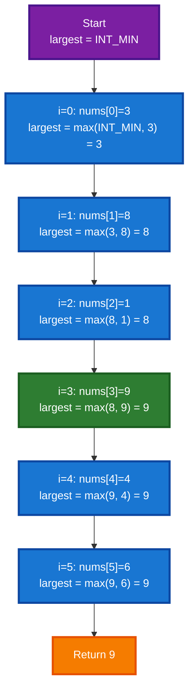

### 📊 Step-by-Step Updates

```mermaid
gantt
    title Largest Element Updates
    dateFormat X
    axisFormat %s

    section Initialization
    largest = INT_MIN :0, 1

    section Updates
    largest = 3 :1, 2
    largest = 8 :2, 3
    stays 8 :3, 4
    largest = 9 :4, 5
    stays 9 :5, 6
    stays 9 :6, 7

    section Result
    Return 9 :7, 8
```

### ✅ Key Points

- ✓ Single pass through array
- ✓ Very efficient O(n) solution
- ✓ Minimal space usage
- ✓ Simple and intuitive
- ✓ Works with negative numbers

---

## 3. Find Second Largest Element

### 📖 Explanation

This algorithm finds the second largest element in a single pass by maintaining two variables: one for the largest and one for the second largest element.

### 🎯 Approach

1. Initialize `largest` to first element
2. Initialize `secondLargest` to `INT_MIN`
3. For each element:
   - If greater than `largest`: update both variables
   - Else if between `largest` and `secondLargest`: update `secondLargest`
4. Return `secondLargest` (or -1 if not found)

### 💻 Code Implementation

```cpp
// second largest element
class Solution
{
public:
    int secondLargestElement(vector<int> &nums)
    {
        // your code goes here
        int largest = nums[0];
        int secondLargest = INT_MIN;
        for (int i = 1; i < nums.size(); i++)
        {
            if (nums[i] > largest)
            {
                secondLargest = largest;
                largest = nums[i];
            }
            else if (nums[i] < largest && nums[i] > secondLargest)
            {
                secondLargest = nums[i];
            }
        }
        return secondLargest != INT_MIN ? secondLargest : -1;
    }
};
```

### 🔍 Complexity Analysis

| Complexity Type | Best Case | Average Case | Worst Case |
| --------------- | --------- | ------------ | ---------- |
| Time            | O(n)      | O(n)         | O(n)       |
| Space           | O(1)      | O(1)         | O(1)       |

- **All Cases O(n)**: Single pass through array
- **Space O(1)**: Only two tracking variables

### 🎨 Dry Run with Visual

**Input**: `nums = [12, 35, 1, 10, 34, 1]`

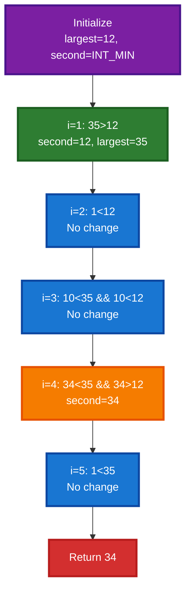

### 📊 Variable Tracking

```mermaid
sequenceDiagram
    participant i as Index
    participant n as nums[i]
    participant l as largest
    participant s as secondLargest

    Note over i,s: Initial: largest=12, second=INT_MIN

    i->>n: i=1, value=35
    n->>l: 35 > 12, update
    l->>s: old largest (12) → second
    Note over l,s: largest=35, second=12

    i->>n: i=2, value=1
    Note over l,s: No change (1 < 12)

    i->>n: i=3, value=10
    Note over l,s: No change (10 < 12)

    i->>n: i=4, value=34
    n->>s: 34 < 35 && 34 > 12
    Note over l,s: largest=35, second=34

    i->>n: i=5, value=1
    Note over l,s: No change

    Note over s: Final: Return 34
```

### ✅ Key Points

- ✓ Single pass solution
- ✓ Optimal O(n) time complexity
- ✓ Handles edge cases (all same elements)
- ✓ Returns -1 if no second largest exists
- ✓ Better than sorting approach O(n log n)

---

## 4. Maximum Consecutive Ones

### 📖 Explanation

This problem finds the maximum number of consecutive 1s in a binary array. The algorithm maintains a running count of consecutive 1s and tracks the maximum.

### 🎯 Approach

1. Initialize `maxi = 0` and `count = 0`
2. Traverse the array:
   - If element is 1: increment `count` and update `maxi`
   - If element is 0: reset `count` to 0
3. Return `maxi`

### 💻 Code Implementation

```cpp
// maximum consecutive ones
class Solution
{
public:
    int findMaxConsecutiveOnes(vector<int> &nums)
    {
        int maxi = 0;
        int count = 0;
        for (int i = 0; i < nums.size(); i++)
        {
            if (nums[i] == 1)
            {
                count++;
                maxi = max(maxi, count);
            }
            else
            {
                count = 0;
            }
        }
        return maxi;
    };
};
```

### 🔍 Complexity Analysis

| Complexity Type | Best Case | Average Case | Worst Case |
| --------------- | --------- | ------------ | ---------- |
| Time            | O(n)      | O(n)         | O(n)       |
| Space           | O(1)      | O(1)         | O(1)       |

- **All Cases O(n)**: Single pass required
- **Space O(1)**: Only two variables

### 🎨 Dry Run with Visual

**Input**: `nums = [1, 1, 0, 1, 1, 1, 0, 1]`

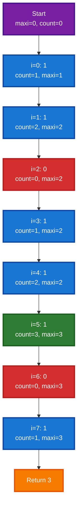

### 📊 Count Tracking


### ✅ Key Points

- ✓ Single pass solution
- ✓ Efficient O(n) time
- ✓ Minimal space O(1)
- ✓ Handles empty arrays
- ✓ Works for any binary array

---

## 5. Left Rotate Array by One

### 📖 Explanation

This algorithm rotates all elements of the array one position to the left. The first element moves to the last position.

### 🎯 Approach

1. Store the first element in a temporary variable
2. Shift all elements one position to the left
3. Place the temporary element at the last position

### 💻 Code Implementation

```cpp
// left rotate array by one
class Solution
{
public:
    void rotateArrayByOne(vector<int> &nums)
    {
        int temp = nums[0];
        for (int i = 1; i < nums.size(); i++)
        {
            nums[i - 1] = nums[i];
        }
        nums[nums.size() - 1] = temp;
    }
};
```

### 🔍 Complexity Analysis

| Complexity Type | Best Case | Average Case | Worst Case |
| --------------- | --------- | ------------ | ---------- |
| Time            | O(n)      | O(n)         | O(n)       |
| Space           | O(1)      | O(1)         | O(1)       |

- **All Cases O(n)**: Must shift all elements
- **Space O(1)**: Only one temporary variable

### 🎨 Dry Run with Visual

**Input**: `nums = [1, 2, 3, 4, 5]`

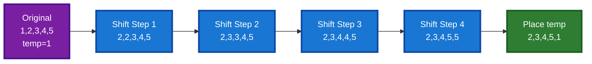

### 📊 Rotation Visualization

```mermaid
sequenceDiagram
    participant Pos0 as Position 0
    participant Pos1 as Position 1
    participant Pos2 as Position 2
    participant Pos3 as Position 3
    participant Pos4 as Position 4
    participant Temp as Temp

    Note over Pos0,Pos4: Initial: [1,2,3,4,5]

    Pos0->>Temp: Save 1
    Pos1->>Pos0: Move 2→0
    Pos2->>Pos1: Move 3→1
    Pos3->>Pos2: Move 4→2
    Pos4->>Pos3: Move 5→3
    Temp->>Pos4: Place 1→4

    Note over Pos0,Pos4: Final: [2,3,4,5,1]
```

### ✅ Key Points

- ✓ In-place rotation
- ✓ O(1) extra space
- ✓ Simple implementation
- ✓ Foundation for K rotations

---

## 6. Left Rotate Array by K - Brute Force

### 📖 Explanation

This approach rotates the array K positions to the left using extra space. It stores the first K elements in a temporary array, shifts the remaining elements, then copies back the K elements.

### 🎯 Approach

1. Handle edge case: `k = k % n` (avoid unnecessary rotations)
2. Store first K elements in temporary array
3. Shift remaining (n-k) elements to the front
4. Copy the K elements from temp to the end

### 💻 Code Implementation

```cpp
// left rotate array by k--brute force

class Solution
{
public:
    // Function to rotate the array to the left by k positions
    void rotateArray(vector<int> &nums, int k)
    {
        int n = nums.size(); // Size of array
        k = k % n;           // To avoid unnecessary rotations

        vector<int> temp;

        // Store first k elements in a temporary array
        for (int i = 0; i < k; i++)
        {
            temp.push_back(nums[i]);
        }

        // Shift n-k elements of given array to the front
        for (int i = k; i < n; i++)
        {
            nums[i - k] = nums[i];
        }

        // Copy back the k elemnents at the end
        for (int i = 0; i < k; i++)
        {
            nums[n - k + i] = temp[i];
        }
    }
};
```

### 🔍 Complexity Analysis

| Complexity Type | Best Case | Average Case | Worst Case |
| --------------- | --------- | ------------ | ---------- |
| Time            | O(n)      | O(n)         | O(n)       |
| Space           | O(k)      | O(k)         | O(k)       |

- **Time O(n)**: Three separate loops but linear overall
- **Space O(k)**: Temporary array for K elements

### 🎨 Dry Run with Visual

**Input**: `nums = [1, 2, 3, 4, 5, 6, 7]`, `k = 3`

```mermaid
graph TD
    A["Original Array<br/>1,2,3,4,5,6,7<br/>k=3"] --> B["Step 1: Store first 3<br/>temp = 1,2,3"]
    B --> C["Step 2: Shift 4→0<br/>4,2,3,4,5,6,7"]
    C --> D["Shift 5→1<br/>4,5,3,4,5,6,7"]
    D --> E["Shift 6→2<br/>4,5,6,4,5,6,7"]
    E --> F["Shift 7→3<br/>4,5,6,7,5,6,7"]
    F --> G["Step 3: Copy temp[0]→4<br/>4,5,6,7,1,6,7"]
    G --> H["Copy temp[1]→5<br/>4,5,6,7,1,2,7"]
    H --> I["Copy temp[2]→6<br/>4,5,6,7,1,2,3"]
    I --> J["Final Result<br/>4,5,6,7,1,2,3"]

    style A fill:#7B1FA2,stroke:#4A148C,stroke-width:3px,color:#fff
    style B fill:#E91E63,stroke:#C2185B,stroke-width:3px,color:#fff
    style C fill:#1976D2,stroke:#0D47A1,stroke-width:3px,color:#fff
    style D fill:#1976D2,stroke:#0D47A1,stroke-width:3px,color:#fff
    style E fill:#1976D2,stroke:#0D47A1,stroke-width:3px,color:#fff
    style F fill:#1976D2,stroke:#0D47A1,stroke-width:3px,color:#fff
    style G fill:#F57C00,stroke:#E65100,stroke-width:3px,color:#fff
    style H fill:#F57C00,stroke:#E65100,stroke-width:3px,color:#fff
    style I fill:#F57C00,stroke:#E65100,stroke-width:3px,color:#fff
    style J fill:#2E7D32,stroke:#1B5E20,stroke-width:3px,color:#fff
```

### 📊 Three-Phase Process

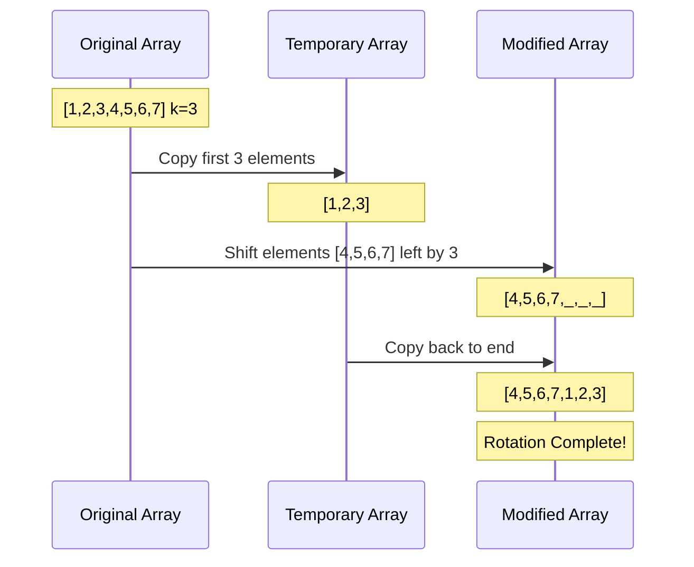

### ✅ Key Points

- ✓ Easy to understand
- ✓ Linear time complexity
- ✓ Handles k > n with modulo
- ✗ Requires O(k) extra space
- ✗ Not optimal space-wise

---

## 7. Left Rotate Array by K - Optimal

### 📖 Explanation

This is the optimal approach using the **Reversal Algorithm**. It performs rotation in-place using only O(1) extra space by reversing portions of the array three times.

### 🎯 Approach - Reversal Algorithm

1. **Reverse first K elements**: `[1,2,3,4,5]` → `[3,2,1,4,5]` (k=3)
2. **Reverse remaining (n-k) elements**: `[3,2,1,4,5]` → `[3,2,1,5,4]`
3. **Reverse entire array**: `[3,2,1,5,4]` → `[4,5,1,2,3]`

**Mathematical Proof**:

- Let array = `A B` where A = first k elements, B = remaining
- Reverse A: `A' B`
- Reverse B: `A' B'`
- Reverse all: `(A' B')' = B A` ✓

### 💻 Code Implementation

```cpp
// left rotate array by k--optimal

class Solution
{
private:
    void reverse(vector<int> &nums, int start, int end)
    {
        while (start < end)
        {
            int temp = nums[start];
            nums[start] = nums[end];
            nums[end] = temp;
            start++, end--;
        }
    }

public:
    // Function to rotate the array to the left by k positions
    void rotateArray(vector<int> &nums, int k)
    {
        int n = nums.size();
        k = k % n;

        reverse(nums, 0, k - 1);
        reverse(nums, k, n - 1);
        reverse(nums, 0, n - 1);
    }
};
```

### 🔍 Complexity Analysis

| Complexity Type | Best Case | Average Case | Worst Case |
| --------------- | --------- | ------------ | ---------- |
| Time            | O(n)      | O(n)         | O(n)       |
| Space           | O(1)      | O(1)         | O(1)       |

- **Time O(n)**: Each element reversed twice (3 passes total)
- **Space O(1)**: In-place reversal, only swap variables
- **Optimal**: Best possible solution!

### 🎨 Dry Run with Visual

**Input**: `nums = [1, 2, 3, 4, 5, 6, 7]`, `k = 3`

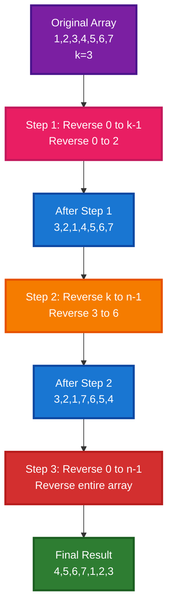

### 📊 Three Reversal Steps

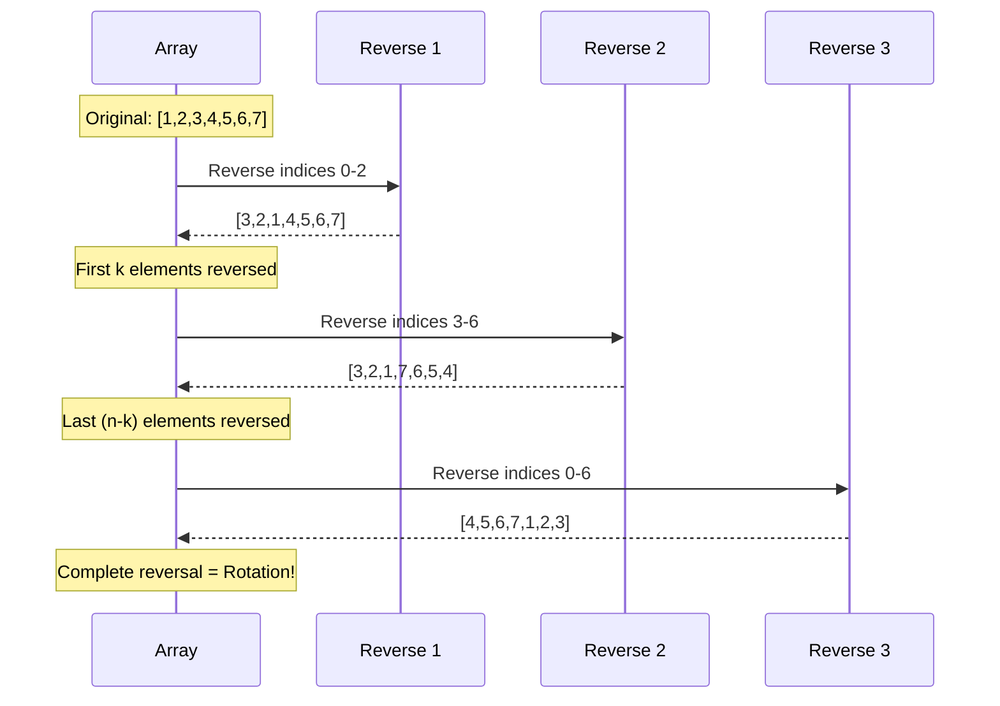

### 📈 Detailed Reversal Process

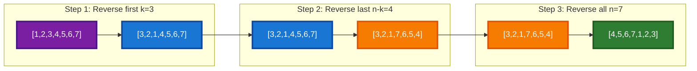

### 🧮 Why This Works - Visual Proof

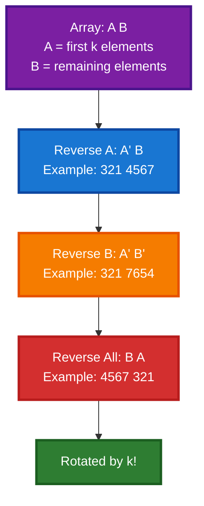

### ✅ Key Points

- ✓ **Optimal Solution**: O(n) time, O(1) space
- ✓ In-place rotation
- ✓ No extra arrays needed
- ✓ Elegant algorithm
- ✓ Uses reversal property
- ✓ Better than brute force approach
- ✓ Industry standard solution

---

## Comparison Table

| Problem                   | Time Complexity | Space Complexity | Best Approach             |
| ------------------------- | --------------- | ---------------- | ------------------------- |
| **Linear Search**         | O(n)            | O(1)             | Sequential scan           |
| **Largest Element**       | O(n)            | O(1)             | Single pass with tracking |
| **Second Largest**        | O(n)            | O(1)             | Two variable tracking     |
| **Max Consecutive Ones**  | O(n)            | O(1)             | Counter with reset        |
| **Rotate by One**         | O(n)            | O(1)             | Shift with temp           |
| **Rotate by K (Brute)**   | O(n)            | O(k)             | Temp array approach       |
| **Rotate by K (Optimal)** | O(n)            | O(1)             | **Reversal Algorithm** ⭐ |

---

## Key Concepts Summary

### 🎯 Array Traversal Patterns

#### 1. **Single Pass with Tracking**

Used in: Largest Element, Second Largest, Max Consecutive Ones

```
Initialize tracker variable(s)
For each element:
    Update tracker based on condition
Return tracker
```

#### 2. **Array Manipulation**

Used in: Rotations

```
Store elements temporarily (or use reversal)
Shift/modify elements
Restore/place elements in new positions
```

#### 3. **Sequential Search**

Used in: Linear Search

```
For each element:
    Check if matches target
    Return if found
Return not found indicator
```

### 🔑 Optimization Techniques

#### **Space Optimization**

- Use variables instead of extra arrays when possible
- In-place modifications save O(n) space
- Reversal algorithm: O(k) → O(1) improvement

#### **Time Optimization**

- Single pass is better than multiple passes
- Track multiple values simultaneously
- Avoid sorting when possible (O(n) vs O(n log n))

### 📊 Common Edge Cases

1. **Empty Array**: `nums.size() == 0`
2. **Single Element**: `nums.size() == 1`
3. **All Same Elements**: `[5, 5, 5, 5]`
4. **K > N**: Use modulo `k = k % n`
5. **Negative Numbers**: Algorithms work for all integers

### 💡 When to Use What

#### **Linear Search vs Binary Search**

- Linear Search: Unsorted arrays, small datasets
- Binary Search: Sorted arrays, O(log n) needed

#### **Brute Force vs Optimal Rotation**

- Brute Force: Easier to understand, acceptable for small K
- Optimal: Production code, large arrays, space constrained

#### **Single vs Multiple Variables**

- Track multiple values to solve in one pass
- Example: Second largest needs 2 variables

---

## 🎓 Practice Problems

### Easy

1. Find the smallest element in array
2. Find the second smallest element
3. Right rotate array by K positions
4. Remove duplicates from sorted array
5. Check if array is sorted

### Medium

6. Move all zeros to end
7. Find missing number in array
8. Find the number appearing once
9. Longest subarray with sum K
10. Two sum problem

### Hard

11. Rotate array by K (follow-up: do it in-place)
12. Find all pairs with given difference
13. Majority element (appears > n/2 times)

---

## 🔗 Related Concepts

- **Binary Search**: For sorted arrays
- **Two Pointers**: For array manipulation
- **Sliding Window**: For subarray problems
- **Hashing**: For frequency-based problems

---

## 📚 Additional Resources

- [Array Data Structure](https://en.wikipedia.org/wiki/Array_data_structure)
- [Array Visualizations](https://visualgo.net/en/array)
- [Time Complexity Analysis](https://www.bigocheatsheet.com/)

---

**Happy Coding! 🚀**

_Last Updated: October 10, 2025_
