# 📚 Sorting Algorithms - Complete Guide

This directory contains implementations of fundamental and advanced sorting algorithms with detailed explanations, complexity analysis, and visual demonstrations.

---

## 📋 Table of Contents

1. [Bubble Sort](#1-bubble-sort)
2. [Selection Sort](#2-selection-sort)
3. [Insertion Sort](#3-insertion-sort)
4. [Merge Sort](#4-merge-sort)
5. [Quick Sort](#5-quick-sort)
6. [Comparison Table](#comparison-table)
7. [When to Use Which Algorithm](#when-to-use-which-algorithm)

---

## 1. Bubble Sort

### 📖 Explanation
Bubble Sort is a simple comparison-based sorting algorithm that repeatedly steps through the list, compares adjacent elements, and swaps them if they're in the wrong order. The algorithm gets its name because smaller elements "bubble" to the top of the list.

### 🎯 Approach
1. Start from the beginning of the array
2. Compare each pair of adjacent elements
3. Swap them if they're in the wrong order
4. After each pass, the largest element "bubbles up" to its correct position
5. Repeat for remaining unsorted elements
6. **Optimization**: If no swaps occur in a pass, the array is already sorted

### 💻 Code Implementation

```cpp
// time complexity is O(n^2)
// space complexity is O(1)
// it is not a stable sort
// it is not a in place sort
// it is not a adaptive sort
// it is not a online sort
// it is not a batch sort
// it is not a parallel sort
// outer loop for n-1 times, because last element will be sorted
// inner loop runs from 0 to n-1-i, because after each pass, the last i elements are sorted
#include <bits/stdc++.h>
using namespace std;
class Solution
{
public:
    vector<int> bubbleSort(vector<int> &nums)
    {
        int n = nums.size();
        for (int i = 0; i < n - 1; i++)
        {                    // Corrected bound
            int didSwap = 0; // Reset on each pass
            for (int j = 0; j < n - 1 - i; j++)
            {
                if (nums[j] > nums[j + 1])
                {
                    swap(nums[j], nums[j + 1]);
                    didSwap++;
                }
            }
            if (didSwap == 0)
                break; // Early exit if already sorted
        }
        return nums;
    }
};
```

### 🔍 Complexity Analysis

| Complexity Type | Best Case | Average Case | Worst Case |
|----------------|-----------|--------------|------------|
| Time           | O(n)      | O(n²)        | O(n²)      |
| Space          | O(1)      | O(1)         | O(1)       |

- **Best Case O(n)**: When array is already sorted (with optimization)
- **Worst Case O(n²)**: When array is reverse sorted
- **Space O(1)**: No extra space required (in-place sorting)

### 🎨 Dry Run with Visual

**Input Array**: [5, 2, 8, 1, 9]

```mermaid
graph TD
    A["Pass 1: [5, 2, 8, 1, 9]"] --> B["Compare 5,2 → Swap → [2, 5, 8, 1, 9]"]
    B --> C["Compare 5,8 → No Swap → [2, 5, 8, 1, 9]"]
    C --> D["Compare 8,1 → Swap → [2, 5, 1, 8, 9]"]
    D --> E["Compare 8,9 → No Swap → [2, 5, 1, 8, 9]"]
    E --> F["✓ Largest element 9 in position"]
    
    F --> G["Pass 2: [2, 5, 1, 8, 9]"]
    G --> H["Compare 2,5 → No Swap → [2, 5, 1, 8, 9]"]
    H --> I["Compare 5,1 → Swap → [2, 1, 5, 8, 9]"]
    I --> J["Compare 5,8 → No Swap → [2, 1, 5, 8, 9]"]
    J --> K["✓ Second largest 8 in position"]
    
    K --> L["Pass 3: [2, 1, 5, 8, 9]"]
    L --> M["Compare 2,1 → Swap → [1, 2, 5, 8, 9]"]
    M --> N["Compare 2,5 → No Swap → [1, 2, 5, 8, 9]"]
    N --> O["✓ Third largest 5 in position"]
    
    O --> P["Pass 4: [1, 2, 5, 8, 9]"]
    P --> Q["Compare 1,2 → No Swap → [1, 2, 5, 8, 9]"]
    Q --> R["✓ No swaps → Array Sorted!"]
    
    style F fill:#90EE90
    style K fill:#90EE90
    style O fill:#90EE90
    style R fill:#FFD700
```



### 📊 Step-by-Step Visualization


### ✅ Key Points
- ✓ Simple to understand and implement
- ✓ In-place sorting (O(1) space)
- ✓ Stable sort (maintains relative order)
- ✓ Adaptive with optimization
- ✗ Poor performance on large datasets
- ✗ O(n²) time complexity

---

## 2. Selection Sort

### 📖 Explanation
Selection Sort divides the array into sorted and unsorted regions. It repeatedly finds the minimum element from the unsorted region and places it at the beginning of the unsorted region.

### 🎯 Approach
1. Start with the entire array as unsorted
2. Find the minimum element in the unsorted region
3. Swap it with the first element of the unsorted region
4. Move the boundary of sorted region one position right
5. Repeat until entire array is sorted

### 💻 Code Implementation

```cpp
// it is basically get the minimum and swap it
// time complexity is O(n^2)
// space complexity is O(1)
// it is not a stable sort
// it is not a in place sort
// it is not a adaptive sort
// it is not a online sort
// it is not a batch sort
// it is not a parallel sort

// outer loop for n-1 times, because last element will be sorted
// inner loop starts from i+1 to n, because we are comparing with the current element and before i+1 is already sorted
#include <bits/stdc++.h>
using namespace std;
class Solution
{
public:
    vector<int> selectionSort(vector<int> &nums)
    {
        int min;
        int n = nums.size();
        int tmp;
        for (int i = 0; i < n - 1; i++)
        {
            min = i;
            for (int j = i + 1; j < n; j++)
            {
                if (nums[j] < nums[min])
                {
                    min = j;
                }
            }
            tmp = nums[min];
            nums[min] = nums[i];
            nums[i] = tmp;
        }
        return nums;
    }
};
```

### 🔍 Complexity Analysis

| Complexity Type | Best Case | Average Case | Worst Case |
|----------------|-----------|--------------|------------|
| Time           | O(n²)     | O(n²)        | O(n²)      |
| Space          | O(1)      | O(1)         | O(1)       |

- **All Cases O(n²)**: Always performs (n-1) + (n-2) + ... + 1 comparisons
- **Space O(1)**: No extra space required
- **Not Adaptive**: Performance doesn't improve on partially sorted arrays

### 🎨 Dry Run with Visual

**Input Array**: [64, 25, 12, 22, 11]

```mermaid
graph LR
    subgraph "Pass 1: Find min in [64,25,12,22,11]"
    A1["[64, 25, 12, 22, 11]"] --> B1["Min = 11"]
    B1 --> C1["Swap 64↔11"]
    C1 --> D1["[11, 25, 12, 22, 64]"]
    end
    
    subgraph "Pass 2: Find min in [25,12,22,64]"
    D1 --> E1["Min = 12"]
    E1 --> F1["Swap 25↔12"]
    F1 --> G1["[11, 12, 25, 22, 64]"]
    end
    
    subgraph "Pass 3: Find min in [25,22,64]"
    G1 --> H1["Min = 22"]
    H1 --> I1["Swap 25↔22"]
    I1 --> J1["[11, 12, 22, 25, 64]"]
    end
    
    subgraph "Pass 4: Find min in [25,64]"
    J1 --> K1["Min = 25"]
    K1 --> L1["No Swap"]
    L1 --> M1["[11, 12, 22, 25, 64]"]
    end
    
    style D1 fill:#90EE90
    style G1 fill:#90EE90
    style J1 fill:#90EE90
    style M1 fill:#FFD700
```



### 📊 Visual Representation


### ✅ Key Points
- ✓ Simple algorithm
- ✓ Performs well on small arrays
- ✓ Minimum number of swaps (O(n))
- ✓ In-place sorting
- ✗ Not stable
- ✗ Not adaptive
- ✗ O(n²) in all cases

---

## 3. Insertion Sort

### 📖 Explanation
Insertion Sort builds the sorted array one element at a time by repeatedly taking elements from the unsorted portion and inserting them at the correct position in the sorted portion. It works similarly to how you sort playing cards in your hands.

### 🎯 Approach
1. Start from the second element (index 1)
2. Consider it as a "key" to be inserted
3. Compare the key with elements in the sorted portion (left side)
4. Shift elements greater than key one position right
5. Insert the key at its correct position
6. Repeat for all remaining elements

### 💻 Code Implementation

```cpp
// time complexity is O(n^2)
// space complexity is O(1)
// it is not a stable sort
// it is not a in place sort
// it is not a adaptive sort
// it is not a online sort
// it is not a batch sort
// it is not a parallel sort

// determine a pivot, and place it at the second position, and sort all elements left to it and keep moving the pivot to the right and keep sorting the elements left to it

class Solution
{
public:
    vector<int> insertionSort(vector<int> &nums)
    {
        int n = nums.size();
        int j;
        for (int i = 1; i < n; i++)
        {
            j = i;
            while (j > 0 && nums[j] < nums[j - 1])
            {
                swap(nums[j], nums[j - 1]);
                j--;
            }
        }
        return nums;
    }
};
```

### 🔍 Complexity Analysis

| Complexity Type | Best Case | Average Case | Worst Case |
|----------------|-----------|--------------|------------|
| Time           | O(n)      | O(n²)        | O(n²)      |
| Space          | O(1)      | O(1)         | O(1)       |

- **Best Case O(n)**: When array is already sorted
- **Worst Case O(n²)**: When array is reverse sorted
- **Space O(1)**: No extra space required
- **Adaptive**: Efficient for partially sorted arrays

### 🎨 Dry Run with Visual

**Input Array**: [5, 2, 4, 6, 1, 3]

```mermaid
graph TD
    A["Initial: [5, 2, 4, 6, 1, 3]"] --> B
    
    B["Pass 1: key=2, i=1<br/>Compare with 5"] --> C["5>2, Shift right<br/>[2, 5, 4, 6, 1, 3]"]
    
    C --> D["Pass 2: key=4, i=2<br/>Compare with 5"] --> E["5>4, Shift right<br/>[2, 4, 5, 6, 1, 3]"]
    
    E --> F["Pass 3: key=6, i=3<br/>Compare with 5"] --> G["5<6, No shift<br/>[2, 4, 5, 6, 1, 3]"]
    
    G --> H["Pass 4: key=1, i=4<br/>Shift 6,5,4,2"] --> I["Insert at start<br/>[1, 2, 4, 5, 6, 3]"]
    
    I --> J["Pass 5: key=3, i=5<br/>Shift 6,5,4"] --> K["Insert after 2<br/>[1, 2, 3, 4, 5, 6]"]
    
    K --> L["✓ Sorted Array"]
    
    style C fill:#E6F3FF
    style E fill:#CCE7FF
    style G fill:#B3DBFF
    style I fill:#99CFFF
    style K fill:#FFD700
    style L fill:#90EE90
```



### 📊 Card Sorting Analogy


### ✅ Key Points
- ✓ Simple and intuitive
- ✓ Efficient for small datasets
- ✓ Adaptive (O(n) for nearly sorted data)
- ✓ Stable sort
- ✓ Online (can sort stream of data)
- ✓ In-place sorting
- ✗ O(n²) for large random datasets

---

## 4. Merge Sort

### 📖 Explanation
Merge Sort is a divide-and-conquer algorithm that divides the array into two halves, recursively sorts them, and then merges the two sorted halves. It guarantees O(n log n) time complexity in all cases.

### 🎯 Approach
1. **Divide**: Split the array into two halves
2. **Conquer**: Recursively sort both halves
3. **Combine**: Merge the two sorted halves into one sorted array
4. **Base Case**: Arrays of size 1 are already sorted

### 💻 Code Implementation

```cpp
class Solution {
    private:
     void merge(vector<int>& nums, int low, int mid, int high) {
         vector<int> temp;
         int left = low;
         int right = mid + 1;
 
         // Main merging loop
         while (left <= mid && right <= high) {
             if (nums[left] <= nums[right]) {
                 temp.push_back(nums[left]);
                 left++;
             } else {
                 temp.push_back(nums[right]);
                 right++;
             }
         }
 
         // Copy any remaining elements from left subarray
         while (left <= mid) {
             temp.push_back(nums[left]);
             left++;
         }
 
         // Copy any remaining elements from right subarray
         while (right <= high) {
             temp.push_back(nums[right]);
             right++;
         }
 
         // Write sorted subarray back to original vector
         for (int i = low; i <= high; i++) {
             nums[i] = temp[i - low];
         }
     }
 
     void mergeSortHelper(vector<int>& nums, int low, int high) {
         if (low >= high) { // Correct base case!
             return;
         }
         int mid = low + (high - low) / 2;
         mergeSortHelper(nums, low, mid);
         mergeSortHelper(nums, mid + 1, high);
         merge(nums, low, mid, high);
     }
 
    public:
     vector<int> mergeSort(vector<int>& nums) {
         int left = 0;
         int right = nums.size() - 1;
         mergeSortHelper(nums, left, right);
         return nums; // returns the sorted vector
     }
};
```

### 🔍 Complexity Analysis

| Complexity Type | Best Case | Average Case | Worst Case |
|----------------|-----------|--------------|------------|
| Time           | O(n log n)| O(n log n)   | O(n log n) |
| Space          | O(n)      | O(n)         | O(n)       |

- **All Cases O(n log n)**: Always divides array into halves (log n levels), merging takes O(n) at each level
- **Space O(n)**: Requires temporary array for merging
- **Stable**: Maintains relative order of equal elements
- **Not Adaptive**: Same performance regardless of input

### 🎨 Dry Run with Visual

**Input Array**: [38, 27, 43, 3]


### 📊 Divide and Conquer Visualization


### 📈 Merging Process Detail

```mermaid
sequenceDiagram
    participant L as Left [27, 38]
    participant R as Right [3, 43]
    participant T as Temp []
    
    Note over L,R: Compare 27 vs 3
    R->>T: Add 3
    Note over T: [3]
    
    Note over L,R: Compare 27 vs 43
    L->>T: Add 27
    Note over T: [3, 27]
    
    Note over L,R: Compare 38 vs 43
    L->>T: Add 38
    Note over T: [3, 27, 38]
    
    Note over L,R: Left exhausted
    R->>T: Add 43
    Note over T: [3, 27, 38, 43] ✓
```



### ✅ Key Points
- ✓ Guaranteed O(n log n) time complexity
- ✓ Stable sort
- ✓ Predictable performance
- ✓ Good for large datasets
- ✓ Can be parallelized
- ✗ Requires O(n) extra space
- ✗ Not in-place
- ✗ Slower than quicksort in practice for small arrays

---

## 5. Quick Sort

### 📖 Explanation
Quick Sort is a highly efficient divide-and-conquer sorting algorithm. It picks an element as a pivot and partitions the array around the pivot, placing smaller elements to the left and larger elements to the right. This implementation uses randomized pivot selection to avoid worst-case scenarios.

### 🎯 Approach
1. **Choose Pivot**: Randomly select a pivot element and swap with first element
2. **Partition**: 
   - Use two pointers (i and j)
   - Move i right until finding element > pivot
   - Move j left until finding element ≤ pivot
   - Swap elements at i and j if i < j
3. **Place Pivot**: Swap pivot with element at j
4. **Recurse**: Apply quicksort on left and right subarrays
5. **Base Case**: Single element or empty array is already sorted

### 💻 Code Implementation

```cpp
class Solution {
    public:
     // Function to partition the array
     int partition(vector<int>& arr, int low, int high) {
         // Choosing a random index between low and high
         int randomIndex = low + rand() % (high - low + 1);
         // Swap the random element with the first element
         swap(arr[low], arr[randomIndex]);
 
         // Now choosing arr[low] as the pivot after the swap
         int pivot = arr[low];
         // Starting index for left subarray
         int i = low;
         // Starting index for right subarray
         int j = high;
 
         while (i < j) {
             /*  Move i to the right until we find an
                 element greater than the pivot  */
             while (arr[i] <= pivot && i <= high - 1) {
                 i++;
             }
             /*  Move j to the left until we find an
                 element smaller than the pivot  */
             while (arr[j] > pivot && j >= low + 1) {
                 j--;
             }
             /*  Swap elements at i and j if i is still
                 less than j  */
             if (i < j) swap(arr[i], arr[j]);
         }
 
         // Pivot placed in correct position
         swap(arr[low], arr[j]);
         return j;
     }
 
     // Helper Function to perform the recursive quick sort
     void quickSortHelper(vector<int>& arr, int low, int high) {
         /*  Base case: If the array has one or no
             elements, it's already sorted  */
         if (low < high) {
             // Get the partition index
             int pIndex = partition(arr, low, high);
             // Sort the left subarray
             quickSortHelper(arr, low, pIndex - 1);
             // Sort the right subarray
             quickSortHelper(arr, pIndex + 1, high);
         }
     }
     vector<int> quickSort(vector<int>& nums) {
         // Get the size of array
         int n = nums.size();
 
         // Perfrom quick sort
         quickSortHelper(nums, 0, n - 1);
 
         // Return sorted array
         return nums;
     }
};
```

### 🔍 Complexity Analysis

| Complexity Type | Best Case | Average Case | Worst Case |
|----------------|-----------|--------------|------------|
| Time           | O(n log n)| O(n log n)   | O(n²)      |
| Space          | O(log n)  | O(log n)     | O(n)       |

- **Best/Average Case O(n log n)**: When pivot divides array roughly in half
- **Worst Case O(n²)**: When pivot is always smallest/largest (mitigated by randomization)
- **Space O(log n)**: Recursive call stack (best case)
- **Space O(n)**: Worst case when array is already sorted
- **Not Stable**: Relative order may change
- **In-Place**: Sorts within original array

### 🎨 Dry Run with Visual

**Input Array**: [8, 3, 7, 1, 9, 5]

```mermaid
graph TD
    A["Initial: [8, 3, 7, 1, 9, 5]<br/>Choose pivot randomly"] --> B["Pivot = 8 (after random swap)<br/>i=0, j=5"]
    
    B --> C["Move i: Find element > 8<br/>i stops at 9"]
    C --> D["Move j: Find element ≤ 8<br/>j stops at 5"]
    D --> E["i < j? Yes<br/>Swap 9 and 5<br/>[8, 3, 7, 1, 5, 9]"]
    
    E --> F["Move i: i=5 (at 9)"]
    F --> G["Move j: j=4 (at 5)"]
    G --> H["i < j? No<br/>Swap pivot with j<br/>[5, 3, 7, 1, 8, 9]"]
    
    H --> I["Partition complete!<br/>Pivot 8 at index 4"]
    
    I --> J["Left: [5, 3, 7, 1]<br/>Right: [9]"]
    
    J --> K["Recurse on [5, 3, 7, 1]"]
    J --> L["[9] already sorted"]
    
    K --> M["Continue partitioning left side..."]
    M --> N["Final: [1, 3, 5, 7, 8, 9]"]
    
    style B fill:#FFE6E6
    style E fill:#E6F3FF
    style H fill:#FFD700
    style I fill:#90EE90
    style N fill:#FF6347
```



### 📊 Partition Process Visualization

```mermaid
stateDiagram-v2
    [*] --> ChoosePivot: Start with [10, 7, 8, 9, 1, 5]
    ChoosePivot --> InitPointers: Pivot = 5 (random)<br/>Swap to first position
    
    state InitPointers {
        [*] --> Setup: [5, 7, 8, 9, 1, 10]<br/>i=0, j=5
    }
    
    InitPointers --> MoveI: Find element > 5
    MoveI --> StopI: i stops at 7 (index 1)
    StopI --> MoveJ: Find element ≤ 5
    MoveJ --> StopJ: j stops at 1 (index 4)
    StopJ --> SwapIJ: Swap 7 and 1<br/>[5, 1, 8, 9, 7, 10]
    
    SwapIJ --> MoveI2: Continue moving i
    MoveI2 --> StopI2: i stops at 8 (index 2)
    StopI2 --> MoveJ2: Continue moving j
    MoveJ2 --> StopJ2: j stops at 1 (index 1)
    
    StopJ2 --> SwapPivot: i >= j, stop<br/>Swap pivot with j<br/>[1, 5, 8, 9, 7, 10]
    SwapPivot --> [*]: Pivot in position!<br/>Left: [1] Right: [8,9,7,10]
    
    note right of SwapPivot
        Pivot 5 is now at 
        correct position
        All left ≤ 5
        All right > 5
    end note
```



### 📈 Recursion Tree


### 🎯 Pointer Movement Example

**Array**: [5, 7, 8, 9, 1, 10] with pivot = 5


### ✅ Key Points
- ✓ Very fast in practice (average O(n log n))
- ✓ In-place sorting (low space usage)
- ✓ Cache-friendly
- ✓ Randomization prevents worst case
- ✓ Good for large datasets
- ✗ Not stable
- ✗ Worst case O(n²) (rare with randomization)
- ✗ Recursive (stack overhead)

---

## Comparison Table

| Algorithm | Time (Best) | Time (Avg) | Time (Worst) | Space | Stable | In-Place | Adaptive |
|-----------|-------------|------------|--------------|-------|--------|----------|----------|
| **Bubble Sort** | O(n) | O(n²) | O(n²) | O(1) | ✅ | ✅ | ✅ |
| **Selection Sort** | O(n²) | O(n²) | O(n²) | O(1) | ❌ | ✅ | ❌ |
| **Insertion Sort** | O(n) | O(n²) | O(n²) | O(1) | ✅ | ✅ | ✅ |
| **Merge Sort** | O(n log n) | O(n log n) | O(n log n) | O(n) | ✅ | ❌ | ❌ |
| **Quick Sort** | O(n log n) | O(n log n) | O(n²) | O(log n) | ❌ | ✅ | ❌ |

---

## When to Use Which Algorithm

### 🎯 Use Bubble Sort When:
- Teaching/learning sorting concepts
- Array size is very small (< 10 elements)
- Array is nearly sorted
- Simplicity is more important than performance

### 🎯 Use Selection Sort When:
- Minimizing number of swaps is important
- Memory writes are expensive
- Array size is small
- You need simple implementation

### 🎯 Use Insertion Sort When:
- Array is small (< 50 elements)
- Array is nearly sorted
- Online sorting (data arrives one at a time)
- As part of hybrid algorithms (e.g., Timsort)
- Stability is required

### 🎯 Use Merge Sort When:
- Guaranteed O(n log n) performance is required
- Stability is important
- Sorting linked lists
- External sorting (data doesn't fit in memory)
- Parallel processing is available

### 🎯 Use Quick Sort When:
- Average O(n log n) performance is needed
- In-place sorting is required (memory constrained)
- Random access is available (arrays, not linked lists)
- Most general-purpose scenarios
- Used in standard libraries (e.g., C++ std::sort is usually quicksort variant)

---

## 🔑 Key Takeaways

1. **For Small Arrays**: Use Insertion Sort (simple and efficient)
2. **For Large Arrays**: Use Quick Sort (fast in practice) or Merge Sort (guaranteed performance)
3. **For Nearly Sorted Data**: Use Insertion Sort or Bubble Sort
4. **For Stability Required**: Use Merge Sort or Bubble Sort or Insertion Sort
5. **For Memory Constrained**: Use Quick Sort or Insertion Sort (in-place)
6. **For Guaranteed Performance**: Use Merge Sort (always O(n log n))

---

## 📚 Additional Resources

- [Sorting Visualization](https://visualgo.net/en/sorting)
- [Big-O Cheat Sheet](https://www.bigocheatsheet.com/)
- [Comparison Sorting Algorithms](https://en.wikipedia.org/wiki/Sorting_algorithm)

---

## 🎓 Practice Problems

1. Implement hybrid sort (use insertion sort for small subarrays in merge/quick sort)
2. Implement iterative versions of merge and quick sort
3. 3-way partitioning for quick sort (handle duplicates efficiently)
4. Count inversions using merge sort
5. Kth largest/smallest element using quick select

---

**Happy Coding! 🚀**

*Last Updated: October 10, 2025*

